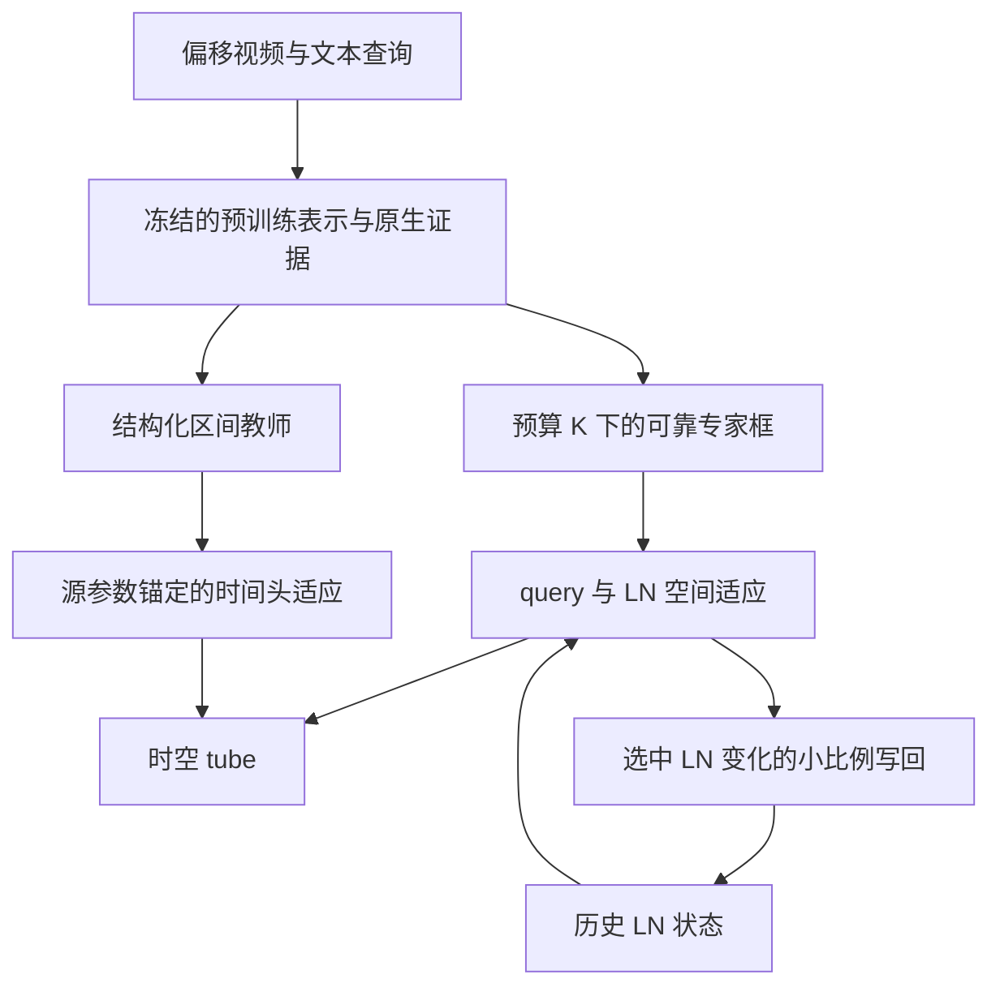

# C1–Scale06：正文方法与复现细节分层稿

状态：空间C1–Scale06与原时间目标NLL＋hinge均已完成本轮锁定。最后一次Current/NLL规模验证覆盖全部可用732个VidSTG-test父源/每源1个query，主700排除旧开发32；主Δv−.0030pp [−.3506,+.3423]，clean既有Current纠错保持89.14%/89.71%，严重相对损害22/21。按预锁标准保留Current，结束此次简化搜索。大样本没有复现旧32的强平均增益；这不证明hinge普遍保护native原正确时间预测，该分层两臂保持率差未确立。见[完整规模验证](<../artifacts/c1_temporal_loss_scale_v1/REPORT.md>)与[研究时间状态](<../methods/C1_TEMPORAL_RESEARCH_STATUS.json>)。结果仍历史暴露数据、描述性source bootstrap；此稿不改变生产注册。

## 写作骨架

- 测试视频依次到达：任务输出是事件区间及目标框序列。
- 稀疏空间校准：专家预算提供少量参考，更新当前 query 与共享 LN。
- 结构化时间校准：原生逐帧证据与区间先验构造教师，适应轻量时间头。
- 保守在线写回：当前视频使用完整适应状态，未来视频只继承小比例 LN 变化。

## 正文草稿

### 问题定义与概览（段落角色：设定、方法）

我们研究分布偏移下的在线视频时空定位。给定依次到达的视频与文本查询 $(V_i,q_i)$，模型预测事件区间 $I_i$ 及区间内的目标框序列 $B_i$。每次适应仅使用当前视频、查询以及已积累的模型状态，不访问测试标签。在线状态在视频之间传递；单个视频的预测使用其完整采样序列。

方法将当前视频的纠错与跨视频状态积累分开。预训练模型首先产生冻结的多模态表示及原生时序证据。空间分支通过少量外部专家参考校准目标框，时间分支通过结构化区间教师校准事件边界；二者组合成最终 tube。当前视频完成后，仅将空间 LayerNorm 参数变化的一小部分写入共享状态。

图中的冻结部分指原生表示与教师证据；query/LN 与时间头分别在各自分支更新。LN 的写回来自选中参数状态，不从 tube 坐标反推。

### 稀疏空间校准（段落角色：动机、设计）

外部专家能够提供帧级定位线索，而调用预算限制了可观察帧数。给定专家预算 $K$，我们将原生预测事件区间划分为 $K$ 个时间段，并在每段中选择接近中点的一帧。只有具有足够绝对置信度、且与竞争实例充分区分的专家预测才被接受，形成参考集合 $\mathcal A_i=\{(t_k,\tilde b_k)\}$。专家保持冻结，接受后的参考在本视频适应期间不变。

我们通过受限参数接口将稀疏监督传播到整个采样序列。可更新参数包括一个 256 维空间 query 残差 $\delta_i$，以及空间解码器最后一层的 1,536 个 LayerNorm 仿射参数 $\lambda_i$。每个视频从 $\delta_i^{(0)}=0$、$\lambda_i^{(0)}=\lambda_i^G$ 开始，其中 $\lambda_i^G$ 是到达时的共享状态。其余参数保持冻结。

采用按预算归一化的稀疏监督（budget-normalized sparse supervision）：

$$
\mathcal L_i^S(\delta_i,\lambda_i)=\frac1K\sum_{(t_k,\tilde b_k)\in\mathcal A_i}
\left[5\|b_{i,t_k}-\tilde b_k\|_1+2\bigl(1-\operatorname{GIoU}(b_{i,t_k},\tilde b_k)\bigr)\right].
$$

固定分母使未接纳观察的损失权重不会被重新分配给其余参考。使用 Adam 在固定步数预算内优化，并保留整条轨迹中参考损失最低的状态 $(\delta_i^*,\lambda_i^*)$，包括未更新的起点。该选态不依赖真实定位标签。没有参考通过接纳时，空间适应保持到达状态。

### 结构化时间校准（段落角色：动机、设计）

逐帧事件证据需要满足一个连续时间区间的结构约束。我们将冻结的原生 actionness 转换为逐帧概率 $\pi_j$，并通过区间内事件、区间外背景的加权负对数似然定义 $E_i(I)$。原生时间头在合法起止点组合上给出分布 $p_{\psi_0}(I)$，提供弱先验。教师区间为

$$
I_i^*=\arg\max_{I}\{-E_i(I)+\rho\log p_{\psi_0}(I)\}.
$$

教师与时间特征均在当前视频内冻结。轻量起止点预测头从预训练参数 $\psi_0$ 出发，利用教师区间的负对数似然及竞争区间排序项完成固定步数适应。然后采用源参数锚定的插值：

$$
\bar\psi_i=\psi_0+\beta_T(\psi_i^{\mathrm{last}}-\psi_0).
$$

时间头分别在两个原生采样偏移上预测合法区间，并使用它们的外包范围作为最终事件区间。将该区间与空间分支的框序列组合，即得到当前视频的时空 tube。时间更新不参与空间参考选择，也不改变空间在线状态。

### 保守在线写回（段落角色：动机、设计与作用）

单视频适应需要足够自由度来纠正当前预测，而共享状态需要限制单个伪监督样本的影响。当前视频使用完整选中状态 $(\delta_i^*,\lambda_i^*)$ 输出，之后仅对 LN 执行慢速写回：

$$
\lambda_{i+1}^{G}=\lambda_i^{G}+\alpha_G(\lambda_i^*-\lambda_i^G).
$$

下一个视频重新初始化 query 残差、时间头及所有优化器状态。由此，当前视频的完整纠错与跨视频吸收强度可以分别控制；对新视频的适应从已积累的 LN 状态开始。

## 实现细节与复现表

将这些数值移出主流程图只是在组织呈现，它们仍是完整方法定义的一部分。

| 项目 | 当前配置与精确定义 |
|---|---|
| 底座 | TA-STVG，VidSTG 源 checkpoint，原生外观/运动/文本路径与两次解码 |
| 专家预算 | $K=4$，在原生时间区间内分层取帧；实际接纳数可少于 K |
| 专家 | 冻结 Grounding DINO-T；上下文目标 token 定位与已有 fallback |
| 接纳 | 主要上下文路径目标分数≥.35、首二候选差≥.05；NMS .5、截取前三后检查几何有效性 |
| 空间接口 | 广播 query 残差256；末层 norm1/norm3/norm4 的 weight/bias 共1536 |
| 空间 loss | 5 L1＋2 GIoU，归一化 cxcywh、单位参考权重、分母固定 K=4 |
| 空间优化 | Adam .03，betas(.9,.999)，eps1e−8，wd0，10步；0–10全轨迹最低原loss、并列取早 |
| 时间校准 | $u=(a-.5\operatorname{median}(a))/(\operatorname{MAD}(a)+10^{-6})$，$\pi=\sigma(u)$ |
| 教师先验 | $\rho=.1$，物理时间 cell 权重；合法区间 start<end |
| 时间 loss | NLL＋margin .2 的最强竞争区间 hinge；两个offset平均 |
| 时间优化 | 66,306参数，AdamW .1，betas(.9,.999)，eps1e−4，wd0；5步，实际last |
| 当前时间收缩 | $\beta_T=.25$，影响当前视频时间输出 |
| 未来空间写回 | $\alpha_G=1/16$，只影响后续视频空间起点 |
| 状态清理 | query置零、时间头恢复source、每视频重建Adam/AdamW矩 |

## 数学与来源表述核对

1. 固定 /K 不自动使 Adam 的参数步幅按参考数量缩小。若所有梯度统一乘 $c>0$，Adam 的一阶矩乘 $c$、二阶矩乘 $c^2$，分子分母在忽略 epsilon 时相互抵消。不同参考缺失还会改变梯度方向，不能仅用数量推导实际步幅。
2. 全路径最低 loss 是 retrospective state selection。实现执行全部10步，不能称为节省计算的 early stopping。
3. $\beta_T=.25$ 是源锚定参数插值。它具有抑制参数偏离的作用，但没有显式信赖域约束或求解最优半径。
4. 5/2 与 `external/TA-STVG/config/defaults.py` 的基础默认值相同；`experiments/vidstg.yaml` 实际为5/3。因此本稿写“固定采用5/2”，不声称继承当前VidSTG源训练权重。
5. $\alpha_G=1/16$ 是固定工作点，没有理论最优性保证。已有其他写回率实验须按各自源模型和数据口径引用，不能伪称此次Scale06下新测。
6. K定义为专家预算。此轮没有新跑 K=1,2,4 曲线，也未将不同专家调用频率D100/D50伪作同视频K预算曲线。
7. Concept、Qwen、外部VLM匹配、Lookahead等历史候选不进入此正文管线。

## 主张—证据映射与五项自检

| 主张 | 证据 | 状态 |
|---|---|---|
| 受限空间适应与慢速LN写回是实际执行过程 | replay.py、Scale06 fit、spatial_consolidation_v1.py | 代码支持 |
| 当前视频空间与时间适应相互解耦 | 冻结 temporal_inputs，独立 TemporalReplay；时间不参与anchor采样 | 代码与本轮Current正控支持 |
| Scale06相对原C1有历史在线收益 | c1_scale06_matched_online_v1/SUMMARY96.json，已保存独立在线链 | 历史实验支持，非fresh |
| 两项时间设计可安全删除 | 本轮32来源四格非劣效与保护读出 | 三候选均未通过全部条件；96未触发，保留原版；不推导理论必要性 |
| 固定/K直接控制Adam实际步幅 | Adam尺度分析 | 不成立为一般结论，已从正文删除 |

- 贡献：主文聚焦监督构造、受限适应与状态分工，不将基础编码器或Adam列作创新；本稿不宣布普遍新颖性。
- 清晰度：按输入→空间/时间校准→tube→未来状态展开；参数表足以追溯数值。
- 实验证据：历史数据与fresh确认分开；简化失败不能写成普遍不可删除或理论必要。
- 评价完整性：本轮报告同时给v/t、环境、负尾与成功保持；K预算曲线保持未新增标记。
- 设计合理性：固定教师、局部完整输出、未来小比例吸收的依赖关系明确；数学近似与实现事实分开。

反向提纲：设定→共享状态与当前纠错分离→预算参考→受限空间优化→结构化时间教师→源锚定时间头→LN慢写回。每段只承担一个方法角色。
