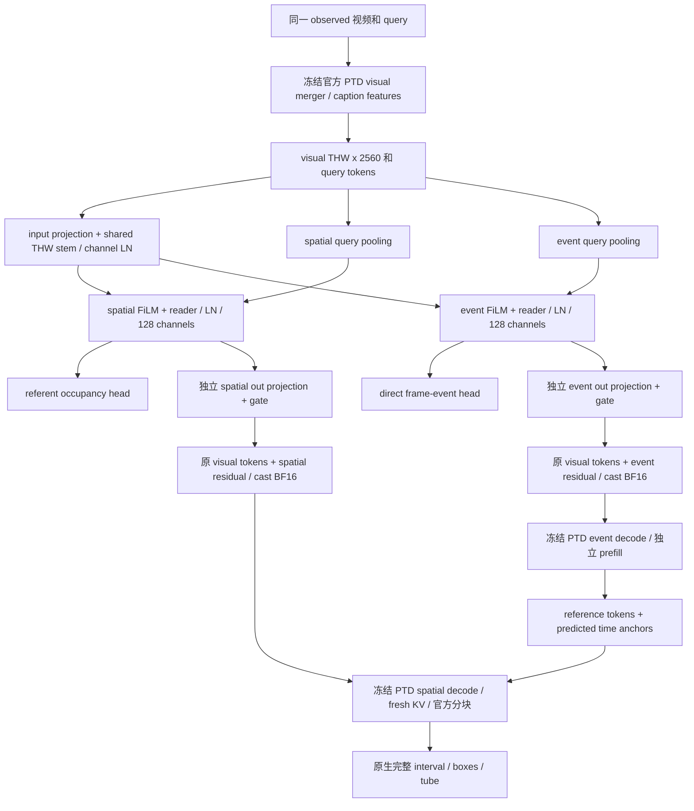

# DESTA-3D v2 实际结构与更新路径

本图描述已实现的 dual hidden128 配置。选项 P1、offset、joint teacher loss 均关闭；图上的双支角色是设计意图，不声称已学出稳定对象/动作分工。

两支各有输出 projection 和 gate；不先平均残差，也不把 event KV 当 spatial KV。shared-reference 路径固定第一支的 reference/time，第二支在相同条件下读出坐标。source B 原训练使用原两次 decode 合同；完整 B1 的两种 inference 合同已做198源 query 配对核验，几何全部相同，Δv/s/t=0，不表示 logits 没变化。

## 初始化和训练

channel-only LN 在每个 THW cell 上归一化。初始 gate 为 sigmoid(-6)，out projection 是小方差非零初始化。完整 dual adapter 约2.49M参数；官方 PTD 冻结。有效共同A在618源 query /95父源/155步连续训练完成。

随后从同A开始 fresh AdamW，B0/B1/B2固定各618 query /155步，三臂共享实际输入：B0正常回传辅助梯度，B1阻断辅助梯度进入上游但 head 正常学习，B2只在 shared stem 的19968维上缩放辅助梯度。B2系数是完整 accumulation window 上 `min(1, 0.25*||gTask||/(||0.1*gAux||+1e-12))`，task为零时系数零；task和head梯度不缩放。

reader LR3e-5，head/out/gate LR1e-4，wd0、clip1、accum4，末窗实际2。沿原775步horizon的前155步，warmup39占实际25.16%；不是“单epoch完整5% cosine”。612条CE合法、6条aux-only全部保留，固定末态，不选best。

## 测试时更新的实际目标

| 部分 | 原 no-output TTA 的处理 |
|---|---|
| 官方PTD、query/text pooling、head、out projection、gate | 冻结 |
| calibration arm | 66816个FiLM/LN参数可更新 |
| convolution arm | input projection/stem/两reader共404608参数可更新 |
| teacher | 同一observed输入的B1 detached输出，corruption不用clean counterpart |
| student | 原配置使用brightness1.05/contrast0.95 mild view |
| loss | normalized latent consistency + ref/event Bernoulli KL + mean parameter anchor，各系数1；alignment0或.01；joint0 |
| state | 每query/arm复位，fresh AdamW1e-5、wd0、clip1、固定3步 |

pre-gate目标不调用PTD lm_head，也没有到输出gate的有效梯度路径，因此gates冻结。source moments是B1完整618 query/95父源、post-query两支128通道的新统计：query内THW统计、父源内query等权、父源等权，方差来自E[x²]-E[x]²。

后续output-anchor对照额外调用真实可微PTD cached replay：teacher/student均用本episode observed输入；time KL及coordinate KL分别归一后相加，源单点梯度等范数给固定系数6.248522551708088。该系数不是目标GT调优，也不是通用最优。缺event/coordinate支持的处理在协议中固定，格式合法的无效零框不筛除。

## 三种容易混淆的监督/读出

1. **pre-gate TTA**：adapter内部特征、ref/event、moments，无GT、无lm_head。
2. **source task CE正控**：源GT teacher forcing，event/spatial各按原官方NTP/MTP分块计均值；明确使用源标签。训练框支持跟GT时间走。
3. **native评估**：自由生成语义reference和时间anchors，再按预测时间构造框支持。图像/视频一致不代表与GT前缀有相同条件。

FP32 helper只作用于第2项最终head：`F.linear(h.float(), weight.float())`，冻结权重仍以BF16保存，主体和native仍BF16。head上下文覆盖checkpoint重算后恢复；这不是完整FP32模型，也不是已经作用在原无标签TTA上的修复。

原始cast、真实merger输入VJP及完整词表投影诊断证明数值链有离散效应；但新FP32监督正控的native均值和负尾更差，因此不能从数值更精确直接推任务更好。
