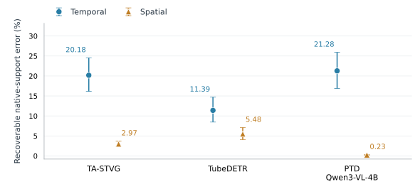
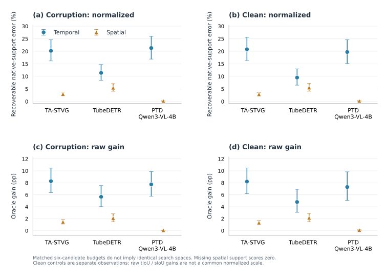

# Native-support correctability across three frozen STVG models

**All 2,304 prediction cells completed, sealed before diagnostic labels, scored and root-audited.** Under the locked six-candidate supports, all three models expose more recoverable temporal than spatial error; the paired 95% interval for the difference is above zero for each model. This supports the stated asymmetry for these supports, not a universal ranking of architectural potential.



## Corruption result

| Model | Temporal recoverable error % [95% CI] | Spatial recoverable error % [95% CI] | Paired T−S pp [95% CI] | Raw temporal / spatial gain pp |
|---|---:|---:|---:|---:|
| TA-STVG | 20.183 [16.147, 24.553] | 2.967 [2.298, 3.711] | 17.216 [13.089, 21.679] | 8.272 / 1.464 |
| TubeDETR | 11.391 [8.461, 14.696] | 5.479 [4.070, 7.112] | 5.912 [2.666, 9.491] | 5.653 / 2.106 |
| PTD Qwen3-VL-4B | 21.284 [16.895, 25.932] | 0.225 [0.154, 0.307] | 21.059 [16.667, 25.720] | 7.732 / 0.076 |

Each cell uses R=100×(best candidate score−native score)/(1−native score). Temporal scores use physical-interval tIoU; spatial scores use full fixed GT-frame support with one whole candidate tube selected, never per-frame oracle stitching. The paired analysis uses the same non-saturated cells in both branches. Five corruptions are averaged within source before 10,000 paired source bootstrap draws. Raw gains retain all cells.

## Clean control and coverage

| Model | Clean temporal % | Clean spatial % | Clean paired T−S 95% CI | Corrupt spatial coverage | Corrupt unique T / S | Invalid-format clean / corrupt cells |
|---|---:|---:|---:|---:|---:|---:|
| TA-STVG | 20.791 | 2.861 | 13.415, 22.801 | 99.51% | 4.611 / 6.000 | 0 / 0 |
| TubeDETR | 9.514 | 5.543 | 0.632, 7.752 | 99.51% | 3.298 / 6.000 | 0 / 0 |
| PTD Qwen3-VL-4B | 19.705 | 0.241 | 14.873, 24.325 | 76.62% | 5.992 / 5.992 | 1 / 1 |

The same direction also appears on clean inputs; this experiment does not establish that corruption uniquely creates the asymmetry. PTD spatial candidates share the fixed native semantic/time prefix and its native anchor support, with no extrapolation. Its roughly76.6% GT-frame coverage differs from roughly99.5% for TA/Tube; this is part of the locked conditional readout and prevents attributing all of the very small PTD spatial headroom solely to representation quality. Coverage is descriptive diagnostic GT information, never candidate construction.

Perfect temporal-native cells excluded only from normalized readouts: TA clean1/corrupt0, Tube clean0/corrupt0, PTD clean1/corrupt5. Spatial saturation is0 throughout. Missing or malformed hypotheses and duplicates remain in the six slots; invalid geometry contributes zero only at the affected interpolated frame. Counts, marginal ratios and confidence intervals are fully available in SUMMARY.json.

## Protocol and implementation

128 unique historically exposed VidSTG-test video sources, one locked query per source, clean plus five source-seeded, query/GT-independent5% transient corruption families: frame drop, freeze, motion blur, occlusion and exposure. The same decoded RGB/pixel hashes and sampled frame IDs are used across the three models; preprocessing and inference precision remain architecture-specific. All weights are frozen, with zero specialist calls and zero updates.

The original PTD smoke exposed a checkpoint limit of t1…t100: its second input had200 frames. The five original smoke predictions and failure were preserved and excluded. The user approved shared min(n,64) equally spaced original-frame IDs;83 of128 frame lists changed, all sources and queries were retained, physical burst seeds/start/end/donors were unchanged. Observed sampled-frame hit fractions are recorded separately. All three repeated two-input no-GT smoke checks passed exact native parity and fixed parameters.

TA-STVG and TubeDETR use six decoder depths, native final layer first. PTD uses deterministic width-six product search on the existing parallel masked probes, with native included and native semantic/time conditioning fixed for spatial candidates. Matching six slots does not equate these search spaces. This is not six independent random samples or ordinary Hugging Face beam search.

Source checkpoint SHA256: TA `5ab12c86363ef0ce0ee006c00fd11c6b659c3a9b2cb01a4f2c613efe22a2aa83`; Tube `2802c66049b2e7986a826b4bbd291eb8521446cfba6fee03b56729438bf44213`; PTD `cc78a8bc1d3d341f70b6b235af160d1c85635046fb78b82fc2f9759e717e5a88`.

The root verified2,304 raw prediction receipts, common pixels/frames/corruption, runtime pins, zero updates and global-seal-before-label ordering.27,648 component candidate scores agree with an independent metric kernel to maximum absolute error8.55e−15. A separate scalar/bootstrap recomputation passed162 comparisons. Main and companion PNGs were visually reviewed; PDF and SVG retain vector text/marks.

## Reproduce public summaries and figures

```bash
python scripts/audit_native_support_public_v1.py results/stvg_native_support/2026-10-01
python scripts/draw_native_support_fig1_v1.py results/stvg_native_support/2026-10-01
```

These commands need NumPy and Matplotlib, and do not read private media, annotations or weights. Public SCALAR_ROWS contains anonymous source indices and scalar candidate scores, never raw boxes, intervals, query text or video IDs. Full inference additionally requires the original authorized datasets/checkpoints and project runtimes. Original input-limit failure is preserved in the public incident summary; it is not a failed full experiment.



The complete method and prior Optuna/Paper48 results remain unchanged. The separately authorized sequential learning-rate/temperature tuning is a subsequent task.
