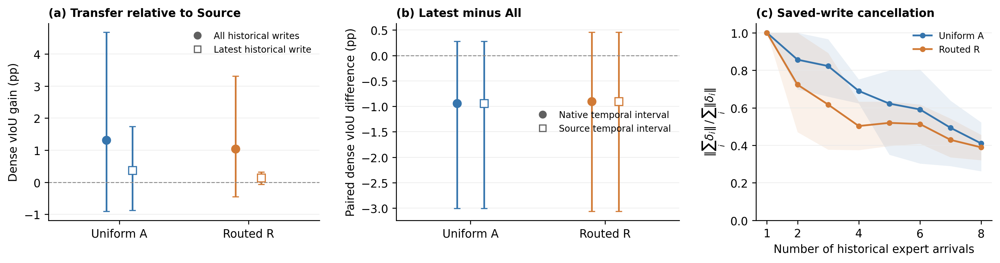

# HC saved-write accumulation audit

状态：576 个 future nonexpert targets 全部完成 Source/All/Last 重放、全局预测封存和 CPU GT 评分。

这是对历史写入 delta 的离线反事实，未实现或运行 exact-refresh 在线学习。

## Population and intervention

原 HC-STVG-v2 开发 HC32 来源，每源一 query、双顺序、clean 与五类 transient 5% corruption。每臂288 future nonexpert targets（240 corruption +48 clean），目标合计30来源，两个来源在两序均位于专家位置。25%专家、HC官方同域checkpoint、K8、lr=0.006097133675874025、teacher/student温度1、rho=.05、D4、1792参数均继承历史配置。

Source 是初始参数；All 是初始参数加目标之前全部保存写入；Last 是初始参数只加最近 scheduled expert arrival 的历史写入。包含 scheduled no-op；若最近arrival没有更新，Last回到Source。差分/累加使用FP64，最终一次转回原FP32。All逐值匹配历史状态并逐值复现旧boxes/indices，Source逐值匹配旧capture。不能把Last称为从Source重新计算梯度的reset方法。

## Primary results

主指标：corruption future nonexpert、目标 source-macro dense vIoU，30来源、240 targets/arm。先按source/order/condition求均值，再按source平均；10000次paired source-bootstrap，seed20261001。以下差值与区间单位均为pp。

| Arm | Source vIoU (%) | All vIoU (%) | Last vIoU (%) | All−Source (95% CI) | Last−Source (95% CI) | Last−All (95% CI) |
|---|---:|---:|---:|---:|---:|---:|
| A | 29.9561 | 31.2710 | 30.3291 | +1.3149 [-0.9088, +4.6787] | +0.3731 [-0.8723, +1.7455] | -0.9419 [-3.0074, +0.2778] |
| R | 29.9561 | 30.9969 | 30.0915 | +1.0409 [-0.4474, +3.3161] | +0.1354 [-0.0615, +0.3165] | -0.9054 [-3.0639, +0.4546] |

**判断：R 的 Last−All 配对区间跨零，尚未证明只保留最近历史写入能改善future nonexpert。不能从单次write的平均正收益推出累计干扰已确立。**

单次pre→post write在历史基点上的正迁移，与把同一delta搬到Source后的收益，是不同问题。本轮保留了这个区别；余弦冲突或范数抵消也不能单独当作GT损害的证据。

| Arm | Source固定时间 Last−All (pp, CI) | ≥2 prior writes Last−All (pp, CI) | order1 / order2 Last−All (pp) |
|---|---:|---:|---:|
| A | -0.9419 [-3.0074, +0.2778] | -1.0677 [-3.4498, +0.3219] | -0.0190 / -2.4827 |
| R | -0.9054 [-3.0639, +0.4546] | -0.9495 [-3.4172, +0.6330] | -1.1492 / -1.0599 |

第一组expert后、第二组expert之前All与Last本来相同，已作为精确零差正控保存；主指标仍含全部预先锁定目标。完整native时间、固定Source时间、dense sIoU/tIoU和所有条件都公开，不根据其中最高值选规则。

## Negative tails, no-op and clean controls

| Arm | Last−All improved / harmed / unchanged | >5pp harm cells | Gross gain / gross loss (source-macro pp) | .3 rescue / destruction | .5 rescue / destruction |
|---|---:|---:|---:|---:|---:|
| A | 76 / 119 / 45 | 5 | 0.3741 / 1.3160 | 0 / 15 | 0 / 8 |
| R | 53 / 142 / 45 | 9 | 0.6642 / 1.5697 | 2 / 15 | 0 / 8 |

A：corruption latest scheduled no-op为15 targets；clean Last−All=-0.9182 [-2.9363, +0.2795]pp。native interval改变0/240；表中累计/最近差不是当前expert的rerank。

排除最近write为no-op的预声明敏感性读出：A Last−All=-1.0765 [-3.1731, +0.1257]pp；不是简单被no-op重置拖低。

R：corruption latest scheduled no-op为9 targets；clean Last−All=-0.9540 [-2.9720, +0.3666]pp。native interval改变0/240；表中累计/最近差不是当前expert的rerank。

排除最近write为no-op的预声明敏感性读出：R Last−All=-0.9707 [-3.0969, +0.3486]pp；不是简单被no-op重置拖低。

## Write geometry

每臂12 streams、每stream8 scheduled writes；以下corruption统计覆盖10 streams。Zero-write cosine及零分母ratio保留null。阴性方向余弦、norm cancellation是参数空间描述，不等于任务干扰。

| Arm | Nonzero writes / scheduled | Mean nonzero write norm | Negative consecutive cosines / defined | Final cancellation mean [min,max] |
|---|---:|---:|---:|---:|
| A | 75 / 80 | 0.146615 | 32 / 60 | 0.409915 [0.261783, 0.522294] |
| R | 77 / 80 | 0.118860 | 36 / 64 | 0.389121 [0.320849, 0.455887] |

R具有略低的最终cancellation ratio，但其平均非零参数位移范数也更小。因此“routed产生幅度更强的write，抵消导致GT损害”不是本轮已经测得的因果结论。在两个R顺序上Last的均值都低于All，但源聚类区间仍跨零；这限制了显著性与泛化范围。

## Preserved cases

| Arm | Polarity | Anonymous source | Condition/order/arrival | Prior writes | Last−All (pp) |
|---|---|---:|---|---:|---:|
| A | positive | 20 | frame_freeze_5/order2/5 | 2 | +5.4174 |
| A | positive | 20 | exposure_5/order2/5 | 2 | +4.6580 |
| A | positive | 20 | frame_drop_5/order2/5 | 2 | +3.1485 |
| A | negative | 18 | motion_blur_5/order2/26 | 7 | -59.4658 |
| A | negative | 18 | exposure_5/order2/26 | 7 | -58.2285 |
| A | negative | 18 | frame_drop_5/order2/26 | 7 | -58.0887 |
| R | positive | 18 | occlusion_5/order2/26 | 7 | +39.2328 |
| R | positive | 16 | occlusion_5/order2/23 | 6 | +16.4841 |
| R | positive | 7 | frame_freeze_5/order2/18 | 5 | +13.7151 |
| R | negative | 18 | motion_blur_5/order2/26 | 7 | -56.5941 |
| R | negative | 18 | occlusion_5/order1/10 | 3 | -53.7306 |
| R | negative | 18 | frame_drop_5/order2/26 | 7 | -50.4583 |

These outcome-selected examples are illustrations only; all 576 anonymous scalar rows and the locked population are published.

## Conditional Token P2: actual interface finding

**本轮完成了现有接口核验，没有执行P2候选评分（0/60 cells）。**

* UniversalVTG的PEFeatureExtractor逐帧encode_image；PE-Core forward_features接受image batch，encode_video仅独立编码后mean。能提取静态patch，但没有跨帧contextualization。
* UniversalVTG的时间网络接收(D,T)并输出(B,C,T)，空间位置已在前面pool，无法按不同candidate boxes做inside/outside。
* TA-STVG VideoSwin提供时空空间features，但其Kinetics视觉pretraining/TA grounding投影与RoBERTa不是现成的event lexical↔patch双塔cosine接口，没有该接口的native CLIP logit scale。原ASA是learned cross-attention；将它改成cosine需另一个定义，不能冒充附件的P2。

因此未下载新模型、未临时训练投影、未把frame CLIP的soft aggregation改名为video-native temporal token alignment。这项接口结果不证明motion语义是P1失败的唯一原因，也不证明静态token加显式tube建模必然无效。

[ConDA](https://openaccess.thecvf.com/content/CVPR2026/papers/Ge_Condensed_Test-Time_Adaptation_of_VLMs_for_Action_Recognition_CVPR_2026_paper.pdf)的semantic patch selection和adaptive tube construction说明时序关系还可以通过tube构造引入，不能简化成“必须换video foundation model”。本轮仅核对原始论文可检索内容，未声称复现ConDA。[D2VLM官方实现](https://github.com/nusnlp/d2vlm)引入evidence tokens与训练的FPO框架；[TF-CADE原文](https://openaccess.thecvf.com/content/CVPR2026/papers/Lee_TF-CADE_Foreground-Concentrated_Text-Video_Alignment_for_Zero-Shot_Temporal_Action_Detection_CVPR_2026_paper.pdf)包含classification/localization/actionness监督训练。这些不是本机零准备成本可用的同一接口。

## Verification and resources

CPU准备与独立readback均验证768条历史状态链；576 All/Source预测各自bitwise匹配。根审计最大metric误差9.99e-16，匿名公开审计独立检查54206项。实际缓存后缀replays=1626；worker wall=613.18s（含model load/IO，非纯GPU kernel时间），peak allocated VRAM=0.969GiB。零新backbone/专家/backward/optimization。

一次CPU准备helper被local delta变量遮蔽的TypeError发生在0预测/0GT阶段；已保留原代码和失败记录后修复，无科学配置变化。推理代码/输入、scoring与interface-source的hash收据均保存。CURRENT_METHOD未变，历史队列不恢复。

## Decision scope

R 的 Last−All 配对区间跨零，尚未证明只保留最近历史写入能改善future nonexpert。不能从单次write的平均正收益推出累计干扰已确立。 不从该面板的GT选择memory、refresh比例、token fusion或线上阈值。附件明确说先不要跑exact-refresh；本轮没有启动它。任何后续在线规则需单独的匹配学习实验。

Figure: intervals in (a,b) are 95% source-bootstrap; the shaded geometry ranges in (c) are the min–max over ten corruption streams, not confidence intervals.

Anonymous records: `results/tastvg_accumulation_audit/2026-10-02`; protocol: `protocols/tastvg_accumulation_audit_v1.md`.
