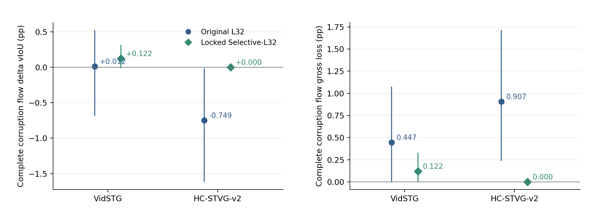
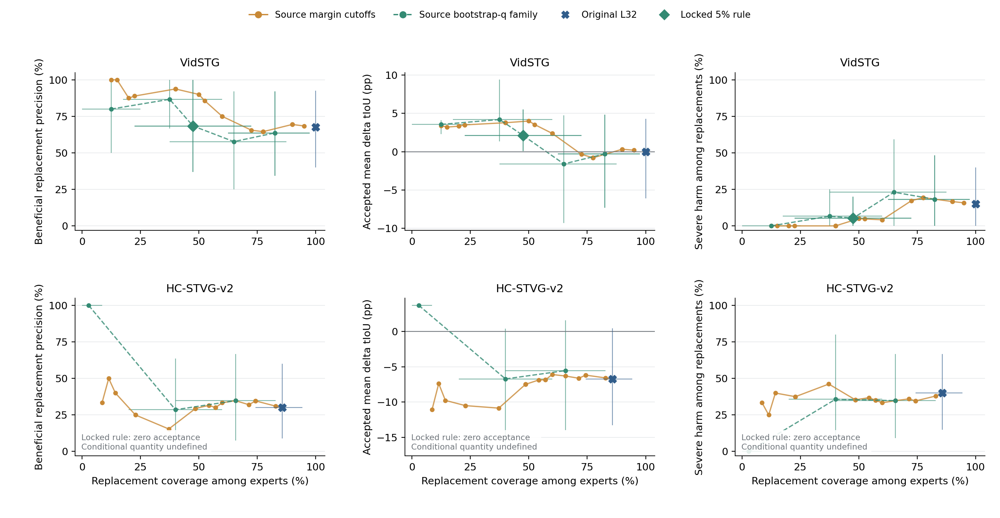
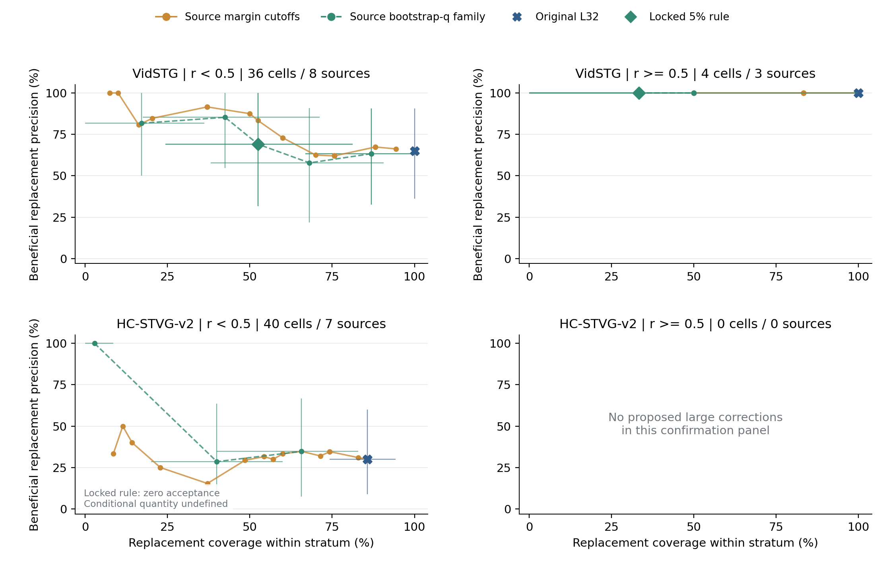
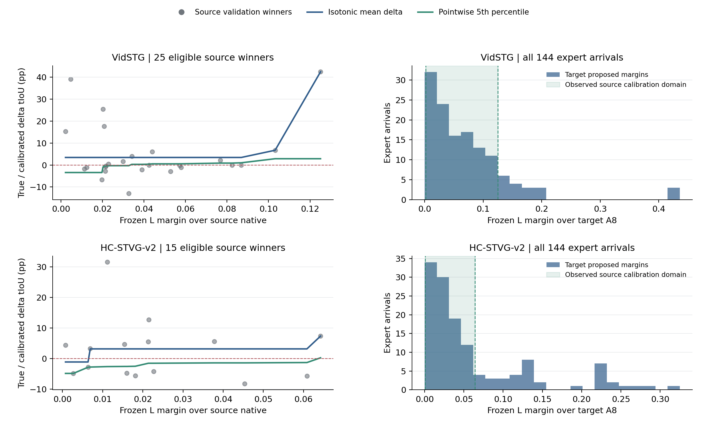

# Anchor-Certified Latent Reranking: source-native calibration to target A8

The locked source-only rule reduces VidSTG replacement harm, but does not establish a jointly usable temporal module. Vid confirmation complete-corruption vIoU changes by **+0.1221 pp [-0.0163, +0.3130]** relative to A8. HC accepts **zero** replacements and is exactly A8. The prelocked two-dataset decision is **NO-GO for this calibration**. Scores, support and persistent adaptation remain unchanged.

## Experiment and supervision

The three arms are A (always A8), L32 (unchanged frozen latent top1 with a unique positive margin over A8), and Selective-L32 (the same winner subject to source calibration). Each dataset reuses the existing 32 development and 16 confirmation sources, one query per source, two orders and clean plus five 5% corruptions. All 96 target sources have historical exposure. There are 1,152 arrivals: 288 scheduled experts (240 corrupted, 48 clean) and 864 nonexperts. Candidate replacement is possible only at experts; nonexpert predictions and all A state hashes remain identical. Confirmation is a disjoint panel within this batch, not fresh test.

The backbone is the original official in-domain TA-STVG checkpoint (Vid fbb1ed88, HC ee72f0d9), with original Paper48 sampling/two offsets. Uniform spatial evidence, 1,792 persistent spatial parameters, Vid K1 / HC K8 and their sealed learning rates/temperatures are retained. A8 is the previous UVTG-selected interval; Old8 is contained in Expanded32. No new candidate, expert, encoder, decoder replay, backward or parameter update occurs in this experiment.

The frozen source ridge scorer L was previously trained on 95 Vid / 48 HC official-train sources; its alpha was selected on 31 / 16 source-validation sources. Calibration uses **only those same 31 / 16 validation sources**, which is reuse after alpha selection, not independent validation. Labels are source GT tIoU, so this is source-supervised calibration with no target supervision for fitting.

The source cache contains native candidate 0, not source UVTG A8. The user explicitly authorized **source-native calibration transferred to target A8** for a pure CPU experiment. This combines an anchor change and a source-to-target domain change; it must not be described as exact source-A8 calibration. Target cached labels were already historically exposed; this round seals its new decisions before parsing them again.

## Frozen rule and the meaning of the lower curve

For each source-validation arrival, take the unique L32 maximum with positive margin over native. Fit increasing isotonic regression to the selected winner's margin and true delta tIoU, one eligible record per independent source. This conditions calibration on top1 selection, rather than fitting all candidate pairs. Vid has 25 eligible winners and HC 15. A binary-benefit isotonic map is also exported but does not drive the decision.

Bootstrap these eligible sources 10,000 times (seed 20261003), refit the mean-delta map, evaluate at fixed source knots, and take its pointwise fifth percentile, capped above by the original mean. Interpolate within the observed source margin domain. Replace only if the unique positive-margin winner is inside that domain and this lower mean-delta curve is positive; otherwise retain A8. No margin extrapolation is permitted.

This lower curve is an **approximate pointwise bootstrap confidence curve for calibrated mean change**. It is not a per-arrival prediction bound, conformal guarantee, simultaneous confidence bound, 95% correctness probability or target-domain safety certificate. Small reused source validation and anchor/domain transfer limit its interpretation. The isotonic solver follows the [official scikit-learn specification](https://scikit-learn.org/stable/modules/generated/sklearn.isotonic.IsotonicRegression.html); the bootstrap rule is the explicitly locked experiment heuristic.

Both models and all 288 target expert choices were globally sealed before the new join with existing target GT-derived metrics. Diagnostic source-margin quantiles (0,.05,...,1) and lower-curve quantiles (.5,.2,.1,.05,.025,.01) were frozen then as well. No target operating point was selected.

## Primary readout

All entries below are complete-corruption-flow source-macro paired differences in **pp**, with 10,000 recipient-source bootstrap 95% pointwise intervals. Each source first averages conditions and orders. The official dense scorer's already sealed candidate metrics are reused with unchanged A boxes; GT is never inserted into the decoder. Gross gain/loss are positive/negative parts of each arrival's delta relative to A, not relative to Frozen.

| Dataset / panel | A8 vIoU (%) | L32 - A8: vIoU pp [CI] | Selective - A8: vIoU pp [CI] | Selective - A8: tIoU pp [CI] |
|---|---:|---:|---:|---:|
| VidSTG / search | 17.4529 | -0.1373 [-1.1083, +0.8118] | +0.2767 [-0.0148, +0.7063] | +0.6755 [-0.0101, +1.6580] |
| VidSTG / confirm | 32.6465 | +0.0120 [-0.6874, +0.5259] | +0.1221 [-0.0163, +0.3130] | +0.2515 [-0.0059, +0.5710] |
| HC-STVG-v2 / search | 30.9637 | +0.3188 [-0.4399, +1.2387] | +0.0000 [+0.0000, +0.0000] | +0.0000 [+0.0000, +0.0000] |
| HC-STVG-v2 / confirm | 26.7630 | -0.7489 [-1.6172, -0.0176] | +0.0000 [+0.0000, +0.0000] | +0.0000 [+0.0000, +0.0000] |

Vid confirmation Selective-L32 minus L32 is **+0.1101 pp [-0.3691, +0.7788]**. This does not establish a statistically clear improvement over either A8 or L32. Its two order point estimates relative to A8 are +0.2228 / +0.0214 pp, with leave-one-source-out means +0.0510 to +0.1477 pp. Six independent confirmation sources receive an accepted correction, so the primary Vid point gain is not entirely lost by deleting one source, but uncertainty remains.

HC confirmation minus L32 is **+0.7489 pp [+0.0176, +1.6172]**, entirely because every replacement is rejected. It restores A8 while discarding both helpful and harmful L32 moves. It provides no gain over A8 and no evidence that the certifier can make a useful HC replacement.

## Precision, coverage and negative tails

Coverage and conditional ratios are source-balanced. Raw cell counts are shown separately; in HC, unequal expert cells per source mean raw counts divided by total can differ from source-balanced percentages. Benefit means delta tIoU > 1e-12. Severe harm means delta vIoU < -5 pp. Zero accepted predictions have **undefined** precision, accepted mean and conditional severe rate.

| Dataset / panel / arm | Accepted raw cells | Accepting sources | Coverage (%) | Beneficial precision (%) | Accepted mean delta tIoU (pp) | Improve / harm / unchanged vIoU cells | Severe cells |
|---|---:|---:|---:|---:|---:|---:|---:|
| VidSTG / search / L32 | 70/80 | 15 | 87.50% | 38.57% | +0.3278 | 19 / 35 / 26 | 11 |
| VidSTG / search / Selective | 38/80 | 10 | 47.50% | 52.63% | +5.6885 | 13 / 10 / 57 | 1 |
| VidSTG / confirm / L32 | 40/40 | 8 | 100.00% | 67.50% | +0.0028 | 27 / 13 / 0 | 6 |
| VidSTG / confirm / Selective | 19/40 | 6 | 47.50% | 68.42% | +2.1177 | 13 / 6 / 21 | 1 |
| HC-STVG-v2 / search / L32 | 77/80 | 14 | 95.71% | 44.78% | +2.1362 | 38 / 35 / 7 | 8 |
| HC-STVG-v2 / search / Selective | 0/80 | 0 | 0.00% | undefined | undefined | 0 / 0 / 80 | 0 |
| HC-STVG-v2 / confirm / L32 | 34/40 | 7 | 85.71% | 30.00% | -6.7456 | 9 / 25 / 6 | 13 |
| HC-STVG-v2 / confirm / Selective | 0/40 | 0 | 0.00% | undefined | undefined | 0 / 0 / 40 | 0 |

Vid confirmation precision moves only **67.50% to 68.42%**, despite reducing accepted cells from 40 to 19. The primary rule therefore does not show the hoped-for large precision gain at moderate retained coverage. Conditional accepted delta tIoU is +2.1177 pp [+0.0780, +5.4974], using frozen acceptance decisions and resampling recipient sources; this is not the complete-stream effect. Severe rate among accepted corrections falls from 15.00% to 5.26%, but its intervals are wide.

| Confirmation complete corruption flow | L32 gross gain / loss pp | Selective gross gain / loss pp |
|---|---:|---:|
| VidSTG | 0.4589 / 0.4469 | 0.2441 / 0.1220 |
| HC-STVG-v2 | 0.1584 / 0.9073 | 0.0000 / 0.0000 |

Vid gross loss falls by about 72.7%, but gross gain also falls. Of 21 rejected confirmation L32 moves, **14 would improve tIoU and vIoU**, seven would harm vIoU, and five of those seven are severe. In development, 32 rejected moves include seven tIoU improvements, six vIoU improvements, 25 vIoU harms and ten severe harms. Thus rejection quality itself changes between panels; the development precision improvement does not fully transfer.

HC rejects all 34 proposed confirmation moves, including nine helpful vIoU moves and 25 harmful ones (13 severe). Development loses 38 beneficial vIoU moves as well as suppressing 35 harmful ones. The source lower curve is not everywhere negative: it becomes positive near the upper source margin edge, but no target proposed in-domain margin enters that positive region. Across all HC expert arrivals, 96 reject for nonpositive lower mean, 37 for out-of-domain margin, and 11 propose no unique positive-margin winner.

Across Vid's 144 experts the reasons are 65 accepted, 45 nonpositive lower mean, 22 out of source margin domain and 12 without a unique positive winner. The finite source domains are [0.002155, 0.125079] for Vid and [0.000739, 0.064239] for HC. Both distributions and all reasons are exported, including useful rejected moves.

## Large and small corrections

The strata use the **proposed unchanged L32 winner** before gating, with r = (|delta start| + |delta end|) / duration(A8), small r < .5 and large r >= .5. They are diagnostic strata, not separately fitted thresholds. Source-balanced conditional ratios are recomputed within each stratum.

| Confirmation stratum | Cells / independent sources | L32 accepted / improve / harm / severe | Selective accepted / improve / harm / severe | Selective accepting sources |
|---|---:|---:|---:|---:|
| VidSTG / small | 36 / 8 | 36 / 23 / 13 / 6 | 18 / 12 / 6 / 1 | 6 |
| VidSTG / large | 4 / 3 | 4 / 4 / 0 / 0 | 1 / 1 / 0 / 0 | 1 |
| HC-STVG-v2 / small | 40 / 7 | 34 / 9 / 25 / 13 | 0 / 0 / 0 / 0 | 0 |
| HC-STVG-v2 / large | 0 / 0 | 0 / 0 / 0 / 0 | 0 / 0 / 0 / 0 | 0 |

The Vid large-correction panel originally has four helpful moves from three sources. The rule retains only one, from one source. Its displayed 100% precision and degenerate conditional bootstrap interval are **not** population reliability evidence: 2,990 of 10,000 bootstrap draws have zero accepted denominator. HC confirmation has no proposed large correction, so this experiment cannot evaluate its large-correction certification. All severe confirmed harms in both datasets are small moves, consistent with the previous finite panel; this does not prove small changes are intrinsically more dangerous.

## Prelocked curve families and clean controls

The full figures show every source-derived operating point. Curve error bars are pointwise source-bootstrap intervals; they are neither a simultaneous band nor corrected for browsing many correlated operating points. HC zero-coverage conditional points are omitted rather than assigned perfect precision.

The Vid confirmation q=.025 diagnostic accepts 15 cells from six sources, has 86.67% conditional benefit precision and complete-flow delta vIoU **+0.2091 [+0.0272, +0.4267] pp**. This is a descriptive, precomputed operating point, **not the prelocked primary q=.05**. Viewing target results does not authorize changing the primary rule or treating this operating point as independently validated. HC's q=.1 accepts only one cell from one source (2.86% source-balanced coverage), with 3,364 zero-denominator bootstrap draws; q=.05 and stricter accept none. A common usable two-dataset regime is not demonstrated.

| Clean complete-flow delta vIoU pp [CI] | L32 - A8 | Selective - A8 |
|---|---:|---:|
| VidSTG / search | -0.3426 [-1.4604, +0.7247] | +0.4414 [+0.0000, +1.1647] |
| VidSTG / confirm | -0.1961 [-0.9756, +0.4773] | +0.0386 [-0.3231, +0.4367] |
| HC-STVG-v2 / search | +0.7039 [-0.2683, +2.0903] | +0.0000 [+0.0000, +0.0000] |
| HC-STVG-v2 / confirm | -0.4096 [-1.3622, +0.3358] | +0.0000 [+0.0000, +0.0000] |

No nonexpert metric changes. Current readout changes at accepted experts only; no new future adaptation effect is claimed.

## Concrete accepted and rejected cases

These are post-hoc explanatory examples from sealed confirmation rows, not operating-point selection or sample exclusion.

| Dataset / source / corruption / order | Decision | L32 vIoU delta pp | Selective vIoU delta pp | Reason |
|---|---|---:|---:|---|
| VidSTG / 36 / motion_blur_5 / order1 | accept | +17.3445 | +17.3445 | accepted |
| VidSTG / 36 / frame_drop_5 / order1 | accept | -5.4593 | -5.4593 | accepted |
| VidSTG / 41 / frame_drop_5 / order1 | retain A8 | +5.3854 | +0.0000 | outside_source_margin_support |
| HC-STVG-v2 / 33 / frame_freeze_5 / order1 | retain A8 | +5.0708 | +0.0000 | nonpositive_lower_mean_delta |
| HC-STVG-v2 / 41 / exposure_5 / order2 | retain A8 | -17.6465 | +0.0000 | outside_source_margin_support |

## Decision, verification and resources

The prelocked decision requires positive confirmation complete-corruption means in both datasets, at least three accepting sources per dataset, positive leave-one-source-out means, and lower gross loss and severe-harm count than L32. Vid passes these **point-estimate** rules; HC fails the gain, nonzero-source and leave-one-out conditions. The joint decision is `NO_GO_locked_calibration`. These development criteria are not equivalent to statistical confirmation. Keep A and CURRENT unchanged. No target gate retuning, ranking refit, new expert or structured/listwise follow-up is started by this audit.

The strongest supported conclusion is narrower than “latent information is uncalibratable”: **this source-native to target-A8 mean-delta calibration suppresses harm on Vid but fails to produce useful accepted HC corrections**. Low source count, reused validation, source/target shift, anchor mismatch and the one-dimensional margin may each contribute; this experiment does not identify a unique cause or rule out different quality models. A favorable descriptive Vid curve does not resolve the HC failure.

The independent auditor uses sklearn's isotonic implementation, refits all 10,000 source bootstraps, independently recomputes every score-based winner/gate, all 1,152 metrics and paired source ratios/intervals, verifies bitwise L32 metric parity and the new seal-before-label order, and checks every prelocked GO test. **750,047 scalar checks passed**, maximum numeric error 3.331e-16. Ten CPU mathematical tests and 100 randomized weighted PAV comparisons also passed.

New inference/expert/replay/backward/parameter-update counts are all **zero**. Measured CPU wall times are 1.056s for calibration, 0.084s for choice sealing, 4.855s for cached scoring, and 18.821s for the independent audit. These do not include report/plotting/publication time and are not GPU kernel times. Rendering-only bounds-check failures were retained and fixed without changing any calibration, decision or metric.

## Reproducible artifacts

- [Locked protocol](../protocols/tastvg_anchor_certification_v1.md) and [execution](tastvg_anchor_certification_v1/EXECUTION.md).
- [Configuration](../results/tastvg_anchor_certification/2026-10-03/CONFIG.json), [global decision seal](../results/tastvg_anchor_certification/2026-10-03/GLOBAL_DECISION_SEAL.json), [decision](../results/tastvg_anchor_certification/2026-10-03/DECISION.json), [independent audit](../results/tastvg_anchor_certification/2026-10-03/ROOT_AUDIT.json).
- [All anonymous source calibration, scores, choices, positive/negative metrics and curves](../results/tastvg_anchor_certification/2026-10-03); old anonymous score/metric caches are bound by hashes, not overwritten.
- Code: [runner](../scripts/run_tastvg_anchor_certification_v1.py), [calibration math](../scripts/tastvg_anchor_certification_math_v1.py), [tests](../scripts/test_tastvg_anchor_certification_v1.py), [independent auditor](../scripts/audit_tastvg_anchor_certification_v1.py), [figures](../scripts/draw_tastvg_anchor_certification_v1.py), [report generator](../scripts/report_tastvg_anchor_certification_v1.py).

From the repository root, with NumPy, scikit-learn and Matplotlib installed, the anonymous public audit and tests run as:

```bash
python -B -m unittest scripts.test_tastvg_anchor_certification_v1
python -B scripts/audit_tastvg_anchor_certification_v1.py
```

The audit validates the released cached experiment without private media, weights or raw annotations. The original preparation runner also checks private predecessor receipts; do not interpret it as a new public inference launcher. [ENVIRONMENT.json](../results/tastvg_anchor_certification/2026-10-03/ENVIRONMENT.json) records the actual CPU runtime. Figures and the report can be regenerated from the released sealed metrics using the two linked rendering scripts.








