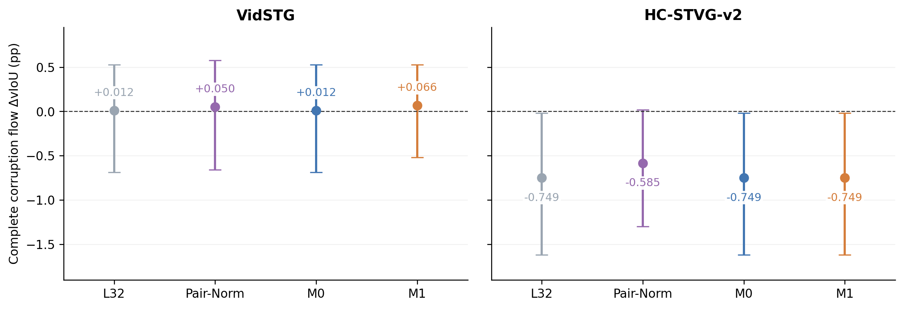
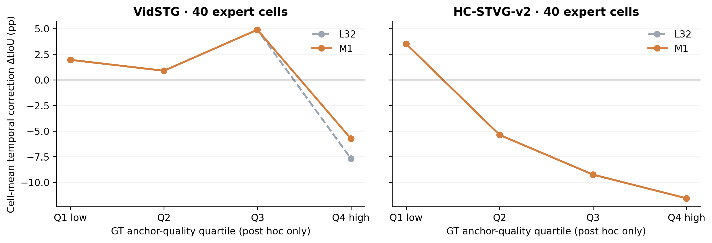
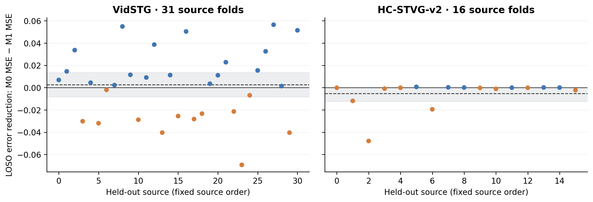

# Anchor-score conditional delta: a matched CPU review

**The locked M1 feature does not establish useful joint confirmation behavior.** HC source LOSO error increases and HC target choices are identical to M0/L32. Vid confirmation rejects just one additional severe harmful correction; that gain is confined to one source and the complete-flow CI still crosses zero. Keep A; stop this scalar recipe. No structured model or historical GPU queue is started.

This experiment checks the user's proposed anchor-score factor with matched linear controls. It does not prove that true anchor quality is unimportant, that scalar evidence never works, or that source-scale/native-anchor explanations have been causally eliminated.

## Fixed data and execution

Official same-domain TA-STVG checkpoints Vid fbb1ed88 / HC ee72f0d9, original two-offset pixels, all 32 hypotheses including Old8, frozen L scores, Uniform expert arrival schedule and A's 1792-parameter persistent spatial trajectory (Vid K1 / HC K8) are unchanged. Each dataset uses 32 search + 16 confirmation sources, one query/source, two orders, clean and five 5% corruptions, 25% expert positions. All 1152 arrivals are evaluated: 288 expert (240 corrupt/48 clean), 864 nonexpert identically A. These are historically exposed development panels, not fresh tests.

The 31/16 official source-validation sources already selected the original ridge alpha and earlier calibrations. Only these source labels fit the new delta predictors. The original ranking and alpha are not retrained. Baseline GT case diagnosis precedes fitting and is explicitly recorded; separate guarded fit/selection stages cannot parse target metric rows or that diagnostic. Input bytes are read solely for SHA256 verification before each guard is installed; seal flags concerning label reads mean no parsing of target label values into fitting or selection, not absence of hash-only file I/O. Both source models and all new choices seal before the new-arm target metric join. This controls this run's decisions, not earlier GT exposure.

## Good/failure cases and the measured gap

The attachment's GT-quality quartiles reproduce. These are **cell means on corruption expert arrivals**, including no-op cells, and cannot be used as an online gate. Source-balanced estimates and intervals are also released. Improve/harm here means tIoU increase/decrease.


| Confirm expert | GT quartile | Mean A8 tIoU | L32 ΔtIoU pp | L32 ΔvIoU pp | Improve / harm / neutral |
| --- | --- | --- | --- | --- | --- |
| VidSTG | 1 | 0.0581 | +1.9422 | +0.7092 | 10 / 0 / 0 |
| VidSTG | 2 | 0.2071 | +0.8773 | -0.0122 | 6 / 4 / 0 |
| VidSTG | 3 | 0.7214 | +4.8786 | +3.0934 | 7 / 3 / 0 |
| VidSTG | 4 | 0.8573 | -7.6867 | -3.5982 | 4 / 6 / 0 |
| HC-STVG-v2 | 1 | 0.3860 | +3.5072 | +1.5920 | 6 / 0 / 4 |
| HC-STVG-v2 | 2 | 0.6526 | -5.3811 | -3.3542 | 0 / 10 / 0 |
| HC-STVG-v2 | 3 | 0.7959 | -9.2592 | -5.1044 | 1 / 8 / 1 |
| HC-STVG-v2 | 4 | 0.9039 | -11.5710 | -5.1160 | 2 / 7 / 1 |


The cited Vid source37/exposure/order2 case is verified: A8 tIoU 0.873016 → L32 0.679012, radius 0.295082, vIoU -8.6962 pp. Prior Pair-Norm accepts it. **M1 also accepts it**, predicting +0.009727 tIoU. The single newly rejected Vid confirmation case is source37/**frame_drop**, not this exposure example.

The helpful source34/frame_drop/order1 case is also verified: 0.236994 → 0.421488, vIoU +11.2971 pp. Both are small corrections. Radius alone therefore does not separate these two cases, but two cases do not identify a universal cause. The baseline convenience named-case filter expected `exposure` while the real condition is `exposure_5`; full rows/quartiles were intact and independent case readback uses the real condition.

Two limits matter before fitting. First, Δt=t_winner−t_anchor contains minus t_anchor. The HC confirmation correlation is -0.5256; the exact average-over-candidates delta has an even stronger negative correlation (-0.9294). The latter is a post-hoc arithmetic control, not a new deployed scorer. These correlations do not prove anchor-quality blindness.

Second, the proposed proxy is a relative **L score**, not GT correctness. Its cell-level correlation with A8 GT tIoU on confirmation is 0.3638 Vid and 0.1126 HC. These descriptive associations, with repeated cells and few sources, are not calibration guarantees.

## Matched single-feature test

Each source's unique highest L candidate is compared with all 32 pseudo-anchors, including its self pair with delta=0. Retain negative/neutral labels and duplicate intervals; total fit weight one/source. This produces 992 Vid and 512 HC pseudo-anchor examples, **31/16 independent sources**, not 1504 independent observations.

With fixed IQR+1e−8, m=(s_top−s_anchor)/denominator and a=(s_anchor−median(s))/denominator:

    M0: predicted delta = beta0 + beta1*m
    M1: predicted delta = beta0 + beta1*m + beta2*a

Both use weighted unregularized SVD least squares with rcond=1e−12. No interaction, MLP, threshold/q/regularization search, extra latent or expert. Both target rules accept the unchanged unique top strictly above A8 only if predicted mean delta>1e−12. This point-mean rule is **not** a lower safety certificate. Marginal source-range extrapolation is recorded, never another gate. M0 differs from the previous isotonic Pair-Norm; that previous arm is descriptive.

Exactly m+a=c_pool=(s_top−median(s))/denominator. Therefore M1 is equivalently beta0+(beta1−beta2)m+beta2*c_pool. It adds across-pool top-score context, **not independent within-pool anchor evidence**. Full design ranks are 2/3 for M0/M1 in both datasets; rank sufficiency across sources does not remove that identity or identify a causal anchor mechanism.

## Source leave-one-source-out

Every source is predicted from a fit to all other validation sources. All 32 pseudo-anchors have equal within-source weight; the eligible non-self analysis is also released. MSE uses 0–1 tIoU units squared. Positive error reduction favors M1. Bootstrap resamples 10000 whole sources, not pairs.


| Dataset | M0 MSE | M1 MSE | M0−M1 MSE [95% CI] | Improved source folds |
| --- | --- | --- | --- | --- |
| VidSTG | 0.096679 | 0.093944 | +0.002735 [-0.008155, +0.013648] | 19/31 |
| HC-STVG-v2 | 0.041211 | 0.046362 | -0.005151 [-0.012189, -0.000342] | 6/16 |

Vid improvement is uncertain; HC M1 has higher error and its paired interval is below zero. All folds, coefficients, rank/condition diagnostics and predictions are exported; no fold outcome selects a different rule. The top pseudo-anchor self pair is excluded from actual replacement but retained as explicitly specified in training.

## Complete corruption flow

All differences below are source-macro vIoU pp against unchanged A8. Source→order→condition averages and paired 10000-source bootstrap are used; per-order and leave-one-source-out values are released.

| Panel | L32−A8 | Prior Pair-Norm−A8 | M0−A8 | M1−A8 | M1−M0 |
| --- | --- | --- | --- | --- | --- |
| VidSTG/search | -0.1373 [-1.1083, +0.8118] | +0.0650 [-0.6253, +0.8893] | -0.1373 [-1.1083, +0.8118] | -0.2973 [-1.2269, +0.6042] | -0.1600 [-0.4830, +0.0032] |
| VidSTG/confirm | +0.0120 [-0.6874, +0.5259] | +0.0502 [-0.6603, +0.5774] | +0.0120 [-0.6874, +0.5259] | +0.0663 [-0.5197, +0.5268] | +0.0543 [+0.0000, +0.1628] |
| HC-STVG-v2/search | +0.3188 [-0.4399, +1.2387] | +0.3167 [-0.4423, +1.2366] | +0.3188 [-0.4399, +1.2387] | +0.3188 [-0.4399, +1.2387] | +0.0000 [+0.0000, +0.0000] |
| HC-STVG-v2/confirm | -0.7489 [-1.6172, -0.0176] | -0.5847 [-1.2986, +0.0194] | -0.7489 [-1.6172, -0.0176] | -0.7489 [-1.6172, -0.0176] | +0.0000 [+0.0000, +0.0000] |

## Confirmed coverage, gross utility and negative tail

Acceptance counts use the 40 corrupt expert cells/dataset; gross gain/loss use the complete corrupt flow. Severe means ΔvIoU<−5 pp.

| Dataset | Arm | Accepted | Accepting sources | t-benefit / other accepted | Gross gain/loss pp | Severe harms |
| --- | --- | --- | --- | --- | --- | --- |
| VidSTG | L32 | 40/40 | 8 | 27/13 | 0.4589/0.4469 | 6 |
| VidSTG | Pair-Norm | 36/40 | 8 | 25/11 | 0.4436/0.3933 | 6 |
| VidSTG | M0 | 40/40 | 8 | 27/13 | 0.4589/0.4469 | 6 |
| VidSTG | M1 | 39/40 | 8 | 27/12 | 0.4589/0.3926 | 5 |
| HC-STVG-v2 | L32 | 34/40 | 7 | 9/25 | 0.1584/0.9073 | 13 |
| HC-STVG-v2 | Pair-Norm | 29/40 | 7 | 8/21 | 0.1513/0.7361 | 10 |
| HC-STVG-v2 | M0 | 34/40 | 7 | 9/25 | 0.1584/0.9073 | 13 |
| HC-STVG-v2 | M1 | 34/40 | 7 | 9/25 | 0.1584/0.9073 | 13 |

Vid M0 accepts every L32 replacement. M1 changes one confirmation decision, lowers severe harms 6→5 and leaves all 27 helpful proposals accepted. M1−M0 +0.0543 pp comes entirely from source37; leaving it out gives zero. The overall M1−A8 interval crosses zero. HC M1 accepts exactly the same 34 proposals as M0/L32, including all 25 harmful proposals and 13 severe harms. This is not near-zero coverage safety; it is absent rejection utility.

## Does the conditional mechanism appear?

GT strata are diagnostic only. Zero denominators mean no proposals of that kind, not a safety rate.

| Dataset | GT anchor quartile | Arm | Helpful proposals kept | Harmful proposals rejected |
| --- | --- | --- | --- | --- |
| VidSTG | Q1 | M0 | 10/10 | 0/0 |
| VidSTG | Q1 | M1 | 10/10 | 0/0 |
| VidSTG | Q4 | M0 | 4/4 | 0/6 |
| VidSTG | Q4 | M1 | 4/4 | 1/6 |
| HC-STVG-v2 | Q1 | M0 | 6/6 | 0/0 |
| HC-STVG-v2 | Q1 | M1 | 6/6 | 0/0 |
| HC-STVG-v2 | Q4 | M0 | 2/2 | 0/7 |
| HC-STVG-v2 | Q4 | M1 | 2/2 | 0/7 |

M1 keeps the lowest-quartile helpful proposals on both datasets, but it rejects only 1/6 top-quartile harmful proposals on Vid and 0/7 on HC. It has not learned the claimed pattern of selectively protecting reliable anchors. The frozen relative score proxy is insufficient in this locked fit; failure does not refute a mechanism using an independent, valid anchor-quality measurement.

## Clean control and scope

| Clean complete flow | M0−A8 pp | M1−A8 pp |
| --- | --- | --- |
| VidSTG/search | -0.3426 [-1.4604, +0.7247] | -0.5010 [-1.5795, +0.5124] |
| VidSTG/confirm | -0.1961 [-0.9756, +0.4773] | -0.1961 [-0.9756, +0.4773] |
| HC-STVG-v2/search | +0.7039 [-0.2683, +2.0903] | +0.7039 [-0.2683, +2.0903] |
| HC-STVG-v2/confirm | -0.4096 [-1.3622, +0.3358] | -0.4096 [-1.3622, +0.3358] |

All 864 nonexpert cells remain A. These arms change current expert temporal readout only, not future adaptation or persistent spatial learning. Clean, search and confirmation are not stitched into dataset-specific winners.

## Decision and verification

**NO_GO_locked_anchor_score_linear_models**. Failed prelocked development checks:

- VidSTG: positive_leave_one_out
- HC-STVG-v2: source_LOSO_MSE_improves, positive_mean, better_than_M0, positive_leave_one_out, less_gross_loss, fewer_severe_harms


Keep A/CURRENT. Stop more variants of this margin/relative-anchor-score certification recipe. A structured candidate-relative representation is a possible future variable; no concrete new model is trained here. Scale shift, selected-top conditioning and source→target mismatch remain possible; two normalized-score failures do not causally eliminate them. The one added feature comparison changes neither source pairs nor fit/rule, but M0 vs prior Pair-Norm changes the pair population and regressor and cannot be read as a one-factor causal comparison.

Independent SciPy pivoted QR reconstructs both full fits and every LOSO fold against NumPy SVD. Every input hash, choice/state/pixel hash, cached metric, quartile, paired/source/order/bootstrap summary and decision check passes: **227,053 scalar checks**, maximum difference 1.07e-14. Seven meaningful CPU controls pass. Baseline case audit 0.201s, source fitting/LOSO 0.248s, new choice sealing 0.096s, metric aggregation 1.712s, independent audit 2.474s. These are CPU wall times excluding rendering/publication, not GPU timing. New GPU forwards, expert calls, replays, backwards and updates are all zero.

## Reproduction and evidence

- [Protocol](../protocols/tastvg_anchor_quality_v1.md), [execution](tastvg_anchor_quality_v1/EXECUTION.md), [actual configuration](../results/tastvg_anchor_quality/2026-10-03/CONFIG.json).
- [All source/target scores, labels, fits, LOSO, seals, positive/negative cases and figures](../results/tastvg_anchor_quality/2026-10-03), [decision](../results/tastvg_anchor_quality/2026-10-03/DECISION.json), [independent audit](../results/tastvg_anchor_quality/2026-10-03/ROOT_AUDIT.json).
- [Runner](../scripts/run_tastvg_anchor_quality_v1.py), [math](../scripts/tastvg_anchor_quality_math_v1.py), [tests](../scripts/test_tastvg_anchor_quality_v1.py), [auditor](../scripts/audit_tastvg_anchor_quality_v1.py), [drawing](../scripts/draw_tastvg_anchor_quality_v1.py), [report generator](../scripts/report_tastvg_anchor_quality_v1.py).

```bash
python -B -m unittest scripts.test_tastvg_anchor_quality_v1
python -B scripts/audit_tastvg_anchor_quality_v1.py
```

The public audit uses anonymous saved scores and scalar labels. Preparation also verifies private predecessor/current receipts; it is not a public model inference launcher. No media, weights, raw annotations, hidden caches or personal conversations are released.






