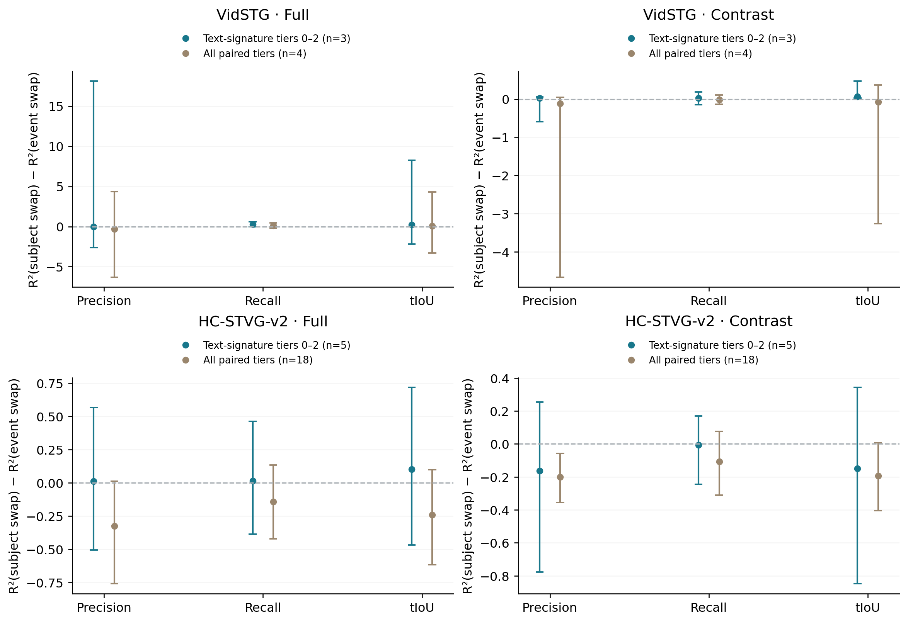
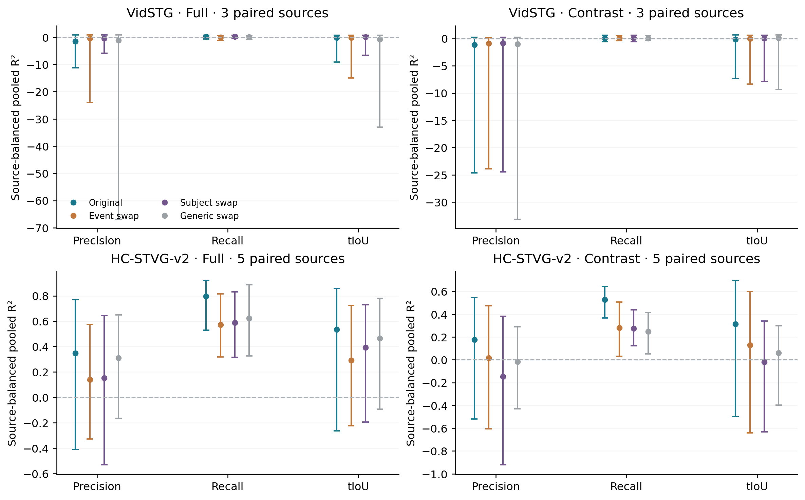
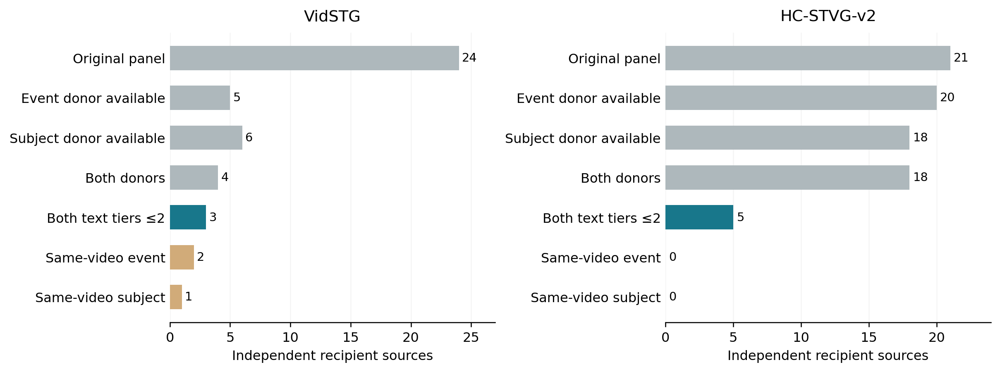

# TA-STVG Controlled Natural-query Decomposition Review

This completed audit follows [451d1c8 query-swap specificity](TA_QUERY_SWAP_SPECIFICITY_REVIEW.md). It tests whether the existing frozen Full/Contrast quality probes are more affected by action changes than by referent changes. No quality head is trained, no candidate is selected and A/CURRENT remain unchanged.

**The intended action-selective Contrast interpretation is not established.** All three HC strict-primary intervals cross zero, with precision/tIoU point estimates in the opposite direction. Vid has a positive Contrast tIoU specificity difference on only three recipients, but both controlled swaps improve its poor original absolute tIoU readout. That positive difference alone is not evidence that changing the event destroys a correctly grounded original representation. The strict confirmation cohort has just one independent source per dataset.

## Primary matched comparison

The common strict text-signature recipients have both an event donor and a subject donor at tiers0–2. On the same recipients define `specificity = R²(subject swap) − R²(event swap)`, equivalently original-minus-event loss minus original-minus-subject loss. Positive values mean greater relative disruption by the event intervention. This is a frozen readout contrast in **raw R² units, not a tIoU/vIoU prediction gain**.

| Dataset / Contrast | Original | Event swap | Subject swap | Generic swap | Subject − event | Paired 95% CI |
|---|---:|---:|---:|---:|---:|---|
| VidSTG / precision | -1.1668 | -0.8709 | -0.8436 | -1.0350 | 0.0273 | [-0.5887, 0.0599] |
| VidSTG / recall | 0.0564 | 0.0826 | 0.1102 | 0.0689 | 0.0276 | [-0.1500, 0.1888] |
| VidSTG / tiou | -0.1392 | -0.0233 | 0.0436 | 0.0746 | 0.0669 | [0.0282, 0.4736] |
| HC2 / precision | 0.1773 | 0.0153 | -0.1476 | -0.0181 | -0.1629 | [-0.7764, 0.2550] |
| HC2 / recall | 0.5279 | 0.2816 | 0.2748 | 0.2466 | -0.0068 | [-0.2456, 0.1705] |
| HC2 / tiou | 0.3118 | 0.1283 | -0.0201 | 0.0597 | -0.1484 | [-0.8481, 0.3428] |

HC2 has five independent strict recipients/25 corrupted cells: P −0.1629 [−0.7764,+0.2550], R −0.0068 [−0.2456,+0.1705], tIoU −0.1484 [−0.8481,+0.3428]. These estimates do not support an action-selective certifier. They do not establish that Contrast lacks semantic information; both referent and event/context changes can affect it.

Vid has three strict recipients/15 corrupted cells. Contrast tIoU specificity is +0.0669 [+0.0282,+0.4736], while original/event/subject absolute R² is −0.1392/−0.0233/+0.0436. Event swap did not degrade the original point estimate. Its original-minus-event gap is −0.1159 [−2.9378,+1.0173]. Low predictive validity and tiny matched coverage constrain the interpretation. Contrast P/R specificity intervals cross zero. The prespecified Full recall contrast is positive on the same three sources, which also prevents attributing the effect uniquely to Contrast.

## Full comparison and relative block evidence

| Dataset / Full | Original | Event swap | Subject swap | Generic swap | Subject − event | Paired 95% CI |
|---|---:|---:|---:|---:|---:|---|
| VidSTG / precision | -1.4818 | -0.3601 | -0.3887 | -1.1088 | -0.0286 | [-2.6126, 18.1212] |
| VidSTG / recall | 0.2843 | 0.0360 | 0.2993 | 0.1150 | 0.2633 | [0.0003, 0.6255] |
| VidSTG / tiou | -0.1758 | -0.1415 | 0.0782 | -0.7864 | 0.2197 | [-2.2051, 8.2339] |
| HC2 / precision | 0.3467 | 0.1406 | 0.1536 | 0.3095 | 0.0130 | [-0.5051, 0.5670] |
| HC2 / recall | 0.7964 | 0.5726 | 0.5869 | 0.6239 | 0.0143 | [-0.3865, 0.4607] |
| HC2 / tiou | 0.5336 | 0.2921 | 0.3941 | 0.4663 | 0.1020 | [-0.4670, 0.7170] |

All six strict `Contrast specificity − Full specificity` intervals cross zero. Thus the data do not establish that the Contrast block is a more event-specific quality channel than Full. High accessible quality, generic query-swap dependence and selective event sensitivity are different questions; this audit measures only the latter under the locked natural-query matches.

## Broad matched, clean and confirmation controls

| Dataset / cohort / Contrast tIoU | Sources | Original | Event | Subject | Subject − event | Paired 95% CI |
|---|---:|---:|---:|---:|---:|---|
| VidSTG / corrupt/all/common | 4 | -0.4078 | -0.2240 | -0.3023 | -0.0782 | [-3.2595, 0.3713] |
| VidSTG / clean/all/common_strict | 3 | -0.1606 | -0.0104 | 0.0548 | 0.0652 | [0.0296, 0.4736] |
| VidSTG / corrupt/search/common_strict | 2 | 0.3184 | 0.2001 | 0.2467 | 0.0465 | [0.0282, 0.4736] |
| VidSTG / corrupt/confirm/common_strict | 1 | -5.8388 | -2.9010 | -2.5773 | 0.3237 | one source; no population interval |
| HC2 / corrupt/all/common | 18 | 0.2471 | 0.1335 | -0.0589 | -0.1924 | [-0.4035, 0.0071] |
| HC2 / clean/all/common_strict | 5 | 0.4051 | 0.0293 | 0.0005 | -0.0289 | [-0.7229, 0.7989] |
| HC2 / corrupt/search/common_strict | 4 | 0.1531 | 0.2045 | -0.0748 | -0.2793 | [-1.1180, 0.4130] |
| HC2 / corrupt/confirm/common_strict | 1 | 0.7550 | -0.1019 | 0.1213 | 0.2233 | one source; no population interval |

The broader HC paired cohort has18 sources, but most subject swaps preserve only a root action, not the entire event. Its Contrast precision specificity is **−0.1997 [−0.3555,−0.0567]**, a supplementary pointwise reversal. Broader tIoU specificity is −0.1924 [−0.4035,+0.0071]. These are measured responses to the fixed weak controls, not proof of pure identity coding.

Strict confirmation tIoU specificity is +0.3237 on one Vid source and +0.2233 on one HC source. The raw bootstrap output has degenerate point intervals because resampling one source only repeats it; those are not replication or inferential precision. Clean, both original orders, event AUROC/AP/logloss, MSE/MAE and within-cell R² are all retained in SUMMARY. Source-pooled R² is not mean cell R² or pairwise ranking. Very broad/negative R² intervals are preserved rather than clipped; small-source label-variance instability explains why a single favorable interval must be read alongside absolute MSE and baseline validity.

## Actual coverage and natural queries

Only the predecessor's fixed288 expert arrivals are used: Vid144/24 sources, HC144/21, 240 corrupted plus48 clean. The original metadata panel is32 development+16 confirmation sources per dataset, but sparse expert coverage is smaller. Historical exposure remains; confirmation does not mean fresh test.

| Available control in the cached target panel | Vid cells / independent sources | HC cells / independent sources |
|---|---:|---:|
| Original | 144 / 24 | 144 / 21 |
| Event donor | 30 / 5 | 138 / 20 |
| Subject donor | 36 / 6 | 120 / 18 |
| Both donors, all tiers | 24 / 4 | 120 / 18 |
| Both donors, text tiers0–2 | 18 / 3 | 30 / 5 |
| Same-video event donor | 12 / 2 | 0 / 0 |
| Same-video subject donor | 6 / 1 | 0 / 0 |

Vid donors are561 official natural captions/questions on the original48 videos. They contain real same-media multiple queries. HC donors are3482 official real captions from the existing full-cohort metadata plan; every exact media hash has one distinct caption. A shared YouTube provenance is not the same video cut. Hence no same-video HC intervention is available. Missing donors remain missing; they are not filled by generic swaps.

Pairs prefer identical media and referent IDs for event changes, different referent IDs with identical action signatures for subject changes, then weaker cross-video nominal phrase/noun-class or action/root matches. Query form is fixed, lexical action signatures are defined from cached Stanza1.14.0 parses, text length difference and SHA resolve ties. All mappings precede new model predictions. For strict subject matches the signature holds all parsed VERBs, direct/indirect objects, particles and passive voice; event matches require disjoint parsed lexical verbs. Cross-video subject matching cannot hold actual person identity fixed.

**Control limitation found before score sealing:** natural-language parsing is not semantic equivalence. HC sources14/26 share a walking action despite disjoint parsed VERBs, and source2's subject donor adds a stop phase. TEXT_CONTROL_REVIEW records these cases before new score/GT access. No mapping or recipient is excluded/replaced by its measured quality. Oblique objects, directions, attributes, extra clauses and linguistic distribution can still vary. Strict is a text-signature tier, not an exact causal one-factor control. These limits and the small same-video overlap prevent a general pure-event binding claim.

Vid annotation-bearing official metadata is read for descriptions, target IDs and used input segments. This is **annotation-assisted referent matching**, not no annotation-file access. GT times, boxes, relations and quality metrics do not select pairs. No donor GT is read. All controlled scores seal globally before the original already-exposed cached GT span is joined for P/R/t labels.

## Frozen implementation and validation

Original pixels, Paper48 frame grid/two offsets, official in-domain checkpoint, A pre-update1792 spatial state, persistent trajectory and original Old8⊂32 intervals remain fixed. Changing the query recomputes the full text-conditioned encoder, then replays the suffix at the exact saved A pre-state. The changed query's new native interval/boxes never replace original candidate support or output. All136 atlas probes, means/stds and source-selected regularization are byte-identical; only Full/Contrast P/R/t, Geometry invariance and secondary Hidden-event readouts are evaluated. No source/target probe fitting, MLP, layerwise capture, extra expert, top-1 prediction or parameter update occurs.

Four original-query no-GT smoke cells reproduce hidden/features/A boxes/native interval bitwise; eight controlled smoke arms verify finite representation/head compatibility. Root acceptance precedes production capture. All324 controlled arrival-arm hidden representations differ from their original query; that verifies intervention delivery, not task improvement. Original/generic scalar metrics reproduce the predecessor bitwise. Geometry readouts remain exactly identical.

Private root audit reconstructs features, labels, probe arithmetic, pre/post state and immutable bindings, deterministic donor tier/word-count/SHA selection and action atoms. It checks 52207212 scalar/features (max error 5.68e-14). The independent public audit recomputes source aggregation and10000 paired bootstrap intervals from anonymous sufficient statistics: 402878 checks, max error 1.07e-14. Nine meaningful CPU tests pass.

Resampling is conditional on the fixed donor mapping; repeated donors/orders/corruptions do not create independent sources. All strict primary recipients have distinct donor hashes here, but broad/available strata and pool reuse remain recorded. Pointwise95% intervals are unadjusted and correlated endpoints are not independent replications.

## Compute and preserved attempts

| Stage | Worker wall seconds | New encoder inputs | Two-offset backbone forwards | Arrival suffix replays |
|---|---:|---:|---:|---:|
| vidstg SMOKE | 13.66 | 6 | 12 | 6 |
| vidstg CAPTURE_BARRIER | 99.92 | 66 | 132 | 66 |
| hc2 SMOKE | 16.56 | 6 | 12 | 6 |
| hc2 CAPTURE_BARRIER | 532.67 | 228 | 456 | 258 |

Total GPU-worker wall 662.82s (11.05min), including loading/decoding/hashing/I/O rather than pure kernel time. Production:294 encoder inputs/324 replays; smoke:12 inputs/replays. Total306 encoder inputs and612 offset forwards. New expert/training/backward/parameter-write/candidate counts are all zero. CPU text intake 46.14s, readout 3.26s, scoring/intervals 62.22s, root audit 29.89s. These successful-stage timings do not include every metadata preparation/publication step.

Preserved histories: CPU immutable-status writer exception, metadata-only pre-prediction strengthening of action/voice controls, and a CPU audit readback-file repeat-write exception fixed by checking the existing immutable text review. The latter required no model, prediction, mapping or score rerun. Original failures and draft design remain private with hashes; anonymous repair receipts are published.

## Decision

The HC Contrast generic query-swap dependence from the predecessor remains a measured result on its original cohort. This round does not isolate that dependence into selective event/action information or establish Contrast-over-Full superiority. Vid's small positive relative difference is retained, together with low baseline predictability and inadequate confirmation. The data do not prove that all retained Full signal is a prior, that Contrast contains no event information or that every nonlinear route will fail.

**No method promotion or follow-up run.** Keep A and deployed CURRENT unchanged. Do not introduce generic-propose/Contrast-certify gating, MLP, layerwise/appearance-motion fitting or latent TTA based on these controls. This bounded audit closes with all positive/negative/clean/order results, text caveats and verified public synchronization.

## Figures and reproduction

[Protocol](../protocols/tastvg_controlled_query_v1.md) · [execution](tastvg_controlled_query_v1/EXECUTION.md) · [all anonymous results](../results/tastvg_controlled_query/2026-10-03). Published sufficient statistics support the independent public audit; GPU replay still requires the authorized private source/model/media/cached assets.
