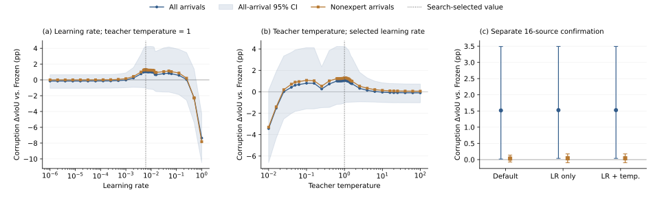

# HC-STVG-v2: sequential learning-rate and teacher-temperature tuning

The final learning rate is 0.006097133675874025, radius 0.05 and teacher temperature 1. The selected pair is identical to the learning-rate-only winner. On the separate confirmation cohort, the selected-minus-default corruption all-arrival contrast is +0.00930 [-0.02017, +0.03516] pp. This is a very small mean difference with an interval spanning zero; tuning has not established improvement over the default.

## Configuration and cohort

The official same-domain HC-STVG-v2 TA-STVG checkpoint and original Paper48 sampling are retained. There are 32 development sources and 16 new confirmation sources excluding all 48 old Optuna sources; all are historically exposed elsewhere in the project. One query per source, two orders, clean and five 5% corruption conditions, 25% specialists, 1792 spatial parameters and one SGD step are fixed. Predictions precede the spatial update. Nonexpert is a subset of the formal method, not an expert-free arm.

Stage A: teacher temperature1, learning rate1e-6..1 with24 coarse+12 refinements. Seal its winner before Stage B: temperature.01..100 with23 coarse+12 refinements at fixed learning rate. The main endpoint is corruption all-arrival source-macro dense delta vIoU. There are71 scheduled records,70 actual search configurations, one exact reuse and zero failures. The final confirmation reuses the identical lr-only configuration, so two distinct192-arrival confirmations execute. Actual total27264 arrivals. No reselection uses confirmation.

## Confirmation versus Frozen

| Arm | All corruption ΔvIoU pp [95% CI] | Nonexpert ΔvIoU pp [95% CI] |
|---|---:|---:|
| default | +1.51701 [+0.01674, +3.48873] | +0.03125 [-0.07531, +0.13919] |
| lr_only | +1.52631 [+0.03745, +3.49332] | +0.04090 [-0.09558, +0.17584] |
| selected | +1.52631 [+0.03745, +3.49332] | +0.04090 [-0.09558, +0.17584] |

Default and selected both show positive all-arrival means relative to Frozen on this cohort; this does not establish a tuning benefit. The clean all-arrival selected-minus-default contrast is -0.02081 [-0.11882, +0.04044] pp. Nonexpert corruption selected-minus-default is +0.00965 [-0.02353, +0.03830] pp.



Panels use separate y-axis ranges. The learning-rate curve is nonmonotonic and deteriorates at very large values. Temperature1 remains selected after the broad conditional temperature sweep. Search-selected values are development estimates, not selection-adjusted confirmation evidence. Shading/error bars are source-bootstrap95% intervals. A single coordinate pass is not a global optimum.

## Verification

Root verification checked27264 payload hashes and state links,305388 scalar/bootstrap checks,6396 recorded SGD audits,6816 teacher checks,54528 recorded independent metric comparisons,72 exact reinsertions, both grid/refinement rules and selection before confirmation. The root audit did not rerun inference or reopen GT. All anonymous trial and confirmation scalar rows, summary readouts, negative tails, reuse receipts and full curves are public; source identities/media/annotations/raw tensors/weights remain excluded.

Reproduce the public scalar audit and figure:

```bash
python scripts/audit_tastvg_coordinate_public_v2.py results/tastvg_coordinate/2026-10-01/hc2
python scripts/draw_tastvg_coordinate_v2.py results/tastvg_coordinate/2026-10-01/hc2
```

VidSTG and HC2 are both complete; neither confirms reliable selected-versus-default improvement. The separately authorized next sensitivity study starts from sealed search winners, not confirmation-selected alternatives. No production promotion or automatic full-data rerun.
