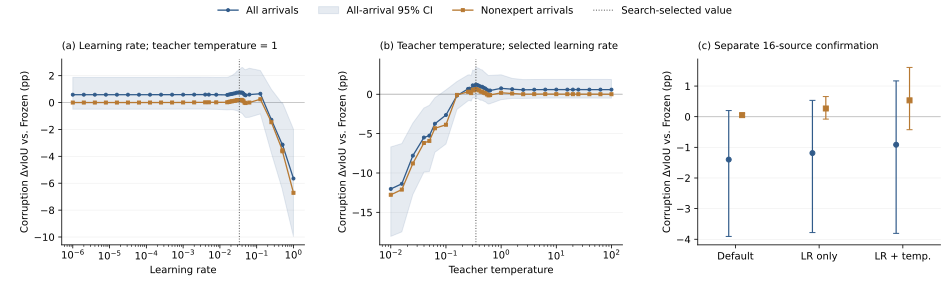

# VidSTG: sequential learning-rate and teacher-temperature tuning

The selected pair improved the separate confirmation mean relative to the default by **0.48418 pp**, with a paired 95% source-bootstrap interval of **[-0.23379, +1.36350] pp**. The interval includes zero. The selected method remained below Frozen on this confirmation cohort in the all-arrival mean: **-0.91493 pp**. These results do not establish a reliable gain over either the default or Frozen, and do not promote a new production configuration.

## Configuration and data

TA-STVG uses the same official VidSTG source checkpoint and original Paper48 input sampling as the prior experiment. The protocol uses 32 development sources and a separate 16-source confirmation cohort, one query per source, two fixed orders, clean plus five 5% deployment corruptions. Confirmation sources exclude all 48 prior Optuna sources. All cohorts nevertheless have historical project exposure; this is development and source-disjoint confirmation, not a globally unseen benchmark.

The formal method retains 25% scheduled specialist availability, 1,792 trainable spatial parameters, one SGD update per scheduled arrival and relative candidate radius 0.05. Output is recorded before the spatial update. “Nonexpert” means the subset of arrivals without a current specialist call, still using the inherited adapted state. It is not a separate expert-free method.

Stage A searches learning rate from 1e-6 to 1 with teacher temperature 1: 24 coarse points and 12 fixed-rule local refinements. Its selected learning rate is 0.033761698432507946. Only then does Stage B search teacher temperature from 0.01 to 100 at that learning rate: 23 coarse points and 12 refinements. The selected teacher temperature is 0.34902548789596055. Both winners are interior points. The all-arrival corruption source-macro dense delta vIoU is the selection objective; confirmation outcomes never select parameters.

There are 71 scheduled records, 70 distinct executed search configurations, one exact receipt-verified reuse, zero numerical failures, and three 192-arrival confirmations. Each search configuration has 384 arrivals. The total is 27,456 actual arrivals; this is not a count of independent videos.

## Search and confirmation

| Configuration | Learning rate | Teacher temperature | Search all ΔvIoU (pp) | Confirmation all ΔvIoU (pp), 95% CI | Confirmation nonexpert ΔvIoU (pp), 95% CI |
|---|---:|---:|---:|---:|---:|
| Default | 0.005 | 1 | +0.59063 | -1.39911 [-3.90616, +0.20026] | +0.05092 [-0.00330, +0.11181] |
| LR only | 0.0337617 | 1 | +0.75012 | -1.18660 [-3.78095, +0.53205] | +0.26771 [-0.07965, +0.65600] |
| LR + temperature | 0.0337617 | 0.3490255 | +1.23836 | -0.91493 [-3.80692, +1.16787] | +0.53318 [-0.42459, +1.60665] |

All deltas in the table compare the formal method against Frozen on the same cohort. Search maxima are selection-biased descriptive values, not confirmation evidence. The paired selected-minus-default contrast on confirmation is +0.48418 pp [-0.23379, +1.36350] for all corruption arrivals and +0.48226 pp [-0.42047, +1.49780] for nonexpert corruption arrivals. The corresponding clean all-arrival contrast is +0.52769 pp [-0.19688, +1.41495], so the observed mean difference is not established as corruption-specific.



The search curves show strong degradation at large learning rates and at very cold teacher temperatures with the selected learning rate. Across the full tested ranges, the all-arrival search delta spans -5.65020 to +0.75012 pp in Stage A and -12.02771 to +1.23836 pp in Stage B. Broad sensitivity does not itself prove a beneficial setting will generalize. Stage B is conditional on the Stage A winner; this single coordinate pass is not a global optimum or a full interaction study. Panels use different y-axis ranges to retain all measured failures of performance. Shading and error bars are 95% source-bootstrap intervals; development intervals are not selection-adjusted.

## Verification and reproducibility

The root checked every completed prediction-payload hash and sealed state-receipt chain: 27,456 arrivals, 307,762 scalar/summary/bootstrap checks, 6,390 recorded SGD checks, 6,864 teacher checks, 54,912 recorded independent metric comparisons and 96 recorded exact full reinsertions. All recorded metric errors are zero. The new root audit rehashes payloads and independently recomputes scalar summaries; it does not rerun models or reopen GT. The separate public scalar audit passed 307,032 checks. The final selection precedes confirmation label exposure and prediction barriers, and both stage grids, refinements, fixed coordinates and winners match the frozen rules. Live default prediction/state/gradient parity was verified before search.

All scheduled configurations, reusable receipts, all/clean/expert/nonexpert summaries, source/order variation, negative tails and anonymous scalar rows are retained under `results/tastvg_coordinate/2026-10-01/vidstg`. Private media, source identities, query text, annotations, raw prediction tensors and weights are excluded. The implementation and exact protocol are included. Run the public audit with:

```bash
python scripts/audit_tastvg_coordinate_public_v2.py results/tastvg_coordinate/2026-10-01/vidstg
python scripts/draw_tastvg_coordinate_v2.py results/tastvg_coordinate/2026-10-01/vidstg
```

HC-STVG-v2 is still running in the same frozen serial queue at this publication. The authorized additional sensitivity study remains queued after both datasets finish and are audited and published. Neither this report nor its means authorize confirmation-based reselection, automatic full-dataset evaluation or method promotion.
