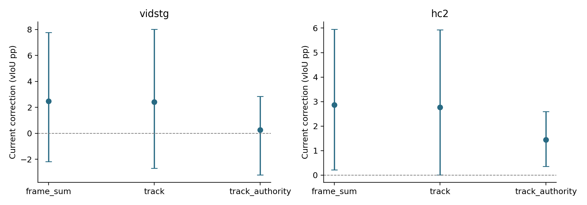
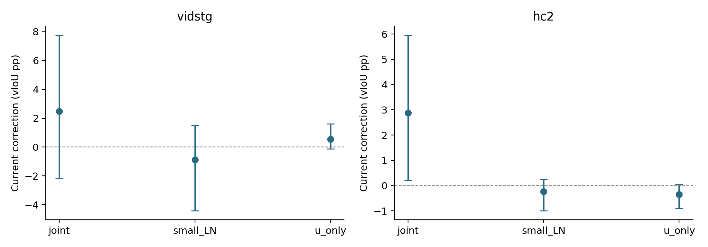
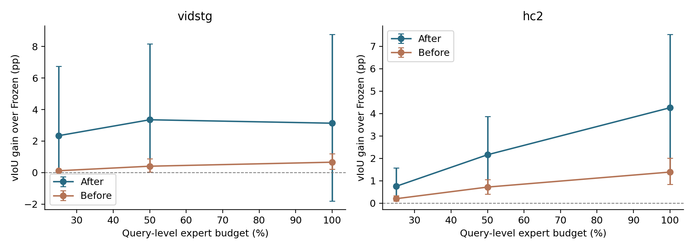
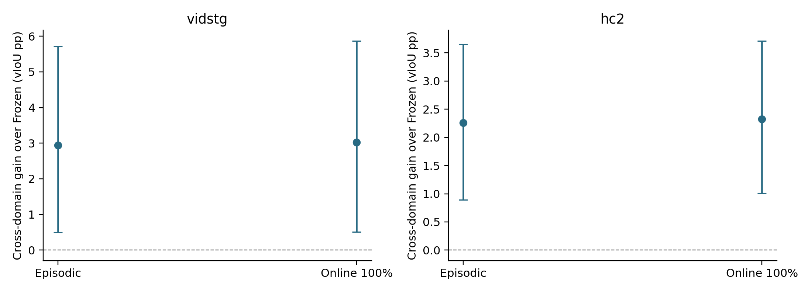

# DeCoTA track evidence, actuation scope and real online qualification

本轮接续已公开R1，保持各数据集32开发＋16历史曝光确认来源、一query、双序、clean＋五5%。不是全部官方query。
R3/R4在封存的P1同到达前状态上比较当前纠正；R5和预算流独立演化LN，不能把两类结果合并称为持续收益。
优化器、evidence、scope按预锁规则只在开发面板选，确认不重选。CURRENT与旧C1/P0/P1完整保留。

## R3: matched current-query interventions

| Confirm corruption | Arm | Δbefore vIoU pp [paired95%] | >20pp harm |
|---|---|---:|---:|
| vidstg | frame_sum | +2.4749 [-2.1739,+7.7648] | 8 |
| vidstg | track | +2.4090 [-2.7005,+8.0263] | 9 |
| vidstg | track_authority | +0.2665 [-3.2091,+2.8519] | 5 |
| hc2 | frame_sum | +2.8709 [+0.2133,+5.9558] | 0 |
| hc2 | track | +2.7738 [+0.0087,+5.9322] | 0 |
| hc2 | track_authority | +1.4382 [+0.3625,+2.5939] | 0 |

开发决定：`frame`。非GT最优step；当前输出与最终写入proposal分开保存。

## R4: matched current-query interventions

| Confirm corruption | Arm | Δbefore vIoU pp [paired95%] | >20pp harm |
|---|---|---:|---:|
| vidstg | joint | +2.4744 [-2.1738,+7.7643] | 8 |
| vidstg | small_LN | -0.8716 [-4.4218,+1.5018] | 8 |
| vidstg | u_only | +0.5366 [-0.1241,+1.6150] | 0 |
| hc2 | joint | +2.8710 [+0.2137,+5.9560] | 0 |
| hc2 | small_LN | -0.2291 [-0.9972,+0.2528] | 0 |
| hc2 | u_only | -0.3513 [-0.9125,+0.0641] | 0 |

开发决定：`joint`。非GT最优step；当前输出与最终写入proposal分开保存。

## Actual independent LN streams

| Confirm corruption | Stream | After−Frozen pp [paired95%] | Before−Frozen pp | After−episodic pp | >20pp harm |
|---|---|---:|---:|---:|---:|
| vidstg | episodic | +2.9836 [-2.0137,+8.6754] | +0.0000 [+0.0000,+0.0000] | +0.0000 [+0.0000,+0.0000] | 8 |
| vidstg | budget_0.25 | +2.3418 [+0.0674,+6.7369] | +0.1174 [+0.0241,+0.2130] | -0.6418 [-3.5461,+3.0898] | 0 |
| vidstg | budget_0.5 | +3.3523 [+0.4594,+8.1673] | +0.4053 [+0.0434,+0.8861] | +0.3687 [-2.1642,+3.7960] | 0 |
| vidstg | budget_1.0 | +3.1341 [-1.8140,+8.7771] | +0.6597 [+0.2126,+1.2056] | +0.1504 [+0.0116,+0.3091] | 8 |
| hc2 | episodic | +3.9754 [+1.0160,+7.3520] | +0.0000 [+0.0000,+0.0000] | -0.0000 [-0.0000,+0.0000] | 0 |
| hc2 | budget_0.25 | +0.7553 [+0.1425,+1.5774] | +0.2004 [+0.0887,+0.3265] | -3.2201 [-6.6038,-0.3395] | 0 |
| hc2 | budget_0.5 | +2.1621 [+0.7034,+3.8633] | +0.7186 [+0.4066,+1.0565] | -1.8133 [-4.9666,+0.5535] | 0 |
| hc2 | budget_1.0 | +4.2593 [+1.4225,+7.5398] | +1.3883 [+0.8445,+2.0075] | +0.2838 [-0.1151,+0.7950] | 0 |

最终空间scope：`joint`；时间读出：`native`。
先前agent增加的同域资源门槛保留于R6_SCOPE_CORRECTION.json，但它不属于用户要求的停止条件。R6已按原全路线授权做新的跨域测量；冻结方法未按确认结果重选。

## R6: newly executed cross-domain qualification

Vid目标采用官方HC-STVG-v2源checkpoint；HC2目标采用官方VidSTG源checkpoint。重新捕获576个匹配输入及对应四帧DINO观察，不复用同域H；两组episodic/online100真实链共2304读出，全封存后GT评分。

| Confirm corruption | Stream | After−Frozen pp [paired95%] | Before−Frozen pp | After−episodic pp | >20pp harm |
|---|---|---:|---:|---:|---:|
| vidstg | episodic | +2.9449 [+0.4997,+5.7132] | +0.0000 [+0.0000,+0.0000] | +0.0000 [+0.0000,+0.0000] | 0 |
| vidstg | online_100 | +3.0274 [+0.5083,+5.8715] | +0.7444 [+0.0423,+1.4733] | +0.0825 [-0.1338,+0.3333] | 0 |
| hc2 | episodic | +2.2580 [+0.8906,+3.6503] | +0.0000 [+0.0000,+0.0000] | +0.0000 [+0.0000,+0.0000] | 0 |
| hc2 | online_100 | +2.3269 [+1.0087,+3.7151] | +0.7430 [+0.2859,+1.3560] | +0.0689 [-0.1035,+0.2455] | 0 |

双数据集跨域确认lower95都正：`True`；此处是实际资格测量，不是方法晋升。

| Cross-domain panel (online100) | After−Frozen pp [paired95%] | Before−Frozen pp | After−episodic pp | >20pp harm |
|---|---:|---:|---:|---:|
| vidstg/search/corruption | +0.7057 [-3.1338,+4.0133] | +0.8125 [+0.4531,+1.2273] | +0.9700 [-0.3656,+2.7718] | 17 |
| vidstg/confirm/clean | +2.9868 [+0.4967,+5.7038] | +0.7326 [+0.0624,+1.4067] | +0.2701 [+0.0190,+0.5649] | 0 |
| hc2/search/corruption | +2.7472 [+0.7632,+4.9008] | +1.3357 [+0.9521,+1.7337] | -0.0666 [-0.5566,+0.5481] | 2 |
| hc2/confirm/clean | +1.7177 [-0.0327,+3.5879] | +0.6779 [+0.3402,+1.0839] | +0.4503 [-0.3308,+1.7199] | 0 |

跨域Vid开发corruption总收益区间跨零且有17次>20pp损害，HC开发有2次；确认两方向总收益为正仍不建立普遍安全。两确认方向online−episodic的区间都跨零；Before−Frozen为正不等于After已可靠超过episodic。

| Cross-domain confirm tail | Dataset/source | Condition/order | After−Frozen pp | Before−Frozen pp | Current spatial pp |
|---|---|---|---:|---:|---:|
| positive | vidstg/47 | exposure_5/order2 | +17.5224 | +0.9017 | +16.6207 |
| positive | vidstg/47 | motion_blur_5/order2 | +17.3617 | +0.9343 | +16.4274 |
| positive | vidstg/47 | frame_drop_5/order1 | +17.0017 | +4.6419 | +12.3598 |
| negative | vidstg/35 | frame_drop_5/order2 | -8.3649 | -2.3782 | -5.9867 |
| negative | vidstg/35 | exposure_5/order1 | -7.6413 | -3.4597 | -4.1816 |
| negative | vidstg/35 | frame_freeze_5/order1 | -7.1002 | -3.2817 | -3.8185 |
| positive | hc2/36 | exposure_5/order1 | +13.3841 | +6.6630 | +6.7210 |
| positive | hc2/47 | frame_freeze_5/order2 | +11.6110 | +0.0658 | +11.5452 |
| positive | hc2/47 | frame_freeze_5/order1 | +11.3383 | -0.0651 | +11.4034 |
| negative | hc2/39 | frame_drop_5/order2 | -7.5801 | -0.5030 | -7.0771 |
| negative | hc2/39 | frame_drop_5/order1 | -7.3149 | -0.0245 | -7.2905 |
| negative | hc2/39 | frame_freeze_5/order2 | -4.2029 | -0.3427 | -3.8602 |

跨域的逐到达observed/unobserved GT损害、own-energy改善但GT受损，以及correctness阈值变化保留在DIAGNOSTICS/SUMMARY；正负例都不作为重选规则。

## Development selection and same-state contrasts

R3必须同时保住两个开发面板的原anchor和FrameSum均值，且不增加>20pp受损到达；R4须同时保住joint均值及严重负尾。资格不等于确认已证明普遍收益。
| Stage/panel | Arm | Δbefore vIoU pp [paired95%] | >20pp harm |
|---|---|---:|---:|
| R3/vidstg search | frame_sum | +1.1599 [-1.1421,+3.1442] | 5 |
| R3/vidstg search | track | +1.6148 [-0.5316,+3.4979] | 5 |
| R3/vidstg search | track_authority | +0.0481 [-1.5841,+1.1181] | 5 |
| R3/hc2 search | frame_sum | +2.3131 [+0.4633,+4.0592] | 1 |
| R3/hc2 search | track | +2.2981 [+0.6092,+3.8522] | 1 |
| R3/hc2 search | track_authority | +0.8731 [+0.3835,+1.3275] | 2 |
| R4/vidstg search | joint | +1.1650 [-1.1387,+3.1528] | 5 |
| R4/vidstg search | small_LN | -0.3134 [-2.2289,+1.2189] | 5 |
| R4/vidstg search | u_only | +0.4745 [-0.8410,+1.7305] | 0 |
| R4/hc2 search | joint | +2.3143 [+0.4647,+4.0609] | 1 |
| R4/hc2 search | small_LN | +0.1369 [-0.6311,+0.8208] | 2 |
| R4/hc2 search | u_only | +0.1739 [-0.6136,+0.8493] | 1 |

| Confirm corruption | Contrast | ΔvIoU pp [paired95%] |
|---|---|---:|
| R3/vidstg | track_minus_frame_sum | -0.0659 [-0.5494,+0.2804] |
| R3/vidstg | track_authority_minus_track | -2.1425 [-5.4193,-0.0999] |
| R3/hc2 | track_minus_frame_sum | -0.0972 [-0.3726,+0.1256] |
| R3/hc2 | track_authority_minus_track | -1.3356 [-3.4793,+0.5704] |
| R4/vidstg | u_only_minus_joint | -1.9377 [-6.1740,+2.0847] |
| R4/vidstg | small_LN_minus_joint | -3.3460 [-6.8195,-1.0534] |
| R4/hc2 | u_only_minus_joint | -3.2223 [-6.1129,-0.7689] |
| R4/hc2 | small_LN_minus_joint | -3.1001 [-5.9325,-0.7291] |

Track−FrameSum对比轨迹权重与独立帧同尺度控制，TrackAuthority−Track改变实际位移权限；两者不单独证明身份被识别。u-only对照也改变当前梯度参数维数和额外慢步计算，不能只归因reset寿命。
## Source35 matched current correction

该到达从同一封存P1状态出发。Native时间固定，GT只计分；不把该单例推广成全部来源规律。
| Stage | Arm | vIoU% | Δbefore pp |
|---|---|---:|---:|
| R3 | frame_sum | 11.9759 | -33.0883 |
| R3 | track | 22.7759 | -22.2883 |
| R3 | track_authority | 26.6926 | -18.3717 |
| R4 | joint | 11.9759 | -33.0883 |
| R4 | u_only | 45.0642 | +0.0000 |
| R4 | small_LN | 13.0861 | -31.9781 |

## Evidence support and update execution

| Stage/dataset | Arm | Observed GT IoU Δpp | Unobserved Δpp | Proxy improved / GT harmed count |
|---|---|---:|---:|---:|
| R3/vidstg | frame_sum | +9.5863 [+2.0914,+18.2096] | +4.3846 [-0.8977,+10.1271] | 17 |
| R3/vidstg | track | +9.5624 [+0.7606,+18.9874] | +4.1647 [-1.8541,+10.4017] | 20 |
| R3/vidstg | track_authority | +2.0902 [-3.3456,+5.8628] | +0.7667 [-3.0286,+3.5484] | 7 |
| R3/hc2 | frame_sum | +4.9169 [+0.9893,+9.0036] | +3.9650 [+0.4798,+7.6528] | 49 |
| R3/hc2 | track | +5.6420 [+1.6180,+9.7530] | +3.8802 [+0.0609,+7.7916] | 48 |
| R3/hc2 | track_authority | +2.7322 [+0.8686,+4.5135] | +2.2053 [+0.7557,+3.6946] | 27 |
| R4/vidstg | joint | +9.5846 [+2.0884,+18.2082] | +4.3839 [-0.8982,+10.1263] | 17 |
| R4/vidstg | small_LN | -0.3621 [-4.6531,+2.7276] | -0.7317 [-4.3494,+1.6688] | 7 |
| R4/vidstg | u_only | +1.5099 [+0.4526,+3.3148] | +0.6473 [-0.1135,+1.7906] | 10 |
| R4/hc2 | joint | +4.9173 [+0.9896,+9.0041] | +3.9650 [+0.4795,+7.6534] | 49 |
| R4/hc2 | small_LN | +0.0206 [-1.1240,+0.8471] | -0.4043 [-1.4368,+0.3338] | 31 |
| R4/hc2 | u_only | +0.3367 [-1.1504,+2.1283] | -0.8934 [-2.4583,+0.0387] | 57 |

Observed为四个实际观察位置落在GT计分帧上的IoU变化，unobserved为其余GT计分帧；不是新的监督或正式GT-selected策略。
固定track posterior的GT诊断只使用已有带GT观察帧：最佳path、MAP path与posterior均值分别保留。事件外/无GT观察不构造虚假的correctness标签；路径重叠仍不保证identity。

| Confirm corruption observed support | GT-best path IoU% | MAP path IoU% | Posterior expected IoU% | No scored observation arrivals |
|---|---:|---:|---:|---:|
| vidstg | 88.53 | 85.95 | 65.49 | 70 |
| hc2 | 59.97 | 50.73 | 40.56 | 0 |

这些是具备GT计分观察位置子集上的source-macro空间IoU，不是全tube vIoU，也不是teacher正确概率。无计分观察到达仍保留在正式全流指标中。

## Positive and negative cases

| Tail | Dataset/source | Condition/order | After−Frozen pp | Before−Frozen pp | Current spatial pp |
|---|---|---|---:|---:|---:|
| positive | vidstg/37 | exposure_5/order1 | +35.2283 | +0.6064 | +34.6219 |
| positive | vidstg/37 | frame_drop_5/order1 | +35.1811 | +0.6115 | +34.5696 |
| positive | vidstg/37 | frame_freeze_5/order1 | +34.9088 | +0.5824 | +34.3264 |
| positive | vidstg/37 | occlusion_5/order1 | +34.9026 | +0.6611 | +34.2415 |
| positive | vidstg/37 | motion_blur_5/order1 | +34.8099 | +0.6643 | +34.1456 |
| positive | vidstg/37 | motion_blur_5/order2 | +34.2512 | +3.3451 | +30.9060 |
| positive | vidstg/37 | occlusion_5/order2 | +34.0367 | +4.4110 | +29.6257 |
| positive | vidstg/37 | frame_freeze_5/order2 | +34.0018 | +3.2243 | +30.7775 |
| negative | vidstg/35 | occlusion_5/order1 | -37.7189 | -0.5985 | -37.1203 |
| negative | vidstg/35 | exposure_5/order2 | -36.6158 | -0.8422 | -35.7736 |
| negative | vidstg/35 | frame_drop_5/order1 | -35.3720 | -0.6606 | -34.7114 |
| negative | vidstg/35 | motion_blur_5/order2 | -34.6416 | -1.3520 | -33.2896 |
| negative | vidstg/35 | exposure_5/order1 | -33.6400 | -0.5517 | -33.0883 |
| negative | vidstg/35 | motion_blur_5/order1 | -33.1361 | -0.8779 | -32.2582 |
| negative | vidstg/35 | frame_drop_5/order2 | -29.3714 | -1.2360 | -28.1354 |
| negative | vidstg/35 | occlusion_5/order2 | -29.1357 | -1.0497 | -28.0859 |

## Actual resources and limits

R5/预算合计4608个逻辑到达；实际新cached backward 8040，复用完成的旧流到达2304。新DINO/完整backbone均0；每个专家query四观察。
25/50/100位置按同一来源hash形成嵌套集合，跨顺序和corruption一致；全流、专家、非专家、clean、各corruption、顺序均单列source-macro/10000配对bootstrap。
具体地，Vid确认的25%/50%固定专家来源集合均不包含source35，100%才对它执行当前fit。因此低预算未出现该严重尾部不能证明同一异常更新被稳定修好；未按GT排除source35，也未按确认重新选择预算。
Track使用缓存目标兼容度＋native IoU＋连续IoU，所有系数1、最多81条exact paths。重叠连续性不保证同一identity；posterior浓度不是正确概率。
u-only的当前输出只吃256维残差；随后一新1536维LN步只服务未来1/16写入。Small-LN的当前LN位移额外乘预锁浓度。没有按GT挑step、阈值或样本。
Wall time包括模型加载、I/O和cached decoder/backward，不是纯GPU-kernel时间。完整raw预测/媒体/标注/权重保持私有，公开匿名逐到达指标和数学审计。

| Stage/dataset | Logical arrivals | Actual cached backwards | Worker wall seconds |
|---|---:|---:|---:|
| R3/vidstg | 576 | 13320 | 471.22 |
| R3/hc2 | 576 | 17280 | 552.32 |
| R4/vidstg | 576 | 13764 | 479.30 |
| R4/hc2 | 576 | 17856 | 556.73 |
| online/vidstg | 2304 | 3720 | 248.27 |
| online/hc2 | 2304 | 4320 | 253.24 |

跨域另有576个新two-offset capture，实际DINO 2040次；2304读出。smoke与正式捕获共享已匹配输入，观察预算没有重复计算。
另有smoke完整模型回插4个two-offset forward；合计1160次单offset完整backbone调用。raw/normalized匹配smoke另有80次cached backward，未冒充正式读出成本。

跨域vidstg捕获wall 341.07s、在线/episodic worker wall 399.80s，实际cached backwards 8880；smoke总wall另列，不是纯kernel延迟。
跨域hc2捕获wall 411.89s、在线/episodic worker wall 445.77s，实际cached backwards 11520；smoke总wall另列，不是纯kernel延迟。

旧缓存/轨迹复用与实际新计算由独立收据区分。保留无GT smoke访问guard失败原件，以及预测前R4最终配置指向修订；都未按GT改变方法。

## Route decision and remaining limits

R1完整factorial与CPU posterior已公开独立审计。R2依原开发规则保留All Adam；SGD与Adam均能造成同一严重损害，不能把Adam写成唯一故障。
Full/Extent posterior没有建立两数据集共同收益，按附件停止条件不执行514-head T1或occupancy选帧。R3 track未保住两开发面板，因此不接入track、不运行仅track有效才允许的GIoU变体。
R4 u-only减少Vid当前严重尾部，但未保住两开发均值；small-LN也未达规则，因此实际在线配置保持joint。不存在成功的新authority/track/scope组合，不包装成新方法已成立。
同域预算和新的跨域均报告Frozen、episodic、实际在线Before/After；小面板历史曝光、单一hash预算和有限两顺序不等于全官方query或未见测试。
确认与诊断GT只用于事后指标和资格报告，未重新选择optimizer/参数/预算/状态。部署登记保持原方法。

