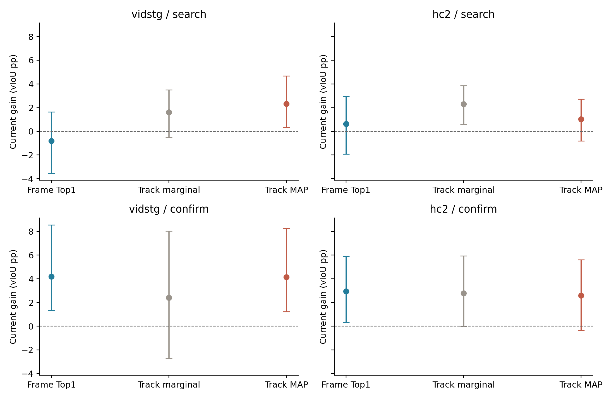
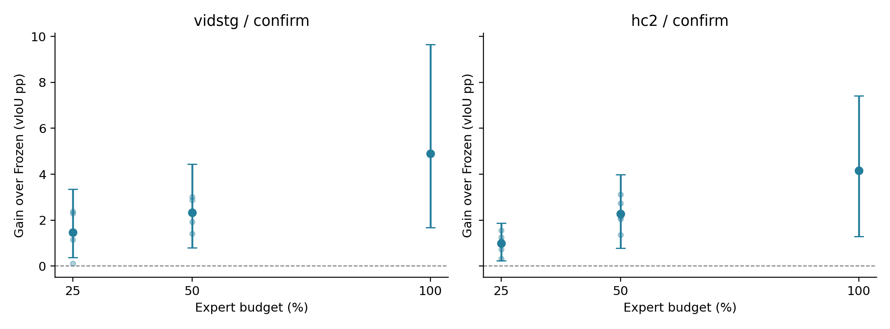
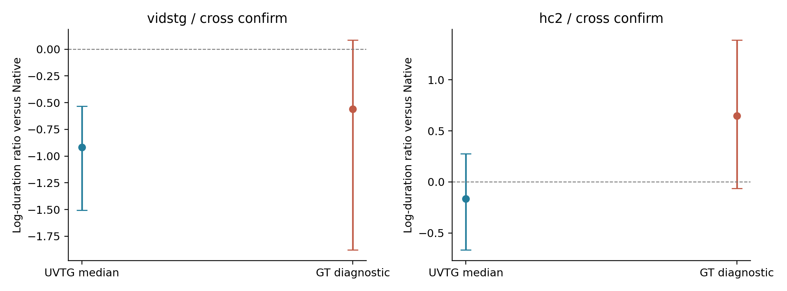

# DeCoTA hard latent-path commitment, real online trajectories and duration bias

本轮研究接口选择为 **top1**，只依据预锁开发规则；确认结果不用于重选。
固定各集32开发＋16历史曝光确认来源、一query、双序、clean＋五种5%corruption。不是全部官方query，也不是fresh test。CURRENT保持原decota_refine_uniform_v1。
S-next在同一个封存P1 prestate比较当前纠正；后面的十二条独立流从源状态重新演化LN。两者的统计含义不同。

主裁决：MAP降低了开发集的部分损害，但没有通过预锁零严重尾部规则，因此回退共享Top1；这不是MAP在所有面板都弱于Top1的结论。Top1的确认当前纠正与实际online结果为正，但开发Vid仍有负均值和严重损害，不能称普遍安全。
100%online确认Before−Frozen在两集为正；但After−匹配episodic尚未双集成立，Vid全部预算净继承区间跨零，HC仅25/50%有明确正区间。当前纠正有效，不自动等于slow LN对最终输出具有双集稳定增量。
同域官方checkpoint为TASTVG_VidSTG.pth与TASTVG_HCSTVG2.pth，文件及模型state哈希见CONFIGURATION。继承PLAN中的anchor_params、temporal_lr/steps等只是旧实验元数据，本轮实际空间Adam.03/10步、Native时间、零temporal更新，以本轮协议与运行锁为准。

## Matched current correction

Top1不是每帧无条件raw top1：先保留旧admission接受的观察帧，再取各帧最高DINO分数。Track-Marginal和MAP使用全部有效旧观察。旧四位置是在原Native I0内按物理时间均匀选取，已具有预测事件scope；本轮复用旧位置，不重采样或使用GT事件范围。先前口头称缓存没有event-scoped选帧不准确，已核对原observations接口修正。
MAP E-step固定score＝DINO分数＋prestate IoU＋相邻物理时刻IoU，最多81完整路径；M-step使用tau1的mean-frame GIoU contrastive loss。三个方案同Adam.03、joint1792、10步、自身loss首个最小step；没有GT选step。
旧Track-Marginal的实际目标是−log∑z P(z)exp(∑frame IoU)，而不是线性∑z P(z)IoU。posterior expected GT IoU是事后证据诊断，不是该critic的训练目标；其数值下降不能单独证明线性identity averaging是损害根因。
MAP相对控制同时改变hard path与loss，Top1还保留旧admission；因此三臂不是对identity单因素的证明。完整笛卡尔contrastive归一化可分解为逐帧项，不是新训练的tracking模型；singleton无竞争时严格no-op。E/M目标不同，不声称EM似然单调性。

| Dataset/panel | Arm | ΔBefore vIoU pp [paired95%] | ΔTop1 pp | >20pp harm |
|---|---|---:|---:|---:|
| vidstg/search | top1 | -0.8054 [-3.5382, +1.6324] | +0.0000 [+0.0000, +0.0000] | 16 |
| vidstg/search | marginal | +1.6148 [-0.5316, +3.4979] | +2.4203 [+0.3945, +4.8649] | 5 |
| vidstg/search | map_contrastive | +2.3121 [+0.3101, +4.6760] | +3.1176 [+0.2954, +6.5599] | 2 |
| vidstg/confirm | top1 | +4.2065 [+1.3160, +8.5475] | +0.0000 [+0.0000, +0.0000] | 0 |
| vidstg/confirm | marginal | +2.4090 [-2.7005, +8.0263] | -1.7974 [-5.7091, +0.3177] | 9 |
| vidstg/confirm | map_contrastive | +4.1393 [+1.2321, +8.2435] | -0.0671 [-0.5498, +0.4904] | 2 |
| hc2/search | top1 | +0.6293 [-1.9191, +2.9287] | +0.0000 [+0.0000, +0.0000] | 10 |
| hc2/search | marginal | +2.2981 [+0.6092, +3.8522] | +1.6688 [+0.0339, +3.6259] | 1 |
| hc2/search | map_contrastive | +1.0259 [-0.8240, +2.7105] | +0.3966 [-1.7997, +2.7422] | 1 |
| hc2/confirm | top1 | +2.9534 [+0.3402, +5.9210] | +0.0000 [+0.0000, +0.0000] | 0 |
| hc2/confirm | marginal | +2.7738 [+0.0087, +5.9322] | -0.1796 [-1.2727, +0.6243] | 0 |
| hc2/confirm | map_contrastive | +2.6031 [-0.3441, +5.6059] | -0.3503 [-2.1981, +1.0221] | 0 |

开发MAP资格：`{'vidstg': False, 'hc2': False}`；规则为两集均不降低Top1均值、配对lower95≥−0.5pp且无>20pp当前损害。失败即共享Top1回退，不按确认切换数据集专属方法。

| Confirm corruption observations | Best-path IoU% | MAP-path IoU% | Posterior expected IoU% | No GT-scored observations |
|---|---:|---:|---:|---:|
| vidstg | 88.53 | 85.95 | 65.49 | 70 |
| hc2 | 60.28 | 51.04 | 40.83 | 0 |

这只是具备GT计分观察帧子集的空间IoU；不是identity accuracy，更不是全tube vIoU。最佳path允许逐帧GT诊断，不把事件外没有标注的帧虚构为错误。

### Same-source success and failure readback

source35/exposure的固定MAP path在四观察上的GT IoU86.28%，恰为该支持最优；更新将当前vIoU45.06%→70.05%。但frame-freeze的MAP path在三有GT观察上的IoU只有5.48%，而同支持GT最优91.25%；loss4.1465→3.9139，vIoU31.14%→4.46%，同prestate Top1为53.55%。该坏例在更新前的路径推断已选错，不能全部归因optimizer或LN；hard commitment也不能自动识别正确referent。
frame-freeze坏例的MAP与Top1第一步梯度cosine为−0.9965，几乎反向；两者实际Adam参数位移范数都约1.2699。该案区别首先在目标方向而非位移幅度，不能据此唯一分离hard identity和contrastive loss的作用。数值保留于CASE_ACTUATION_READBACK。
这两个condition各自按同prestate比较，但corruption和各自P1历史都不同；它们说明具体成功/失败链，不单独证明corruption因果。观察/未观察GT变化与匿名path索引保留于CASE_MECHANISM_READBACK。
## Actual independent LN streams

Native时间始终固定；query残差和Adam每次重置，LN proposal位移×1/16写回。按dataset/split/condition/order/stream重置源状态。
100%与episodic各一条；25/50%各五个预锁hash schedules，25⊂50，每组roster跨condition/order固定。没有按GT强制纳入或排除source35。
| Confirm corruption | Stream | After−Frozen pp [paired95%] | Before−Frozen pp | After−episodic pp | >20pp harm |
|---|---|---:|---:|---:|---:|
| vidstg | episodic | +4.9658 [+1.6739, +9.7865] | +0.0000 [+0.0000, +0.0000] | +0.0000 [+0.0000, +0.0000] | 0 |
| vidstg | online100 | +4.8928 [+1.6821, +9.6579] | +0.5708 [+0.1788, +1.0469] | -0.0729 [-0.2337, +0.0923] | 0 |
| vidstg | seed0_budget25 | +1.1517 [+0.2473, +2.3007] | +0.1885 [-0.0116, +0.4447] | -3.8141 [-8.5221, -0.6708] | 0 |
| vidstg | seed1_budget25 | +1.4173 [+0.2539, +2.8932] | +0.2043 [-0.0802, +0.5021] | -3.5485 [-8.3595, -0.5385] | 0 |
| vidstg | seed2_budget25 | +0.1198 [-0.1088, +0.3682] | -0.0043 [-0.1727, +0.1613] | -4.8460 [-9.7560, -1.4830] | 0 |
| vidstg | seed3_budget25 | +2.3854 [+0.0425, +6.8801] | +0.0592 [-0.0793, +0.2007] | -2.5804 [-4.3996, -0.9508] | 0 |
| vidstg | seed4_budget25 | +2.3017 [+0.0408, +6.7249] | +0.0770 [+0.0018, +0.1453] | -2.6641 [-4.4615, -1.0645] | 0 |
| vidstg | seed0_budget50 | +2.4066 [+1.0287, +4.0282] | +0.4790 [+0.1595, +0.8695] | -2.5592 [-7.0526, +0.0203] | 0 |
| vidstg | seed1_budget50 | +1.9297 [+0.7370, +3.4183] | +0.3088 [+0.0120, +0.6153] | -3.0361 [-7.7469, -0.0924] | 0 |
| vidstg | seed2_budget50 | +1.4205 [+0.2387, +2.9634] | +0.1620 [-0.1157, +0.4637] | -3.5453 [-8.3409, -0.5206] | 0 |
| vidstg | seed3_budget50 | +2.8737 [+0.1665, +7.5597] | +0.1972 [-0.0179, +0.4582] | -2.0921 [-3.7621, -0.6426] | 0 |
| vidstg | seed4_budget50 | +3.0085 [+0.1952, +7.8442] | +0.1089 [-0.0731, +0.2974] | -1.9572 [-3.5481, -0.5493] | 0 |
| hc2 | episodic | +3.9230 [+1.0019, +7.1976] | +0.0000 [+0.0000, +0.0000] | +0.0000 [+0.0000, +0.0000] | 0 |
| hc2 | online100 | +4.1580 [+1.2960, +7.4202] | +1.2522 [+0.7867, +1.8090] | +0.2350 [-0.0002, +0.5151] | 0 |
| hc2 | seed0_budget25 | +0.3245 [-0.4917, +1.2221] | +0.1422 [+0.0724, +0.2172] | -3.5985 [-6.8626, -0.8691] | 0 |
| hc2 | seed1_budget25 | +1.2566 [+0.4180, +2.3374] | +0.3381 [+0.1717, +0.5436] | -2.6664 [-5.9799, +0.0722] | 0 |
| hc2 | seed2_budget25 | +1.0914 [-0.2561, +2.8956] | +0.4465 [+0.2027, +0.7237] | -2.8316 [-5.9417, -0.4061] | 0 |
| hc2 | seed3_budget25 | +0.7340 [-0.3544, +2.1409] | +0.3280 [+0.1931, +0.4793] | -3.1890 [-6.3276, -0.6170] | 0 |
| hc2 | seed4_budget25 | +1.5583 [+0.2649, +3.4309] | +0.2958 [+0.1352, +0.4745] | -2.3647 [-5.5954, +0.2433] | 0 |
| hc2 | seed0_budget50 | +1.3584 [-0.2455, +3.2465] | +0.6210 [+0.3190, +0.9715] | -2.5646 [-5.5576, -0.3446] | 0 |
| hc2 | seed1_budget50 | +2.7341 [+0.5052, +5.7135] | +0.6702 [+0.4068, +0.9942] | -1.1889 [-3.0537, +0.3699] | 0 |
| hc2 | seed2_budget50 | +3.1179 [+0.5425, +6.3832] | +0.6959 [+0.4307, +1.0154] | -0.8051 [-2.2305, +0.4538] | 0 |
| hc2 | seed3_budget50 | +2.0489 [+0.3881, +4.0544] | +0.5408 [+0.3000, +0.8093] | -1.8741 [-4.8236, +0.2313] | 0 |
| hc2 | seed4_budget50 | +2.1272 [+0.8196, +3.8527] | +0.6489 [+0.3402, +1.0042] | -1.7958 [-4.9733, +0.7492] | 0 |

| Dataset/panel | Expert budget | 5-schedule mean ΔFrozen pp | Schedule range pp | Source CI after within-source schedule averaging |
|---|---:|---:|---:|---:|
| vidstg/search | 25% | -0.1403 | [-0.8965,+1.2744] | -0.1403 [-1.0139, +0.6508] |
| vidstg/search | 50% | +0.0352 | [-1.2403,+1.6911] | +0.0352 [-1.3801, +1.3577] |
| vidstg/confirm | 25% | +1.4752 | [+0.1198,+2.3854] | +1.4752 [+0.3678, +3.3576] |
| vidstg/confirm | 50% | +2.3278 | [+1.4205,+3.0085] | +2.3278 [+0.7967, +4.4333] |
| hc2/search | 25% | +1.6860 | [+0.9118,+2.2939] | +1.6860 [+0.8064, +2.5147] |
| hc2/search | 50% | +2.5694 | [+1.4980,+3.5943] | +2.5694 [+0.6835, +4.1864] |
| hc2/confirm | 25% | +0.9930 | [+0.3245,+1.5583] | +0.9930 [+0.2324, +1.8674] |
| hc2/confirm | 50% | +2.2773 | [+1.3584,+3.1179] | +2.2773 [+0.7788, +3.9921] |

上述source bootstrap先在每个来源内平均五个schedule；CI条件于这五个预定schedule，五份重复输入不是五倍独立样本。预算全流、专家/非专家、clean、每个corruption与两顺序的完整分解保留于SUMMARY。

| Vid confirm/source35 | 25% expert schedules | 50% expert schedules |
|---|---|---|
| source35 | [0] | [0, 1] |

### Matched-roster persistence

预算流相对100%episodic的差值包含专家可用性，不是纯继承。另以该roster专家位置的episodic预测、非专家位置Frozen构造严格匹配读出；全部来自已封存缓存，无新推理。
| Confirm corruption | Budget | Online−matched episodic pp [source paired95%] |
|---|---:|---:|
| vidstg | 25% five-schedule mean | +0.0698 [-0.0503, +0.1969] |
| vidstg | 50% five-schedule mean | +0.1370 [-0.0536, +0.3715] |
| vidstg | 100% | -0.0729 [-0.2337, +0.0923] |
| hc2 | 25% five-schedule mean | +0.2216 [+0.1336, +0.3098] |
| hc2 | 50% five-schedule mean | +0.3532 [+0.2285, +0.4733] |
| hc2 | 100% | +0.2350 [-0.0002, +0.5151] |

## Positive and negative tails

| Setting | Dataset/source | Condition/order | ΔBefore pp | ΔFrozen pp |
|---|---|---|---:|---:|
| MAP matched | vidstg/35 | frame_freeze_5/order1 | -26.6796 | -27.1588 |
| MAP matched | vidstg/35 | frame_freeze_5/order2 | -24.6911 | -25.5329 |
| MAP matched | vidstg/36 | exposure_5/order1 | -2.3473 | -0.9495 |
| MAP matched | vidstg/37 | occlusion_5/order1 | +32.1372 | +32.7983 |
| MAP matched | vidstg/37 | frame_freeze_5/order1 | +32.0289 | +32.6113 |
| MAP matched | vidstg/37 | frame_freeze_5/order2 | +30.8125 | +34.0367 |
| MAP matched | hc2/43 | exposure_5/order1 | -12.6370 | -9.8035 |
| MAP matched | hc2/43 | frame_freeze_5/order1 | -11.8068 | -9.1181 |
| MAP matched | hc2/43 | occlusion_5/order1 | -11.7852 | -9.2261 |
| MAP matched | hc2/33 | exposure_5/order1 | +22.6201 | +22.6201 |
| MAP matched | hc2/33 | occlusion_5/order1 | +22.5246 | +22.5246 |
| MAP matched | hc2/33 | motion_blur_5/order1 | +20.7153 | +20.7153 |
| online100 | vidstg/41 | frame_freeze_5/order2 | +0.0000 | -1.1743 |
| online100 | vidstg/41 | exposure_5/order2 | +0.0000 | -0.9806 |
| online100 | vidstg/41 | motion_blur_5/order2 | +0.0000 | -0.8300 |
| online100 | vidstg/37 | frame_drop_5/order2 | +31.1743 | +36.1704 |
| online100 | vidstg/37 | exposure_5/order2 | +30.8182 | +35.9282 |
| online100 | vidstg/37 | exposure_5/order1 | +34.2559 | +35.1221 |
| online100 | hc2/47 | occlusion_5/order1 | -14.8759 | -14.6188 |
| online100 | hc2/47 | occlusion_5/order2 | -13.7176 | -13.1249 |
| online100 | hc2/47 | exposure_5/order1 | -10.8040 | -10.3936 |
| online100 | hc2/33 | frame_drop_5/order2 | +20.0299 | +23.8301 |
| online100 | hc2/33 | motion_blur_5/order2 | +20.6756 | +23.8001 |
| online100 | hc2/33 | occlusion_5/order2 | +18.6962 | +22.8673 |

## CPU duration-bias diagnostic

全部有效raw UVTG proposals的log-duration中位数减Native log-duration。重复proposal保留，不用confidence。物理半开frame区间；不重复计两个顺序。相同pixels/frameids/query下分别用同域与既有对侧源checkpoint的Native；仅有缓存的输入计分。
无标签统计先封存，GT随后只计分。270/576个source-condition格可用（Vid24、HC21来源），306格缺UVTG缓存；其中250个source/pixels不同，Vid20格旧corruption pixels重复仍按预锁condition权重保留。unique_inputs旧字段指cohort格，不是像素去重数。缺失不补推理，覆盖子集不能代表完整stream。
| Cross checkpoint panel | Sources | Median rExpert [95%] | Median rGT [95%] | Source correlation [95%] | Expert-vs-GT logduration corr |
|---|---:|---:|---:|---:|---:|
| vidstg/search | 16 | -0.6832 [-1.2547416695288525, -0.2858184141515826] | -0.2728 [-0.872488109215762, 0.33020162012953735] | -0.11724241415463134 [-0.6936600429209485, 0.4427755636759679] | 0.42147271283001403 |
| vidstg/confirm | 8 | -0.9178 [-1.5069908488216486, -0.5342913587508494] | -0.5593 [-1.878646830591557, 0.08762730662979301] | 0.5648155409199055 [-0.5946787451428159, 0.9708135690525611] | 0.0954974931323212 |
| hc2/search | 14 | -0.7063 [-0.9138265544929606, -0.31370457226735937] | -0.1143 [-0.4746889896978526, 0.5090541441176084] | 0.8160282043275116 [0.37944177200902457, 0.9480000745879074] | 0.12596922882315126 |
| hc2/confirm | 7 | -0.1652 [-0.6670394245896942, 0.27589153690410145] | +0.6485 [-0.06166027193090322, 1.391683176934102] | 0.6451348833381437 [-0.01973540265263361, 0.963452361737152] | -0.2109839283917276 |

跨域确认诊断资格：`{'vidstg': False, 'hc2': False}`。没有启动scalar slow temporal state。
rExpert与rGT共同减Native log-duration，能制造相关性；独立log-duration相关和来源内condition去均值相关均另列。HC确认点估计UVTG偏缩短、GT偏扩长，符号相反；Vid方向点估计一致但GT中位数区间跨零、相关区间宽。不能从少数覆盖来源推断全target domain应系统扩/缩。
本次没有支持新增temporal slow state；结论限于该expert median统计与缓存面板，不是对所有时间校准的永久否定。
## Verification, computation and scope

无GT smoke在各集前2旧clean输入复现Top1/Marginal全步loss、梯度、状态与tube逐值一致；MAP已有独立NumPy公式、有限差分梯度与single/empty/duplicate合同。1152新MAP全封存后计3456三臂匿名指标；控制来自已审计收据。
独立根审计重新计算所有loss/E-step/Adam参数算术、选择step、状态生命周期、LN链及official dense一致性；没有额外重跑每个decoder Jacobian，报告该边界。最终13824逻辑在线预测包含episodic同输入顺序收据复用，真实独立online链不复用。
source-macro/配对10000-source bootstrap；正负例与clean均保留，不按GT改名单、tau、学习率、目标或写入。观察GT IoU与tube任务指标分开，不把目标降低等同正确纠正。
全部新完整backbone/expert/temporal参数更新为0；执行cached decoder/backward。模型checkpoint加载与I/O、等待和CPU审计分开，不把worker wall称为纯GPU-kernel时间。

Online实际cached backward：53010；stage资源完整见RESOURCE_RECEIPT。

