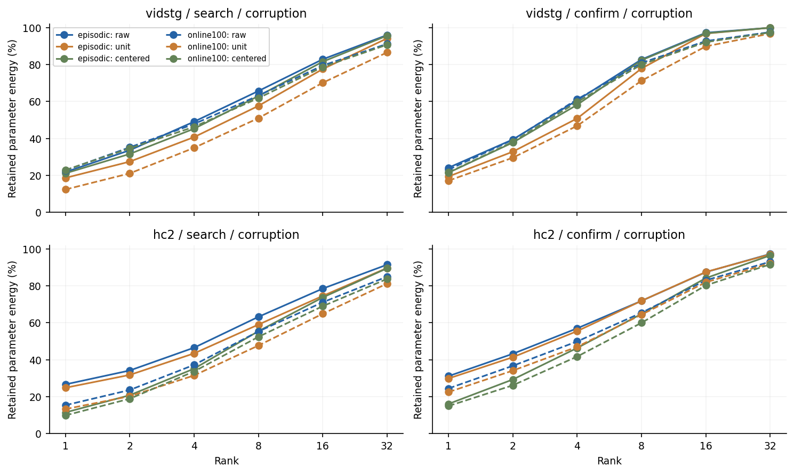
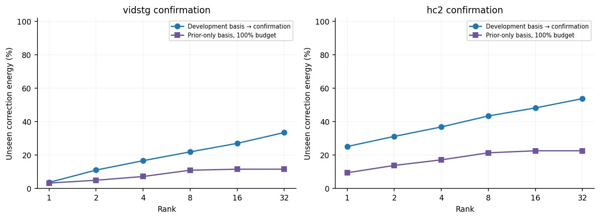
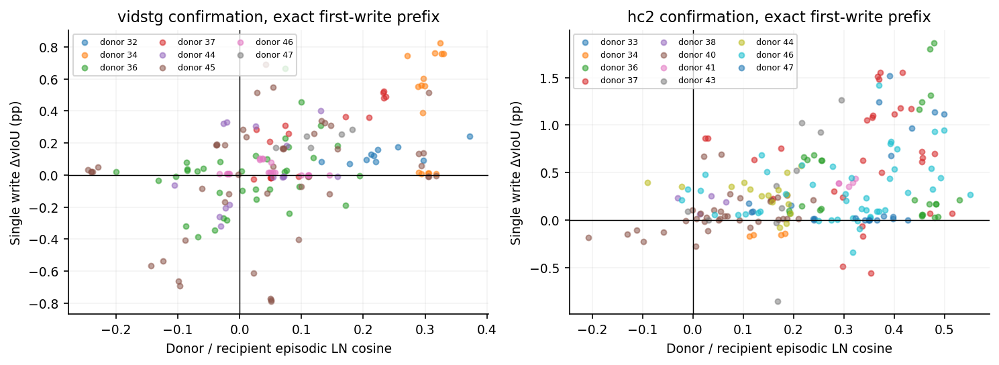

# Single-expert DeCoTA: LN correction geometry and first-write transfer

本轮实际完成纯 CPU 诊断。固定 Native WHEN、一个 frozen Grounding DINO、原四个预测事件内观察、admitted Top1 critic、Adam .03 / joint1792 / 10-step own-loss selection。没有模型前向、decoder重放、反向、新专家或新 GT 计分。没有执行低秩写入；生产 CURRENT 未改。

已核验 13824 个旧封存状态；两集各32开发＋16来源互斥但历史曝光确认，一query/source、双序、clean＋五类5%、12独立流。独立episode二序同输入去重后576 source-condition corrections（每集288）。1536维向量取 selected fit.state − initial，不是末步或已缩小1/16的committed状态。零更新保留。

**本轮裁决：** shared_geometry_not_validated_as_transferable_memory. Do not convert low-rank energy into a shared-memory claim or launch the conditional method.

核心结果是“同query的correction有很强重复结构，但跨query共享basis较弱”。确认corrupt同来源跨条件的平均cosine为Vid .8475 / HC .7941，不同来源仅 .0700 / .2221。开发basis对新确认来源的rank8能量保留只有21.92% / 43.40%；100%在线、至少8个历史非零write后的严格prior-only rank8仅10.91% / 21.34%。不能用同面板83% / 72%的in-sample E8替代这些跨来源与真实前缀结果。

需要保留的正证据：在首write隔离效用上，事后控制recipient和condition后，cosine与效用的相关性在两确认面板均为正：Vid .4809 [.1489,.8787]，HC .5109 [.1012,.7533]。这支持有限范围内“方向兼容性含迁移信息”，不是零信号。该补充是明确标记的post-hoc解释控制，不重新选择rank、改变pair集合或覆盖原预锁决策；更不能直接验证prior-SVD投影会保留该有用方向。未来受体的episodic correction是离线诊断变量，不是非专家在线可得的gate。

## Correction spectrum

| Dataset / panel / stream | N / sources / zero | E1 | E2 | E4 | E8 | E16 | E32 | unit E8 | centered E8 | effective rank |
|---|---:|---:|---:|---:|---:|---:|---:|---:|---:|---:|
| vidstg / search / episodic | 160 / 32 / 46 | 21.732 | 33.569 | 49.060 | 65.678 | 82.884 | 96.016 | 57.613 | 62.965 | 20.761 |
| vidstg / confirm / episodic | 80 / 16 / 25 | 24.104 | 39.395 | 60.654 | 82.769 | 97.258 | 99.969 | 77.872 | 82.366 | 11.618 |
| vidstg / search / online100 | 320 / 32 / 93 | 22.659 | 35.144 | 47.795 | 63.200 | 79.510 | 91.236 | 50.973 | 61.822 | 25.802 |
| vidstg / confirm / online100 | 160 / 16 / 50 | 23.030 | 39.224 | 61.200 | 80.887 | 92.753 | 97.615 | 71.246 | 80.022 | 14.078 |
| hc2 / search / episodic | 160 / 32 / 5 | 26.633 | 34.170 | 46.536 | 63.257 | 78.559 | 91.526 | 59.054 | 55.472 | 23.900 |
| hc2 / confirm / episodic | 80 / 16 / 4 | 31.116 | 43.223 | 57.032 | 71.907 | 87.484 | 97.337 | 71.916 | 64.839 | 15.662 |
| hc2 / search / online100 | 320 / 32 / 12 | 15.357 | 23.595 | 37.219 | 55.339 | 71.155 | 85.037 | 47.696 | 52.411 | 39.897 |
| hc2 / confirm / online100 | 160 / 16 / 8 | 24.443 | 36.715 | 49.914 | 65.465 | 83.069 | 93.112 | 64.461 | 60.017 | 22.282 |

百分数是参数平方范数能量，不是任务收益。raw谱不减均值；unit control消除大范数样本优势；centered control去掉共用平均方向。三者分别分析，不把中心化PCA说成原始proposal的实际投影。不同checkpoint的1536维空间不合并。

## Unseen-source and chronological evidence

| Dataset / stream / group | Held-out test | sources | E8 (%) with source CI | E16 (%) |
|---|---|---:|---:|---:|
| vidstg / episodic / corruption | development_hash_fold0 | 12 | 20.488 [15.945, 25.123] | 25.660 [21.133, 30.283] |
| vidstg / episodic / corruption | development_hash_fold1 | 13 | 20.502 [15.760, 24.932] | 25.476 [20.532, 30.159] |
| vidstg / episodic / corruption | development_to_confirmation | 11 | 21.915 [16.249, 27.285] | 26.996 [21.141, 32.590] |
| vidstg / online100 / corruption | development_hash_fold0 | 12 | 15.346 [11.997, 18.718] | 20.489 [16.846, 24.062] |
| vidstg / online100 / corruption | development_hash_fold1 | 13 | 16.146 [13.021, 19.426] | 21.034 [17.613, 24.557] |
| vidstg / online100 / corruption | development_to_confirmation | 11 | 20.294 [15.561, 24.971] | 25.415 [20.688, 30.129] |
| hc2 / episodic / corruption | development_hash_fold0 | 16 | 33.618 [28.033, 39.164] | 39.075 [34.171, 43.858] |
| hc2 / episodic / corruption | development_hash_fold1 | 16 | 36.319 [30.663, 41.402] | 41.772 [36.379, 46.808] |
| hc2 / episodic / corruption | development_to_confirmation | 16 | 43.400 [37.462, 48.533] | 48.208 [42.189, 53.404] |
| hc2 / online100 / corruption | development_hash_fold0 | 16 | 22.912 [18.019, 27.918] | 29.190 [24.345, 34.031] |
| hc2 / online100 / corruption | development_hash_fold1 | 16 | 25.520 [20.573, 30.678] | 31.086 [26.335, 36.112] |
| hc2 / online100 / corruption | development_to_confirmation | 16 | 34.478 [29.469, 39.345] | 40.303 [35.097, 45.225] |

Development两hash folds以source互斥，所有corruption和重复order同时holdout。confirmation只由development basis投影；标签不选rank。谱能量低秩即使跨source保留，仍不等于这些方向有正向任务效用。

这里“source heldout”指basis矩阵不使用该source的向量。online100向量来自原持续轨迹，其继承状态仍可能已受到held source的早期写入影响，不是从整条历史删除source的因果holdout。source-initialized episodic结果是主几何对照。零向量的投影比例不可定义；保留率统计条件于非零correction，Vid确认为11个有非零改动的来源，HC为16个；全部16源、零行和其能量仍保留在Gram及coverage中。

| Dataset / confirmation budget | prior nonzero writes ≥ | evaluated sources / cells | prior-only E8 (%) |
|---|---:|---:|---:|
| hc2 / 100% | 1 | 16 / 142 | 20.268 [15.737, 24.970] |
| hc2 / 100% | 8 | 13 / 72 | 21.342 [16.656, 25.941] |
| hc2 / 25% | 1 | 10 / 134 | 11.494 [7.177, 15.784] |
| hc2 / 50% | 1 | 15 / 310 | 15.809 [10.657, 21.417] |
| vidstg / 100% | 1 | 11 / 100 | 8.503 [6.921, 10.142] |
| vidstg / 100% | 8 | 6 / 30 | 10.915 [8.605, 13.158] |
| vidstg / 25% | 1 | 9 / 90 | 4.762 [1.893, 8.378] |
| vidstg / 50% | 1 | 10 / 242 | 5.830 [3.523, 8.496] |

每个prefix basis只使用本stream同condition/order的先前非零write，当前与未来向量不加入。第一次写为cold start，不能报告有历史共享率；小预算确认流可能根本没有8个历史写。其他rank和clean全部保存在匿名JSON。没有把全流SVD basis回灌在线推理。

## Cosine and exact isolated first-write utility

从已有在线轨迹提取939个去重donor-recipient-condition pair，原逻辑membership为1439。仅第一次非零commit后、第二次commit前的Before；受体source模型、query=0、输入像素和native时间严格匹配。第二个write到达的Before仍包含，仅其写后退出单donor范围。效用为 U^(1/16)=Before_v−Frozen_v。所有后续累计Before−Frozen均不冒充此量。

| Dataset / panel / subset | pairs / defined cos | donors / recipients | corr(c,U) | U(c>0), pp | U(c<0), pp | positive − negative, pp |
|---|---:|---:|---:|---:|---:|---:|
| vidstg / search / corruption | 193 / 141 | 8 / 14 | 0.066 [-0.169, 0.670] | 0.312 [-0.012, 0.708] | 0.101 [-0.249, 0.590] | 0.212 [-0.113, 0.531] |
| vidstg / search / clean | 39 / 29 | 8 / 13 | -0.021 [-0.493, 0.763] | 0.194 [-0.142, 0.477] | 0.481 [-0.241, 1.688] | -0.287 [-1.637, 0.598] |
| vidstg / confirm / corruption | 200 / 165 | 8 / 11 | 0.407 [0.028, 0.898] | 0.119 [-0.024, 0.380] | -0.070 [-0.257, 0.085] | 0.190 [-0.022, 0.506] |
| vidstg / confirm / clean | 40 / 33 | 8 / 11 | 0.428 [0.006, 0.980] | 0.148 [-0.023, 0.473] | -0.078 [-0.274, 0.085] | 0.226 [-0.017, 0.579] |
| hc2 / search / corruption | 182 / 175 | 9 / 20 | 0.328 [-0.118, 0.604] | 0.201 [-0.017, 0.445] | 0.238 [-0.058, 0.604] | -0.037 [-0.384, 0.278] |
| hc2 / search / clean | 36 / 36 | 9 / 17 | 0.239 [-0.645, 0.700] | 0.177 [-0.190, 0.460] | 0.376 [0.204, 0.627] | -0.199 [-0.642, 0.186] |
| hc2 / confirm / corruption | 206 / 198 | 11 / 15 | 0.404 [-0.143, 0.714] | 0.421 [0.149, 0.662] | 0.074 [-0.068, 0.235] | 0.347 [0.062, 0.571] |
| hc2 / confirm / clean | 43 / 41 | 10 / 14 | 0.314 [-0.360, 0.816] | 0.358 [0.039, 0.649] | -0.057 [-0.160, 0.046] | 0.414 [0.054, 0.668] |

CI采用10000次source-node bootstrap，同一个source作为donor和recipient时共享重采样计数；每个recipient来源基础等权，条件/order/schedule不视为独立n。受体零proposal有utility但cosine不可定义，未删出coverage。相关性与正负cos分组是预锁诊断，不把受体事后episodic correction用于线上选择。区间条件于当前prefix覆盖与已封存向量，未重拟合basis。

这些对照只覆盖早期source-prestate donor和其prefix受体，不覆盖任意i→j、晚期共享前态或完整未缩小DeltaLN。单写是实际缓存的因果参数干预，cosine与效用的相关性本身仍不是投影方向的因果消融。

### Post-hoc source/condition and coverage controls

平衡的episodic corruption矩阵采用两个无标签主效应（source、condition）与interaction的正交平方范数分解。每来源只有一个固定query，source效应不能再区分视频、文本或当前错误类型，不把它命名为已识别的identity因子。

| Panel | Source/query share of centered energy | Corruption main-effect share | Interaction share |
|---|---:|---:|---:|
| Vid search | 80.60% | 0.57% | 18.83% |
| Vid confirm | 85.62% | 0.89% | 13.49% |
| HC search | 78.76% | 0.67% | 20.57% |
| HC confirm | 73.87% | 1.61% | 24.51% |

这说明当前低秩很大程度是重复source/query方向，而非五类corruption共同方向。没有证明source主效应必然不可迁移，也没有测更多query来隔离instance/video/text；它限制的是直接将当前in-sample低秩叫作stream/domain共享成分。

Cosine主表只对非零受体correction计算关联。恢复所有零受体后的首write平均效用，确认corrupt为Vid −.00127 pp / HC +.40547 pp；前者近零，后者为正点值。Vid 35/200 pair的受体correction为零，cosine不可定义；这些pair效用源均值为−.19408 pp，不能从迁移总量中删掉。HC 8/206为零，效用源均值+.98848 pp，也保留。覆盖均值是描述统计，不增加独立n或改变主bootstrap。

固定同一个recipient-condition，比较不同donor时，对cosine和utility分别减去该组均值，进一步排除受体难度的共变。确认Vid / HC residual correlation为.4809 / .5109，source-node CI分别[.1489,.8787] / [.1012,.7533]。开发两CI仍跨零。残差在bootstrap中固定而不refit，结果条件于已有对照，不作新方法qualification；完整计算与可复算代码在POSTHOC_CONTROLS.json和derive_controls.py中。

## Positive and negative cases

| Dataset / panel | donor → recipient | corruption | cosine | single-write Δv, pp |
|---|---|---|---:|---:|
| vidstg / search | 20 → 10 | motion_blur_5 | 0.021 | 4.258 |
| vidstg / search | 20 → 10 | occlusion_5 | 0.033 | 4.234 |
| vidstg / search | 20 → 10 | exposure_5 | -0.040 | 4.225 |
| vidstg / search | 20 → 17 | motion_blur_5 | -0.028 | -1.160 |
| vidstg / search | 20 → 28 | exposure_5 | 0.107 | -0.693 |
| vidstg / search | 20 → 28 | frame_freeze_5 | 0.106 | -0.678 |
| vidstg / confirm | 34 → 37 | frame_freeze_5 | 0.324 | 0.824 |
| vidstg / confirm | 34 → 37 | frame_drop_5 | 0.316 | 0.764 |
| vidstg / confirm | 34 → 37 | occlusion_5 | 0.330 | 0.759 |
| vidstg / confirm | 45 → 41 | frame_freeze_5 | NA | -0.922 |
| vidstg / confirm | 45 → 41 | motion_blur_5 | NA | -0.791 |
| vidstg / confirm | 45 → 37 | occlusion_5 | 0.050 | -0.787 |
| hc2 / search | 22 → 27 | frame_freeze_5 | -0.004 | 1.459 |
| hc2 / search | 22 → 27 | motion_blur_5 | 0.280 | 1.385 |
| hc2 / search | 0 → 25 | exposure_5 | 0.350 | 1.284 |
| hc2 / search | 0 → 27 | frame_freeze_5 | 0.285 | -1.545 |
| hc2 / search | 0 → 30 | frame_freeze_5 | 0.092 | -1.418 |
| hc2 / search | 0 → 27 | frame_drop_5 | 0.111 | -1.343 |
| hc2 / confirm | 36 → 41 | motion_blur_5 | 0.479 | 1.863 |
| hc2 / confirm | 36 → 41 | frame_drop_5 | 0.470 | 1.798 |
| hc2 / confirm | 37 → 35 | occlusion_5 | 0.416 | 1.554 |
| hc2 / confirm | 43 → 41 | exposure_5 | 0.168 | -0.856 |
| hc2 / confirm | 37 → 38 | frame_freeze_5 | 0.354 | -0.563 |
| hc2 / confirm | 37 → 34 | frame_freeze_5 | 0.297 | -0.491 |

所有pair、正负cosine组、固定bins、各donor移除后的影响和clean均完整公开，不只展示极值正例。极值是事后诊断，不作优化目标或路由阈值。原online matched-persistence全数表另附，未重新计分或把本轮几何归因成其原有收益。

## Decision and reproducibility

目前当前查询仍使用完整Top1纠正；持续写入保留旧1/16规则。本轮没有证明“完整1/16不是最好”的最优性命题，也没有验证shared/private语义。只有关联和实际投影online matched对照都成立后，才有依据谈selective parameter consolidation。不同optimizer的低秩形状、来源集共同偏差与非零norm都仍可能解释几何。

本轮读取可信旧torch tensor caches（CPU map），不读取checkpoint、视频、原标注、候选框做新评分；拟合历史已接触的GT-derived匿名metric只作事后join。新参数向量不公开，公开其匿名Gram/范数/谱/投影/配对指标，供独立复算。主对照仍是同域TA-STVG，非新增跨域结果。

根审计31491784检查，独立rectangular SVD与全部prefix-r8 direct SVD通过；最大投影误差5.55e-15。公开审计1282159项通过。10个数学/因果前缀合同测试。成本为CPU wall，new model/expert/backward/GT scoring均0。

