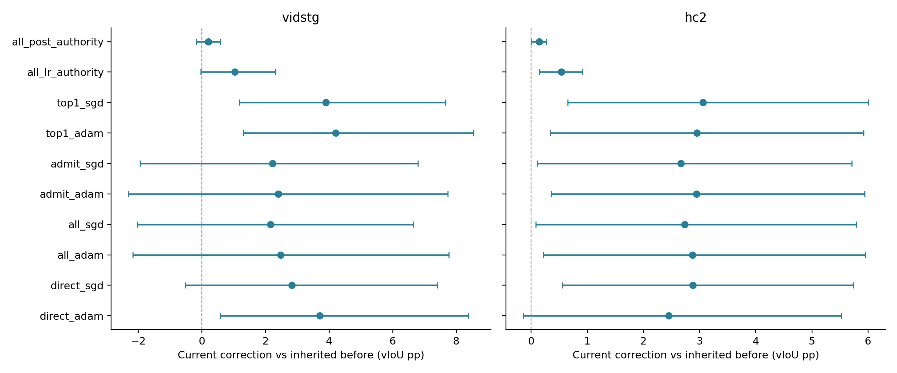
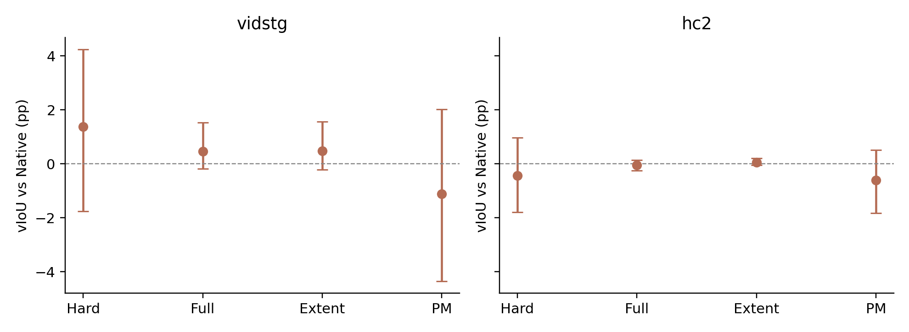
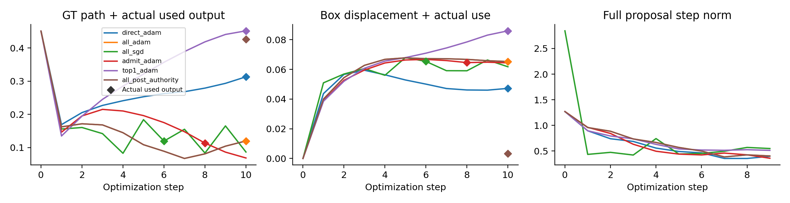

# DeCoTA optimizer/admission 与 temporal posterior：R1完整对照

本轮使用两集原32开发＋16确认来源、一query、双序、clean＋五类5%，均有历史曝光。空间共1152到达×10臂；时间同1152读出×5臂。
空间同P1到达前状态固定，不是各优化器自己继承的长流；每query四观察，不是25%专家流。零新DINO与完整backbone，全部预测封存后GT。

| 数据集／确认corrupt | Spatial arm | 当前纠正 ΔvIoU pp [配对95%CI] | >20pp harm |
|---|---|---:|---:|
| vidstg | direct_adam | +3.6994 [+0.5857,+8.3693] | 0 |
| vidstg | direct_sgd | +2.8297 [-0.5123,+7.4163] | 1 |
| vidstg | all_adam | +2.4744 [-2.1738,+7.7643] | 8 |
| vidstg | all_sgd | +2.1572 [-2.0172,+6.6383] | 8 |
| vidstg | admit_adam | +2.4003 [-2.3136,+7.7274] | 8 |
| vidstg | admit_sgd | +2.2156 [-1.9431,+6.7926] | 8 |
| vidstg | top1_adam | +4.2065 [+1.3160,+8.5475] | 0 |
| vidstg | top1_sgd | +3.8953 [+1.1691,+7.6600] | 0 |
| vidstg | all_lr_authority | +1.0357 [-0.0321,+2.3060] | 0 |
| vidstg | all_post_authority | +0.2027 [-0.1692,+0.5882] | 0 |
| hc2 | direct_adam | +2.4506 [-0.1444,+5.5249] | 0 |
| hc2 | direct_sgd | +2.8753 [+0.5592,+5.7355] | 0 |
| hc2 | all_adam | +2.8710 [+0.2137,+5.9560] | 0 |
| hc2 | all_sgd | +2.7302 [+0.0811,+5.7932] | 0 |
| hc2 | admit_adam | +2.9451 [+0.3627,+5.9429] | 0 |
| hc2 | admit_sgd | +2.6662 [+0.1038,+5.7131] | 0 |
| hc2 | top1_adam | +2.9534 [+0.3402,+5.9210] | 0 |
| hc2 | top1_sgd | +3.0590 [+0.6477,+6.0085] | 0 |
| hc2 | all_lr_authority | +0.5339 [+0.1509,+0.9132] | 0 |
| hc2 | all_post_authority | +0.1408 [+0.0054,+0.2661] | 0 |

| 数据集／确认corrupt | Temporal | ΔvIoU vs Native pp [95%CI] |
|---|---|---:|
| vidstg | hard | +1.3684 [-1.7596,+4.2504] |
| vidstg | full | +0.4637 [-0.1790,+1.5271] |
| vidstg | extent | +0.4807 [-0.2216,+1.5595] |
| vidstg | pm | -1.1207 [-4.3624,+2.0273] |
| hc2 | hard | -0.4379 [-1.7896,+0.9651] |
| hc2 | full | -0.0476 [-0.2544,+0.1422] |
| hc2 | extent | +0.0603 [-0.0495,+0.2017] |
| hc2 | pm | -0.6118 [-1.8221,+0.5130] |

SGD学习率只按32开发clean的第一步功能位移匹配，不使用GT。每种目标单独校准，避免用Direct的梯度单位替代critic单位。

| 数据集 | 目标 | SGD lr | 第一功能位移相对误差 |
|---|---|---:|---:|
| vidstg | direct | 1.037143 | 0.00987% |
| vidstg | all | 7.1209685 | 0.00033% |
| vidstg | admit | 6.7269752 | 0.00882% |
| vidstg | top1 | 4.9240423 | 0.00542% |
| hc2 | direct | 1.0402084 | 0.00560% |
| hc2 | all | 7.4984152 | 0.00541% |
| hc2 | admit | 7.2268286 | 0.01019% |
| hc2 | top1 | 4.6427849 | 0.00024% |

开发Pareto选择的优化器臂：`all_adam`。未按确认重选；如果没有保持两集mean且不增加严重尾部的优化器，保留All-Adam参照，不宣称优化器问题已被解决。
Temporal posterior资格：`{'full': False, 'extent': False}`；T1状态：`skipped_by_prelocked_posterior_condition`。
Extent保留精确物理中心的概率边际；最终MAP中心可能变化。两个原offset各自读出再取原生envelope；没有把合并网格分布冒充原生策略。
Authority是专家候选浓度，不是正确概率；post authority是最终参数位移插值，尚无functional或GT安全保证。
R1结束不代表六轮路线完成。后续track、参数scope、真实online和预算/跨域阶段须按冻结门接续或明确记为条件未满足。

## Matched mechanism readback

All−Admit changes admission; Admit−Top1 changes multi-proposal support on the same admitted observations; Top1−Direct changes the objective with matched admitted top-one boxes. SGD−Adam uses a development-matched first-step median functional displacement, not per-query equality or a matched ten-step trajectory. These comparisons can rank evidence for mechanisms; none alone proves a unique cause.

| Confirm corruption | Contrast | ΔvIoU pp [paired95%] |
|---|---|---:|
| vidstg | admission_all_minus_admit | +0.0741 [+0.0000,+0.1850] |
| vidstg | mixing_admit_minus_top1 | -1.8062 [-5.3524,+0.0784] |
| vidstg | objective_top1_minus_direct | +0.5071 [-0.2676,+1.8033] |
| vidstg | actuation_all_sgd_minus_adam | -0.3172 [-1.2801,+0.4720] |
| vidstg | actuation_direct_sgd_minus_adam | -0.8697 [-1.8440,+0.0221] |
| vidstg | authority_lr_minus_adam | -1.4387 [-5.5597,+2.2624] |
| vidstg | authority_post_minus_adam | -2.2716 [-7.2023,+1.9978] |
| hc2 | admission_all_minus_admit | -0.0741 [-0.8637,+0.5140] |
| hc2 | mixing_admit_minus_top1 | -0.0083 [-0.2234,+0.2200] |
| hc2 | objective_top1_minus_direct | +0.5028 [-0.6394,+1.8974] |
| hc2 | actuation_all_sgd_minus_adam | -0.1408 [-0.5334,+0.2071] |
| hc2 | actuation_direct_sgd_minus_adam | +0.4247 [-0.2546,+1.2851] |
| hc2 | authority_lr_minus_adam | -2.3371 [-5.2969,+0.0942] |
| hc2 | authority_post_minus_adam | -2.7302 [-5.7406,-0.1686] |

Source35/exposure/order1 starts from the same actual P1 prestate in every arm. The following are actual used outputs, including post-authority interpolation; optimizer proposal best-step metrics remain separately stored.

| Arm | vIoU% | Δbefore pp | >20pp current harm |
|---|---:|---:|---|
| direct_adam | 31.3004 | -13.7638 | False |
| direct_sgd | 27.2347 | -17.8295 | False |
| all_adam | 11.9759 | -33.0883 | True |
| all_sgd | 11.9315 | -33.1328 | True |
| admit_adam | 11.3274 | -33.7368 | True |
| admit_sgd | 13.7757 | -31.2885 | True |
| top1_adam | 45.1557 | +0.0915 | False |
| top1_sgd | 50.5174 | +5.4532 | False |
| all_lr_authority | 39.7798 | -5.2845 | False |
| all_post_authority | 42.5830 | -2.4812 | False |

The FP64 beta-zero native readout is independently retained as a numerical control; posterior qualification requires positive paired evidence against both the original and this matched control. Negative, clean and order-specific results are retained in complete summaries. Wall times and backward counts refer to worker execution and cached decoder/backprop work, not pure GPU-kernel time.

The first post-seal CPU audit stopped on a valid-looking SGD theoretical-delta discrepancy of 3.2781e-6 against a fixed3e-6 tolerance. The failure was preserved; resumed auditing checks each actual float32 parameter addition against an explicit ULP rounding bound, retaining exact saved state-to-state deltas. Predictions, gradients, optimization and GT-exposure chronology were unchanged.
