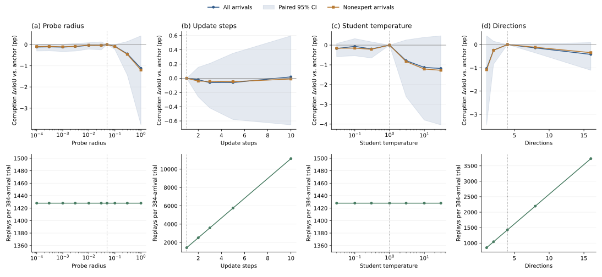
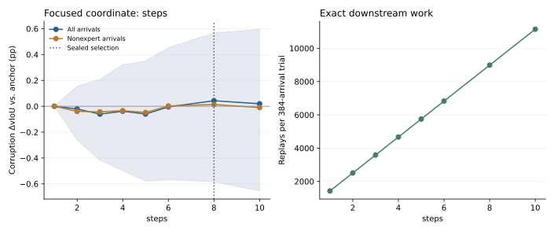
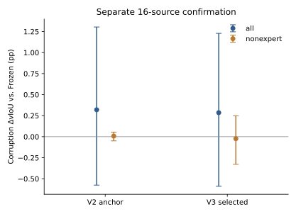

# HC-STVG-v2: more update steps do not yield a confirmed gain

The prespecified extended search completed 24 single-factor configurations and eight focused K configurations, with zero failures. Five focus configurations reuse exact earlier receipts: 27 actual search runs plus two separate confirmations give 10,752 actual arrivals. Only K had a positive screen contrast and therefore qualified for focus. The final search-selected K=8 improves the development objective by just 0.0430 vIoU percentage points over K=1; separate confirmation does not reproduce that improvement.

## Configuration and evidence boundary

The official HC-STVG-v2-trained TA-STVG checkpoint and original Paper48 sampling remain unchanged. Learning rate .006097133675874025 and teacher temperature 1 are sealed v2 search winners. The anchor uses rho .05, K1, student temperature1 and four directions; 1,792 spatial parameters and 25% scheduled temporal/spatial specialists are fixed. Current output is sealed before spatial updates. State persists within each condition/order and resets between streams/configurations. K>1 refreshes student candidates at each intermediate state, reads each cached specialist once per arrival, and preserves the original four direction vectors when enlarging the nested basis.

Each dataset uses 32 search sources and a newly locked16-source confirmation cohort, one query/source, two orders and clean plus five GT/query-independent5% transient corruption conditions. Thus search has384 arrivals/configuration and confirmation192. All sources have historical project exposure; confirmation excludes prior Optuna/v2 sources and is not a pristine held-out benchmark. Selection uses corruption all-arrival source-macro dense delta vIoU against Frozen. Nonexpert, expert, clean and harms are reported separately. Confirmation never reselects parameters. This uses the original project preprocessing, not Fig1 uniform64 or a new official-resolution evaluation.

## Complete single-factor screen

Values are gains against Frozen on the development cohort, in percentage points. Each row varies only its named coordinate around the anchor; overlapping anchor entries are one run.

| Coordinate | Values | Gains in the same order (pp) |
|---|---|---|
| rho | .0001, .0003, .001, .003, .01, .03, .05, .1, .3, 1 | .9369, .9456, .9334, .9616, 1.0149, 1.0125, **1.0540**, .9717, .6172, -.0656 |
| K | 1, 2, 3, 5, 10 | 1.0540, 1.0333, .9933, .9940, **1.0732** |
| Student temperature | .03, .1, .3, 1, 3, 10, 30 | .8829, .9905, .8609, **1.0540**, .2669, -.0749, -.1275 |
| Directions | 1, 2, 4, 8, 16 | .0261, .8139, **1.0540**, .9103, .6302 |

Only steps exceed the anchor, by .0193pp at K10. The fixed allocator therefore opens one focus coordinate, K, and no second coordinate. The integer focus grid needs no continuous fine-search stage.

| Focus K | 1 | 2 | 3 | 4 | 5 | 6 | 8 | 10 |
|---|---:|---:|---:|---:|---:|---:|---:|---:|
| Corruption all gain (pp) | 1.0540 | 1.0333 | .9933 | 1.0157 | .9940 | 1.0491 | **1.0970** | 1.0732 |

The final sealed choice is K8, with all other parameters unchanged. Development intervals are not corrected for multiple configurations or selection. These conditional one-factor observations do not exclude parameter interactions or establish global optimality.

## New-source confirmation

Intervals are paired10,000-source-bootstrap95% intervals; values are percentage points. The two configurations run on exactly the same new16 sources, two orders and six conditions.

| Readout | Anchor minus Frozen | Selected minus Frozen | Paired selected minus anchor [95% CI] |
|---|---:|---:|---:|
| Corruption, all arrivals | +.3200 | +.2853 | **-.0347 [-.1763, +.0965]** |
| Corruption, nonexpert | +.0073 | -.0237 | -.0310 [-.3377, +.2277] |
| Clean, all arrivals | See full scalar summary | See full scalar summary | -.0065 [-.1412, +.1202] |

All-arrival gains against Frozen also remain uncertain: anchor CI[-.5760,+1.3040]pp, selected CI[-.5899,+1.2283]pp. Corruption expert paired contrast is -.2300pp, CI[-.6913,+.0646]. These small, historically exposed confirmation cohorts do not establish a reliable additional tuning gain. The search winner remains sealed as K8; it is not reselected from confirmation and is not promoted to production.

## Cost and verification

| Search configuration | Native downstream replays | Backwards | Each cached specialist provider reads | Worker wall seconds |
|---|---:|---:|---:|---:|
| Anchor K1 | 1,428 | 90 | 96 | 137.40 |
| Selected K8 | 8,988 | 720 | 96 | 441.97 |

K8 costs6.29x downstream replays,8x backwards and3.22x measured worker wall time here. Wall time includes setup/I/O and is neither pure GPU kernel timing nor uncached deployment latency. Provider reads are cached accesses, not new specialist inference. COSTS.csv records every schedule and receipt reuse.

Independent root verification checked10,752 arrival payload/state hashes,5,814 inner-step state chains,5,652 SGD steps and10,128,384 parameter scalar updates. It checked120,396 recorded metric scalars, locked screen/focus allocation, exact reuse, selection-before-confirmation and disjoint confirmation sources. Total work is79,620 native replays,54,438 spatial candidate replays and2,688 reads of each specialist. A separate anonymous public audit passed122,376 scalar/bootstrap/paired-contrast/work checks. All screen, focus and confirmation figures were visually inspected. No new GT or model execution was used by the root audit; original scoring receipts independently check dense endpoint geometry.

Reproduce: `python scripts/audit_tastvg_extended_public_v3.py results/tastvg_extended/2026-10-01/hc2`; draw: `python scripts/draw_tastvg_extended_v3.py results/tastvg_extended/2026-10-01/hc2`. Public outputs omit private identities, media, annotations, weights, raw predictions, expert tensors and adapted states.

## Overall v3 disposition

VidSTG completed24 configurations without any improvement over its anchor, so its predeclared allocator opened no focus. HC2 completed32 schedules including the K focus; its small search improvement was not confirmed. Across both datasets there are56 schedules,51 actual search runs and three actual192-arrival confirmation runs, totaling20,160 arrivals and zero failed trials. Neither result justifies promoting a new configuration. Prior negative results and engineering recovery records are preserved.

The user's GT pipeline diagnostic remains a separate request: old Paper48P1/P5 CPU diagnosis is already complete. Diagnosis of a final tuned full evaluation requires a concretely locked full-evaluation configuration/cohort and sealed predictions. Future isolated logging must preserve spatial candidate and post-update tubes without changing inference. This closure starts no new full GPU job and does not treat the old diagnosis as the final tuned full-data analysis.
