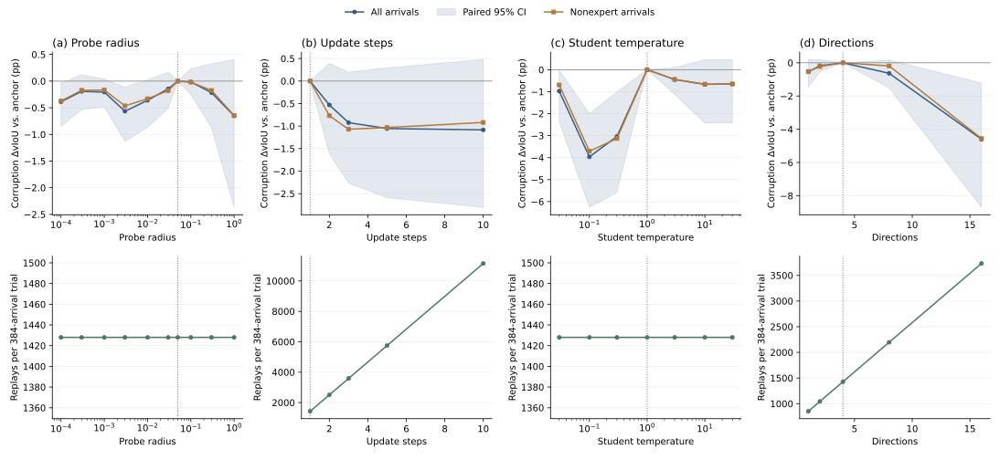
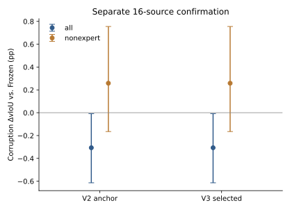

# VidSTG: extended sensitivity finds no improvement over the sealed anchor

All 24 prespecified one-coordinate configurations completed, with zero numerical failures. None exceeded the v2 search-selected anchor on the locked corruption all-arrival objective. The fixed allocation rule therefore opened no focused-search coordinates and retained rho .05, K1, student temperature1 and four directions. This is a completed bounded search, not an assertion of global optimality or a reason to expand the grid after seeing results.

Learning rate .033761698432507946 and teacher temperature .34902548789596055 stay fixed at the sealed v2 winners. The model uses the official VidSTG-trained TA-STVG checkpoint, original Paper48 sampling, 1,792 updated spatial parameters, plain SGD and 25% scheduled temporal/spatial specialists. Current output precedes spatial writes; adapted state persists within each condition/order and resets between streams/configurations. All 32 search sources and the new, disjoint16-source confirmation cohort are historically exposed project sources. Confirmation excludes all sources of prior Optuna and v2; its outcomes did not select parameters.

## Full screen

One query/source, two fixed orders and clean plus five GT/query-independent5% transient corruption conditions give384 arrivals per search configuration. Selection uses source-macro dense corruption all-arrival delta vIoU against Frozen; clean and expert/nonexpert subsets remain separate. Each row below changes only the named coordinate from the anchor. Values are vIoU percentage-point gains against Frozen on the development set, not confirmation gains.

| Coordinate | Values in ascending order | Corrupt all-arrival gains, same order (pp) |
|---|---|---|
| rho | .0001, .0003, .001, .003, .01, .03, .05, .1, .3, 1 | .8510, 1.0454, 1.0330, .6733, .8775, 1.0942, **1.2384**, 1.2228, 1.0225, .5861 |
| K | 1, 2, 3, 5, 10 | **1.2384**, .7085, .3153, .1830, .1546 |
| Student temperature | .03, .1, .3, 1, 3, 10, 30 | .2663, -2.7261, -1.7976, **1.2384**, .7903, .5716, .5912 |
| Directions | 1, 2, 4, 8, 16 | .6977, 1.0608, **1.2384**, .6070, -3.3601 |

Student temperature and direction count have large downside sensitivity in these ranges; more steps also reduce the mean. Sensitivity does not establish a better configuration. These are conditional single-factor observations around one anchor, not an interaction search. Paired source-bootstrap contrasts versus anchor, clean results, harms and all order/source statistics are retained for every configuration. Development intervals are not adjusted for repeated inspection/selection.

The first four direction vectors are exactly unchanged as D grows; prefixes are nested. K>1 regenerates student candidates and rewards at each intermediate state, with expert evidence read once per arrival. Thus the negative K/D results do not result from accidentally freezing stale candidates or changing the original basis when enlarging D.

## Separate confirmation

Final selected configuration equals the anchor. Its confirmation is an exact receipt-verified reuse of the same anchor run, not a second independent replicate. There are24 actual search runs and one192-arrival confirmation, totaling9,408 actual arrivals.

| Confirmation readout | Selected (= anchor) minus Frozen, pp | 95% source-bootstrap interval, pp |
|---|---:|---:|
| Corruption all arrivals | -0.3069 | [-0.6142, -0.0084] |
| Corruption nonexpert arrivals | +0.2584 | [-0.1650, +0.7553] |
| Corruption expert arrivals | -1.5813 | [-2.8794, -0.4021] |
| Clean all arrivals | -0.1848 | [-0.5316, +0.1604] |

On this confirmation cohort the all-arrival mean is below Frozen; this does not generalize to all VidSTG sources or establish a causal explanation for the expert subset. The two corrupt all-arrival order means are +0.0021 and -0.6159 pp. Nonexpert benefit remains uncertain. Selected-minus-anchor is identically zero because the configuration is identical. No confirmation reselection or production promotion occurs.

## Work and independent audit

| Search configuration | Native downstream replays | Backwards | Each specialist's cached provider reads | Worker wall seconds |
|---|---:|---:|---:|---:|
| Anchor, K1/D4 | 1,428 | 90 | 96 | 147.57 |
| K10/D4 | 11,148 | 900 | 96 | 687.53 |
| K1/D16 | 3,732 | 90 | 96 | 218.82 |

Native replay counts include both-offset downstream calls, not repeated backbone computation. Worker wall time includes setup/I/O and is not pure GPU kernel timing or uncached deployment latency. Cached provider reads are not fresh expert inference calls. COSTS.csv contains every configuration and marks any receipt reuse.

The root independently rehashed9,408 raw payloads and state links, recomputed3,792 inner-step state chains,3,648 SGD steps and6,537,216 parameter scalar updates, and checked recorded distribution/loss arithmetic and exact replay/backward/provider counts. Aggregate counts are54,384 native replays,36,240 spatial candidate replays and2,352 reads of each cached specialist provider. Independent scalar/bootstrap and anonymous public audits validate main/subset means, source uncertainty, negative tails, paired contrasts, locked screen allocation and selection-before-confirmation. The root did not read new GT, run models or change any pinned runtime file. Full endpoint evaluation remains supported by the original per-trial independent geometry audits.

Reproduce public scalar checks with `python scripts/audit_tastvg_extended_public_v3.py results/tastvg_extended/2026-10-01/vidstg`; regenerate vector figures with `python scripts/draw_tastvg_extended_v3.py results/tastvg_extended/2026-10-01/vidstg`. Public outputs exclude identities, media, annotations, raw predictions, specialist tensors, model weights and adapted states.

HC2 continues in the original serial controller and is not claimed complete here. The completed CPU diagnostic of old Paper48P1/P5 remains separate from this search and has not changed selection. The user's final tuned full-evaluation diagnosis remains a later task after that evaluation is concretely locked and sealed; no new full GPU job is launched by this closure.
