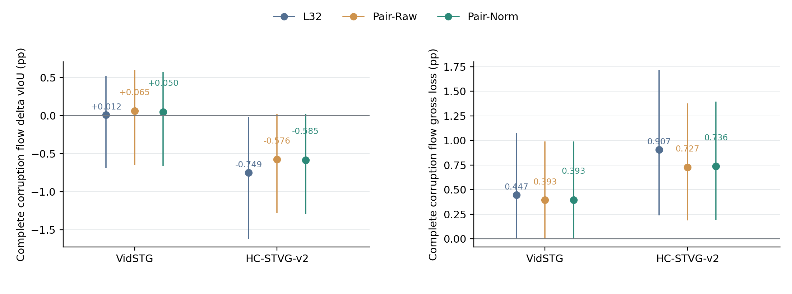
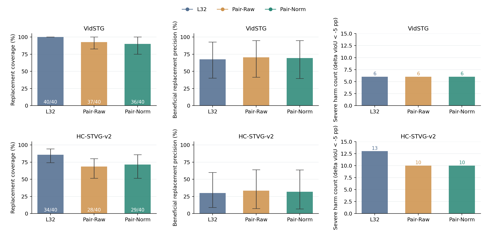
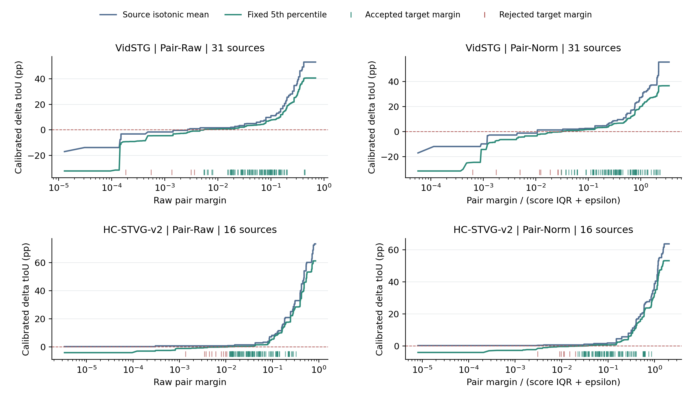

# Anchor-Free Pairwise Certification Review

**The prelocked Pair-Norm rule does not establish useful joint correction.** Removing source-native conditioning restores nonzero HC acceptance, but its confirmed complete-corruption mean remains negative. Raw and IQR-normalized pair margins both fail the carried-forward development GO rule. Keep A; do not promote either calibration.

## Question and fixed implementation

The previous source-native winner calibration reduced Vid harm but accepted no HC corrections. This experiment changes only calibration: fit candidate-versus-candidate tIoU differences from the frozen source-validation scores, then certify the unchanged L32 winner against target A8. Spatial A state, candidate pools, score ordering, pixels, checkpoint, expert schedule and all nonexpert predictions are unchanged. A8 is the existing adapted spatial trajectory plus original temporal readout; this is not a comparison against Frozen.

Source ridge training/validation counts remain Vid 95/31 and HC 48/16, with alpha 10/1 and standardization frozen. Only 31/16 validation sources fit the two new one-dimensional isotonic maps. That validation was already used for ridge alpha selection and previous calibration; no new independent validation is claimed. Targets retain 32 development plus 16 historically exposed confirmation sources per dataset, one query/source, two orders, clean plus five 5% corruptions and 25% expert arrivals: 1,152 arrivals, 288 expert (240 corrupt/48 clean), 864 nonexpert unchanged A. Official same-domain TA-STVG checkpoints are Vid fbb1ed88 / HC ee72f0d9; original Paper48 two-offset sampling and A spatial K1/K8 rules are retained.

Every unordered pair with L-score difference >1e-12 is oriented toward its higher score. GT-neutral and GT-harmful pairs remain in the fit. Each source has total weight one; its strict pairs split that weight. The 15,376 Vid and 7,936 HC pairs are not independent samples: effective independent units remain 31 and 16. There are no source score ties or zero-IQR cases in this input cohort.

Pair-Raw uses the score difference. **Pair-Norm is primary**, using that difference divided by the IQR of all 32 frozen scores plus fixed 1e-8. Both use the same fixed 5% source-bootstrap lower fitted-mean curve, with 10,000 whole-source draws, seed 20261003. Unique positive top1 winners are accepted only within the observed full source margin domain and with lower mean >1e-12. No q, threshold or normalization family is searched. Models are sealed before opening target score rows, and all target choices are sealed before joining the previously saved target GT metrics. This cannot erase prior target exposure.

The lower curve is a pointwise fitted-mean confidence heuristic, **not** an individual prediction bound, simultaneous band, conformal guarantee or target safety probability. Source pairs remove native-specific conditioning; arbitrary source pairs and selected target top1-vs-A8 comparisons still differ. Pairwise fitting therefore does not eliminate all anchor/domain confounding.

## Complete corruption flow

All deltas below are source-macro vIoU percentage points relative to unchanged A8. Intervals use paired 10,000-source bootstrap; they are pointwise and reflect the finite historically exposed panels.

| Dataset / panel | L32 - A8 | Pair-Raw - A8 | Pair-Norm - A8 |
|---|---:|---:|---:|
| VidSTG / search | -0.1373 [-1.1083, +0.8118] | -0.1363 [-1.1073, +0.8119] | +0.0650 [-0.6253, +0.8893] |
| VidSTG / confirm | +0.0120 [-0.6874, +0.5259] | +0.0649 [-0.6500, +0.5992] | +0.0502 [-0.6603, +0.5774] |
| HC-STVG-v2 / search | +0.3188 [-0.4399, +1.2387] | +0.3282 [-0.4273, +1.2431] | +0.3167 [-0.4423, +1.2366] |
| HC-STVG-v2 / confirm | -0.7489 [-1.6172, -0.0176] | -0.5760 [-1.2856, +0.0240] | -0.5847 [-1.2986, +0.0194] |

The primary confirmation means are small and uncertain on Vid and negative on HC; both confidence intervals include zero. HC is no longer a zero-acceptance case. Restored coverage does not deliver net positive utility.

## Confirmed acceptance, benefit and harm

Precision is the ratio of source-balanced beneficial replacements to source-balanced acceptance, not generally the raw benefit count divided by raw acceptance. Severe harm means delta vIoU < -5 pp. Gross gain/loss below are measured on the complete corruption flow.

| Dataset / arm | Accepted expert cells | Accepting sources | Benefit / harm counts | Source-balanced benefit precision | Gross gain / loss pp | Severe harms |
|---|---:|---:|---:|---:|---:|---:|
| VidSTG / L32 | 40/40 | 8 | 27 / 13 | 67.50% [40.00, 92.50] | 0.4589 / 0.4469 | 6 |
| VidSTG / Pair-Raw | 37/40 | 8 | 26 / 11 | 70.27% [41.18, 94.74] | 0.4582 / 0.3933 | 6 |
| VidSTG / Pair-Norm | 36/40 | 8 | 25 / 11 | 69.44% [39.39, 94.74] | 0.4436 / 0.3933 | 6 |
| HC-STVG-v2 / L32 | 34/40 | 7 | 9 / 25 | 30.00% [8.82, 60.00] | 0.1584 / 0.9073 | 13 |
| HC-STVG-v2 / Pair-Raw | 28/40 | 7 | 8 / 20 | 33.33% [7.14, 64.00] | 0.1513 / 0.7273 | 10 |
| HC-STVG-v2 / Pair-Norm | 29/40 | 7 | 8 / 21 | 32.00% [6.67, 63.64] | 0.1513 / 0.7361 | 10 |

On Vid confirmation, normalization retains 36/40 proposed replacements and all six severe harms; it suppresses much less harm than the preceding native-based gate (one severe harm), although it keeps more corrections. On HC confirmation, it accepts 29/40 expert cells across seven sources, with ten severe harms versus thirteen for L32. That reduces loss but still leaves a negative mean. These observations do not select a new operating point.

## Matched raw-versus-normalized comparison and controls

| Dataset / panel | Pair-Norm - Pair-Raw vIoU pp [CI] |
|---|---:|
| VidSTG / search | +0.2013 [+0.0000, +0.6039] |
| VidSTG / confirm | -0.0147 [-0.0440, +0.0000] |
| HC-STVG-v2 / search | -0.0115 [-0.0345, +0.0000] |
| HC-STVG-v2 / confirm | -0.0087 [-0.0262, +0.0000] |

Neither fixed arm has a common confirmed useful regime. Even success here could not uniquely attribute earlier failures to anchor semantics or source-score scale: the source pair population, weights and selected-winner conditioning also change. The current failure rejects these two locked constructions, not all information in the latent representation.

| Clean complete flow | L32 - A8 pp | Pair-Raw - A8 pp | Pair-Norm - A8 pp |
|---|---:|---:|---:|
| VidSTG / search | -0.3426 [-1.4604, +0.7247] | -0.3426 [-1.4604, +0.7247] | -0.3426 [-1.4604, +0.7247] |
| VidSTG / confirm | -0.1961 [-0.9756, +0.4773] | -0.0630 [-0.8063, +0.5629] | -0.0630 [-0.8063, +0.5629] |
| HC-STVG-v2 / search | +0.7039 [-0.2683, +2.0903] | +0.7039 [-0.2683, +2.0903] | +0.7039 [-0.2683, +2.0903] |
| HC-STVG-v2 / confirm | -0.4096 [-1.3622, +0.3358] | -0.1358 [-0.9191, +0.4355] | -0.1358 [-0.9191, +0.4355] |

All 864 nonexpert predictions and metrics are unchanged A. This is a current expert temporal readout experiment, not new future parameter adaptation. Per-order means, source values and leave-one-out ranges are included in every SUMMARY.

## Correction-size diagnosis

Size refers to the proposed unchanged L32 winner, before certification: endpoint L1 displacement divided by A8 duration, small r<.5 / large r>=.5. These strata never alter fitting or acceptance.

| Dataset / size | Cells / sources | L32 accepted / severe | Raw accepted / severe | Norm accepted / severe |
|---|---:|---:|---:|---:|
| VidSTG / small | 36 / 8 | 36 / 6 | 33 / 6 | 32 / 6 |
| VidSTG / large | 4 / 3 | 4 / 0 | 4 / 0 | 4 / 0 |
| HC-STVG-v2 / small | 40 / 7 | 34 / 13 | 28 / 10 | 29 / 10 |
| HC-STVG-v2 / large | 0 / 0 | 0 / 0 | 0 / 0 | 0 / 0 |

The Vid large panel contains only four helpful proposals from three sources; HC confirmation has no proposed large correction. These counts cannot establish a safe large-change rule or a universal small-change failure mode. All positive, negative and useful-rejected cases are exported.

## Decision and independent verification

- Pair-Norm, VidSTG: fails positive_leave_one_out, fewer_severe_harms.
- Pair-Norm, HC-STVG-v2: fails positive_mean, positive_leave_one_out.
- Pair-Raw, VidSTG: fails positive_leave_one_out, fewer_severe_harms.
- Pair-Raw, HC-STVG-v2: fails positive_mean, positive_leave_one_out.

Primary decision: **NO_GO_locked_pairwise_certification**. Stop further 1D margin/threshold variants under this research branch. Keep A and production CURRENT. The next scientific variable is structured candidate-relative quality, potentially using precision/completeness or listwise objectives; this report does not start an unspecified new training experiment.

An independent auditor reconstructs every source pair and weight, uses SciPy PAV instead of the runner's sklearn Cython solver, refits all four 10,000-source bootstrap calibrations, independently recomputes every choice and all cached metrics/paired source aggregates, and checks seal ordering, original score/state hashes and the locked GO tests. 492,369 scalar checks pass; maximum numerical difference 3.33e-16. Seven targeted CPU tests pass. Source calibration wall time is 30.190s; cached scoring 1.784s; independent audit 25.050s. These times exclude publication/rendering, and no GPU kernel timing is implied. All new model forwards, expert calls, replays, backpropagations and parameter updates are zero.

## Reproduction and released evidence

- [Protocol](../protocols/tastvg_pairwise_certification_v1.md), [execution](tastvg_pairwise_certification_v1/EXECUTION.md), [configuration](../results/tastvg_pairwise_certification/2026-10-03/CONFIG.json).
- [Source candidates, pairs, frozen calibrations, decisions and all metrics](../results/tastvg_pairwise_certification/2026-10-03), [decision](../results/tastvg_pairwise_certification/2026-10-03/DECISION.json), [audit](../results/tastvg_pairwise_certification/2026-10-03/ROOT_AUDIT.json).
- [Runner](../scripts/run_tastvg_pairwise_certification_v1.py), [math](../scripts/tastvg_pairwise_certification_math_v1.py), [independent auditor](../scripts/audit_tastvg_pairwise_certification_v1.py), [figures](../scripts/draw_tastvg_pairwise_certification_v1.py), [report generator](../scripts/report_tastvg_pairwise_certification_v1.py).

With NumPy, scikit-learn, SciPy and Matplotlib, from the repository root:

```bash
python -B -m unittest scripts.test_tastvg_pairwise_certification_v1
python -B scripts/audit_tastvg_pairwise_certification_v1.py
```

The released anonymous audit uses saved scalar scores and labels, not private media, weights, hidden tensors or raw annotations. The preparation runner additionally checks private predecessor receipts and is not a public inference launcher.






