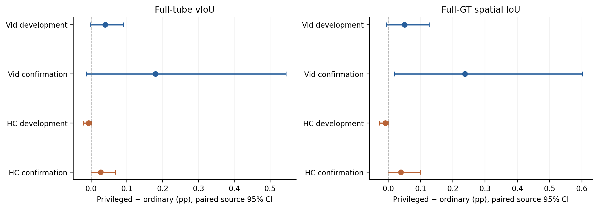
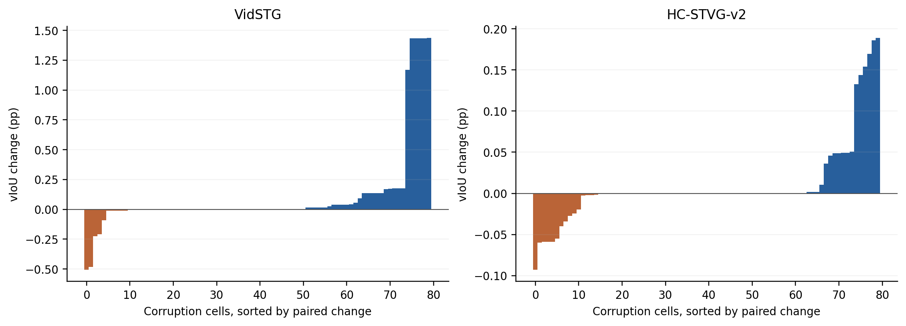

# Event-scoped privileged spatial attention: P0 review

**Actual P0 completed: 192 paired frozen-model inputs.** The predeclared P0 gate failed. Do not run OPD or LN consolidation for this fixed attention-prior implementation.

This experiment tests whether an external spatial field gives the same frozen STVG model a usable advantage. It does not train a new model, imitate DINO box coordinates, run online adaptation, or modify the deployed registry.

## Inputs and intervention

Each dataset has 8 development and 8 source-disjoint but historically exposed confirmation sources, one query per source, clean plus five 5% corruptions: 96 unique inputs each. The sources are original C1 ordinals 0–7 and 32–39, fixed before GT. Each P0 input requests up to four existing sampled frames inside its frozen native interval. This is an every-query expert diagnostic, not A’s 25% expert-arrival flow. Two orders would duplicate identical frozen predictions, so none are counted as extra evidence.

The baseline is native Frozen TA-STVG with the official same-domain EMA checkpoint, original Paper48 pixels/grid and two-offset decoding. A8/UniversalVTG and the previous online C1 outputs are not the baseline. Grounding-DINO tiny is frozen; the existing static referent phrase is used. All positive-area clipped raw proposals with phrase score ≥ .35 are kept, including duplicates. No top-K/NMS/margin winner enters the field. Weights are softmax(score/1); each Gaussian uses half the proposal width/height as standard deviation. Alpha=1 and epsilon=1e-6 are fixed defaults, not searched.

The field adds log(M+epsilon) to valid image-key logits in all six blocks of the final native spatial PosDecoder only. Native first-pass gates/query inputs and time are frozen. RGB, token content and global context remain present. Text/padded keys receive zero bias; image-vs-text mass can change. The prior is soft evidence, not calibrated object correctness. Cross-frame self attention can change unobserved frames despite an observed-only logit bias.

## Main paired results

Corruption means are source macro averages. Difference and paired 95% intervals are in percentage points; 10,000 whole-source draws, seed 20261004. Each split contains only 8 sources, with historical exposure. Intervals are pointwise, not simultaneous multiple-testing guarantees.

| Panel | Ordinary vIoU (%) | Privileged vIoU (%) | ΔvIoU pp [95% CI] | ΔsIoU pp [95% CI] | >5pp harm / cells |
|---|---:|---:|---|---|---:|
| vidstg search | 14.100 | 14.139 | +0.039 [-0.001, +0.091] | +0.051 [-0.006, +0.126] | 0/40 |
| vidstg confirm | 30.633 | 30.813 | +0.180 [-0.013, +0.545] | +0.238 [+0.020, +0.601] | 0/40 |
| hc2 search | 25.582 | 25.575 | -0.007 [-0.022, +0.000] | -0.009 [-0.027, +0.001] | 0/40 |
| hc2 confirm | 26.494 | 26.521 | +0.027 [-0.001, +0.068] | +0.039 [-0.001, +0.100] | 0/40 |

Clean control:

| Panel | ΔvIoU pp [95% CI] | ΔsIoU pp [95% CI] | >5pp harm |
|---|---|---|---:|
| vidstg search | +0.033 [-0.010, +0.089] | +0.038 [-0.032, +0.121] | 0/8 |
| vidstg confirm | +0.136 [-0.142, +0.545] | +0.183 [-0.090, +0.586] | 0/8 |
| hc2 search | -0.007 [-0.021, +0.000] | -0.009 [-0.026, +0.000] | 0/8 |
| hc2 confirm | +0.023 [-0.008, +0.069] | +0.032 [-0.015, +0.102] | 0/8 |

tIoU is exactly invariant because I0 is fixed. Dense sIoU is over all annotated GT frames, independent of predicted time; ΔsIoU is not a change of temporal evaluation support. All five corruption panels and pooled source means are in SUMMARY.json.

## Scope and evidence diagnostics

| Panel | Native observations inside GT event | Nonempty evidence frames / requested | Observed GT-frame IoU Δ pp | Unobserved GT-frame IoU Δ pp |
|---|---:|---:|---:|---:|
| vidstg search | 58.75% | 70/160 | +1.005 | +0.038 |
| vidstg confirm | 56.88% | 80/160 | +0.059 | +0.236 |
| hc2 search | 53.12% | 21/160 | -0.088 | -0.008 |
| hc2 confirm | 62.50% | 94/160 | +0.206 | +0.036 |

These are descriptive cell/frame summaries, not new primary tests or GT-based online gates. Missing GT outside an event is not assigned a made-up box. The prior can misidentify an instance, be sparse, or alter cross-modal attention mass; these diagnostics do not uniquely identify one causal failure. Proposal-best and mixture-weighted GT IoU, attention visual/evidence mass and unobserved frame changes are preserved in DIAGNOSTIC_SUMMARY.json.

Evidence coverage is a material limitation: 101/192 cells have no valid field on any requested frame, including 42 cells with an empty conservative phrase. These remain in the paired evaluation as exact no-ops, not removed using GT. In HC development only 21/160 requested corruption observation frames receive a nonempty field. The result tests this explicit extraction/threshold/field interface, not an ideal all-query evidence teacher.

The Vid confirmation positive signal is concentrated: source 37 contributes 96.44% of positive source-mean gains (99.87% of net gain). This is post-hoc concentration analysis, not a source deletion or new gate. The positive dense-sIoU CI in this panel is retained, but is insufficient to establish a shared two-dataset teacher advantage.

The field changes actual attention allocation: observed-frame conditional evidence mass rises from .433 to .541 in Vid confirmation and from .580 to .632 in HC confirmation. This confirms an active intervention; the much smaller box/tube changes show that attention allocation improvement under this field is not itself a localization-quality guarantee.

## Work and failure cases

| Dataset | Source | Condition | Ordinary vIoU % | Privileged vIoU % | Δ pp | Active evidence frames |
|---|---:|---|---:|---:|---:|---:|
| vidstg | 37 | motion_blur_5 | 41.86 | 43.29 | +1.44 | 4 |
| vidstg | 37 | occlusion_5 | 41.87 | 43.30 | +1.43 | 4 |
| vidstg | 35 | exposure_5 | 45.62 | 45.11 | -0.51 | 4 |
| vidstg | 35 | frame_drop_5 | 45.63 | 45.15 | -0.48 | 4 |
| hc2 | 35 | frame_freeze_5 | 43.56 | 43.75 | +0.19 | 4 |
| hc2 | 38 | motion_blur_5 | 42.61 | 42.79 | +0.19 | 4 |
| hc2 | 39 | frame_freeze_5 | 0.83 | 0.74 | -0.09 | 4 |
| hc2 | 1 | frame_drop_5 | 37.85 | 37.79 | -0.06 | 4 |

## Validation, costs and decision

10 CPU contracts passed without initializing CUDA. Two fixed clean inputs passed real full-model ordinary/privileged bitwise reinsertion and unchanged temporal logits. All 192 native ordinary tubes match their cache bitwise; all model/expert weights stayed unchanged. All returned attention probabilities, additive priors and dense metrics were independently recomputed on CPU after the global prediction barrier. Root audit: 32,043,493 checks; public aggregate audit: 2,784 checks.

New DINO forwards: 600 (cap 768); GPU worker wall 257.051s, CPU scoring/audit 10.587s. Zero backwards and zero parameter updates. Worker wall includes checkpoint loading, input hashing, decoding and IO; it is not pure GPU kernel time. Empty phrases/evidence are recorded as no-op rather than removed.

The P0 gate was locked before GT: corrupt vIoU means must be positive in all four development/confirmation dataset panels. That condition did not hold, so the implementation stops here. No new strength sweep, Sa2VA swap, OPD, LN consolidation or old queue is started. This is not proof that every expert/evidence/prior interface is impossible.

Two methodological boundaries remain even if a later version succeeds: native attention probabilities are not a tube-generating policy likelihood; at a single layer with unchanged QK logits, the residual mixture A0^(1−beta)Aplus^beta is algebraically a scaled additive prior. That identity does not itself create an independent innovation or a guarantee of coordinate/localization quality.

Checkpoint training provenance: the [official Grounding-DINO repository](https://github.com/IDEA-Research/GroundingDINO) lists the published training sources. This is not an audited guarantee of zero underlying-media overlap with these historically exposed research datasets.

All implementation/protocol/anonymous metrics/negative cases and PNG/PDF figures are public-export eligible. Private videos, annotations, weights, raw boxes, spatial fields and attention/H tensors remain excluded. CURRENT_METHOD is unchanged.
