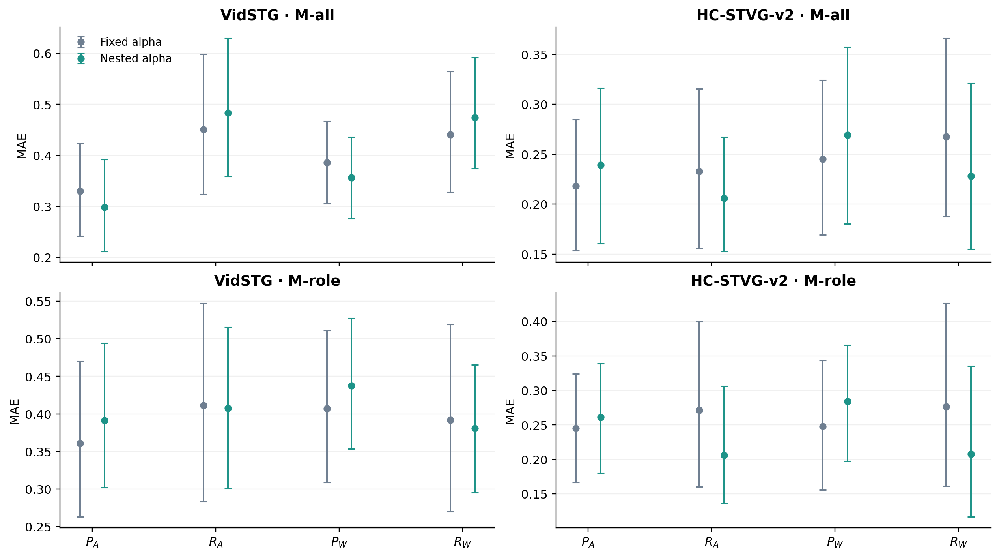
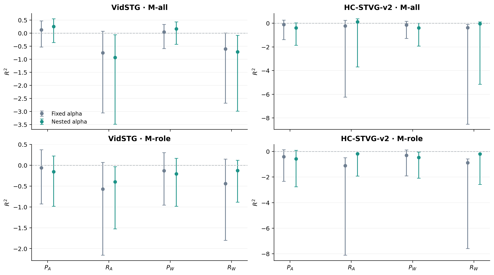
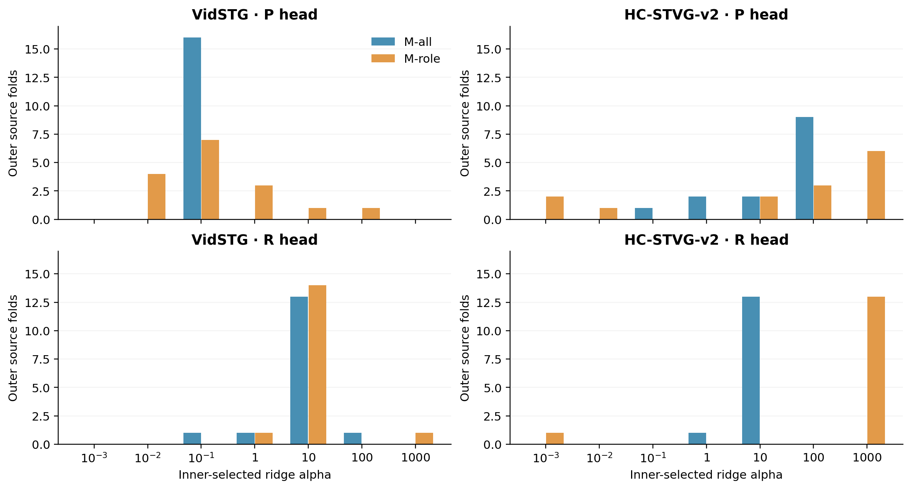

# Nested Source-Regularization Audit：正则化有局部效应，未恢复普遍跨源质量读出

本轮按 bf45294 之后的用户授权完成。唯一科学变量是 ridge alpha 的选择方式：旧固定 alpha LOSO 对照，比较完全排除外层来源的 nested source-LOSO alpha 选择。不是新的无标签 TTA 方法，也没有接入 A 或 CURRENT_METHOD。

**主判断：旧 alpha 并非各读出的普遍最优值，HC recall 的收缩有可测改善；但这套 nested 选择没有把原来的跨源失败整体修复。** 16 个 corruption 角色/群体结果里，13 个 nested R² 点值仍为负；三个正点值的区间全部跨零，没有一个 R² 的95%区间完全在零以上。M-role 八个 R² 点值仍全负。不能据此宣布 final latent 没信息，也不能把所有失败唯一归于高维 variance。

## 数据、嵌套规则与控制

沿用已有 search 专家到达：VidSTG 16来源/96cells，HC-STVG-v2 14来源/96cells；每集80corrupt＋16clean。一query/source、两order、clean＋五类5% corruption、25% expert的原32-source开发设计不变，只用现有专家特征。确认不新拟合、不新评估，来源有历史曝光，holdout只针对质量读出的监督与normalizer；A持久轨迹可能无标签遇到被留出的source，不是fresh test。

TA-STVG官方同域checkpoint：Vid `fbb1ed8871d6c2aa093879efefc2ee500bb7de5e0fe1c25b809c5393d010f3c7`；HC `ee72f0d9a50c573a115bd7cfc2329c860745a1cf3dab83af1be7787c11b3c218`。原Paper48双offset/pixels，第6层Inside256→P、Endpoint512→R，A1792空间参数轨迹VidK1/HCK8、Old8⊂Expanded32、A8与固定L32 winner W全部不变。M-all训练all32，M-role训练[A,W]保留重复，两者共享各自的P/R heads。

外层16/14整源LOSO；内层只在其余15/13来源中逐源LOSO，所有该源的condition/order/candidate一起留出。alpha预锁 `[.001,.01,.1,1,10,100,1000]`，每个outer fold、population、P/R head分别选；选择目标是inner held-source **A/W双角色六条件等源MAE**，两个群体用同一部署角色目标。训练仍是原source-weighted MSE＋alpha系数范数惩罚，权重总和1、bias无罚、每个inner/outer训练集重估标准化；回归不clip，精确并列取最小alpha。主评测为corruption，所以all-condition selection与corrupt primary的差异是预锁设定，不是事后更换目标。

30outer folds、422ordered inner folds；11,816个inner candidate-head fits＋120个selected outer refits。七alpha复用同训练数据的eig分解，共1,808次，未改变特征空间或方程。没有对称fold复用。原nmax fixed-alpha预测逐值复用：Vid P/R=1/1，HC=1/.1。训练阶段file guard禁止读outer labelled pack，inner训练数组同时排除outer/inner source；全部选择/outer模型seal后，在独立GTfree进程读outer hidden预测并seal，最后才join已有GT用于评测。模型hash、输入/状态/candidate hash和全过程见RUNTIME_BINDING、FOLDS、INNER_CV、FIT_SUMMARY、GLOBAL_READOUT_SEAL、LABEL_JOIN。

## 主结果：同来源、同到达的 raw regression

MAE为0–1比例，差值是nested−fixed，负值较好；括号为10000次配对source-bootstrap95%区间。R²与Pearson均未裁剪。

| Dataset / population | Role | MAE fixed → nested | ΔMAE [95% CI] | R² fixed → nested | Pearson fixed → nested |
|---|---|---:|---:|---:|---:|
| vidstg M-all | P_A | 0.3296 → 0.2979 | -0.0317 [-0.0918, +0.0268] | 0.1295 → 0.2549 | 0.4008 → 0.5401 |
| vidstg M-all | R_A | 0.4505 → 0.4831 | +0.0326 [-0.0109, +0.0753] | -0.7530 → -0.9304 | -0.0962 → -0.3653 |
| vidstg M-all | P_W | 0.3854 → 0.3566 | -0.0288 [-0.0897, +0.0347] | 0.0434 → 0.1654 | 0.2773 → 0.4325 |
| vidstg M-all | R_W | 0.4409 → 0.4737 | +0.0328 [-0.0055, +0.0724] | -0.6054 → -0.7164 | -0.0689 → -0.3174 |
| vidstg M-role | P_A | 0.3610 → 0.3915 | +0.0305 [-0.0209, +0.0834] | -0.0621 → -0.1544 | 0.2507 → 0.1857 |
| vidstg M-role | R_A | 0.4113 → 0.4079 | -0.0034 [-0.0604, +0.0686] | -0.5722 → -0.3987 | 0.0097 → -0.0258 |
| vidstg M-role | P_W | 0.4070 → 0.4376 | +0.0306 [-0.0187, +0.0831] | -0.1321 → -0.2041 | 0.1565 → 0.0896 |
| vidstg M-role | R_W | 0.3919 → 0.3811 | -0.0108 [-0.0849, +0.0677] | -0.4401 → -0.1240 | 0.1460 → 0.1595 |
| hc2 M-all | P_A | 0.2182 → 0.2392 | +0.0210 [-0.0149, +0.0668] | -0.1111 → -0.3868 | 0.1834 → -0.0855 |
| hc2 M-all | R_A | 0.2330 → 0.2061 | -0.0270 [-0.0700, +0.0208] | -0.2364 → 0.1167 | 0.1800 → 0.4357 |
| hc2 M-all | P_W | 0.2451 → 0.2691 | +0.0240 [-0.0238, +0.0781] | -0.1527 → -0.4003 | 0.0399 → -0.1893 |
| hc2 M-all | R_W | 0.2676 → 0.2283 | -0.0393 [-0.0721, -0.0031] | -0.3848 → -0.0401 | -0.1706 → 0.0530 |
| hc2 M-role | P_A | 0.2448 → 0.2609 | +0.0162 [-0.0304, +0.0664] | -0.4061 → -0.5849 | 0.0911 → 0.1060 |
| hc2 M-role | R_A | 0.2711 → 0.2061 | -0.0650 [-0.1388, +0.0027] | -1.1132 → -0.1874 | -0.2969 → -0.6540 |
| hc2 M-role | P_W | 0.2480 → 0.2840 | +0.0361 [-0.0072, +0.0825] | -0.3052 → -0.4791 | 0.0014 → -0.0431 |
| hc2 M-role | R_W | 0.2766 → 0.2081 | -0.0686 [-0.1280, -0.0093] | -0.8903 → -0.2055 | -0.5016 → -0.7580 |

HC R_W MAE有两项明确的点态配对改善：M-all .2676→.2283，差−.0393 [−.0721,−.0031]；M-role .2766→.2081，差−.0686 [−.1280,−.0093]。其余14个MAE差区间跨零，不能用“不显著”证明相等。HC四个recall ΔR²配对区间都高于零，但M-role R_A/R_W仍为−.1874/−.2055；M-all R_A的+.1167区间[−3.6837,+.3839]，并未建立稳定正R²。

特别是 **HC M-role recall 的MAE/MSE改善没有恢复正确的质量排序**：R_A Pearson −.6540 [−.8791,−.2972]，R_W −.7580 [−.9748,−.6235]。不能把绝对误差下降直接写成可靠quality signal，或者把它当成alpha已经解决mapping。

Vid M-all precision点值改善：P_A .3296→.2979，P_W .3854→.3566，但配对MAE/R²区间跨零；recall点值反而变坏。Vid M-role没有一致改善，P两项更坏、R两项MAE点值略降；其四R²仍为负。两dataset/两population不能事后拼选赢家。所有clean、order、condition以及未定义bootstrap draw完整保留在SUMMARY。

## Alpha选择不是统一增强正则化

| Dataset | Population | P selected alpha: outer fold counts | R selected alpha: outer fold counts |
|---|---|---|---|
| vidstg | M-all | 0.1: 16 | 0.1: 1; 1.0: 1; 10.0: 13; 100.0: 1 |
| vidstg | M-role | 0.01: 4; 0.1: 7; 1.0: 3; 10.0: 1; 100.0: 1 | 1.0: 1; 10.0: 14; 1000.0: 1 |
| hc2 | M-all | 0.1: 1; 1.0: 2; 10.0: 2; 100.0: 9 | 1.0: 1; 10.0: 13 |
| hc2 | M-role | 0.001: 2; 0.01: 1; 10.0: 2; 100.0: 3; 1000.0: 6 | 0.001: 1; 1000.0: 13 |

Vid M-all P全部16折选.1，低于旧1；所以不能把旧拟合普遍描述为“正则化太弱”。HC M-all R在13/14折选10，HC M-role R在13/14折选1000，相对旧.1强很多；R_W MAE改善与这套选择相容，但不是variance为唯一原因的因果证明。M-role HC R大量命中预锁上界1000，只能说明在本grid里倾向更强收缩，不能排除范围外或另一selection objective；本轮不按外层结果扩grid。

完整每个inner source/alpha的A/W、clean/corrupt MAE在INNER_CV.json和INNER_SOURCE_MAE.csv，120外层head选择在FIT_SUMMARY.json/ALPHA_SELECTION.csv；选参只用内层来源，外层标签从未参与。

## Secondary：解析决策未普遍恢复

只在解析F中clip P/R，保持同一个eligible W，deltaF>0接受；无阈值搜索、无新candidate。以下Δv仅search corruption **专家子集**相对A，不是全流收益。

| Dataset / population | AUROC fixed → nested | BA fixed → nested | accepted helpful/harmful fixed → nested | severe accepts fixed → nested | expert Δv pp fixed → nested | nested−fixed Δv pp [95% CI] |
|---|---:|---:|---|---:|---:|---:|
| vidstg M-all | 0.4566 → 0.4471 | 0.4213 → 0.4520 | 17/29 → 18/29 | 10 → 9 | -1.2205 → -0.9920 | +0.2285 [-0.0102, +0.6957] |
| vidstg M-role | 0.4436 → 0.3861 | 0.5291 → 0.3259 | 16/24 → 15/30 | 8 → 9 | -0.4789 → -0.8671 | -0.3882 [-0.8991, -0.0265] |
| hc2 M-all | 0.6341 → 0.5538 | 0.6260 → 0.5417 | 25/18 → 25/21 | 6 → 6 | +1.7980 → +1.7691 | -0.0289 [-0.0908, +0.0134] |
| hc2 M-role | 0.5335 → 0.5779 | 0.5077 → 0.6250 | 22/13 → 26/13 | 3 → 3 | +2.1250 → +2.4386 | +0.3136 [-0.0167, +0.8791] |

Vid M-role BA下降 .2031 [−.3796,−.0384]，配对expert vIoU下降 .3882pp [−.8991,−.0265]；有害accept24→30、严重8→9。这是本固定解析执行的负结果，不能因为回归某项MAE较低而忽略。HC M-role有益accept22→26、有害13不变，但Δv+.3136pp [−.0167,+.8791]仍不确定。所有AUROC变化区间跨零。

## Work / failure cases，均为事后解释

公开CASES.json同时保存误差改善最大/恶化最大，以及决策变化的正负样本；下面不是线上筛选规则。cell key末段是arrival，source_id以ROWS字段为准。

| Dataset / population / cell key | 四角色平均绝对误差 fixed → nested | 解析决定 fixed → nested | 固定W真实Δv pp |
|---|---:|---|---:|
| vidstg M-all source30 `vidstg/search/exposure_5/order2/12` | 0.3818 → 0.2171 | accept → accept | -0.6161 |
| vidstg M-all source19 `vidstg/search/occlusion_5/order2/20` | 0.4261 → 0.4616 | accept → reject | -18.5315 |
| vidstg M-role source30 `vidstg/search/motion_blur_5/order2/12` | 0.3243 → 0.1605 | accept → accept | +1.2569 |
| vidstg M-role source3 `vidstg/search/exposure_5/order2/24` | 0.0824 → 0.1183 | reject → accept | -7.2796 |
| vidstg M-role source3 `vidstg/search/motion_blur_5/order2/24` | 0.1294 → 0.1607 | accept → reject | +9.8204 |
| hc2 M-all source4 `hc2/search/exposure_5/order2/20` | 0.5259 → 0.3997 | accept → accept | -10.5456 |
| hc2 M-all source20 `hc2/search/motion_blur_5/order2/16` | 0.1363 → 0.2976 | accept → accept | +10.3603 |
| hc2 M-role source14 `hc2/search/occlusion_5/order1/12` | 0.0722 → 0.1267 | reject → accept | +11.8739 |

Vid M-all exposure误差 .3818→.2171，仍接受真实较差W：MAE改善不自动保证delta判别。Vid M-all occlusion拒掉−18.53pp的大坏例，保留该正向保护。Vid M-role source3 exposure原正确reject变为accept坏W（−7.28pp）；同source blur原accept有益W（+9.82pp）变reject，说明不能把收益只归于更保守。HC M-all exposure误差 .5259→.3997仍接受−10.55pp坏W；motion_blur原较准的P被压低，误差 .1363→.2976但仍接受有益W。HC M-role occlusion由误拒变接受+11.87pp；这些正负例均未进入alpha选择。

## 核验、成本与判断边界

10项CPU测试通过；根审计独立用SciPy SPD求解复核全部11,816 inner候选和120 outer模型，与生产NumPy eigen实现交叉检查，总5,144,185标量/结构检查；公开审计185,762项，CSV三表62,632标量核对。物理P/R/tIoU、源权重、normalizer、outer/inner排除、选择、固定control逐值相同、candidate/state/pixel hash和10000source配对区间均核验。三PNG已目检，无重叠/裁切；PDF同步生成。

科学计算CPU wall：拟合50.938s，GTfree读出1.090s，诊断2.160s；独立根审计55.076s、公开审计3.883s另列。不含代码开发/报告/绘图/远端同步，零GPU、专家、backbone、candidate、replay、backward、新在线流或production调用。

Bootstrap不重fit，条件于固定OOF预测；outer模型训练集重叠，source仅16/14，点态区间未多重校正。不能用三项正R²点值或两项MAE区间宣称全面解决，不能用其余区间跨零宣布参数无效。固定上界alpha命中也不证明所有regularization探索已穷尽。历史曝光与多轮开发不等于未见test。

**决策：保留 A 与 CURRENT；nested-alpha读出不接入正式方法。** 本轮把“旧alpha选择不合适”从未测试因素变成了已测的局部因素：HC recall存在改善，Vid不一致，可靠A/W质量mapping和安全decision未普遍恢复。停止把“调大alpha即可救回”作为已成立故事，继续保留regularization、独立source数与representation-conditioned mapping之间的不确定性。没有启动PCA/低秩/layerwise/MLP/新gate/新专家/新队列；后续新实验需要明确机制与匹配控制。

## 可复核文件

[协议](../protocols/tastvg_pr_nested_alpha_v1.md)、[执行说明](tastvg_pr_nested_alpha_v1/EXECUTION.md)、[全部匿名结果](../results/tastvg_pr_nested_alpha/2026-10-03)、[根审计](../results/tastvg_pr_nested_alpha/2026-10-03/ROOT_AUDIT.json)、[公开审计](../results/tastvg_pr_nested_alpha/2026-10-03/PUBLIC_AUDIT.json)、[完整内层曲线](../results/tastvg_pr_nested_alpha/2026-10-03/INNER_CV.json)。私有hidden/模型/normalizer/GT时间span/媒体均不公开。
