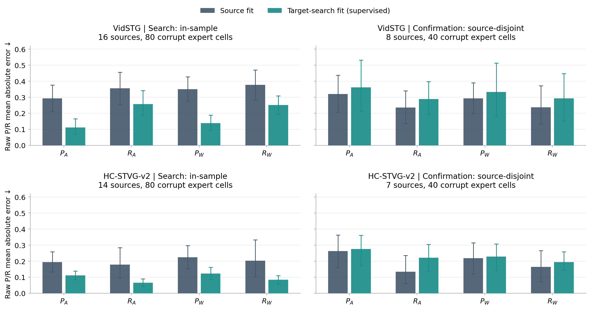
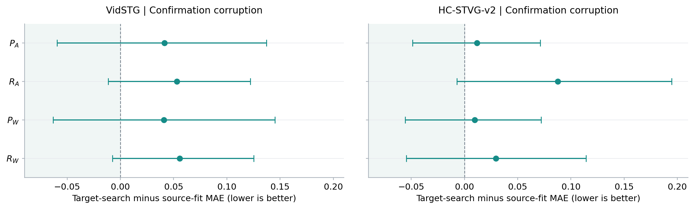
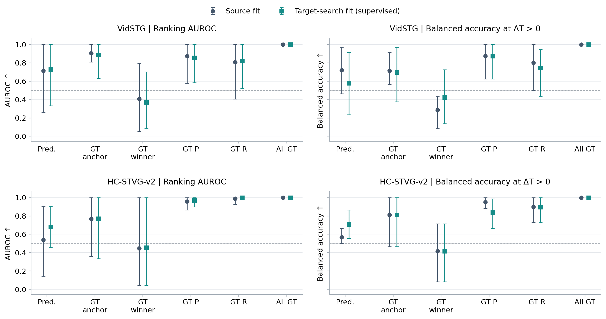

# Target-domain P/R readout accessibility audit

**The target-search refit improves in-sample P/R fitting, but does not establish held-out recovery of the four A/W readouts. HC retains a narrower positive result: the fixed-zero decision rejects more harmful replacements.**

This finite CPU audit is complete. It uses target-search GT for four supervised diagnostic ridge fits, then evaluates source-disjoint confirmation features and labels. It is not unsupervised test-time adaptation, a new gate, a new temporal selector or a method promotion. A, L32 winners, checkpoint states, input pixels and production CURRENT_METHOD remain unchanged.

The two tests requested after [f5e3f2d](https://github.com/Zonglin-He/A/blob/f5e3f2d4758f50379ac94baa2b3e16c293d652dd/docs/TA_STRUCTURED_SEPARABILITY_REVIEW.md) are both implemented: matched source-fit versus target-search-fit P/R regression, followed by predicted/oracle P/R composition on fixed A8 and L32 winner.

## Actual setting and data use

Both original panels contain 32 search +16 confirmation sources/dataset, one query/source, two fixed orders, clean +five 5% transient corruptions, with the existing 25% expert schedule. The regression audit uses only expert arrivals for which the cached feature interface exists; the other 864 arrivals are not added. There are 288 expert cells total (240 corrupt +48 clean), 30 independent expert training sources and 15 expert confirmation sources across the two datasets. All target sources have project-level historical exposure; source-disjoint confirmation is not a fresh test.

| Dataset | Search expert sources / cells | Confirm expert sources / cells | Training candidate rows | Fixed alpha P / R | Original source train / alpha-validation sources |
| --- | --- | --- | --- | --- | --- |
| VidSTG | 16 /96 | 8 /48 | 3072 | 1 / 1 | 95 / 31 |
| HC-STVG-v2 | 14 /96 | 7 /48 | 3072 | 1 / 0.1 | 48 / 16 |

The frozen TA-STVG checkpoints are Vid fbb1ed88 and HC ee72f0d9 (full SHA256 in CONFIG). A retains Uniform Rank-RKL on 1792 spatial parameters, Vid K1 / HC K8 and the original Paper48 two-offset sampling; it does not inherit Fig1 uniform64 sampling.

Each fit uses all 32 search-cell candidates, including duplicates and ties: cached final sixth temporal decoder hidden, Inside[512:768] for P and Endpoint[0:512] for R. The old source-selected ridge penalties stay fixed. The equal-source normalization *procedure* is identical, while search mean/std and unpenalized intercept are re-estimated from target-search only. No confirmation features or labels enter fitting. Original source models are not refitted.

Fit weights are sealed before GT-free readout of both panels. All scalar predictions and fixed A/W indices are sealed before confirmation labels are joined. This verifies the present execution order, not first-ever blindness to previously exposed confirmation data. Input hashes, guarded access, model/readout/label seals and source prediction parity passed root audit.

Define P as event-intersection / candidate length and R as event-intersection / GT event length. Raw ridge predictions are used for regression; only the diagnostic analytic composition clips them to [0,1]:

\[F(P,R)=\frac{PR}{P+R-PR},\qquad F(0,0)=0.\]

W is the previously frozen L32 winner, not a newly selected candidate. The offline replacement is accepted iff W differs from A and predicted F(W)−F(A)>0. This analytic acceptance is a new diagnostic control even for the old source-fit weights; it is not the predecessor L32/A arbitration rule. True helpful/harmful labels use cached ΔtIoU >±1e−12; no-ops and neutral cases remain reported but are excluded from binary discrimination.

## 1. Regression: fitting the search panel is possible; confirmation does not recover

The following R² values use the corruption search rows, which were included in target-supervised fitting. These are in-sample diagnostics, not evidence of generalization.

| Dataset | Readout | Source-fit R² | Target-search-fit R² | Source-fit MAE | Target-search-fit MAE |
| --- | --- | --- | --- | --- | --- |
| VidSTG | P_A | 0.3037 | 0.8593 | 0.2934 | 0.1115 |
| VidSTG | R_A | -0.0562 | 0.4176 | 0.3555 | 0.2580 |
| VidSTG | P_W | 0.1995 | 0.8358 | 0.3509 | 0.1393 |
| VidSTG | R_W | -0.1371 | 0.4981 | 0.3768 | 0.2514 |
| HC-STVG-v2 | P_A | 0.0619 | 0.7241 | 0.1949 | 0.1111 |
| HC-STVG-v2 | R_A | -0.0869 | 0.8823 | 0.1787 | 0.0657 |
| HC-STVG-v2 | P_W | 0.0214 | 0.6935 | 0.2242 | 0.1225 |
| HC-STVG-v2 | R_W | -0.2288 | 0.8499 | 0.2029 | 0.0842 |

On confirmation corruption, all four MAE means increase in each dataset. The paired intervals below do not establish a broad MAE deterioration or improvement. Vid winner-recall R² deterioration does have a below-zero paired interval. Negative R² means worse squared error than the same weighted GT mean baseline; it does not imply the hidden representation contains no temporal information.

| Dataset | Readout | Source R² / MAE / rho | Target-search R² / MAE / rho |
| --- | --- | --- | --- |
| VidSTG | P_A | 0.1862 / 0.3207 / 0.4394 | -0.1461 / 0.3619 / 0.2426 |
| VidSTG | R_A | -1.3316 / 0.2357 / 0.3225 | -2.1293 / 0.2887 / 0.3961 |
| VidSTG | P_W | 0.2479 / 0.2927 / 0.5026 | -0.2059 / 0.3335 / 0.2797 |
| VidSTG | R_W | -4.5265 / 0.2379 / -0.3084 | -7.1752 / 0.2936 / -0.2098 |
| HC-STVG-v2 | P_A | -0.4466 / 0.2634 / 0.1627 | -0.4989 / 0.2753 / -0.2189 |
| HC-STVG-v2 | R_A | -0.1125 / 0.1341 / 0.1709 | -0.7389 / 0.2217 / -0.1909 |
| HC-STVG-v2 | P_W | -0.1858 / 0.2191 / 0.4226 | -0.1877 / 0.2287 / 0.1692 |
| HC-STVG-v2 | R_W | -0.4468 / 0.1642 / 0.0362 | -0.4458 / 0.1939 / -0.2652 |

| Dataset | Readout | Paired ΔMAE [95% CI] | Paired ΔR² [95% CI] | Paired Δrho [95% CI] |
| --- | --- | --- | --- | --- |
| VidSTG | P_A | 0.0413 [-0.0595, 0.1371] | -0.3323 [-1.2725, 0.2191] | -0.1968 [-0.6519, 0.1873] |
| VidSTG | R_A | 0.0530 [-0.0115, 0.1221] | -0.7977 [-4.8458, 0.1479] | 0.0736 [-0.1784, 0.4155] |
| VidSTG | P_W | 0.0408 [-0.0632, 0.1452] | -0.4538 [-1.8258, 0.2323] | -0.2229 [-0.6629, 0.1454] |
| VidSTG | R_W | 0.0557 [-0.0075, 0.1253] | -2.6487 [-13.9372, -0.3142] | 0.0986 [-0.3168, 0.3535] |
| HC-STVG-v2 | P_A | 0.0119 [-0.0487, 0.0713] | -0.0522 [-1.5714, 3.7065] | -0.3816 [-1.2376, 0.7959] |
| HC-STVG-v2 | R_A | 0.0876 [-0.0070, 0.1945] | -0.6264 [-17.4578, 0.0120] | -0.3618 [-0.9399, 0.1892] |
| HC-STVG-v2 | P_W | 0.0096 [-0.0557, 0.0719] | -0.0018 [-1.5333, 2.6166] | -0.2534 [-0.9985, 0.8573] |
| HC-STVG-v2 | R_W | 0.0296 [-0.0546, 0.1143] | 0.0009 [-3.3227, 1.8067] | -0.3015 [-0.8949, 0.5542] |

The all-32 pooled metrics are retained to show why average candidate recoverability cannot substitute for quality of the particular A/W comparison. For example, HC source-fit pooled recall R² is high while the A/W recall roles have negative R²; target refitting improves search roles without repairing the confirmation roles.

| Dataset | All-32 variable | Source R² / MAE / rho | Target-search R² / MAE / rho |
| --- | --- | --- | --- |
| VidSTG | P_pool | 0.3131 / 0.2888 / 0.5886 | -0.0866 / 0.3619 / 0.4381 |
| VidSTG | R_pool | 0.5867 / 0.1985 / 0.7808 | 0.4630 / 0.2333 / 0.6927 |
| HC-STVG-v2 | P_pool | 0.4895 / 0.2059 / 0.7702 | 0.4854 / 0.2193 / 0.7159 |
| HC-STVG-v2 | R_pool | 0.8052 / 0.1318 / 0.9134 | 0.7145 / 0.1620 / 0.8520 |

Confirmation corruption clipping fractions are small but nonzero: Vid target P_W exceeds1 on 12.5% of source-weighted rows; HC source R_A and R_W exceed1 on 14.2857%, versus target R_A 2.8571% and R_W 0%. All four lower-than-zero fractions are0 in this panel. Clipping is an analytic-map requirement, not a reason to hide raw regression errors.

*Bars: raw source-balanced MAE; error bars: whole-source 95% bootstrap intervals. Search bars include training data; confirmation has disjoint sources but historical exposure.*

*These intervals bootstrap paired changes jointly, rather than subtracting two independent confidence intervals.*

## 2. Analytic decision: retain the HC local positive result, without calling it recovery

AUROC uses oriented predicted ΔF without sign flipping. Balanced accuracy uses the prelocked strict-zero decision. Helpful and harmful classes each give equal total weight to an informative source. Severe harm here means accepted cached ΔvIoU<−.05. Counts are cell counts; means/intervals are source-balanced.

| Dataset | Fit | AUROC [95% CI] | Balanced accuracy [95% CI] | Accepted helpful / harmful | Accepted severe v-harm |
| --- | --- | --- | --- | --- | --- |
| VidSTG | source_fit | 0.7155 [0.2625, 1.0000] | 0.7214 [0.4625, 0.9714] | 25 / 7 | 1 |
| VidSTG | target_search_fit | 0.7271 [0.3333, 1.0000] | 0.5786 [0.2339, 0.9167] | 19 / 7 | 1 |
| HC-STVG-v2 | source_fit | 0.5398 [0.1444, 0.9079] | 0.5667 [0.5000, 0.6667] | 9 / 21 | 12 |
| HC-STVG-v2 | target_search_fit | 0.6796 [0.4584, 0.9048] | 0.7083 [0.5583, 0.8667] | 9 / 11 | 10 |

| Dataset | Paired ΔAUROC [95% CI] | Paired Δbalanced accuracy [95% CI] | Paired ΔFPR [95% CI] |
| --- | --- | --- | --- |
| VidSTG | 0.0116 [-0.1120, 0.2464] | -0.1429 [-0.3333, 0.0167] | 0.0000 [0.0000, 0.0000] |
| HC-STVG-v2 | 0.1398 [-0.1790, 0.5467] | 0.1417 [0.0143, 0.3000] | -0.2833 [-0.6000, -0.0286] |

HC therefore has a measured local balanced-accuracy improvement (paired CI above0) and fewer false-positive replacements. The helpful accepts remain9 while harmful accepts fall21→11. All seven leave-one-source-out balanced-accuracy changes remain positive (+.0700 to+.1700), but these are influence calculations, not new refits or independent tests. AUROC improvement remains uncertain, and10 severe v-harms remain. This supports partial relative-decision repair in this exposed small panel; it does not establish accurate absolute P/R regression, safe deployment or an unsupervised method gain.

Vid keeps7 harmful accepts and loses6 helpful accepts (25→19). Its balanced-accuracy change is negative with an interval crossing0. The two datasets do not establish a common confirmation improvement.

The offline accepted-decision utility below reuses cached A/W metrics on the expert subset only. These are simulated readout deltas relative to A, not full-flow inference results or new persistent-state gains.

| Dataset | Fit | Expert-subset ΔvIoU pp [95% CI] | Expert-subset ΔtIoU pp [95% CI] |
| --- | --- | --- | --- |
| VidSTG | source_fit | 1.0939 [0.2169, 2.0791] | 2.2834 [0.4998, 4.2752] |
| VidSTG | target_search_fit | 0.3339 [-0.7417, 1.3142] | 0.8413 [-1.1014, 2.8206] |
| HC-STVG-v2 | source_fit | -2.4474 [-5.3693, 0.1807] | -4.4354 [-10.2952, 0.6100] |
| HC-STVG-v2 | target_search_fit | -1.8620 [-4.9012, 0.7493] | -3.5429 [-9.4531, 1.5254] |

## 3. Oracle component ladder: errors must be compared on a coherent relative scale

Each ladder arm keeps W fixed and replaces only the listed scalar components by GT. GT_anchor replaces both A components; GT_winner both W components; GT_precision both P components; GT_recall both R components. The same six arms are evaluated for both fits. Partial P/R mixtures need not correspond to a realizable interval and are not deployable candidate quality scores.

| Dataset | Fit | Replacement | AUROC | Balanced accuracy | Accepted helpful / harmful / severe |
| --- | --- | --- | --- | --- | --- |
| VidSTG | source_fit | predicted | 0.7155 | 0.7214 | 25 / 7 / 1 |
| VidSTG | source_fit | GT_anchor | 0.9048 | 0.7143 | 15 / 0 / 0 |
| VidSTG | source_fit | GT_winner | 0.4077 | 0.2857 | 12 / 13 / 6 |
| VidSTG | source_fit | GT_precision | 0.8750 | 0.8750 | 27 / 3 / 1 |
| VidSTG | source_fit | GT_recall | 0.8071 | 0.8036 | 22 / 4 / 0 |
| VidSTG | source_fit | GT_all | 1.0000 | 1.0000 | 27 / 0 / 0 |
| VidSTG | target_search_fit | predicted | 0.7271 | 0.5786 | 19 / 7 / 1 |
| VidSTG | target_search_fit | GT_anchor | 0.8866 | 0.6964 | 21 / 4 / 0 |
| VidSTG | target_search_fit | GT_winner | 0.3714 | 0.4250 | 13 / 9 / 6 |
| VidSTG | target_search_fit | GT_precision | 0.8554 | 0.8750 | 27 / 3 / 1 |
| VidSTG | target_search_fit | GT_recall | 0.8214 | 0.7464 | 18 / 4 / 0 |
| VidSTG | target_search_fit | GT_all | 1.0000 | 1.0000 | 27 / 0 / 0 |
| HC-STVG-v2 | source_fit | predicted | 0.5398 | 0.5667 | 9 / 21 / 12 |
| HC-STVG-v2 | source_fit | GT_anchor | 0.7685 | 0.8125 | 6 / 2 / 2 |
| HC-STVG-v2 | source_fit | GT_winner | 0.4472 | 0.4167 | 6 / 17 / 11 |
| HC-STVG-v2 | source_fit | GT_precision | 0.9593 | 0.9500 | 9 / 3 / 2 |
| HC-STVG-v2 | source_fit | GT_recall | 0.9889 | 0.9000 | 9 / 2 / 2 |
| HC-STVG-v2 | source_fit | GT_all | 1.0000 | 1.0000 | 9 / 0 / 0 |
| HC-STVG-v2 | target_search_fit | predicted | 0.6796 | 0.7083 | 9 / 11 / 10 |
| HC-STVG-v2 | target_search_fit | GT_anchor | 0.7713 | 0.8125 | 6 / 2 / 2 |
| HC-STVG-v2 | target_search_fit | GT_winner | 0.4546 | 0.4167 | 6 / 17 / 11 |
| HC-STVG-v2 | target_search_fit | GT_precision | 0.9704 | 0.8375 | 9 / 5 / 5 |
| HC-STVG-v2 | target_search_fit | GT_recall | 1.0000 | 0.8958 | 9 / 2 / 2 |
| HC-STVG-v2 | target_search_fit | GT_all | 1.0000 | 1.0000 | 9 / 0 / 0 |

The ladder is not monotone in “how much GT” it receives. Correcting the anchor alone removes many bad accepts, but can reject useful candidates whose remaining winner estimate is too low. Correcting only the winner can instead accept a worse interval because the anchor remains underestimated. Thus it is not justified to uniquely blame either anchor or winner estimation from one component replacement.

Replacing both P values or both R values improves confirmation HC AUROC relative to all-predicted, for both fits; the paired intervals are below. This isolates a useful component intervention, while leaving the other predicted component imperfect. It is not proof that a learned replacement can reproduce the oracle benefit.

| Dataset / fit | Oracle intervention | Paired AUROC change [95% CI] | Paired balanced-accuracy change [95% CI] |
| --- | --- | --- | --- |
| VidSTG / source_fit | GT_anchor | 0.1893 [0.0000, 0.6625] | -0.0071 [-0.3000, 0.3500] |
| VidSTG / source_fit | GT_winner | -0.3077 [-0.9107, 0.3250] | -0.4357 [-0.8143, -0.1500] |
| VidSTG / source_fit | GT_precision | 0.1595 [-0.0467, 0.6214] | 0.1536 [0.0125, 0.4125] |
| VidSTG / source_fit | GT_recall | 0.0917 [-0.2585, 0.4762] | 0.0821 [-0.1500, 0.3625] |
| VidSTG / target_search_fit | GT_anchor | 0.1595 [-0.0196, 0.4875] | 0.1179 [-0.1625, 0.4458] |
| VidSTG / target_search_fit | GT_winner | -0.3557 [-0.9167, 0.2750] | -0.1536 [-0.7375, 0.4750] |
| VidSTG / target_search_fit | GT_precision | 0.1283 [-0.1583, 0.5811] | 0.2964 [0.0250, 0.7000] |
| VidSTG / target_search_fit | GT_recall | 0.0943 [-0.2400, 0.4613] | 0.1679 [-0.1000, 0.4250] |
| HC-STVG-v2 / source_fit | GT_anchor | 0.2287 [-0.4952, 0.8556] | 0.2458 [-0.1179, 0.4583] |
| HC-STVG-v2 / source_fit | GT_winner | -0.0926 [-0.4000, 0.2426] | -0.1500 [-0.5500, 0.1571] |
| HC-STVG-v2 / source_fit | GT_precision | 0.4194 [0.0667, 0.7889] | 0.3833 [0.2167, 0.5000] |
| HC-STVG-v2 / source_fit | GT_recall | 0.4491 [0.0921, 0.8219] | 0.3333 [0.1714, 0.4714] |
| HC-STVG-v2 / target_search_fit | GT_anchor | 0.0917 [-0.5190, 0.5389] | 0.1042 [-0.2607, 0.3600] |
| HC-STVG-v2 / target_search_fit | GT_winner | -0.2250 [-0.6667, 0.1714] | -0.2917 [-0.6600, -0.0500] |
| HC-STVG-v2 / target_search_fit | GT_precision | 0.2907 [0.0381, 0.5185] | 0.1292 [0.0179, 0.2625] |
| HC-STVG-v2 / target_search_fit | GT_recall | 0.3204 [0.0952, 0.5416] | 0.1875 [0.0500, 0.3208] |

HC target-fit GT_recall reaches AUROC1.0000 while still accepting two harmful replacements (balanced accuracy .8958). Perfect ordering within this small panel is not correct absolute zero-threshold calibration. Full GT restores AUROC1 / balanced accuracy1 and no harmful primary-binary accepts in every panel: an algebra/label positive control, not new evidence of predictive power.

*Confirmation corruption; whole-source 95% intervals. Ranking AUROC and strict-zero balanced accuracy are deliberately separated. Undefined resamples remain counted in SUMMARY.*

## 4. Concrete preserved work/failure cases

The first three rows below revisit fixed old cases; the final two are post-hoc most harmful target-fit accepted cases/dataset from the same sealed confirmation rows. They are diagnostic examples, not GT-selected training data or an online admission rule.

| Cell / source | True Δt / Δv pp | Source ΔF | Target ΔF | Target GT_anchor ΔF | Target GT_winner ΔF |
| --- | --- | --- | --- | --- | --- |
| vidstg/confirm/exposure_5/order2/12 / source37 | -19.4004 / -8.6962 | -0.0343 | -0.0440 | -0.6652 | 0.4272 |
| vidstg/confirm/frame_drop_5/order1/4 / source34 | 18.4493 / 11.2971 | 0.0021 | -0.0259 | -0.0066 | 0.1651 |
| hc2/confirm/frame_drop_5/order1/12 / source34 | -5.9740 / -4.4188 | 0.0255 | -0.0101 | -0.0593 | -0.0105 |
| vidstg/confirm/frame_drop_5/order1/8 / source36 | -7.4380 / -5.4593 | 0.0904 | 0.1272 | -0.1040 | 0.1568 |
| hc2/confirm/exposure_5/order2/8 / source41 | -24.0526 / -17.6465 | 0.0398 | 0.0472 | -0.5373 | 0.3441 |

Vid source37/exposure/order2 is a correctly rejected bad replacement under both predicted fits. Giving only the winner GT turns it into a false accept because the anchor estimate remains much lower than its true quality. Vid source34/frame-drop/order1 is a genuinely useful replacement: the old source analytic map accepts it, while target fitting rejects it despite improving some individual P estimates. HC source34/frame-drop/order1 is a positive target-fit case: a false accept is corrected to reject. The preserved severe failures show why the HC aggregate balanced-accuracy gain is insufficient for safety.

## 5. Clean, orders and uncertainty

Clean is retained as a separate control, rather than pooled into the corruption claim. Only8 clean expert cells/dataset are available. Both orders are evaluated separately as point estimates; HC confirmation corrupt order2 has no helpful class, so its AUROC and balanced accuracy are undefined, not .5.

| Panel | Fit | AUROC [95% CI] | Balanced accuracy [95% CI] | Accepted helpful / harmful / severe |
| --- | --- | --- | --- | --- |
| VidSTG confirm clean | source_fit | 0.7333 [0.2500, 1.0000] | 0.6667 [0.5000, 1.0000] | 5 / 2 / 0 |
| VidSTG confirm clean | target_search_fit | 0.7333 [0.2500, 1.0000] | 0.5667 [0.2500, 0.9286] | 4 / 2 / 0 |
| HC-STVG-v2 confirm clean | source_fit | 0.5000 [0.0000, 1.0000] | 0.6250 [0.5000, 0.8750] | 4 / 3 / 2 |
| HC-STVG-v2 confirm clean | target_search_fit | 0.4167 [0.0000, 1.0000] | 0.4583 [0.0833, 0.8000] | 2 / 3 / 2 |

| Panel | Order | Source-fit AUROC / balanced accuracy | Target-fit AUROC / balanced accuracy |
| --- | --- | --- | --- |
| VidSTG confirm corrupt | order1 | 0.7083 / 0.6417 | 0.5868 / 0.4917 |
| VidSTG confirm corrupt | order2 | 1.0000 / 0.9667 | 1.0000 / 0.8333 |
| HC-STVG-v2 confirm corrupt | order1 | 0.5556 / 0.5000 | 0.7778 / 0.7500 |
| HC-STVG-v2 confirm corrupt | order2 | undefined / undefined | undefined / undefined |

All12 dataset/panel summaries, raw regression metrics, source moments, both-order readbacks, within-source AUC, clipping counts, leave-one-source-out influence and paired source-bootstrap results are available under results/tastvg_pr_accessibility/2026-10-03. Primary confidence intervals use10000 whole-source paired draws, seed20261003; no multiple-comparison correction is claimed. Confirmation corrupt AUROC has45 undefined draws for Vid and198 for HC; undefined values are not replaced.

## 6. Interpretation and decision scope

The narrow supported conclusion is: target-search supervision can fit these frozen readouts locally, yet this fixed linear/alpha intervention does not restore their confirmation A/W absolute quality estimates. HC exposes partial relative-decision improvement; Vid does not. The analytic GT component ladder demonstrates coupled comparison errors and separates ranking from absolute acceptance.

This result does not identify source→target domain shift as the sole cause. The refit changes training source count, candidate/anchor distribution, corruption mix, intercept and normalization statistics. It also cannot prove that final-layer features lack P/R information:16/14 training sources and one source-selected alpha per component are a limited supervised diagnostic. Conversely, fitting the search labels is not held-out recoverability. True P/R exactly reconstruct interval tIoU, but neither imperfect P/R nor even perfect temporal discrimination guarantees fixed-space vIoU improvement.

**Decision: preserve A and production CURRENT_METHOD; do not deploy target-supervised weights or an oracle gate. No layerwise run, MLP, extra expert, full-query queue or further parameter search is started.**

## 7. Verification, engineering history and resources

Eight meaningful CPU tests pass. Independent root audit passes 310,216 scalar checks, including four verification refits with scipy SPD solve versus the producer eigen solver; original source-fit prediction parity; every payload/input binding; source separation; fit/readout/label ordering; physical candidate P/R labels; exact all-GT tIoU; all decision/metric/paired-bootstrap/leave-source values. Public scalar audit separately passes 216,858 checks in the public checkout using no private features, weights or GT spans.

One scoring-only schema repair is preserved in recovery/metric_key_001: the old metric rows store cell identity in separate fields, rather than a cell_key field. Original failure/log/runtime code remain archived. RUNTIME_REVISION_001 binds the corrected deterministic join while keeping the initial RUNTIME_LOCK, all fit weights, FIT_SEAL, PREDICTIONS and GLOBAL_READOUT_SEAL unchanged. No scientific setting, refit or readout was changed/repeated.

Scientific CPU wall time: fit 0.7019s, readout 0.8189s, diagnose 5.6647s; root verification 7.5825s separately. These are CPU wall times for cached work, not a full model runtime estimate. Four experimental ridge fits plus four independent verification refits; zero GPU, backbone, expert, new-candidate, decoder replay, backward, full online rollout or production parameter updates.

Public export includes implementations, protocol/configuration, seals/bindings, anonymous scalar predictions/labels/negative cases, all summaries, audit receipts and vector/raster plots. It excludes fitted coefficients/normalizer arrays, latent features, GT spans/raw annotations, private video/media, weights and conversation attachments. The local research archive records the final remote byte verification receipt.

Protocol: [protocols/tastvg_pr_accessibility_v1.md](../protocols/tastvg_pr_accessibility_v1.md). Results: [results/tastvg_pr_accessibility/2026-10-03](../results/tastvg_pr_accessibility/2026-10-03).
