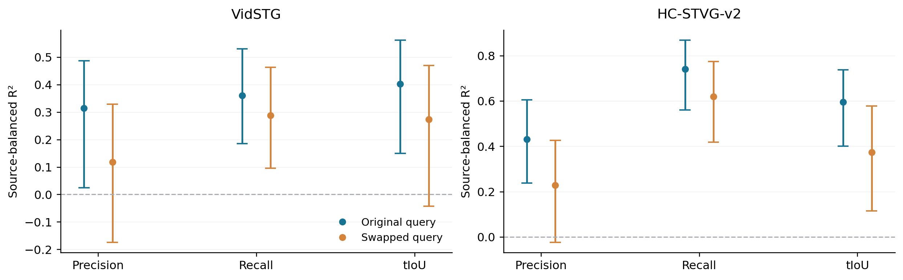
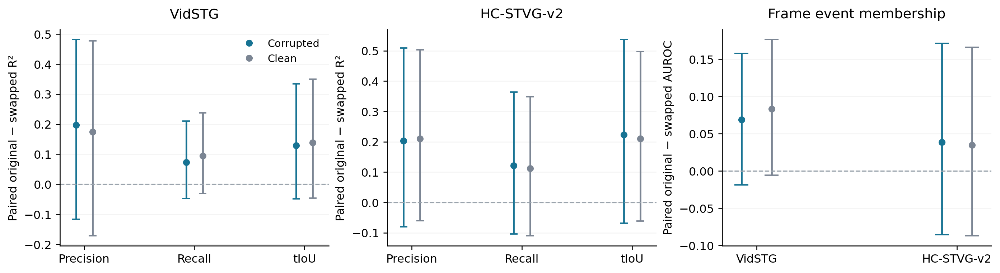
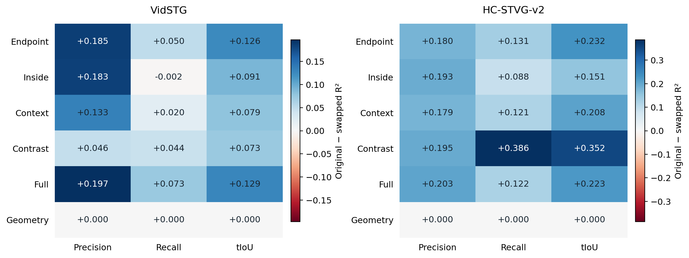

# TA-STVG Query-swap Specificity Review

This completed audit tests the fixed source-trained readouts under a same-video query intervention. It does not train a new quality model, select a new output, or change A. The predecessor is [the frozen temporal information atlas](TA_TEMPORAL_INFORMATION_ATLAS_REVIEW.md).

## Primary result: corrupted expert arrivals

| Dataset | Endpoint | Original query | Swapped query | Original − swapped | Paired 95% CI |
|---|---|---:|---:|---:|---|
| VidSTG | Event AUROC | 0.7320 | 0.6632 | 0.0688 | [-0.0187, 0.1581] |
| VidSTG | Full precision R² | 0.3142 | 0.1175 | 0.1967 | [-0.1165, 0.4825] |
| VidSTG | Full recall R² | 0.3606 | 0.2877 | 0.0729 | [-0.0472, 0.2107] |
| VidSTG | Full tIoU R² | 0.4028 | 0.2740 | 0.1288 | [-0.0490, 0.3342] |
| HC-STVG-v2 | Event AUROC | 0.8582 | 0.8195 | 0.0387 | [-0.0856, 0.1715] |
| HC-STVG-v2 | Full precision R² | 0.4310 | 0.2279 | 0.2032 | [-0.0807, 0.5088] |
| HC-STVG-v2 | Full recall R² | 0.7406 | 0.6187 | 0.1218 | [-0.1041, 0.3631] |
| HC-STVG-v2 | Full tIoU R² | 0.5960 | 0.3731 | 0.2228 | [-0.0689, 0.5378] |

The differences are in raw R²/AUROC units, **not vIoU percentage-point gains**. A positive gap with an interval above zero supports dependence of this frozen readout on the original query under this donor mapping. It does not prove exclusively semantic coding. Intervals that cross zero do not establish equivalence or absence of query-conditioned information.

**Measured primary outcome:** all eight corrupted-primary paired intervals cross zero. The Full precision/recall/tIoU point estimates decline for both datasets, but this panel does not establish a stable Full query-specificity gap. The existing quality information also does not disappear under swapped queries. These two statements must be retained together.

## Prespecified block supplement: a narrower positive finding

HC2 Contrast has lower absolute predictability than Full, but stronger query dependence under this intervention. Its three corrupted-panel paired intervals are above zero. These are supplementary, correlated endpoints with unadjusted pointwise intervals, not three independent replications or a new selected readout.

| HC2 Contrast endpoint | Original R² | Swap R² | Paired gap | 95% CI |
|---|---:|---:|---:|---|
| precision | 0.2447 | 0.0501 | 0.1945 | [0.0438, 0.3501] |
| recall | 0.3832 | -0.0033 | 0.3865 | [0.1387, 0.6726] |
| tiou | 0.3262 | -0.0256 | 0.3518 | [0.1308, 0.5818] |

The HC2 confirmation Contrast tIoU gap is 0.3662 [0.0499, 0.8139] (seven sources); confirmation precision/recall gaps still cross zero. Clean Contrast recall/tIoU gaps are also positive. Vid’s real-label candidate block gaps all remain uncertain. The distinction is **absolute accessible quality versus query dependence**. It does not license a Contrast-based selector, a nonlinear quality model or a claim that all precise event semantics are established.

## What was held fixed

288 existing expert cells: 240 corruption and 48 clean. VidSTG has 144 cells / 24 independent sources (16 search, 8 confirm); HC2 has 144 / 21 (14, 7). Each original panel contained 32 search and 16 confirm sources, but only the existing sparse expert latent cells are evaluated. The two orders and source-dependent sparse schedule are retained. All data have historical development exposure; confirmation here means the predecessor panel, not a fresh test.

For each recipient video, a fixed caption from a different source/video in the same 48-source dataset pool replaces the query. SHA source sorting and the first globally valid cyclic offset define a one-to-one mapping before inference. Normalized captions differ; no GT or score chooses or filters donors. The donor’s existing subject parse is supplied through the original TA-STVG query interface. Thus this intervenes on the full query interface (caption and subject), not a token-only patch. Different provenance does not certify that a caption is false on the recipient video. No target-label hard-negative filtering is used.

Pixels, frame grid, both offsets, official same-domain checkpoints, pre-update A states, and Old8⊂Expanded32 endpoint indices remain fixed. Candidate features for the swapped query are pooled over the **original** 32 intervals. Neither the swapped query’s native interval nor a changed candidate pool enters the metric. A’s spatial predictions and persistent parameter trajectory are not rerun, adapted or promoted.

All 136 atlas models and their source-fitted normalization/alpha remain byte-identical. The prespecified focused set evaluates 40 models per dataset plus Null controls: Hidden/position event and six candidate views × precision/recall/tIoU × real/shuffled-fit labels. No source training GT is reread and there is no refitting, MLP, layerwise capture or expert call.

## Clean and confirmation controls

| Dataset / panel | Endpoint | Original | Swap | Paired gap | 95% CI |
|---|---|---:|---:|---:|---|
| VidSTG / clean | Event AUROC | 0.7557 | 0.6723 | 0.0834 | [-0.0058, 0.1769] |
| VidSTG / clean | Full precision R² | 0.3128 | 0.1383 | 0.1745 | [-0.1715, 0.4774] |
| VidSTG / clean | Full recall R² | 0.3901 | 0.2952 | 0.0949 | [-0.0306, 0.2373] |
| VidSTG / clean | Full tIoU R² | 0.4237 | 0.2856 | 0.1381 | [-0.0464, 0.3498] |
| VidSTG / corrupt confirm | Event AUROC | 0.7463 | 0.8141 | -0.0678 | [-0.2084, 0.0655] |
| VidSTG / corrupt confirm | Full precision R² | 0.2735 | 0.2848 | -0.0114 | [-1.2865, 0.6905] |
| VidSTG / corrupt confirm | Full recall R² | 0.6042 | 0.4572 | 0.1470 | [-0.1055, 0.4463] |
| VidSTG / corrupt confirm | Full tIoU R² | 0.4471 | 0.4914 | -0.0442 | [-0.5519, 0.1641] |
| HC-STVG-v2 / clean | Event AUROC | 0.8711 | 0.8364 | 0.0347 | [-0.0871, 0.1663] |
| HC-STVG-v2 / clean | Full precision R² | 0.4500 | 0.2404 | 0.2096 | [-0.0606, 0.5024] |
| HC-STVG-v2 / clean | Full recall R² | 0.7588 | 0.6473 | 0.1115 | [-0.1102, 0.3485] |
| HC-STVG-v2 / clean | Full tIoU R² | 0.6104 | 0.4001 | 0.2103 | [-0.0620, 0.4972] |
| HC-STVG-v2 / corrupt confirm | Event AUROC | 0.8810 | 0.7966 | 0.0844 | [-0.0981, 0.3747] |
| HC-STVG-v2 / corrupt confirm | Full precision R² | 0.4445 | 0.1412 | 0.3033 | [-0.1297, 0.9342] |
| HC-STVG-v2 / corrupt confirm | Full recall R² | 0.8008 | 0.5713 | 0.2295 | [-0.1674, 0.8393] |
| HC-STVG-v2 / corrupt confirm | Full tIoU R² | 0.6655 | 0.3120 | 0.3535 | [-0.0791, 0.9334] |

The full anonymous ROWS and SUMMARY include both fixed orders, search/confirm, all latent blocks, geometry/position, shuffled-fit and Null controls, R²/MSE/MAE, event AP/logloss, and within-cell R². Geometry, position and Null inputs are identical for the two queries, and their paired changes are exactly zero. They are invariance controls, not evidence that all latent signal is a shortcut.

## Validation and resources

Four no-GT clean smokes recomputed the original query with the full encoder and reproduced the cached temporal hidden, pooled candidate features, A boxes and interval bitwise. The observed hidden exactly reproduced the native start/end head. After root acceptance, the swapped-query encoder was recomputed on all fixed inputs; an encoder cache was reused only across identical recipient/query/pixels/frame-grid inputs. Each arrival replay used its original A pre-state.

All 288/288 target cells changed their hidden under query swap. This verifies that the intervention reaches the representation; hidden change by itself does not establish localization-quality dependence.

Both datasets’ hidden/features and true/swap probe outputs were sealed before joining the original query’s already-exposed cached GT span. There is no raw annotation, donor-GT or new source-label read. The genuine original-query readouts and all focused per-cell metrics reproduce the preceding atlas bitwise.

Root readback checked 34,616,088 scalars/features plus all input/state/probe bindings (maximum numerical error 3.33e-15). The independent anonymous audit checked 356,076 items and recomputed all source aggregations and 10,000-draw paired intervals. Five synthetic CPU tests pass.

| Stage | Worker wall seconds | New encoder inputs | Backbone offset forwards |
|---|---:|---:|---:|
| VidSTG smoke | 13.54 | 4 | 8 |
| VidSTG swap capture | 182.53 | 144 | 288 |
| HC-STVG-v2 smoke | 12.28 | 4 | 8 |
| HC-STVG-v2 swap capture | 314.94 | 126 | 252 |

CPU frozen readout: 2.87s; metric/interval generation: 42.46s. Total 278 encoder inputs and 556 two-offset backbone forwards, including eight true/swap smoke inputs; 288 production swap arrival replays. Zero new experts, training, backward calls, candidates or parameter updates. Worker wall time includes loading, decoding, hashing and I/O; it is not pure GPU kernel time.

## Interpretation and decision

This audit isolates readout dependence on a fixed wrong-source query while preserving labels/support/state. Performance can be retained by video dynamics, position, shared caption concepts and dataset priors; it can fall because of semantic dependence or off-distribution caption/subject effects. These alternatives are not fully separated by one donor per video. Source bootstrap is conditional on the fixed donor mapping.

**Correction to the incoming review:** within-cell R² measures absolute prediction accuracy and can be inflated negatively by low within-cell label variance. It does not directly measure candidate ranking. Neither pooled R² nor a true−swap gap proves safe top-1 choice, a deployable quality head, a realized tIoU/vIoU gain, or that a nonlinear model must succeed/fail. No probe is chosen on this result.

A and production CURRENT remain unchanged. This round ends with the audit and publication. No structured P/R quality head, layerwise/appearance-motion analysis, MLP, new TTA, external expert or paused full-query queue is automatically started.

## Figures

Reproduction: [protocol](../protocols/tastvg_query_swap_specificity_v1.md), [execution](tastvg_query_swap_specificity_v1/EXECUTION.md), [full anonymous results](../results/tastvg_query_swap_specificity/2026-10-03).
