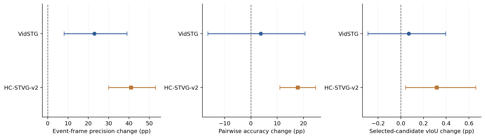

# Student-routed Sa2VA: candidate judgment improves in HC, Vid remains uncertain

The small matched frame-acquisition qualification is complete. Student support places more reference frames inside the event in both datasets. On the same nine sealed A spatial candidates, HC ranking and selected-candidate utility improve; Vid has small positive means with intervals crossing zero. Keep original spatial A and temporal critic. The HC signal justifies considering the separately proposed reference-position-only online comparison; no new online trajectory was run or automatically started.

## Fixed setting and scope

Each dataset: ten source-hash-selected sources from its original 32 historically exposed development pool, one query per source, one original A order at a scheduled expert arrival, clean plus two balanced transient 5% corruptions per source. Thirty matched cells per dataset: 20 corrupted and 10 clean; every corruption family has four cells. This is a development qualification, not fresh generalization or full evaluation.

Uniform reuses the original Sa2VA five-frame cache. Student-routed observes five distinct CDF 10/30/50/70/90% frames of the existing student temporal-candidate consensus. Model, prompt, BF16, preprocessing and frame budget are identical. Original A Rank-RKL, learning rate/temperature, Vid K1 and HC K8, 1792 parameters, original checkpoint/sampling/pixels and temporal critic remain fixed. Nine candidates come from the first sealed inner step; HC later steps are not independent observations.

New calls: 60 routed plus two uniform bitwise parity checks, 62 total, no repeated calls. All specialist outputs and GT-free rewards/selections were globally sealed before diagnostic labels were interpreted. No student forward, backward or persistent-state update occurred.

## Corrupted expert cells: primary matched results

| Dataset | Uniform event-frame precision | Routed precision | Uniform pairwise accuracy | Routed accuracy | Routed−Uniform candidate vIoU (pp, paired 95% CI) | Oracle regret Uniform→Routed (pp) |
|---|---:|---:|---:|---:|---:|---:|
| VidSTG | 42.00% | 65.00% | 77.34% | 81.08% | +0.0697 [-0.2894, +0.3949] | 0.3017 → 0.2319 |
| HC-STVG-v2 | 20.00% | 61.00% | 63.89% | 81.67% | +0.3155 [+0.0406, +0.6594] | 0.4312 → 0.1156 |

Primary vIoU evaluates every candidate at the SAME original A native interval, isolating spatial judgment. Candidate-own interval is a prespecified secondary readout; all 540 candidate intervals actually match their arrival native interval, so these two utility readouts coincide. These numbers are the utility of direct critic selection from fixed candidates; they are not an adapted model’s gain versus Frozen.

HC paired ranking improvement: +17.7778 [+10.9722, +24.5833] pp; Vid: +3.7326 [-16.4062, +20.5729] pp. The ten sources are the bootstrap units, keeping two corruptions together; 10000 paired resamples, seed20261001. Vid ranking is defined on 16/20 corrupted cells and 8/10 sources: four cells have all nine GT utilities tied at zero. HC ranking uses all20 cells/10 sources. All36 candidate pairs enter the check; GT ties are excluded, expert ties/empty feedback earn chance .5, and decisive coverage is published. Do not count pairs or frames as independent videos.

## Evidence failures and candidate headroom

| Dataset | Empty arrivals Uniform→Routed | No event-inside valid reference Uniform→Routed | Valid observed masks Uniform→Routed | Changed candidate choices | Positive/negative utility cells |
|---|---:|---:|---:|---:|---:|
| VidSTG | 0 → 1 /20 | 4 → 5 /20 | 78 → 91 /100 | 11/20 | 6 / 3 |
| HC-STVG-v2 | 2 → 1 /20 | 6 → 2 /20 | 69 → 81 /100 | 14/20 | 13 / 1 |

HC reduces arrivals without event-inside valid evidence from6 to2, including a reduction among nonempty feedback from4/18 to1/19. Vid remains mixed: no event-inside valid evidence4→5 and one new empty arrival. More event hits do not guarantee a correct object mask or improved candidate judgment.

All actual routed inputs have five distinct frames; raw quantile duplicates were zero in all60 cells. The deterministic fill rule was locked and analytically tested before inference. Actual event endpoints preserve the previous half-open convention; HC differences from inclusive final GT-box support are recorded in ROOT_READBACK rather than changing the old metric.

At vIoU>.3 the candidate set contains a correct candidate in only3/20 Vid cells and8/20 HC cells; both strategies select a correct candidate in every such cell, with zero native-correct destruction. At>.5 support is3/20 Vid and2/20 HC. The measured benefit is continuous utility/ranking, not a new threshold-correction gain. Current probe support remains narrow; its oracle ceiling and residual regret are published.

## Positive and negative examples

VidSTG: largest positive is anonymous source0/motion_blur_5/order2, candidate3→6, ΔvIoU+1.8642pp. Largest negative is source1/frame_freeze_5/order2, candidate7→8, ΔvIoU-1.6549pp. Full rows, pair differences and CASES retain both directions.

HC-STVG-v2: largest positive is anonymous source1/occlusion_5/order1, candidate1→3, ΔvIoU+1.7834pp. Largest negative is source6/occlusion_5/order2, candidate0→4, ΔvIoU-0.3986pp. Full rows, pair differences and CASES retain both directions.

## Clean and unchanged temporal-readout control

Clean candidate-utility difference: Vid +0.0134 [-0.4214, +0.3176]pp; HC +0.2326 [+0.0249, +0.5954]pp. HC clean pairwise gain is+12.5000 [+5.8333, +20.0000]pp. Thus the mechanism is not established as corruption-specific.

After inspecting the primary results, a clearly labeled supplementary CPU readout evaluates exactly the same candidates at the unchanged original A final temporal-critic interval. It changes no observations, rewards or decisions and does not replace the predeclared primary endpoint. See FINAL_INTERVAL_CONTROL.json for all values and denominators. This is a sensitivity check, not a separately pre-registered test.

VidSTG at the original A final interval: routed−uniform +0.0672pp [-0.2799, +0.3934].
HC-STVG-v2 at the original A final interval: routed−uniform +0.3893pp [+0.0450, +0.8211].

## Resources, verification and engineering record

Finite specialist worker wall: 127.4362s including IO/loading and the saved engineering attempt; peak allocated VRAM 9.405GiB. This is not pure GPU-kernel time or end-to-end online-method throughput. Specialist calls62, student forward0, backward0. Independent root checks:60 sealed A states,60 routers,300 literal CDF quantiles,4320 dense metric scalar comparisons,1026 reward scalars and120 selections; maximum dense error 7.772e-16. Public audit independently verifies all pair signs, candidate selection/utility/regret, macro and paired bootstrap.

At61/62 the final HC freeze donor input failed the old pixel-hash check. The isolated runner had bound the main HC decode correctly but left the global donor decoder using Vid vsync0. Restore the ORIGINAL HC global decode binding; all four selected HC freeze inputs then exactly match old pixels. Original failed code/lock/log/receipts are preserved with additive revision001. Reuse the matching61 outputs and complete only the remaining call; no GT was read during repair, no sample or method changed, no extra specialist call was used. Two uniform controls reproduce input digest, masks, boxes and prediction text bitwise.

## Decision

HC passes this limited candidate-judgment qualification: improvement extends beyond event coverage to ranking, selected utility and oracle regret on the frozen development set. Vid evidence is inconclusive: coverage improves, but judgement/utility intervals cross zero and evidence failures do not decrease. This does not demonstrate future nonexpert transfer, online vIoU improvement, or a universal advantage of student routing. Retain spatial A and the original temporal critic. No E/SE/QC, geometry weighting, temporal parameter changes, memory, new tuning, full H-full or historical full-query queue is started. A reference-position-only online comparison is the next conditional research step, not a completed result or automatic production promotion.

