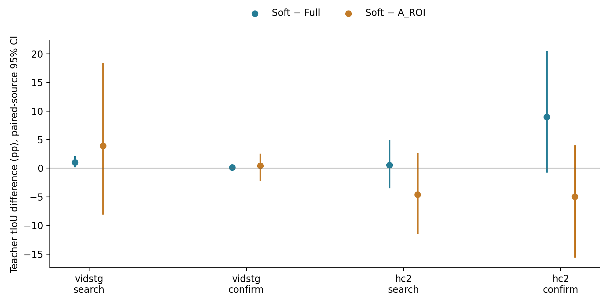
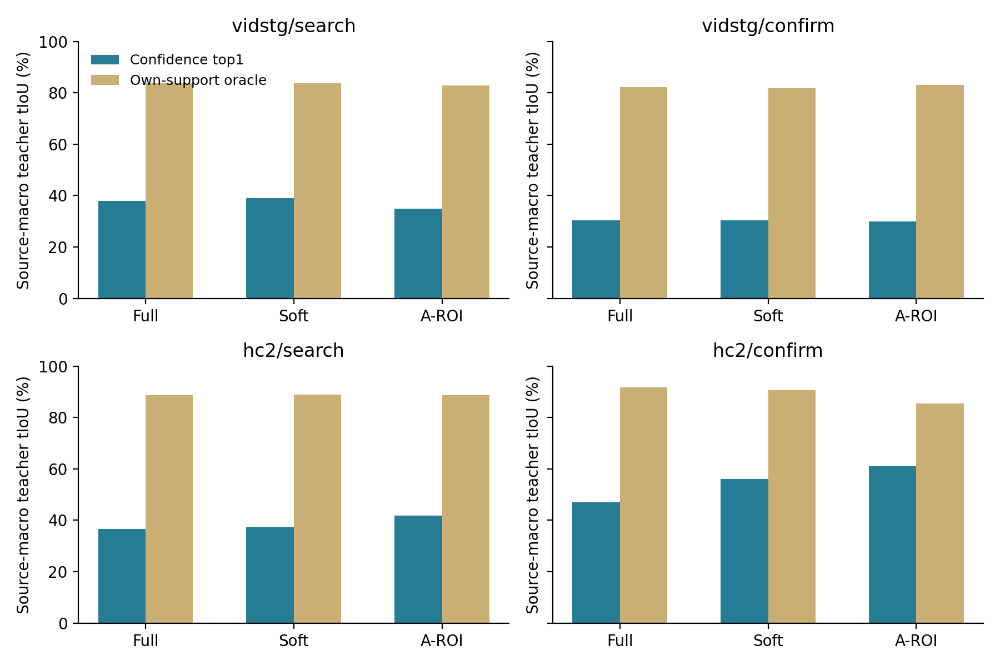
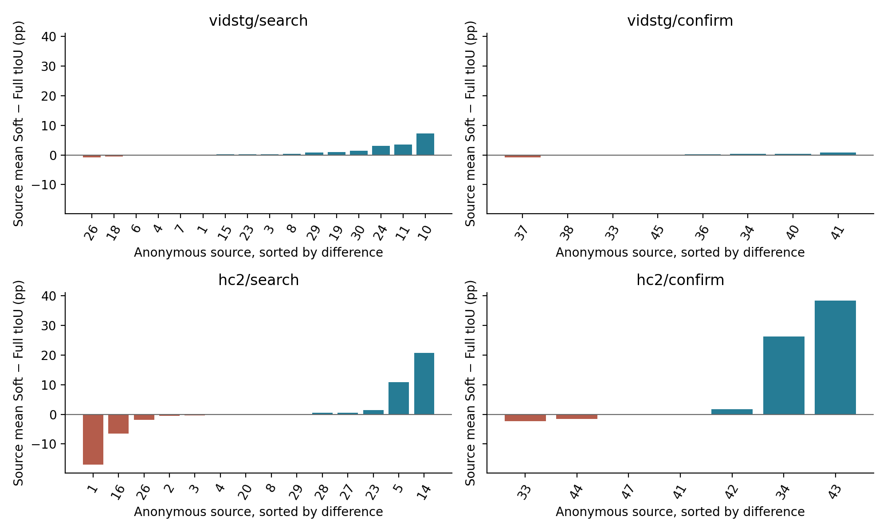

# Spatially conditioned temporal expert P1 review

**Decision: NO_GO_CURRENT_SOFT_PRIOR.** This complete, independently audited experiment evaluates frozen temporal-teacher confidence-top1 intervals. It does not measure final STVG vIoU or demonstrate adaptation gain.

The primary contrast is Soft minus cached Full; Soft minus cached A-ROI is secondary. The teacher-only GO rule requires the paired-source lower 95% confidence bound above zero in all four corruption panels. A resource NO-GO concerns this fixed alpha=.5 coupling; it is not a universal impossibility result for WHERE-to-WHEN guidance. Neither result automatically starts DTA or promotes a production method.

The unchanged design has 32 search and 16 within-batch source-disjoint confirmation sources per dataset, one query per source, two original schedules, clean plus five existing 5% corruptions and a 25% expert schedule. Only 288 scheduled expert cells are scored: 240 corrupt and 48 clean. Independent expert sources are VidSTG 16/8 and HC-STVG-v2 14/7 for search/confirmation. All sources have historical exposure; within-batch disjoint confirmation is not a fresh held-out test. Nonexpert arrivals are not scored.

Soft retains the complete original corrupted frame and all 577 PE tokens (CLS plus 24×24 patches). A fixed fractional A-box mask follows the actual stock 336×336 squash resize. The learned attention pool receives an additive log prior: CLS weight 1, patch weight .5+.5×mask. Background weights remain positive; no pixels or tokens are deleted. Empty, invalid or clipped-empty masks use the exact original global pool. The original learned probe, attention, residual MLP and visual projection remain frozen and unchanged, without extra L2 normalization. The spatial A trajectory is the sealed pre-current-update trajectory, not new TA-STVG inference. Mask coverage and fallback statistics average unique sampled observations; relative feature L2, cosine and norms average the full 2 Hz feature grid after repeated nearest observations are restored. Their denominators differ and are not substituted for one another.

Full reuses the exact old raw UniversalVTG cache; A-ROI reuses the completed P0 crop cache. Soft uses the same frozen PE-Core-L14-336 and UniversalVTG, original query, complete original nearest-observation 2 Hz grid, duration and first raw confidence argmax. Only the feature-pooling prior changes for the new arm. No gradient, parameter update, new spatial expert, temporal GT input or temporal crop is used to construct its predictions.

| Dataset / corrupt panel | Full tIoU | Soft tIoU | Cached A-ROI tIoU | Soft − Full (pp, 95% CI) | Soft − A-ROI (pp, 95% CI) |
|---|---:|---:|---:|---:|---:|
| vidstg/search | 37.8590% | 38.9120% | 34.9785% | +1.0530 [+0.2170, +2.1491] | +3.9335 [-8.1156, +18.4704] |
| vidstg/confirm | 30.2635% | 30.4058% | 29.9453% | +0.1423 [-0.1850, +0.4286] | +0.4605 [-2.2308, +2.5469] |
| hc2/search | 36.6984% | 37.2682% | 41.8900% | +0.5698 [-3.4715, +4.9583] | -4.6218 [-11.4767, +2.6615] |
| hc2/confirm | 47.0798% | 56.0412% | 61.0068% | +8.9615 [-0.7669, +20.4926] | -4.9655 [-15.5967, +4.0707] |

Results are source macro averages. The 10,000-draw paired-source bootstrap uses seed 20261004; all repeated corruption/order cells stay inside their source cluster. Confidence intervals are descriptive and not multiplicity corrected. They are intervals for teacher quality differences, not final STVG differences.

| Dataset / corrupt panel | Full support oracle | Soft support oracle | A-ROI support oracle | Soft − Full support (pp, 95% CI) |
|---|---:|---:|---:|---:|
| vidstg/search | 83.7481% | 83.6405% | 82.8526% | -0.1076 [-0.6407, +0.5416] |
| vidstg/confirm | 82.2738% | 81.6900% | 83.1092% | -0.5838 [-1.6578, +0.2907] |
| hc2/search | 88.6057% | 88.9072% | 88.7728% | +0.3015 [-1.2109, +1.6893] |
| hc2/confirm | 91.6568% | 90.5530% | 85.4073% | -1.1038 [-4.0610, +0.9101] |

Each oracle is the best interval in that arm's own raw proposal support, computed only after the global seal. Changed visual features can change proposal endpoints and support. An oracle decrease together with a top1 increase does not establish a reranking of one fixed hypothesis set, and a top1 increase does not identify successful target-identity filtering.

| Dataset / corrupt panel | Contrast | Gain / harm / unchanged cells | >5 pp / >20 pp harms | >.5 successes rescued / destroyed | New zero-overlap |
|---|---|---:|---:|---:|---:|
| vidstg/search | Soft − Full | 52 / 16 / 12 | 0 / 0 | 6 / 0 | 0 |
| vidstg/search | Soft − A_ROI | 37 / 38 / 5 | 18 / 9 | 11 / 4 | 7 |
| vidstg/search | A_ROI − Full | 45 / 30 / 5 | 15 / 9 | 8 / 9 | 5 |
| vidstg/confirm | Soft − Full | 22 / 6 / 12 | 0 / 0 | 0 / 0 | 0 |
| vidstg/confirm | Soft − A_ROI | 15 / 14 / 11 | 5 / 0 | 1 / 0 | 0 |
| vidstg/confirm | A_ROI − Full | 14 / 15 / 11 | 1 / 1 | 0 / 1 | 1 |
| hc2/search | Soft − Full | 40 / 30 / 10 | 9 / 4 | 6 / 2 | 0 |
| hc2/search | Soft − A_ROI | 13 / 57 / 10 | 38 / 7 | 4 / 3 | 0 |
| hc2/search | A_ROI − Full | 53 / 17 / 10 | 7 / 2 | 5 / 2 | 0 |
| hc2/confirm | Soft − Full | 25 / 8 / 7 | 1 / 0 | 5 / 0 | 0 |
| hc2/confirm | Soft − A_ROI | 20 / 20 / 0 | 13 / 6 | 2 / 2 | 7 |
| hc2/confirm | A_ROI − Full | 21 / 19 / 0 | 10 / 2 | 7 / 2 | 0 |

Tail counts are cell counts, while intervals and mean effects use sources as the statistical unit. Teacher success is strictly tIoU>.5; it is not STVG vIoU success.

| Dataset / corrupt panel | Positive / negative / zero sources, Soft − Full | Largest two share of gross positive gain | Order 1 / order 2 Soft − Full (pp) |
|---|---:|---:|---:|
| vidstg/search | 11 / 3 / 2 | 58.73% | +0.4101 / +1.6958 |
| vidstg/confirm | 6 / 1 / 1 | 63.16% | +0.3599 / -0.0753 |
| hc2/search | 7 / 5 / 2 | 92.31% | +0.2439 / -1.3505 |
| hc2/confirm | 4 / 2 / 1 | 97.09% | +6.4470 / +15.8115 |

Source concentration uses the sum of positive source-mean differences, not net gain. Leave-one-source-out descriptive means, secondary-contrast influence and all original source values are retained in SUMMARY.json; no source is removed from the decision. The two schedules can expose different expert sources, so aggregate schedule differences do not isolate a causal order effect.

Clean controls, with the same paired-source intervals:

- vidstg/search: Soft−Full +0.6792 [+0.1941, +1.2853] pp; Soft−A-ROI +0.9967 [-13.8055, +18.0513] pp.
- vidstg/confirm: Soft−Full +0.0892 [-0.2227, +0.3512] pp; Soft−A-ROI -0.2236 [-2.8999, +1.8670] pp.
- hc2/search: Soft−Full -1.8426 [-9.3712, +3.6649] pp; Soft−A-ROI -2.8844 [-9.9200, +4.6852] pp.
- hc2/confirm: Soft−Full +2.3319 [-0.6183, +7.3527] pp; Soft−A-ROI -12.5088 [-37.6433, +5.4572] pp.

Representative positive and negative cells below are chosen deterministically after scoring from all corrupt cells by difference, with cell-key tie breaks. They are descriptive examples, not extra validation or online selection rules.

| Panel | Contrast / example | Anonymous source | Condition / order | Baseline → candidate teacher tIoU |
|---|---|---:|---|---:|
| vidstg/search | Soft−Full / positive | 10 | occlusion_5 / order2 | 42.6771% → 58.5428% |
| vidstg/search | Soft−Full / negative | 18 | exposure_5 / order1 | 10.1868% → 5.7507% |
| vidstg/search | Soft−A_ROI / positive | 26 | frame_drop_5 / order1 | 8.3491% → 90.2874% |
| vidstg/search | Soft−A_ROI / negative | 18 | exposure_5 / order1 | 53.3615% → 5.7507% |
| vidstg/confirm | Soft−Full / positive | 36 | frame_drop_5 / order1 | 0.6609% → 2.0158% |
| vidstg/confirm | Soft−Full / negative | 37 | frame_drop_5 / order2 | 46.8520% → 45.9955% |
| vidstg/confirm | Soft−A_ROI / positive | 41 | frame_freeze_5 / order1 | 43.2414% → 75.0810% |
| vidstg/confirm | Soft−A_ROI / negative | 40 | frame_freeze_5 / order2 | 78.9349% → 71.0521% |
| hc2/search | Soft−Full / positive | 14 | frame_drop_5 / order1 | 41.7171% → 81.2238% |
| hc2/search | Soft−Full / negative | 1 | occlusion_5 / order1 | 72.8247% → 29.3621% |
| hc2/search | Soft−A_ROI / positive | 14 | occlusion_5 / order1 | 21.4200% → 59.2310% |
| hc2/search | Soft−A_ROI / negative | 8 | frame_drop_5 / order2 | 45.1189% → 3.9468% |
| hc2/confirm | Soft−Full / positive | 43 | motion_blur_5 / order2 | 0.0000% → 66.2136% |
| hc2/confirm | Soft−Full / negative | 33 | frame_drop_5 / order1 | 78.8249% → 67.6067% |
| hc2/confirm | Soft−A_ROI / positive | 34 | occlusion_5 / order1 | 17.3373% → 77.9453% |
| hc2/confirm | Soft−A_ROI / negative | 43 | occlusion_5 / order2 | 85.6229% → 0.0000% |

New scientific Soft requests: 288; Soft smoke format calls: 2; total new Soft calls including smoke: 290. Cached Full unique inputs: 235; cached A-ROI unique inputs: 287, with zero new A-ROI requests. Full reencoding smoke controls: 2. Total GPU worker wall including smoke: 266.01 s. This includes initialization, CPU decoding, masking and I/O and is not pure kernel latency. The shared full-frame PE token encoding is frozen; zero TA-STVG backbone calls, new spatial expert calls, backwards, parameter updates or DTA runs occur.

The root CPU audit independently checks all private input pins, old A-state/pixel bindings, original sampling/duration, first confidence argmax, all stock-squash fractional masks, mask byte hashes, feature-input keys, cache receipts and continuous physical teacher tIoU. It does not decode media, run a model or score GT boxes. The public audit independently recomputes arithmetic, source macro and paired bootstrap, source concentration, orders, tails, CSV and seal chronology. The two predetermined real smoke cells verify original-pool parity against stock PE, alpha=0 and full-mask controls and the historical Full teacher within its saved FP16 tolerance. Parity protects the interface, not the correctness of the chosen temporal interval.

The original CVPR 2023 [Collaborative Static and Dynamic Vision-Language Streams](https://openaccess.thecvf.com/content/CVPR2023/html/Lin_Collaborative_Static_and_Dynamic_Vision-Language_Streams_for_Spatio-Temporal_Video_Grounding_CVPR_2023_paper.html) supplies a mechanism precedent: learned static attention modulates dynamic spatial features with a residual and LayerNorm (Eq. 2). Its HC-STVG-v2 validation ablation reports m_tIoU 56.1→57.4 for static-to-dynamic-only collaboration after supervised joint spatial/temporal training (Table 3). P1 instead conditions a frozen image encoder's attention pool; it is neither a CoSD implementation nor a transferred performance guarantee. The [author paper PDF](https://zanglam.github.io/files/Collaborative_Static_and_Dynamic_Vision-Language_Streams.pdf) was checked; the [author homepage](https://zanglam.github.io/) still lists code as coming soon, so no official-code reproduction is claimed.

P0's GT-ROI used event-only spatial annotation with nearest-box extension outside the event; it was not perfect full-video target tracking. Its comparison against A-ROI cannot establish that a correct crop is insufficient. P1 changes a soft pool prior while preserving full-frame context, but it still cannot uniquely isolate identity, action/context, feature scale or frozen-encoder calibration mechanisms from aggregate teacher scores. Historical data exposure, small independent-source panels and unresolved mechanism attribution limit inference.

All original sources, orders, clean controls, severe harms, support-oracle readouts and examples are preserved. Predictions were globally sealed before temporal GT scoring. Code, protocol, hashes and anonymous results can be public; media, captions, A boxes, temporal GT endpoints, physical raw proposals, private features and weights remain private.
