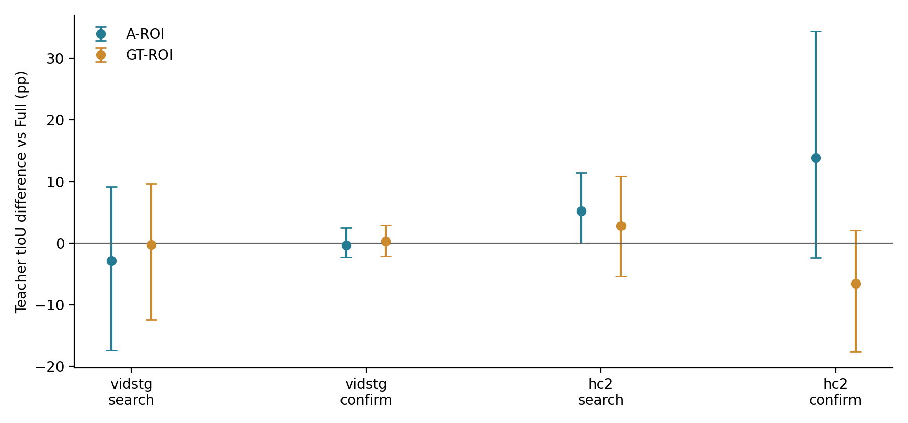

# Spatially guided temporal expert P0 review

The matched three-arm expert-input audit is complete and independently audited. This evaluates confidence-top1 teacher intervals; it makes no STVG adaptation or deployment claim.

Each dataset uses the fixed 32 search +16 within-batch source-disjoint confirmation design, one query/source, two orders, clean plus five existing 5% corruptions, 25% expert schedule. Only 288 scheduled expert cells are evaluated (240 corrupt / 48 clean). Independent expert sources are Vid 16/8 and HC 14/7; all have historical exposure. A is the sealed pre-current-update spatial trajectory, not a fresh TA-STVG inference. Full is the exact old R2 raw teacher.

| Dataset / panel | Full tIoU | A-ROI tIoU | GT-ROI tIoU | A-ROI − Full (pp,95%CI) | GT-ROI − Full (pp,95%CI) |
|---|---:|---:|---:|---:|---:|
| vidstg/search | 37.8590% | 34.9785% | 37.5821% | -2.8805 [-17.4552, +9.1603] | -0.2769 [-12.4914, +9.6467] |
| vidstg/confirm | 30.2635% | 29.9453% | 30.5936% | -0.3182 [-2.3282, +2.5029] | +0.3301 [-2.1778, +2.9368] |
| hc2/search | 36.6984% | 41.8900% | 39.5615% | +5.1916 [-0.0068, +11.4681] | +2.8632 [-5.4325, +10.8326] |
| hc2/confirm | 47.0798% | 61.0068% | 40.5314% | +13.9270 [-2.3830, +34.4552] | -6.5483 [-17.6525, +2.1037] |

Source-macro paired 10,000-source bootstrap, seed 20261004. Repeated corruption/order cells are grouped by source; the intervals are descriptive and not multiplicity corrected. Neither panel names nor source-disjoint-in-this-batch status imply a fresh test.

**GT-ROI is a spatial-box-extension diagnostic.** Spatial labels are absent outside the event for Vid 138/144 and HC 144/144 scheduled cells. The fixed crop pipeline interpolates coordinates and extends nearest boxes outside support, preserving every original video frame. There is no temporal event-window crop or event-based black screen. This prevents that direct timing shortcut but cannot provide perfect target tracking outside the annotated event. GT spatial annotation availability and coordinates are privileged; do not claim that this arm is deployable or a complete spatial oracle.

The square context ratio 1.5 was fixed before predictions. Border pixels are edge-replicated; invalid A boxes use full-frame fallback. Crops alter identity focus, apparent scale/motion and available action/context together. A positive crop result would not uniquely establish identity confusion as the cause; a negative result would not disprove all spatial-to-temporal evidence mechanisms.

| Dataset / panel | Arm | >.5 teacher success | zero-overlap | >5pp harms | >20pp harms | rescued / destroyed successes |
|---|---|---:|---:|---:|---:|---:|
| vidstg/search | A_ROI | 31.25% | 12.50% | 15 | 9 | 8 / 9 |
| vidstg/search | GT_ROI | 27.50% | 12.50% | 10 | 5 | 1 / 5 |
| vidstg/confirm | A_ROI | 22.50% | 25.00% | 1 | 1 | 0 / 1 |
| vidstg/confirm | GT_ROI | 25.00% | 12.50% | 1 | 0 | 0 / 0 |
| hc2/search | A_ROI | 37.14% | 14.29% | 7 | 2 | 5 / 2 |
| hc2/search | GT_ROI | 35.71% | 14.29% | 14 | 10 | 4 / 2 |
| hc2/confirm | A_ROI | 68.57% | 0.00% | 10 | 2 | 7 / 2 |
| hc2/confirm | GT_ROI | 34.29% | 14.29% | 13 | 11 | 0 / 11 |

Clean and order controls are fully published in SUMMARY.json. Clean teacher differences:

- vidstg/search: A-ROI−Full -0.3175 [-17.4323, +14.4072]pp; GT-ROI−Full +0.8663 [-11.4121, +12.0780]pp.
- vidstg/confirm: A-ROI−Full +0.3128 [-1.8315, +3.1003]pp; GT-ROI−Full +0.2318 [-2.3824, +2.9486]pp.
- hc2/search: A-ROI−Full +1.0417 [-7.5055, +8.9622]pp; GT-ROI−Full +1.0405 [-11.9458, +11.1183]pp.
- hc2/confirm: A-ROI−Full +14.8406 [-3.8063, +39.4014]pp; GT-ROI−Full -7.4773 [-19.5756, +1.9619]pp.

Decision: **NO_GO_CURRENT_CROP**. The strict rule requires positive paired lower 95% CI for A-ROI−Full in all four corrupt panels. No crop-ratio tuning, DTA, new expert, source resampling, parameter update or method promotion is performed. Retain A and the old Full temporal expert as the control. Positive and negative examples, teacher-support oracle values and severe failure counts are preserved.

New expert-input calls: A-ROI 287, GT-ROI 230; original Full 235 unique cached inputs reused, plus 2 Full reencoding smoke controls. GPU worker wall: A-ROI 316.08s, GT-ROI 282.14s. Wall includes model loading/CPU decoding/cropping/IO and is not pure GPU kernel time. Zero backbone calls, spatial expert calls, backwards or parameter updates.

Root audit reconstructs all A box conversions, GT spatial interpolations/extensions, crop-window rules, state/pixel/cache hashes, same time grids, raw confidence choices and continuous physical teacher metrics. Portable public audit recomputes scalar differences, source bootstrap, orders, counts, CSV and seal chronology. Two predetermined smoke samples reproduce original Full proposals/top1 within the saved FP16 tolerance. This confirms the interface, not teacher correctness.

The CVPR2023 [Collaborative Static and Dynamic Vision-Language Streams](https://openaccess.thecvf.com/content/CVPR2023/html/Lin_Collaborative_Static_and_Dynamic_Vision-Language_Streams_for_Spatio-Temporal_Video_Grounding_CVPR_2023_paper.html) uses learned spatial attention to guide a dynamic stream; that trained architecture motivates the question but is not evidence that this frozen expert crop must work. Earlier pooled ROI-cosine critics and joint8×9 oracle diagnoses are different interventions.

Implementation/protocol and anonymous results are public; original frames, GT boxes/spans, captions, physical raw proposals, model weights, cropped pixels and features remain private.

<!-- P0_POST_SCORE_CONTEXT -->

The decision is a resource/use decision about this fixed crop, **not a demonstrated impossibility of WHERE-to-WHEN guidance**. All four primary A-ROI differences have paired intervals crossing zero; the current implementation therefore lacks the agreed cross-panel evidence to become a DTA teacher. These small, historically exposed expert-source panels do not establish equivalence to Full, either.

Post-score source heterogeneity is reported below without changing any selection, threshold, crop or decision. Gross-positive concentration divides the two largest positive source-mean changes by the sum of all positive source-mean changes; it must not be described as a fraction of net gain.

| Corrupt panel | Positive / negative / zero sources | Largest two share of gross positive gain | A-ROI−Full order1 / order2 (pp) |
|---|---:|---:|---:|
| vidstg/search | 9 / 6 / 1 | 59.58% | -9.1185 / +3.3575 |
| vidstg/confirm | 2 / 5 / 1 | 100.00% | -1.8423 / +1.2060 |
| hc2/search | 8 / 4 / 2 | 53.40% | +0.6534 / +8.3907 |
| hc2/confirm | 3 / 4 / 0 | 83.12% | +5.5443 / +25.2493 |

HC confirmation contains only seven independent expert sources: three improve and four worsen. Sources 43 and 34 account for 83.12% of **gross positive source gain**. Removing the largest positive source (43) leaves a descriptive mean of +4.7349 pp. No source is removed from the primary result. This is concentration/influence evidence, not a new validation set or a fitted rule.

Orders use their original expert schedules and may expose different source populations; differences between their aggregate means do not isolate a causal order effect.

The proposal-support oracle means (Full / A-ROI / GT-ROI) are:

- vidstg/search: 83.7481% / 82.8526% / 83.1534%.
- vidstg/confirm: 82.2738% / 83.1092% / 80.7308%.
- hc2/search: 88.6057% / 88.7728% / 88.2356%.
- hc2/confirm: 91.6568% / 85.4073% / 85.5852%.

These descriptive means do not show a uniform increase of support capacity. In HC confirmation the A-ROI support mean is lower even though its top1 mean is higher. This is compatible with a change in choice within the support; it does not identify the causal reason or prove that identity filtering succeeded.

The deterministic best/worst confirmation examples are retained in CASES.json. Values below are teacher tIoU percentages, not final STVG vIoU:

| Panel / arm / example | Anonymous source | Condition / order | Full → crop teacher tIoU |
|---|---:|---|---:|
| vidstg / A_ROI / best | 40 | frame_freeze_5 / order2 | 70.6185% → 78.9349% |
| vidstg / A_ROI / worst | 41 | frame_freeze_5 / order1 | 74.4144% → 43.2414% |
| hc2 / A_ROI / best | 43 | occlusion_5 / order2 | 0.0000% → 85.6229% |
| hc2 / A_ROI / worst | 34 | occlusion_5 / order1 | 64.4683% → 17.3373% |
| hc2 / GT_ROI / best | 47 | motion_blur_5 / order1 | 0.0000% → 4.9824% |
| hc2 / GT_ROI / worst | 34 | motion_blur_5 / order1 | 67.6596% → 21.3484% |

**GT timing limitation:** the tracked-to-extended crop-motion change depends on where spatial annotations exist, which is event-dependent. Nearest-box extension prevents a direct GT event-window/black-frame cue, but indirect temporal cues may remain. This was documented in GT_ORACLE_SCOPE_NOTE.json before temporal scoring. GT-ROI is consequently not an independent spatial-only oracle. An inability of this extended-box input to improve teacher top1 cannot distinguish missing full-clip target tracking from context/scale/motion shift, or frozen-expert input mismatch.

All A boxes were valid under the fixed rule: the full-frame fallback fraction is zero. Original corrupted pixels were independently verified for every scheduled cell; 460 predetermined cropped frames were reconstructed with a separate pad/slice implementation. These checks protect the measured intervention from decode/crop errors and do not turn its uncertain effect into a mechanistic conclusion.

ROI inputs are re-encoded through the same frozen visual encoder and temporal expert, so their raw proposal support can change with the view. This is an expert-input intervention, not a new spatial plausibility scorer on a fixed temporal candidate set. Full retains the original saved proposals exactly.

Run `scripts/supplement_tastvg_spatial_guided_temporal_p0_v1.py` after the original report generator to reproduce this explicitly post-score context. The original executed scientific bindings and decision are unchanged.
