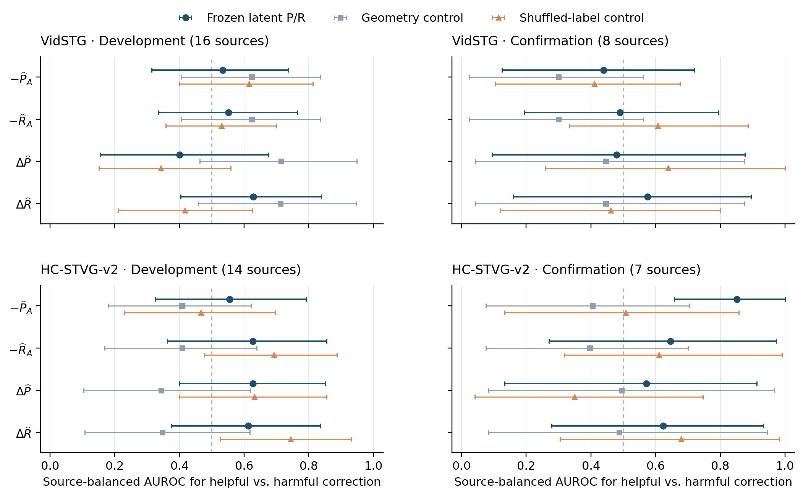
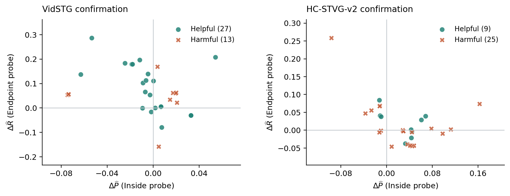

# Frozen structured P/R failure-separability audit

这轮保留了 HC 确认集的一个局部正信号：Inside probe 的 anchor precision 能区分一部分 L32 有益／有害替换。它没有在开发集和 Vid 确认集建立一致分离，且未稳定超过标签打乱对照。因此，现有四个结构化量尚不足以支持新增在线 gate；本轮没有训练或接入 structured model。

本轮只复用已冻结 atlas 候选读出，不加载 probe 权重、latent、媒体或 backbone。A8、原 L32 winner、空间 A 轨迹及专家位置均不变；没有新预测、参数更新或方法收益。下面的 AUC 是离线 good/failure 区分能力，不是安全接收率，也不是 vIoU 增量。

## 配置与数据边界

主分析预锁 Inside→precision、Endpoint→recall，四量为 P̂_A、R̂_A、ΔP̂、ΔR̂。Inside→precision／Context→recall、Full、Geometry、两组对应的训练标签打乱 probes 全部单列，未按目标结果选 block 或方向。原 source-only 标准化、alpha 和权重不变；ridge 输出不裁到 [0,1]。目标读出不使用目标 GT，但 probes 本身使用源域监督。

沿用各数据集 32 开发＋16 确认来源名单、每源一 query、双顺序、clean＋五类 5% corruption、25% expert schedule。实际有 latent 的只有 288 个专家到达（240 corrupt、48 clean）：Vid 开发／确认 16／8 个 expert source，HC 14／7，共 45 独立来源；不把 864 个无 latent 的非专家位置补入分母。TA-STVG 官方同域 checkpoint、原 Paper48 two-offset 采样、1792 空间参数、Vid K1／HC K8 均不改。全部目标面板有历史曝光，confirmation 名称不代表 fresh test。

另用已有源验证 31 Vid／16 HC 做描述性对照；这些来源已参与原 alpha／校准选择，且源 anchor 是 native0，目标 anchor 是实际 A8。不能把该对照当作新的独立验证或据此唯一归因 source→target shift。

288 个新特征行先封存，再 join 已缓存的官方 tIoU／固定 A 空间 vIoU；GT 仅作本次离线诊断。源读出已由原 atlas 封存，源候选 L score 从旧含标签的 source table 取出，不让标签参与 winner 或特征构造。完整新特征 seal 的作用是此次时序审计，不是 first-ever GT blindness；提前哈希读取 label 文件字节已披露。目标 P/R 真值由旧 GT span 与同一采样端点算术重建，没有新 scorer／decoder／专家调用。

## 预锁统计口径

Primary good/failure：真实 eligible L32 替换的 ΔtIoU >／< 1e−12；secondary 使用 ΔvIoU。No-op 和 neutral replacement 保留计数、从二分类 AUC 排除。方向先固定为 −P̂_A、−R̂_A、+ΔP̂、+ΔR̂；没有事后翻转成 max(AUC,1−AUC)。每个类别内每个 source 总权重为 1，10,000 次完整 source bootstrap（seed 20261003）；无正类／负类的重采样记 undefined。另报仅含两类的 source 内 AUC、每顺序统计及删除一个来源的影响。

这里的 LOSO 是固定读出统计的 source deletion，不重新拟合任何 probe，也不构成 out-of-fold predictive validation。原 atlas 没有可直接复用的 LOSO-trained P/R models。多 probe／多面板 CI 是未做家族校正的探索性区间；两个相同的 Inside precision 出现在不同 recall recipe 中，不算独立重复证据。

## 1. 主分析：corrupt 专家到达

| 数据集／面板 | helpful／harmful／neutral／no-op | expert sources（两类混合 sources） | −P̂_A AUC | −R̂_A AUC | ΔP̂ AUC | ΔR̂ AUC |
|---|---:|---:|---:|---:|---:|---:|
| Vid 开发 | 27/34/9/10 | 16 (5) | 0.534 [0.314, 0.737] | 0.552 [0.335, 0.764] | 0.400 [0.154, 0.674] | 0.628 [0.404, 0.839] |
| Vid 确认 | 27/13/0/0 | 8 (3) | 0.439 [0.125, 0.719] | 0.490 [0.194, 0.795] | 0.479 [0.094, 0.876] | 0.575 [0.160, 0.895] |
| HC 开发 | 35/37/5/3 | 14 (4) | 0.555 [0.325, 0.792] | 0.627 [0.362, 0.855] | 0.627 [0.400, 0.851] | 0.613 [0.374, 0.835] |
| HC 确认 | 9/25/0/6 | 7 (2) | 0.852 [0.657, 1.000] | 0.646 [0.270, 0.973] | 0.571 [0.133, 0.913] | 0.623 [0.279, 0.933] |

HC 确认 anchor precision 的有益／有害类别 source-macro 均值为 0.5316／0.5957，差值 -0.064 [-0.113, -0.019]；−P̂_A AUC 0.852 [0.657, 1.000]，删除任一来源后范围 [0.794, 0.942]。有益 9 条来自 3 源，有害 25 条来自 6 源，合计 7 源；仅 2 源同时含两类。

该局部信号相对 Geometry 的 paired AUC 增量为 0.447 [0.056, 0.875]，相对 source 内训练标签打乱对照为 0.344 [-0.167, 0.857]，后者区间跨零。Within-source AUC 虽为 1.000，但仅基于 2 个 mixed sources，bootstrap 的 975 次无 mixed-source 重采样被排除；条件区间 [1,1] 不能解释为可靠外推或无害保证。

更关键的是，该 probe 与 HC 确认真实 anchor precision 的 source-balanced 相关性仅 0.163 [-0.719, 0.686]，与 A8 tIoU 为 0.085 [-0.780, 0.645]。区分当前固定 proposal 的 help/harm，与测准 anchor 本身质量，是两个不同命题。本轮并未证实“正确 anchor-quality measurement 已成立”。

Vid 确认四项区间均跨 0.5；HC 开发四项同样未建立高于 0.5 的区间证据。ΔP̂／ΔR̂ 没有形成两个数据集、开发和确认都一致的强弱差异。不能把 HC 一块面板的正信号升级成通用 anchor-protection 根因。

## 2. Source 对照和 transfer 边界

| Source validation | eligible helpful／harmful（neutral/no-op） | −P̂_A | −R̂_A | ΔP̂ | ΔR̂ |
|---|---:|---:|---:|---:|---:|
| vidstg | 11/11 (3/6) | 0.678 [0.417, 0.889] | 0.694 [0.450, 0.908] | 0.488 [0.223, 0.750] | 0.661 [0.405, 0.892] |
| hc2 | 8/7 (0/1) | 0.929 [0.760, 1.000] | 0.607 [0.280, 0.907] | 0.893 [0.661, 1.000] | 0.268 [0.000, 0.571] |

HC 源验证的 anchor precision 和 Δprecision 分离明显，但 native→A8 anchor 迁移、已使用的验证来源、winner 分布和支持差异同时存在；源强、目标不一致不能唯一归因 representation shift。源每 source 只有一个该类 proposal，所以 source 内 AUC 全部 undefined，不能用 pooled 数字替代 within-source 证据。

## 3. P/R tradeoff 并不构成统一错误规则

| 确认面板／预锁符号象限 | helpful | harmful |
|---|---:|---:|
| vidstg up/up | 8 | 7 |
| vidstg up/down | 6 | 1 |
| vidstg down/up | 11 | 5 |
| vidstg down/down | 2 | 0 |
| hc2 up/up | 3 | 5 |
| hc2 up/down | 3 | 13 |
| hc2 down/up | 3 | 5 |
| hc2 down/down | 0 | 2 |

Vid 的“预测 precision 上升、recall 下降”象限有 6 个有益、1 个有害；HC 同象限为 3／13。两个量都预测上升也仍有 Vid 7 个、HC 5 个有害替换。方向相反本身并不定义有害；两个量都上升也不是可靠替换凭据。其余 recipe、真实 P/R、各 source／顺序／clean 统计和 secondary vIoU 均完整保存在匿名 JSON，不从报告删掉反向结果。

## 4. 匹配 good/failure：读出本身会错

| Vid 确认旧案例 | 原 A8→L32 tIoU | ΔvIoU pp | P̂_A / R̂_A | 预测 ΔP̂ / ΔR̂ | 真实 ΔP / ΔR |
|---|---:|---:|---:|---:|---:|
| source37/exposure_5/order2 | 0.8730→0.6790 | -8.6962 | 0.3769/0.5401 | -0.0740/+0.0543 | -0.2054/+0.0000 |
| source34/frame_drop_5/order1 | 0.2370→0.4215 | +11.2971 | 0.1040/0.4847 | +0.0073/-0.0794 | +0.1700/+0.1961 |

source37 的真实 anchor precision／recall 为 .9016／.9649，probes 却只读出 .3769／.5401；Δprecision 方向正确，但虚构了实际不存在的 recall 增量。source34 的有益替换真实 P/R 都提高，recall probe 却预测下降。正例和负例共同表明：结构化变量保留了可解释接口，但现有读出的内容仍可能不可靠，不能只把失败归结为 scalar 压缩。

## 5. 审计、成本及决定

8 项 CPU 测试通过；独立根审计逐条回读旧 sealed vectors、原 winner、官方缓存指标、GT P/R 算术、全部 source/class weights、sklearn AUROC、配对 bootstrap 和 source deletion，通过 208,762 个标量／状态检查，最大误差 2.01e-10。核心 extraction 2.446s、diagnosis 5.516s CPU wall；额外 source-control bootstrap 与独立审计时间另列，均非 GPU kernel 时间。新 GPU／模型／专家／probe fit／replay／backbone／候选／反向调用全部为 0。

独立 auditor 在离散 weighted-quantile 的 CDF 跳点使用了不同 FP64 加总顺序，选到相邻分位值；另有近常数 shuffled recall 的 Pearson 协方差相减使独立计算差至约 2e−10。失败原件已保留。按原 canonical-source／stable-value FP64 inverse-CDF 重建；仅 Pearson 诊断采用 1e−8 数值容差，AUC／均值／CI／标签／选择仍用 3e−12。不更改任何原测量结果、GT、候选、probes 或选择。公开 ENGINEERING_NOTE 记录这两项审计修复。

**本轮决定：保留 A；不新增 scalar gate，不训练 structured model，不启动 GPU 后续。** 可保留的具体发现是 HC 确认 anchor precision 的局部分离、它对 geometry 的配对优势以及跨面板不一致；未证明 P/R jointly sufficient、anchor quality 是根因、scalar compression 是原因，或所有 latent 层都缺信息。四项单变量／符号象限失败也不等于未测试的四维非线性组合必然失败。

本轮给出的下一次重开条件应是：提出能区分“读出错误、来源／anchor 差异、真正缺少条件信息”的新匹配证据，再决定是否值得拟合结构化方法；不能从 NO-GO 直接跳到一个新阈值、MLP 或额外 expert。

公开副本独立核验通过 195,518 项检查；该核验重算匿名标量、控制、bootstrap 与 source deletion，不读取私有 probe/latent/原始 GT。GitHub 收尾另由逐文件 remote readback 和研究档案凭据确认。
