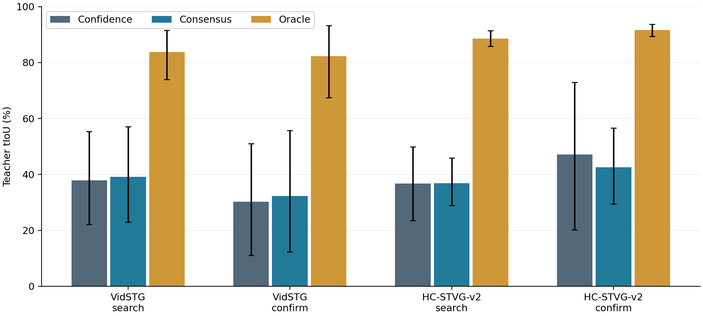
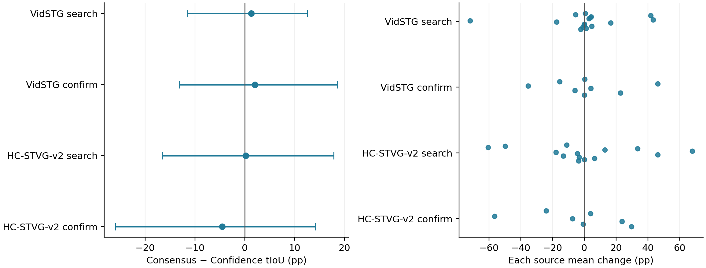
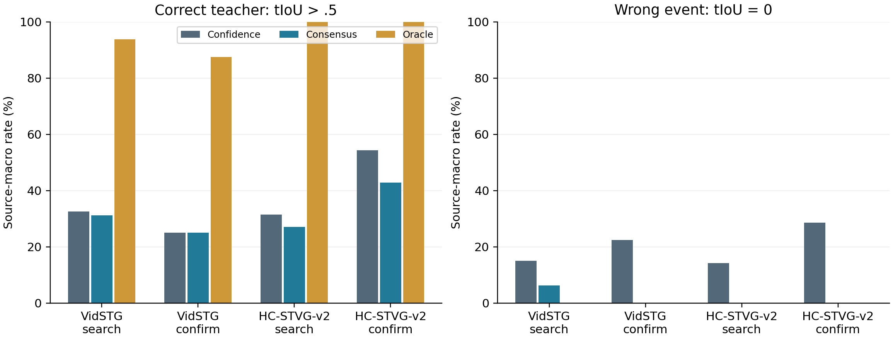

# Teacher purification: raw-proposal consensus medoid audit

**NO_GO:** the CPU teacher-quality audit is complete. The prelocked condition requires positive paired lower95% bounds in all four corrupt expert panels. No adaptation or R2c was run. Spatial A and the production registry are unchanged.

## Matched setting and scope

Reuse the original historically exposed 32 search +16 confirmation sources per dataset, one query/source, two orders, clean +five 5% corruption conditions, fixed 25% expert schedule and exact R2 raw UniversalVTG support. Only 288 scheduled expert observations (240 corrupt,48 clean) are evaluated; the 864 nonexpert cells are not scored here. Independent expert sources are Vid16/8 and HC14/7. Repeated orders/conditions do not create independent videos. No video, weight, hidden-feature or model load was used.

Confidence is the first raw confidence argmax. Consensus is the first argmax mean interval IoU with all other raw rows, excluding self and **not using confidence**. All duplicates/order/fractional endpoints are retained. Support range26–312 and235 cache files match R2. Oracle is the first GT-best proposal, diagnostic only. This is a proposal-level teacher experiment, not a STVG readout or an online adaptation result.

Confidence and Consensus were fixed for all288 cells in a GT-read-guarded subprocess and sealed before the scoring subprocess read pinned GT spans and previous scored controls. Teacher tIoU uses continuous half-open physical frame coordinates, exactly R2 support-level scoring; it is not the dense integer-truncated tube metric. Primary aggregation: within-source condition/order means then equal source macro; paired10000 source bootstrap, seed20261004.

## Corrupted expert teacher quality

| Dataset/panel | Cells/sources | Confidence tIoU (%) | Consensus tIoU (%) | Oracle tIoU (%) | Consensus−Confidence (pp, paired95% CI) |
|---|---:|---:|---:|---:|---:|
| VidSTG search | 80/16 | 37.8590 | 39.1501 | 83.7481 | +1.2911 [-11.4935, +12.5383] |
| VidSTG confirm | 40/8 | 30.2635 | 32.3030 | 82.2738 | +2.0395 [-13.0914, +18.5948] |
| HC-STVG-v2 search | 80/14 | 36.6984 | 36.9007 | 88.6057 | +0.2023 [-16.5248, +17.8344] |
| HC-STVG-v2 confirm | 40/7 | 47.0798 | 42.5402 | 91.6568 | -4.5396 [-25.9491, +14.1964] |

| Dataset/panel | Confidence P(tIoU>.5) | Consensus P(tIoU>.5) | Oracle P(tIoU>.5) | Confidence disjoint | Consensus disjoint | Oracle disjoint |
|---|---:|---:|---:|---:|---:|---:|
| VidSTG search | 32.50% | 31.25% | 93.75% | 15.00% | 6.25% | 0.00% |
| VidSTG confirm | 25.00% | 25.00% | 87.50% | 22.50% | 0.00% | 0.00% |
| HC-STVG-v2 search | 31.43% | 27.14% | 100.00% | 14.29% | 0.00% | 0.00% |
| HC-STVG-v2 confirm | 54.29% | 42.86% | 100.00% | 28.57% | 0.00% | 0.00% |

P(tIoU>.5) is strict **>**, not R2b’s raw-support >=.5 counter. Severe wrong event here means tIoU=0 (disjoint or touching). These rates use source macro; the following counts are cell counts.

| Dataset/panel | Changed choice | Improved/worsened | Correct teacher destroyed/rescued | New disjoint/rescued disjoint | Positive/negative/unchanged sources |
|---|---:|---:|---:|---:|---:|
| VidSTG search | 75/80 | 42/33 | 5/4 | 5/12 | 9/7/0 |
| VidSTG confirm | 40/40 | 25/15 | 0/0 | 0/9 | 5/3/0 |
| HC-STVG-v2 search | 75/80 | 27/48 | 13/9 | 0/10 | 5/8/1 |
| HC-STVG-v2 confirm | 40/40 | 15/25 | 5/2 | 0/10 | 3/4/0 |

## Clean, orders and source sensitivity

| Dataset/panel | Clean Consensus−Confidence (pp,95% CI) | Corrupt order1 (pp,95% CI) | Corrupt order2 (pp,95% CI) | Corrupt leave-one-source-out mean range (pp) |
|---|---:|---:|---:|---:|
| VidSTG search | +2.2655 [-11.0166, +14.5042] | +8.7250 [+1.4040, +19.1253] | -6.1428 [-28.5094, +13.5900] | [-1.5102,+6.1737] |
| VidSTG confirm | +1.8024 [-13.1256, +18.1598] | +14.3420 [-6.0376, +35.6957] | -10.2630 [-26.4952, +0.1108] | [-4.2727,+7.3819] |
| HC-STVG-v2 search | -0.9805 [-19.0623, +17.2938] | -17.4963 [-34.4028, -2.8919] | +15.9988 [-2.6308, +36.1797] | [-4.9996,+4.8821] |
| HC-STVG-v2 confirm | -1.7026 [-24.0345, +17.7189] | +0.4867 [-17.0673, +20.3186] | -7.4670 [-41.5066, +17.5479] | [-10.2247,+4.1417] |

All source values, full per-proposal peer/confidence scores and postseal GT-quality scalars are saved, so macro means, bootstrap, choices and tails can be independently recomputed. Full raw interval coordinates/GT are not exported.

## Positive and failure cases

| Dataset/panel | Case/source/condition/order | Confidence→Consensus tIoU (%) | Delta (pp) | Confidence→Consensus peer agreement | Oracle tIoU (%) |
|---|---|---:|---:|---:|---:|
| VidSTG search | worst/source11/occlusion_5/order2 | 72.00→0.00 | -72.00 | 0.0510→0.2475 | 72.00 |
| VidSTG search | best/source10/exposure_5/order2 | 36.04→87.68 | +51.64 | 0.4004→0.5908 | 92.44 |
| VidSTG confirm | worst/source37/frame_drop_5/order2 | 46.85→11.43 | -35.42 | 0.2167→0.3046 | 86.84 |
| VidSTG confirm | best/source36/motion_blur_5/order1 | 0.00→46.66 | +46.66 | 0.1838→0.2745 | 75.18 |
| HC-STVG-v2 search | worst/source3/frame_drop_5/order1 | 78.47→17.66 | -60.82 | 0.1917→0.2633 | 84.73 |
| HC-STVG-v2 search | best/source8/frame_drop_5/order2 | 3.91→72.55 | +68.65 | 0.2091→0.2718 | 94.59 |
| HC-STVG-v2 confirm | worst/source41/motion_blur_5/order2 | 91.90→35.11 | -56.80 | 0.2257→0.2740 | 93.86 |
| HC-STVG-v2 confirm | best/source47/frame_drop_5/order1 | 0.00→29.57 | +29.57 | 0.2130→0.2408 | 80.76 |

Repeated-source cases are explanations, not independent evidence. Higher peer overlap need not identify the query event: duplicates and correlated wrong intervals can agree, and broad intervals can overlap many modes. This audit can show the mismatch concretely, but does not uniquely establish which mechanism generated every bad proposal.

## Decision and limits

The confirmation panels expose a narrower change than purification: Vid disjoint-teacher rate falls22.50%→0 and HC28.57%→0, but strict tIoU>.5 stays25%→25% in Vid and falls54.29%→42.86% in HC (source macro). Avoiding a total event miss is not equivalent to identifying a precisely localized teacher. HC source41/motion-blur is a concrete failure: confidence teacher91.90%→consensus35.11% tIoU despite peer agreement0.2257→0.2740. This does not determine the unique cause of every failure.

The four-panel pass flags are `{'vidstg/search': False, 'vidstg/confirm': False, 'hc2/search': False, 'hc2/confirm': False}`. The registered continuation criterion is not met. No teacher is promoted and no DTA is launched.

Stop this confidence-free raw medoid purification route; do not continue internal aggregation/weight/LR/K/PoE variants from this result. Additional independent evidence is a potential next research direction, not executed here. The negative audit does not prove that every single-expert method is impossible.

The old T0 consensus heuristic was confidence×peer overlap applied to routing/native readout and failed. This audit isolates a different, confidence-free raw teacher selection; its conclusion is limited to that fixed rule on the exposed panel. Oracle shows support capacity, not a deployable selection or adaptation upper bound achievable without labels. The proposal errors and R2b mixture loss need not share a single cause.

## Verification and cost

One engineering attempt is preserved in `recovery/package_import_001`: the shared package initializer imported the PyTorch library, so the strict framework-exclusion assertion rejected that run after CPU scoring. No model forward, backward or expert call occurred. The repair loads the pure NumPy module directly without changing the shared package or scientific rules. Original code, seal, logs and partial results are retained; every one of the288 repaired unlabeled choices/scores/metadata is bitwise equal to the original. The canonical run and auditor import no deep-learning framework; nine contract tests pass. The public ENGINEERING_RECOVERY.json and ROOT_REVIEW.json record this distinction.

Root audit: {'pinned_inputs_and_code': 532, 'scalar_numeric_checks': 57204, 'pair_overlap_recomputed': 4072008, 'cached_controls_exact': 576}, max absolute error0; independent public scalar/statistical audit: {'selection_seal_hashes': 3, 'numeric_scalars': 15921, 'teacher_choices': 864, 'sealed_row_fields': 6336, 'tail_counts': 468}, max error2.84e-14. Confidence and Oracle exactly reproduce all prior R2 choices and quality values. Input/cache/state/production hashes match, and seal timing is checked.

Selection CPU wall 0.2317s; scoring/statistics CPU wall 0.3164s; root audit wall1.3810s. Times exclude preparation hash validation, report generation and publication, and are not GPU kernel time. Model/GPU/backbone/expert/backward/head update/spatial update/persistent temporal write counts are all zero; no torch/tensorflow/jax framework loaded.

The canonical publication and exact remote content receipts are recorded in the private FINAL_COMPLETION and RESEARCH_HISTORY after upload. Public exports exclude raw proposals/GT/media/checkpoints/hidden states/private caches.

