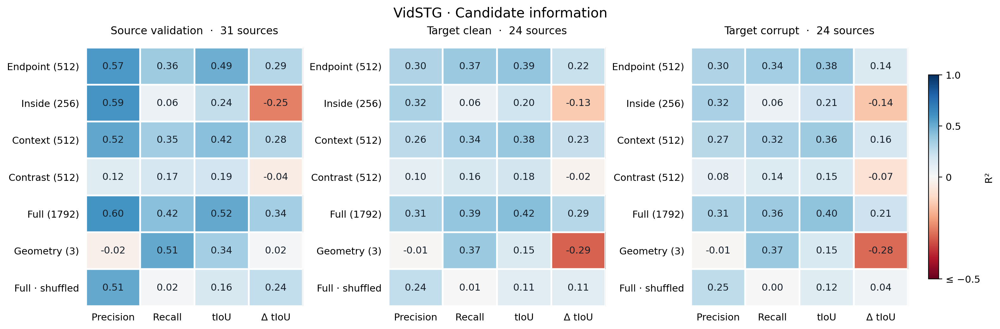
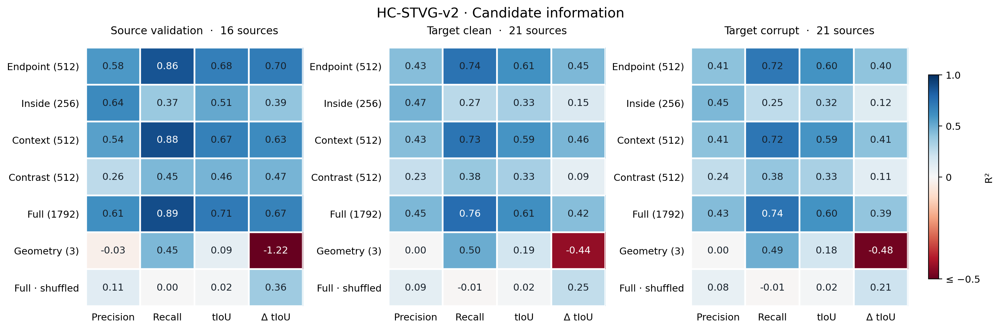
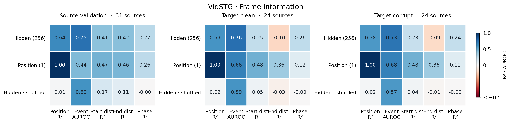
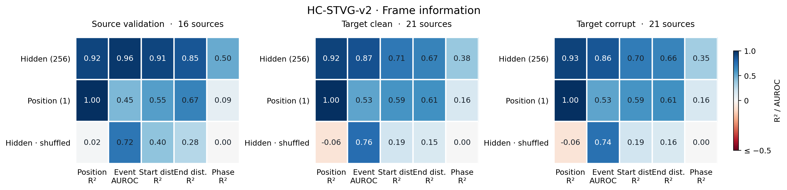
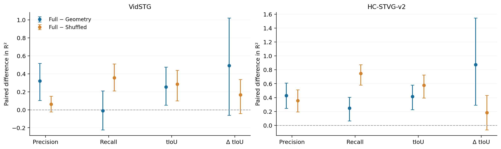

# TA-STVG temporal latent 信息图谱：CPU P0

**本轮不支持“最终 temporal latent 只有粗事件相关性、没有定位质量信息”的统一结论。** HC-STVG-v2 的候选 precision、recall 和 tIoU 可以从冻结 latent 中线性读出，并在目标 corruption 面板超过几何与标签打乱控制。VidSTG 的结果明显更弱：recall 没有超过几何控制，precision 的来源先验影响较大，end-distance 读出也较差。与此同时，两个数据集的直接相对改善量探针都没有稳定超过打乱控制，信息可访问性仍不能替代安全的候选修改决策。

这是一轮 representation characterization。没有新增最终预测、候选、专家调用、backbone 前向、反向传播、MLP 或 TTA；A8 与空间持久状态原样保留。

## 实际范围与数据使用

复用 `107e1ef9` 实际保存的最终第六层 temporal decoder、输入 `temp_embed` 之前的逐观测帧 256D hidden。两 offset 沿用真实 frame ID 合并；左右上下文仍为一秒，缺侧填零，没有重新取帧或修改已有 32 个区间。官方同域 checkpoint 为 Vid `fbb1ed88…`、HC2 `ee72f0d9…`，完整 SHA 在 CONFIG 中。

| 数据集 | 官方 train 拟合源／验证源 | 目标开发缓存源／确认缓存源 | 目标 expert cells | clean／corrupt |
|---|---:|---:|---:|---:|
| VidSTG | 95／31 | 16／8 | 144 | 24／120 |
| HC-STVG-v2 | 48／16 | 14／7 | 144 | 24／120 |

总计源侧 190 个 query/source，目标 45 个独立来源、288 个 expert arrivals。目标仍来自原两集各 32 开发＋16 确认、两个顺序、clean＋五种 5% corruption、25% 专家位置；**只有这 288 个位置有 latent cache**。HC 不同顺序的专家来源覆盖部分重叠，所以 24 个 clean cells 只有 21 个独立目标来源。没有补采其余 864 个非专家 latent，也没有把该子集称为完整 1152-arrival 信息图谱。

源官方训练 GT 用于监督探针；源验证只选 alpha，不并入最终拟合。目标只读出和离线评价，不参与拟合、选 alpha、view、阈值或方法晋升。全部来源有历史曝光；目标确认与本批开发来源互斥，不能称 fresh。开始锁定前查看了四个旧 cached target-span schema 样本，该预读已记录；全 136 个探针冻结之后才生成本轮目标 readout，全 readout 封存后才 join 旧 cached span 标签。它是本轮拟合隔离和评分时序，不是首次接触目标 GT 的声明。

## 探针与计分口径

坐标域为已有观测 clip：origin 为首个 frame ID，宽度为末帧 ID＋1－origin。position、signed start/end distance 以该宽度归一化，不把 GT 裁进观测范围。事件为 `[s,e)`；phase 只在实际观测到的 GT-event 帧上评价，不在事件外补标签。它是 oracle-gated phase characterization，不能当成可部署的事件门控。

Candidate precision 为交集／候选长度，recall 为交集／GT 长度，tIoU 为交集／并集。Endpoint 512D、Inside 256D、Context 512D、Contrast 512D、Full 1792D 与 Geometry `[start,end,length]` 3D 分别拟合。Frame 是 Hidden 256D 和已知 position 1D。连续量用 FP64 ridge，event 用 logistic；每个源等权，避免长 clip 或多个候选伪装成独立样本。

固定 alpha 网格 `.001,.01,.1,1,10,100,1000`，连续任务按源验证 MSE、event 按 log loss 选择，精确并列选较小 alpha。标准化只使用源拟合行。**本轮 MSE 选择与上一轮 quality selector 的验证 top-1 选择不同**，不能把这一组 tIoU 探针当成上一轮 L32 的复现或新 top-1 实验。

直接 Δ 探针使用 `feature(candidate)−feature(anchor)`、零截距；源 anchor 为 cache 中 native 候选 0，目标 anchor 为真实保存的 A8。源没有 UVTG A8 decision，二者不能混称。另报 absolute tIoU readout 的预测差，作为不同的相对读出方式，不额外拟合模型。

每个 view/task 同时拟合真实标签与一组确定性的 source 内训练标签打乱控制；验证和目标标签仍是真实值。打乱保留来源的标签直方图和来源之间的先验，因此**不保证回到 chance**。候选共用置换，Δ 保留 anchor 为零；frame 共用置换，phase 只在事件帧内打乱。所有几何 real/shuffle 和源拟合 intercept-only null 都保留。

136 个模型各自只有源侧选择。主回归值是来源等权 pooled R²：`1−macro MSE/(macro y²−macro y的平方)`。先 frame/candidate 内，再 condition、order、source 平均；10000 次 source bootstrap。另报每 cell 的 R² 与零方差排除、MAE/MSE。Event AUROC/AUPRC 只在同时有两类时定义，不用 .5 填空；source 条件平均也保留缺类记录。Bootstrap 区间均为未做多重比较校正的描述区间。

## Source → clean → corruption

下表为 Full 候选 probe 的 pooled R²，event 为 Hidden 的 AUROC，**不是 vIoU 增量**。Source validation 参与 alpha 选择，仅作描述性参照。

| 数据集／域 | Event AUROC | Precision R² | Recall R² | tIoU R² | 直接 ΔtIoU R² |
|---|---:|---:|---:|---:|---:|
| Vid／source validation | 0.746 | 0.597 | 0.418 | 0.515 | 0.344 |
| Vid／target clean | 0.756 | 0.313 | 0.390 | 0.424 | 0.287 |
| Vid／target corrupt | 0.732 | 0.314 | 0.361 | 0.403 | 0.206 |
| HC／source validation | 0.961 | 0.614 | 0.887 | 0.708 | 0.672 |
| HC／target clean | 0.871 | 0.450 | 0.759 | 0.610 | 0.422 |
| HC／target corrupt | 0.858 | 0.431 | 0.741 | 0.596 | 0.391 |

目标 corruption 上仍有可读信息，尤其 HC 的 recall。Clean→corrupt 均值变化小于 source→target 的变化，但不能将后一差距唯一归因于 latent representation shift：源标签／事件／候选分布、验证参与选择和 anchor 不同都可能影响结果。本轮没有实施 latent adaptation 来检验该因果解释。

| Corrupt 目标／Full | R²［95% CI］ | Full−Geometry［95% CI］ | Full−Shuffled［95% CI］ |
|---|---|---|---|
| Vid precision | .314［.024,.487］ | .320［.104,.517］ | .063［−.024,.152］ |
| Vid recall | .361［.186,.530］ | −.011［−.224,.210］ | .357［.210,.511］ |
| Vid tIoU | .403［.149,.562］ | .253［.052,.474］ | .285［.099,.439］ |
| Vid ΔtIoU | .206［−.042,.401］ | .491［−.062,1.023］ | .167［−.042,.338］ |
| HC precision | .431［.238,.605］ | .428［.244,.610］ | .354［.194,.512］ |
| HC recall | .741［.560,.869］ | .248［.064,.404］ | .748［.580,.873］ |
| HC tIoU | .596［.400,.738］ | .415［.225,.579］ | .578［.393,.724］ |
| HC ΔtIoU | .391［.143,.589］ | .874［.290,1.547］ | .184［−.065,.431］ |

HC precision／recall／tIoU 对两个控制的配对区间都高于零。这些质量信号并非完全被当前三维几何表示解释。Vid 的 tIoU 也超过两个控制；但其 precision shuffled R² 已有 .252，真实 .314 的额外优势不确定，而 recall 几何 .372 与 latent .361 相当。这不支持统一描述成“只会 precision、不会 recall”，也不支持统一描述成“只会 recall、不会 precision”。

两组直接 Δ 相对 shuffled 的区间都跨零。Absolute readout 差的 R² 为 Vid .249［.015,.438］、HC .473［.299,.615］，对 shuffle 的差异为正；但同样尚未评价其大幅修改许可、排序或最终 top-1，不能将它直接晋升 relative selector。

完整确认 corruption 面板单列：Vid 8 源、40 cells；HC 7 源、40 cells。

| 确认／Full | Precision R² | Recall R² | tIoU R² | ΔtIoU R² |
|---|---|---|---|---|
| Vid | .273［−1.054,.587］ | .604［.414,.773］ | .447［−.376,.668］ | .271［−.386,.595］ |
| HC | .445［.081,.685］ | .801［.643,.907］ | .666［.482,.795］ | .403［.176,.596］ |

HC 确认 precision／recall／tIoU 对两控制仍有正配对区间；Vid 置信区间宽，不能用确认 pooled 点值替代稳健性。两数据集直接 Δ 对 shuffle 的确认区间仍跨零。所有 clean/search/confirm、来源矩与两序统计见 SUMMARY、ROWS 与 ORDER_DIAGNOSTICS；顺序覆盖的来源不同，不能凭顺序差断言模型漂移。

## 信息位于哪些候选块

以下为全部 corrupt cached expert 来源的 R²；view 不是根据这些目标结果选出的新配置。

| 数据集／view | Precision | Recall | tIoU | ΔtIoU |
|---|---:|---:|---:|---:|
| Vid Endpoint | .300 | .341 | .378 | .142 |
| Vid Inside | .325 | .055 | .206 | −.140 |
| Vid Context | .273 | .323 | .359 | .164 |
| Vid Contrast | .084 | .138 | .149 | −.073 |
| Vid Full | .314 | .361 | .403 | .206 |
| HC Endpoint | .413 | .716 | .599 | .401 |
| HC Inside | .452 | .251 | .324 | .122 |
| HC Context | .409 | .722 | .588 | .408 |
| HC Contrast | .245 | .383 | .326 | .107 |
| HC Full | .431 | .741 | .596 | .391 |

Interior 对 precision 的点值较好，endpoint/context 对 recall、tIoU 和 Δ 的点值较好；Full 没有在每项上都占优。Contrast 没有展现出“边界差分必然更有用”的模式。这是当前训练规则下的可访问性地图，不是块的因果消融：维度和正则各自不同、块间相关，不能断言删掉某块会导致原生 TA-STVG 定位损害。

## Frame 信息与位置捷径

| Corrupt 目标 | Position R² | Event AUROC | Start-distance R² | End-distance R² | GT-event phase R² |
|---|---:|---:|---:|---:|---:|
| Vid Hidden | .578 | .732 | .229 | −.094 | .240 |
| Vid Position-only | 1.000 | .679 | .478 | .355 | .125 |
| HC Hidden | .928 | .858 | .702 | .660 | .348 |
| HC Position-only | 1.000 | .528 | .586 | .608 | .162 |

Position-only 对 position 本身的 1.000 是已知输入的恒等控制，不是模型发现。Signed distance 是 position 加／减 query 边界的仿射量，所以高 R² 本身不能证明精确边界定位。Vid 的两个距离读出在 corrupt 上都弱于位置控制；HC 较高，但超过位置控制的配对区间仍跨零。Phase 相对 shuffle 为正，相对 geometry 的区间均跨零，不能据此直接认定 query-conditioned event progression。

Vid event 相对 shuffled 的配对区间为［.051,.269］，相对位置为［−.079,.195］；HC 分别为［.033,.206］和［.148,.506］。HC shuffled event AUROC 已有 .745，说明 source 内打乱不会破坏所有跨来源先验，不能把 .5 当成它的强制 null。Vid 24 个目标来源中一个来源观测帧全部在事件内：corrupt 五个 cells 的 AUROC/AP 未定义，实际有效来源 23；源验证有 7 个单类来源，AUROC/AP 有效 24／31。HC 目标 21 个来源均有两类；两集均无零事件观测支持，本轮没有为缺类填值。

为去掉已知位置项，逐帧反推归一化 start＝position−预测 start-distance、end＝position＋预测 end-distance，再平均成每 cell 的边界；不生成新的 STVG 预测。目标 corrupt 的边界绝对误差如下，单位为观测 clip 宽度，越低越好：

| 数据集／探针 | Start error | End error |
|---|---:|---:|
| Vid Hidden | .248 | .352 |
| Vid Position-only | .268 | .314 |
| Vid Hidden shuffled | .247 | .309 |
| HC Hidden | .136 | .150 |
| HC Position-only | .208 | .200 |
| HC Hidden shuffled | .146 | .153 |

HC 真实 hidden 相对 shuffled 的边界点值差距很小，Vid 也没有一致优势。它们限制了从 signed-distance R² 直接推出“知道真实边界”的解释。完整 source-bootstrap 区间和反推边界在帧间的 std 已保存 ENDPOINT_DIAGNOSTICS。

## Pooled 信息不等于 arrival 内可执行的排序

Pooled R² 包含来源之间的均值差异。Within-cell R² 只在该 cell 有标签方差时定义，更关注同一 arrival 内候选变化，但小方差会放大误差、使宏平均很不稳定。Vid corrupt Full precision 的 pooled R² .314、within-cell 宏平均 −7.43；tIoU 为 .403／−3.48。HC precision 为 .431／.224、tIoU 为 .596／.412。直接 Δ 两集的 within-cell 值也均为负。

这不证明 latent 没有可用于排序的信息；MSE 校准和排序是不同量，且本轮未测排名。它说明不能用跨来源 pooled R² 认证 arrival 内修改正确性。尤其 source 内标签打乱保留了来源均值，Vid precision 的真实／打乱差异不足以建立稳定的局部精度读出。

## 核验、资源与本轮裁决

8 个有意义的 CPU 测试通过，覆盖等来源权重、物理 P/R/tIoU 算术、anchor 为零、打乱、缺类／零方差、解析 ridge、logistic KKT 和来源 bootstrap。独立 root auditor 重新构造 27,410,432 个候选特征元素，核验 136 个冻结探针、全部选定 ridge／全部 ridge 路径、选定 logistic KKT／验证损失、335 个读出 packet 的 1,108,540 个点预测和匿名统计。未选定 logistic 权重未保存，不宣称全部 logistic 路径都被独立重拟合。

独立 public auditor 仅用匿名矩复算 coverage、alpha 选择、来源聚合、全部 bootstrap、配对差异、边界去位置和两序统计。它不能从匿名矩重建私有 latent／权重或原始标签，其范围与 root fitting 审计区分。公开审计最初的 AP 范围断言因两个值 `1.0000000000000002` 的浮点舍入停止；只为 auditor 加 1e−12 数值容差，原日志留存，既有模型／预测／指标／runner 没有改动。

源拟合 7.296 秒、冻结读出 2.295 秒、基本统计 20.638 秒，都是实际 CPU worker wall time，不是 GPU kernel 时间；绘图／补充统计／独立审计另外计时。新增 GPU／TA-STVG／专家／backbone／候选推理／反向调用均为零，CUDA 未初始化。模型、latent、原 GT、媒体和 captions 不公开，匿名矩、所有源验证路径、完整正负结果与 PNG/PDF 图公开。

**保留 A 和当前部署方法，不晋升任何 probe。** 这轮已经收回“只有粗语义、缺定位信息”的过强解释，HC 提供明确的候选质量可访问性，Vid 则要求区分几何、来源先验和局部变化。下一机制若研究 relative/listwise readout，必须检验同支持的决策与负尾，不能把 pooled 预测能力当作 top-1 保证。Query-swap 是尚未执行的 query-specificity 控制；layerwise、appearance/motion、MLP、latent TTA 和额外专家仍未启动。负线性结果也不否定所有非线性信息。
