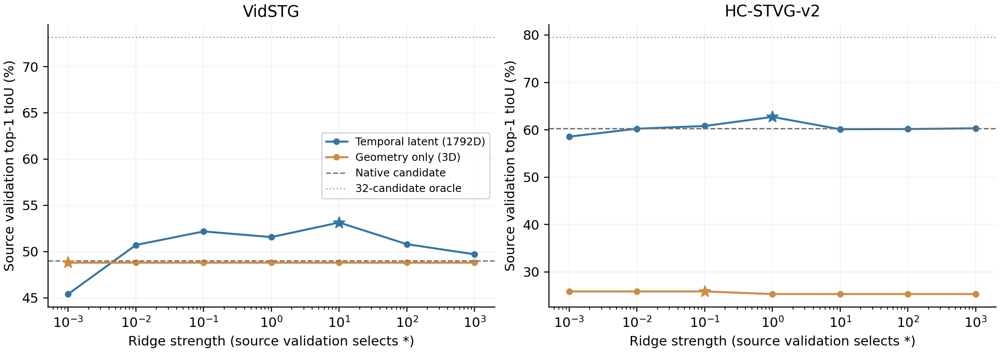
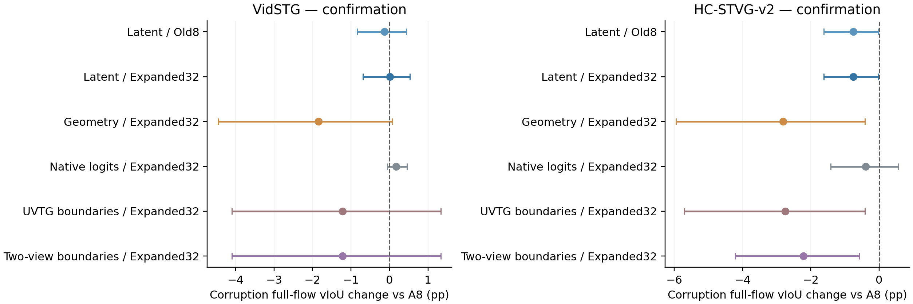

# 候选条件 temporal latent：源监督线性探针审计

**这版线性探针没有建立可替换 A8 的共同收益。** Vid 确认完整 corruption 流几乎为零，HC 为负；它比部分激进边界信号更少破坏输出，但没有稳定超过原生起止先验。源验证能读出一定区间质量信息，不等于能在当前目标流可靠判断大幅修改。保留 A，本轮不晋升探针，不自动训练 MLP 或增加专家。

## 实际执行与数据边界

目标固定为前轮相同的两集各32开发＋16确认来源，一query/source、两序、clean＋五类5% corruption、25%专家：1152到达中288有完整候选（240corrupt、48clean），864非专家逐值保留A。全部来源有历史曝光；确认面板与本批开发来源互斥，不能称fresh。Old8完整包含于Expanded32，原A空间框、Uniform Rank-RKL的1792参数持续轨迹与Vid K1/HC K8、像素、专家位置、原Paper48采样、官方同域checkpoint全部固定。

源监督使用现有官方训练媒体，Vid126独立源沿用95拟合/31验证；HC64独立源按预定来源hash划48/16。源与目标来源ID及媒体SHA256互斥。Vid保留原5fps/max200采样，HC保留原64-frame索引配方（此面板合并65帧）；不按事件质量筛样、不增加媒体或专家。官方训练GT仅为预先生成的32候选提供physical tIoU标签；源验证只选ridge强度，不并入最终拟合。目标GT不参与拟合、选参、阈值或候选生成。两集所有分数/选择GLOBAL_SCORE_SEAL先于已封存dense GT候选指标关联。

这是一项**额外source-supervised probe**，不是零监督temporal heuristic，也不是latent TTA。源训练derived validation参与ridge选择，不是独立最终检验。训练媒体与GT已有项目曝光；源侧当前有限预算和目标历史曝光限制外推。

## 实际表示和拟合

捕获最终第六层时间decoder输入temp_embed的256维状态；两offset按真实frame ID合并。候选表示是 `[h_s,h_e,mu_inside,mu_left,mu_right,h_s-mu_left,h_e-mu_right]`，共1792维。左右各1秒，只平均实际观测帧；缺外侧上下文填零并计数。没有使用PE语义cosine、空间合理性、额外专家或GT事件边界。区间为 `[frame_i,frame_j+1)`。

FP64岭回归，训练行的均值/标准差标准化，拟合截距；alpha网格`.001,.01,.1,1,10,100,1000`。按源验证top1 tIoU最大、MSE最小、alpha最小依次选择，冻结后目标不再调整。几何对照G只含归一化start/end/length，使用相同标签、划分和alpha规则。L/G都用未裁剪回归值排序；不是已校准的IoU或安全概率。与前轮N/U/S相同，唯一最大分且严格超过A8才替换，最高分并列保留A8。

| 源数据集／探针 | 拟合／验证源 | 维度 | 选定alpha | 验证top1 tIoU | 同面板native | 同面板32候选oracle | 验证MSE |
|---|---:|---:|---:|---:|---:|---:|---:|
| vidstg/L | 95/31 | 1792 | 10 | 53.14 | 49.01 | 73.17 | 0.04326 |
| vidstg/G | 95/31 | 3 | 0.001 | 48.81 | 49.01 | 73.17 | 0.05483 |
| hc2/L | 48/16 | 1792 | 1 | 62.71 | 60.28 | 79.52 | 0.02111 |
| hc2/G | 48/16 | 3 | 0.1 | 25.88 | 60.28 | 79.52 | 0.06630 |

源验证L相对native为Vid+4.13pp、HC+2.44pp，均为**参与alpha选择的描述性结果**，不能包装成独立统计改善；尚余约20.03/16.81pp候选oracle缺口。源GT训练并没有自动提供可靠目标读出。

## 固定支持上的最终预测

增量单位pp，95%区间为10000次同来源配对bootstrap。先到达内、条件、顺序，再来源宏平均；HC专家子集在两个顺序的来源覆盖不均，source-macro不能简单等于全流四倍。

| 面板 | A8全corrupt vIoU | L8−A8 | L32−A8 | L32 tIoU增量 | G32−A8 |
|---|---:|---:|---:|---:|---:|
| vidstg/search | 17.45 | -0.19 [-1.04, 0.51] | -0.14 [-1.11, 0.81] | 0.07 [-1.88, 2.59] | -2.04 [-5.28, 0.35] |
| hc2/search | 30.96 | 0.32 [-0.44, 1.24] | 0.32 [-0.44, 1.24] | 0.39 [-0.76, 1.70] | -3.06 [-5.27, -1.15] |
| vidstg/confirm | 32.65 | -0.13 [-0.84, 0.43] | 0.01 [-0.69, 0.53] | 0.00 [-1.54, 1.10] | -1.84 [-4.45, 0.07] |
| hc2/confirm | 26.76 | -0.75 [-1.62, -0.02] | -0.75 [-1.62, -0.02] | -1.42 [-3.10, -0.01] | -2.81 [-5.95, -0.42] |

| corrupt专家面板 | A8 vIoU | L32 vIoU | L32 tIoU | O32 vIoU | L32 regret | gross gain / loss | 改善／受损／>5pp损害 |
|---|---:|---:|---:|---:|---:|---:|---:|
| vidstg/search | 17.83 | 17.28 | 42.62 | 25.34 | 8.06 | 1.99/2.54 | 19/35/11 |
| hc2/search | 30.20 | 31.79 | 55.80 | 43.58 | 11.79 | 3.30/1.71 | 38/35/8 |
| vidstg/confirm | 22.05 | 22.10 | 46.10 | 32.71 | 10.62 | 1.84/1.79 | 27/13/6 |
| hc2/confirm | 33.76 | 30.86 | 63.09 | 44.02 | 13.16 | 0.72/3.62 | 9/25/13 |

| 完整corruption流的配对差距 | L32−N32 | L32−U32 | L32−S32 | L32−G32 |
|---|---:|---:|---:|---:|
| vidstg/search | 1.08 [0.26, 2.12] | 1.70 [-0.29, 4.50] | 1.88 [-0.24, 4.81] | 1.90 [-0.25, 4.83] |
| hc2/search | 0.10 [-0.17, 0.43] | 3.44 [1.27, 5.88] | 3.74 [1.36, 6.57] | 3.38 [1.32, 5.69] |
| vidstg/confirm | -0.16 [-0.82, 0.26] | 1.23 [-1.10, 3.74] | 1.23 [-1.10, 3.74] | 1.86 [0.11, 3.96] |
| hc2/confirm | -0.36 [-1.00, 0.19] | 2.00 [-0.05, 4.50] | 1.46 [-0.01, 3.13] | 2.06 [-0.04, 4.71] |

确认L32没有稳定超过N32；相对U/S正均值也没有正区间的共同证据。“比一个受损的baseline好”不能代替相对A的实际改善。Vid确认相对G32为+1.86pp区间高于零，表明这版latent读出不等同于这版纯位置/时长规则；它仍几乎没有净收益，也不能建立“信息被标量压缩丢失”这一原因。

## 大幅修改：判别与实际许可分开

沿用端点L1/A8时长≥.5及单端balance≤.25操作分组。候选有益/有害以固定A框的vIoU相对同A8差值定义；零差值排除。precision/recall以同来源抽样的分子/分母比值汇总，非池化TP/(TP+FP)；AUC仅在到达内同时有正负候选时定义，缺类不补.5。

| 面板／L | large条件AUC | 有效到达／来源 | beneficial precision | beneficial recall | harmful acceptance | raw TP/FP/FN/TN |
|---|---:|---:|---:|---:|---:|---:|
| vidstg/search | 0.762 [0.560, 0.920] | 32/7 | 47.81 [4.05, 84.36] | 18.02 [1.01, 44.43] | 6.29 [0.91, 14.12] | 50/77/181/1069 |
| hc2/search | 0.792 [0.632, 0.916] | 43/10 | 79.83 [0.00, 94.44] | 20.21 [0.00, 55.58] | 0.84 [0.11, 1.89] | 80/13/160/1571 |
| vidstg/confirm | 0.838 [0.632, 0.977] | 24/6 | 43.71 [31.48, 100.00] | 17.00 [0.00, 39.34] | 1.83 [0.00, 5.15] | 12/15/54/773 |
| hc2/confirm | 0.877 [0.788, 0.979] | 9/3 | 未定义 | 0.00 [0.00, 0.00] | 0.00 [0.00, 0.00] | 0/0/63/809 |

Vid确认L的large precision为43.71%，高于旧U/S的描述性约10%，但置信区间宽、263/10000次抽样无接受分母；raw仍接受12有益/15有害候选。最终top1采用4次大改，4次均有益，只来自3个source、均order1；不能外推安全性，且另外13次小幅修改受损。HC条件AUC=.877，但任何大幅候选都未获相对A8的正分许可：TP=FP=0、precision未定义、recall=0。高条件AUC不能证明可用的top1决策。

| 确认corrupt／L32 | 新增24候选被选中 | 大改改善／损害 | 小改改善／损害 | 原Fast正收益被破坏 | vIoU .3正确→错误／救回 | .5正确→错误／救回 |
|---|---:|---:|---:|---:|---:|---:|
| vidstg | 8/40 | 4/0 | 23/13 | 6 | 0/0 | 0/1 |
| hc2 | 0/40 | 0/0 | 9/25 | 19 | 3/0 | 11/3 |

HC在全部144专家到达上L8和L32选择相同，确认没有选择新增候选，也没有任何大幅top1；确认9改善、25损害中13次损害>5pp，保守并不等于安全。Vid确认专家两序L32增量order1 +1.083pp、order2 −.987pp，leave-one-source-out −.462至+1.295pp；HC为−.033/−5.958pp，leave-one-source-out −3.759至−1.919pp。顺序专家来源覆盖不同，这些数值不单独证明参数漂移。

所有large trim-start/end/expand/shift/trim-both、clean、G对照、raw计数、缺类/零分母和same-support pairwise诊断已发布。PAIRWISE_DIAGNOSTICS是分数封存后的描述分析，不参与模型选择；只在相同支持内比较不同signal，不能用Old8与32不同pair population推断极值校准机制。

## Clean和代表性正负例

| 面板 | clean完整流L8−A8 | clean完整流L32−A8 | clean完整流G32−A8 |
|---|---:|---:|---:|
| vidstg/search | -0.26 [-1.10, 0.43] | -0.34 [-1.46, 0.72] | -2.01 [-5.25, 0.33] |
| hc2/search | 0.70 [-0.27, 2.09] | 0.70 [-0.27, 2.09] | -2.70 [-4.88, -0.78] |
| vidstg/confirm | -0.20 [-0.98, 0.48] | -0.20 [-0.98, 0.48] | -2.20 [-5.14, 0.04] |
| hc2/confirm | -0.41 [-1.36, 0.34] | -0.41 [-1.36, 0.34] | -3.04 [-6.21, -0.58] |

| 确认／L32代表例 | A8→L32 vIoU | 增量pp |
|---|---:|---:|
| vidstg/positive/source36/motion_blur_5/order1 | 42.47→59.81 | +17.34 |
| vidstg/negative/source37/exposure_5/order2 | 39.13→30.44 | -8.70 |
| hc2/positive/source33/frame_freeze_5/order1 | 49.11→54.18 | +5.07 |
| hc2/negative/source41/exposure_5/order2 | 63.81→46.16 | -17.65 |

## 新测得的接口一致性与核验

本轮实际重放288个A更新前状态，空间输出与封存A框逐值相同；时间两offset的全部start/end logits与冻结source capture逐值相同，提取hidden逐值重算head也一致。**在当前A的空间更新范围和这个面板上，可以排除“旧N使用source先验而不是A-current logits”作为失败原因。** 这不推广到别的更新范围或时间参数适应，也不把边缘配对变成完整原生joint-span likelihood。

独立根审计从原hidden重新拼接27,410,432个特征数值、45,888个几何值及上下文计数；190源官方训练label join、source/media互斥、训练标准化、直接线性方程解与全部源验证路径、18,432目标分数、1152决策及1152目标指标绑定均通过。直接ridge解最大差4.19e-15。公开审计独立复算223423标量及1152选择，最大差3.33e-16；只用匿名导出可核验选择/标签/汇总，不声称公开副本能重建被排除的原latent和probe权重。五项CPU数学测试通过，两图已目检。

保留源摄取两个工程失败（相同caption跨used-segment、错误截取来源ID末11字符），均发生在模型推理前。补充CPU导出首次NumPy int64不能JSON序列化也保留原件，修复仅为Python标量转换；正式分数/候选/指标未改。

源capture GPU路径worker wall累计259.04秒，目标缓存重放worker wall累计87.28秒，CPU拟合3.57秒；含模型加载/解码/CPU处理，**不是纯GPU kernel时间**。源完整模型380个offset forward，源额外cached suffix760个offset调用、目标576个offset suffix调用，head直接一致性调用956次；每个offset suffix含两stage decoder。原源barrier的suffix计数仅覆盖observer而未计source_capture内部combined，完整调用口径更正在CALL_ACCOUNTING，原barrier不重写。目标零backbone/新专家/反向更新。峰值显存Vid源约20.61GiB、HC源4.80GiB，目标约1GiB。保存源/目标特征141,429,080/215,349,936bytes。

## 决策

保留A；L8/L32本轮均不接入正式时间分支。有限source监督线性probe在源验证读出了一定质量信号，Vid确认也有具体成功大改，但当前target transfer和top1行为不足以兑现oracle机会。**失败只限定这组表示、源预算、linear ridge、tIoU目标和冻结读出；不证明所有native latent没有信息，也不证明非线性probe必能成功。** 本轮没有测试MLP/listwise/latent TTA/额外expert，不把“标量压缩”当成测得原因。当前约束不按确认GT改threshold、window、alpha或模型。

[执行协议](../protocols/tastvg_temporal_latent_quality_v1.md) · [完整匿名结果](../results/tastvg_temporal_latent_quality/2026-10-03)
