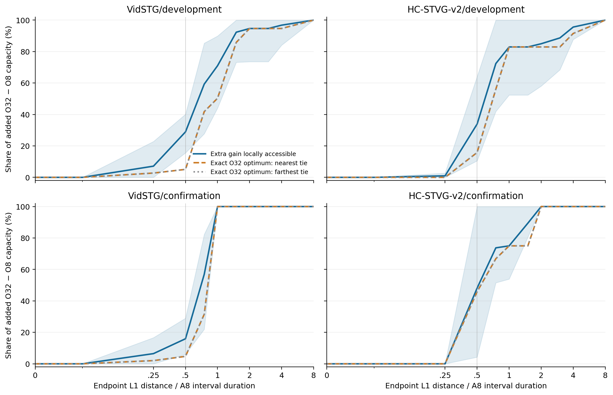
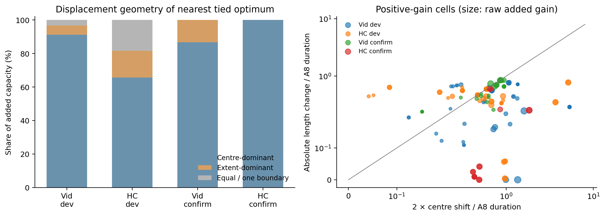

# A8 → O32：局部 oracle 与边界位移诊断

本轮不支持把新增机会统一解释成“小幅局部边界微调”，也不能由远距离直接断定“选错事件”。Vid确认的主要新增机会更接近大幅单边界收缩；HC确认包含更明显的区间整体移动，但仅两个正增来源，不能推广为稳定规律。保留A，暂不启动anchor-conditioned refinement。

这是一轮 CPU post-hoc 诊断，输入为 4ecf366 已封存、独立核验的匿名逐候选指标。没有新增模型、专家、候选、decoder replay 或 GT 标注读取；A 的空间框、Uniform Rank-RKL 持续状态与原 temporal readout 均未变。已有指标是 GT-derived，不能把本分析称为无标签实验。

两集各 32 开发＋16 确认来源，一 query/source、两序、clean＋五类 5% corruption、25% 专家，共 1,152 到达；288 专家有完整候选（240 corrupt、48 clean）。864 非专家没有完整候选，仅核对覆盖，不制造其 oracle。来源均有历史曝光，确认面板不是 fresh test。

## 新增机会来自哪里

以下是 corrupt expert；vIoU 与增量为 pp，区间为 10,000 次同来源配对 bootstrap。

| 面板 | 专家来源 / 到达 | 正增来源 / 到达 | A8 | O8 | O32 | O32−O8 |
|---|---:|---:|---:|---:|---:|---:|
| vidstg/search | 16 / 80 | 10 / 46 | 17.83 | 19.95 | 25.34 | 5.39 [1.78, 9.88] |
| hc2/search | 14 / 80 | 8 / 42 | 30.20 | 35.73 | 43.58 | 7.85 [3.30, 12.79] |
| vidstg/confirm | 8 / 40 | 6 / 29 | 22.05 | 25.23 | 32.71 | 7.49 [2.04, 14.17] |
| hc2/confirm | 7 / 40 | 2 / 15 | 33.76 | 37.30 | 44.02 | 6.72 [0.00, 15.40] |

## 固定局部半径能收回多少新增容量

半径 r 使用端点 L1 位移除以 **A8 区间长度**。r=.5 表示起点和终点位移的绝对值之和不超过 A8 时长的一半，不是每个边界都允许移动一半。所有半径在本次计算前固定；这是 oracle 可达性曲线，不是学习得到的接受阈值。

`accessible_extra(r)=max(0,L32(r)−O8)`，上界是 `O32−O8`。下表的占比使用来源宏平均分子除以来源宏平均总增量；不会平均逐样本不稳定的比值。分子与分母共享 bootstrap 来源抽样。

| 面板 | r=.25 可收回比例 | r=.5 可收回比例 | r=1 可收回比例 | r=2 可收回比例 |
|---|---:|---:|---:|---:|
| vidstg/search | 7.13 [0.00, 22.82] | 28.92 [15.56, 40.12] | 70.98 [43.99, 89.86] | 94.67 [73.55, 100.00] |
| hc2/search | 0.97 [0.00, 2.70] | 33.87 [10.50, 64.04] | 82.94 [52.35, 100.00] | 84.97 [58.04, 100.00] |
| vidstg/confirm | 6.48 [0.00, 16.62] | 15.93 [6.05, 28.97] | 100.00 [100.00, 100.00] | 100.00 [100.00, 100.00] |
| hc2/confirm | 0.00 [0.00, 0.00] | 48.13 [4.24, 100.00] | 75.02 [53.88, 100.00] | 100.00 [100.00, 100.00] |

为防“完整 O32 最优离得远，但稍近的候选也足够好”被漏掉，同时提供两条曲线：上述局部可收回收益，以及以完整 O32 最优位置为定义的收益加权 CDF。后者对并列最优分别用最近和最远距离。

| 面板 | r=.5 完整最优：最近 / 最远占比 | r=1 完整最优：最近 / 最远占比 | r=.5 L32−L8 | r=.5 L32−A8 |
|---|---:|---:|---:|---:|
| vidstg/search | 5.07% / 5.07% | 50.31% / 50.31% | 1.78 [0.58, 3.33] | 3.47 [1.58, 5.67] |
| hc2/search | 15.79% / 15.79% | 82.94% / 82.94% | 3.71 [1.25, 6.40] | 6.73 [3.98, 9.57] |
| vidstg/confirm | 4.73% / 4.73% | 100.00% / 100.00% | 1.50 [0.51, 2.83] | 4.08 [2.93, 5.22] |
| hc2/confirm | 45.83% / 45.83% | 75.02% / 75.02% | 3.23 [0.00, 9.39] | 5.43 [1.38, 11.65] |

L32−L8 限制了两个池；它和“超过完整 O8 的新增机会”不同，不能互换。完整窗口归一化曲线、所有预锁半径、候选计数、逐来源与两序结果均在 SUMMARY/ROWS。

## 起点、终点、中心和长度

起止距离是 A8 到 **候选 vIoU oracle** 的位移，不是到真实 GT 端点的误差。秒数按缓存的观测窗口时长还原；该窗口不保证覆盖完整原视频。以下位移均值包含零增量到达，只作尺度参考；判断新增收益的位置以收益加权曲线和分解为主。

| 面板 | 最近最优：起点 / 终点秒数 | 端点 L1 秒数 | L1 / A8时长 | A8 与最优 tIoU |
|---|---:|---:|---:|---:|---:|
| vidstg/search | 4.30 / 5.60 | 9.91 | 0.79 | 0.572 |
| hc2/search | 2.48 / 2.92 | 5.40 | 0.65 | 0.593 |
| vidstg/confirm | 1.91 / 7.85 | 9.75 | 0.52 | 0.539 |
| hc2/confirm | 0.99 / 1.85 | 2.84 | 0.32 | 0.744 |

设 ds、de 为有符号端点变化，中心位移 c=(ds+de)/2，长度变化 l=de−ds，则

`|ds|+|de| = max(2|c|, |l|)`。

中心和长度不是两项可相加的独立误差。下表将新增容量按最近最优候选的几何类型归属；这是描述性分解，centre 不等于事件 identity 错误，extent 不等于已经获得可实现的边界优化器。

| 面板 | 中心主导的收益占比 | 长度主导 | 等量 / 单边 | 单独移动 start | 单独移动 end | 扩张 | 收缩 | 同向移动 |
|---|---:|---:|---:|---:|---:|---:|---:|---:|
| vidstg/search | 91.22% | 5.40% | 3.37% | 0.00% | 3.37% | 1.50% | 3.91% | 91.22% |
| hc2/search | 65.69% | 15.91% | 18.40% | 10.05% | 8.36% | 0.00% | 15.91% | 65.69% |
| vidstg/confirm | 86.69% | 13.31% | 0.00% | 0.00% | 0.00% | 0.78% | 12.52% | 86.69% |
| hc2/confirm | 100.00% | 0.00% | 0.00% | 0.00% | 0.00% | 0.00% | 0.00% | 100.00% |

**严格主导分类需要连续分解校正。** 两端同向时 centre 项略大，也可能是一端大幅收缩、另一端只移动一个网格步。因此初次结果回读后增加了连续 post-hoc 诊断，没有新增阈值或改任何原始结果：`balance=2min(|ds|,|de|)/(|ds|+|de|)`，0 表示只动一端，1 表示两端等量；另报 centre/L1、extent/L1，两项不能相加。

| 面板 | 收益加权端点 balance | 起点位移占比 | 终点位移占比 | centre 项 / L1 | extent 项 / L1 |
|---|---:|---:|---:|---:|---:|
| vidstg/search | 57.12 [27.35, 82.74] | 35.46 [17.33, 53.10] | 64.54 [46.90, 82.67] | 97.19 [87.11, 100.00] | 45.69 [19.33, 77.41] |
| hc2/search | 55.26 [27.62, 78.45] | 44.91 [26.88, 66.95] | 55.09 [33.05, 73.12] | 90.89 [75.87, 98.79] | 53.85 [26.66, 91.34] |
| vidstg/confirm | 11.70 [5.27, 30.44] | 52.49 [5.99, 92.37] | 47.51 [7.63, 94.01] | 97.99 [93.94, 99.84] | 90.31 [73.09, 96.12] |
| hc2/confirm | 73.15 [53.67, 96.18] | 37.47 [26.83, 50.04] | 62.53 [49.96, 73.17] | 100.00 [100.00, 100.00] | 26.85 [3.82, 46.33] |

该补充是在首批几何结果回读后提出，不能称为未看结果预注册。规则与独立验证见 [连续分解补充](../protocols/tastvg_temporal_local_oracle_balance_addendum_v1.md)。

保持 A8 的某一边界不动、只在现有 32 候选里选另一边界的条件 oracle：

| 面板 | 固定 start：收益 / 平均候选数 | 固定 end：收益 / 平均候选数 |
|---|---:|---:|
| vidstg/search | 0.61 [0.08, 1.50] / 2.53 | 1.02 [0.05, 2.83] / 2.71 |
| hc2/search | 1.83 [0.21, 4.23] / 2.30 | 3.02 [0.73, 5.84] / 3.47 |
| vidstg/confirm | 1.73 [0.47, 3.24] / 3.15 | 1.19 [0.12, 2.52] / 2.67 |
| hc2/confirm | 0.82 [0.12, 1.67] / 3.37 | 2.01 [0.10, 5.50] / 2.11 |

这一限制不新增任何区间。候选数量少时，不能由零收益推断连续的单边界 refinement 无效。

## 并列、集中度与 clean 对照

| 面板 | oracle 并列到达 | 并列几何类别不同 | bootstrap 零总增量抽样 | clean O32−O8 | clean r=.5 可收回占比 |
|---|---:|---:|---:|---:|---:|
| vidstg/search | 15 / 80 | 15 | 0 / 10000 | 5.08 [1.77, 9.08] | 28.42 [9.38, 43.88] |
| hc2/search | 0 / 80 | 0 | 0 / 10000 | 9.35 [4.18, 14.92] | 36.60 [6.82, 69.51] |
| vidstg/confirm | 0 / 40 | 0 | 0 / 10000 | 6.96 [1.45, 13.63] | 8.14 [0.00, 21.95] |
| hc2/confirm | 2 / 40 | 2 | 937 / 10000 | 6.04 [0.00, 13.82] | 23.86 [0.00, 41.70] |

如果某次 bootstrap 的总 O32−O8 为零，占比没有定义，该抽样被计数而非强行置零。占比 CI 因此条件于该次总增量为正；原始 pp 的 CI 仍使用全部 10,000 抽样。HC 确认只有 2 个正增来源，必须结合逐来源和 leave-one-out，不能把容量或局部比例宣称为广泛稳定规律。

## 决策与可解释范围

确认corrupt专家：半个A8时长的端点总位移可收回新增容量，Vid15.93% [6.05,28.97]、HC48.13% [4.24,100]；分别为1.1928pp [0.2860,2.5347]、3.2336pp [0,9.3923]。Vid只有4.73%的新增收益对应完整O32最优位于此半径内，HC45.83%。局部存在收益，但不能说大部分新增机会来自小幅微调。

扩大到r=1时，Vid确认可收回100%、HC75.02%；r=2两组100%。r=1/2属于允许较大端点变动的描述性邻域，不是已经证明安全的局部refiner。开发集在r=.5只可收回Vid28.92%、HC33.87%，不能以确认集单独设接受半径。

严格符号分类把Vid确认86.69%、HC确认100%的新增收益归为centre-dominant。连续分解却显示Vid收益加权balance仅11.70% [5.27,30.44]，extent/L1达90.31% [73.09,96.12]：大部分位移由一端承担，严格centre标签不足以证明mode错误。起点/终点份额52.49%/47.51%，区间很宽，不能规定只修start或只修end。

Vid确认source34/occlusion/order1：A区间[.2212,.9724]变为oracle[.7465,.9447]，起点移动3.8038秒、终点.2002秒，新增31.38pp；source45/frame_drop/order2的起点只动.2002秒而终点移动39.4060秒，新增24.04pp。两例支持大幅裁边，不是统一的小步修正，也不证明真实事件identity改变。

HC确认balance73.15%、extent/L1仅26.85%，现有两个正增来源更像两端协同移动。source47/motion_blur/order1：A[.392,.708]→oracle[.142,.378]，区间不重叠，起点/终点移动4.9900/6.5868秒，新增30.59pp。但source34与47贡献全部新增容量，937/10000 bootstrap总增量为0，比例CI条件于其余9063次抽样，不能宣称所有HC事件都如此。

固定一端的32池条件oracle，Vid仅移动end/仅移动start相对A的均值收益1.73/1.19pp，HC.82/2.01pp；平均只有约2至3个候选。这不否定更丰富的单边界生成机制，且不能与总O32−O8相加或直接比较为独立贡献。

确认集没有正增量oracle并列影响本结论；最近/最远最优的新增收益CDF一致。零收益行和clean对照完整保留，HC集中度和顺序差异均披露。

下一步依据仅限：若研究refinement，须容许大幅单边裁剪及区间协同移动，并先在同支持上验证新的独立定位证据；本轮未授权立即执行该方法，不启动新PE scorer、空间loss、memory、专家或旧队列。

A8→O32 位移不是 GT 边界错误；大幅长度修正和事件平移均可能产生大端点距离。当前数据不包含用于本诊断的真实 GT 端点，因此不能把几何距离直接命名为“选错事件”。

此前 8→32 的 pairwise accuracy 比较改变了候选对总体。它与 top-1 同时改善/恶化并不独立证明 score calibration 或 multiple-hypothesis extreme-tail 因果机制；本次没有检验该假说。

局部 oracle 只回答已有支持中的上限，不保证任一无标签 boundary refiner 能实现它。本次没有选择方法、修改在线阈值、晋升 CURRENT 或启动下一 GPU 实验。

## 复现、审核和完整结果

独立审核 `pass`：288 个完整 expert record、6336 个局部支持核验、8 个统计分组、150514 标量，最大误差 7.11e-15。输入与代码 SHA256 绑定，候选/指标/状态 hash 保持 predecessor。

CPU 分解耗时 1.06 秒（不含审计、制图、公开同步；不是 GPU kernel 时间）。新模型/专家/decoder/backward/prediction 全部为 0。

来源宏平均先聚合 source/order/condition，再对来源平均；所有 bootstrap 和比值使用相同来源抽样。匿名 ROWS 保留每个 expert 的完整 32 区间/缓存指标、全部最优并列、最近最远位移、每个半径结果；CASES 同时保留大增量、近处正增与远处正增。原始媒体、query 文本、GT 坐标、权重和 raw cache 不公开。

[规则](../protocols/tastvg_temporal_local_oracle_v1.md) · [计算](../scripts/run_tastvg_local_oracle_v1.py) · [独立审核](../scripts/audit_tastvg_local_oracle_public_v1.py)

