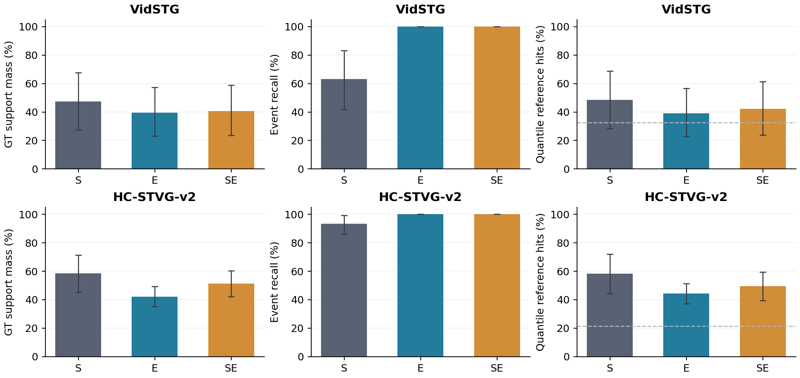
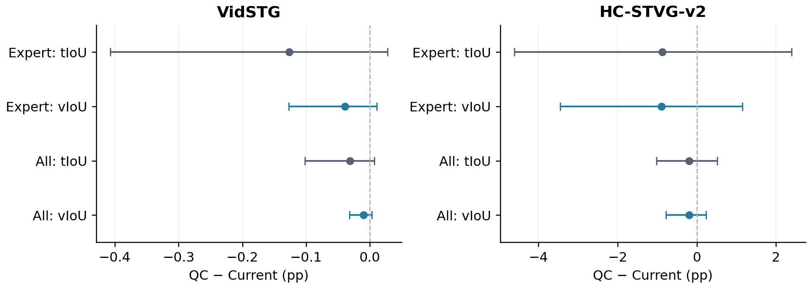
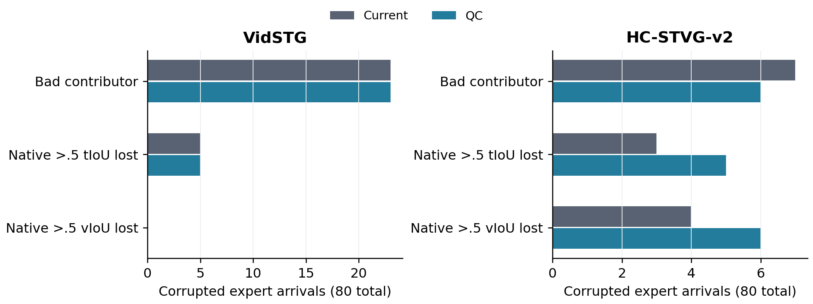

# Temporal Router T0: proposal consensus did not improve support concentration

The authorized CPU audit is complete. E and SE raise positive event coverage to 100%, but reduce the fraction of support assigned to the event and reduce five-quantile frame precision. QC native-candidate scoring does not improve corrupted temporal or tube accuracy. The predeclared T1 development signal is absent in both datasets; T1 GPU/online trials and H-full were not started.

## Matched setting and measurement

Original 32 historically exposed development sources and one query per source in each dataset; two orders, clean plus frame-drop/freeze/blur/occlusion/exposure transient 5%, official same-domain TA-STVG checkpoints, original Paper48 sampling/pixels, spatial A fully frozen. 384 sealed pre-update arrivals per dataset were reused, including 96 scheduled expert arrivals (80 corrupted, 16 clean). Distinct expert sources: Vid16, HC14. There was no new forward/backward, expert inference, video decode or GPU initialization.

The task readout is exact for a fixed spatial A trajectory: temporal selection is not an input to spatial rewards, gradients or persistent-state updates. Current scoring and outputs exactly match the prior A; all future nonexpert QC differences are zero. This is not a fresh online GPU experiment or evidence of temporal learning.

Source/order/condition macro means are primary. Paired 10000 source bootstrap (seed20261001) keeps repeated orders/conditions grouped by source. Cell means and every anonymous row are also published. The small exposed source panel is not a fresh confirmation set.

## Router result on corrupted expert arrivals

| Dataset | Router | GT mass | Event recall | Soft tIoU | Five-quantile hits | Zero reference mass | Useful evidence discarded |
|---|---|---:|---:|---:|---:|---:|---:|
| VidSTG | S | 47.36% | 63.04% | 34.57% | 48.50% | 17/75 | 5 |
| VidSTG | E | 39.47% | 100.00% | 26.49% | 39.00% | 0/75 | 0 |
| VidSTG | SE | 40.58% | 100.00% | 28.00% | 42.25% | 0/75 | 0 |
| HC-STVG-v2 | S | 58.35% | 93.27% | 52.65% | 58.29% | 5/75 | 0 |
| HC-STVG-v2 | E | 42.04% | 100.00% | 29.32% | 44.29% | 0/75 | 0 |
| HC-STVG-v2 | SE | 51.17% | 100.00% | 39.69% | 49.43% | 0/75 | 0 |

S is the student consensus; E uses every cached proposal with q=c×mean-other-proposal tIoU; SE is exactly half S plus half E. Duplicates are retained, as requested. All expert maps have positive mass in the actual panel; no missing-evidence fallback occurred.

| Dataset | Change vs S | GT mass (pp, paired 95% CI) | Quantile hits (pp, paired 95% CI) |
|---|---|---:|---:|
| VidSTG | E−S | -7.8895 [-23.5260, +4.5072] | -9.5000 [-23.7500, +2.0000] |
| VidSTG | SE−S | -6.7824 [-19.4317, +2.8715] | -6.2500 [-18.2500, +3.2500] |
| HC-STVG-v2 | E−S | -16.3111 [-29.5174, -4.1090] | -14.0000 [-29.7143, +0.8571] |
| HC-STVG-v2 | SE−S | -7.1837 [-12.6572, -1.9371] | -8.8571 [-16.5714, -1.1429] |

The 100% recall is not a localized-event success. The maps give nonzero support to every sampled event frame, while assigning a larger fraction of their mass outside the event. Consequently the five CDF reference locations become less event-focused. Removing zero-reference mass does not establish that the restored evidence is useful.

Compared with the old uniform reference positions, quantile hits are still higher: uniform Vid 32.50%, HC 21.43% (source macro). However S already has that advantage; E/SE lose concentration relative to S. No Sa2VA call was made at these hypothetical locations, so frame-location coverage does not prove object-mask quality or spatial adaptation gains.

The previous H-lite diagnostic used actual sampled frames with a GT box, and reported cell means. Under that exact convention S reproduces Vid mass47.3645%/coverage63.0379% and HC mass58.5434%/coverage94.1102%. The main table instead uses source macro and the existing half-open temporal event convention. Vid event/scored masks match. HC has 12/96 expert observations with a sampled-endpoint difference; the prior HC inclusive last-box/end-coordinate discrepancy is preserved and disclosed, rather than silently changing task scoring.

## Native-candidate critic result

| Dataset | Subset | QC−Current tIoU (pp, paired 95% CI) | QC−Current vIoU (pp, paired 95% CI) |
|---|---|---:|---:|
| VidSTG | expert | -0.1264 [-0.4070, +0.0278] | -0.0388 [-0.1274, +0.0109] |
| VidSTG | all | -0.0316 [-0.1018, +0.0069] | -0.0097 [-0.0319, +0.0027] |
| HC-STVG-v2 | expert | -0.8712 [-4.6128, +2.3932] | -0.8942 [-3.4521, +1.1498] |
| HC-STVG-v2 | all | -0.1906 [-1.0199, +0.5185] | -0.1956 [-0.7742, +0.2355] |

All four primary task-difference intervals include zero. The negative means do not prove universal harm, but there is no measured benefit from substituting consensus for raw confidence. The all-arrival result includes unchanged nonexpert positions; it is not simply expert result divided by four in HC because source weighting differs between expert-only and full-stream subsets.

| Dataset | Corrupted choices changed | Bad contributor Current→QC | Native >.5 tIoU destroyed | Native >.5 vIoU destroyed | Candidate vIoU regret Current→QC |
|---|---:|---:|---:|---:|---:|
| VidSTG | 6/80 | 23→23 | 5→5 | 0→0 | 2.1197→2.1585 pp |
| HC-STVG-v2 | 10/80 | 7→6 | 3→5 | 4→6 | 5.5354→6.4296 pp |

Bad contributor means winning proposal tIoU≤.3 despite another available proposal tIoU>.5. The count is an offline diagnostic. QC reduces that count by one in HC but increases missed correct candidates and destructive native replacements. A small improvement in one proxy counter does not fix the final candidate selection.

Positive cases are preserved. HC source31/occlusion/order1 gains +11.8739pp vIoU; source4 has about +10.58pp gains across several corruptions. Negative source0/frame-drop/order1 loses −34.4310pp and motion-blur loses −33.2872pp. These are anonymous repeated-source examples, not independent videos. HC corrupted expert subset has five losses and four gains exceeding 5pp. See CASES.json and complete rows; no case was removed from aggregation.

The HC source0/frame-drop example exposes the proxy mismatch directly: the Current winning proposal has GT tIoU.8234 and agreement.2259; the QC winner has lower GT tIoU.5090 but higher agreement.2650 and confidence.5193 (versus.4526). Its consensus weight is.1376 rather than.1022. The final native candidate changes from tIoU.8347/vIoU.5770 to tIoU.3532/vIoU.2327, although another available expert proposal has GT tIoU.8797. Higher agreement does not identify the better localized proposal in this concrete case.

Clean expert QC−Current vIoU: Vid +0.0166pp [+0.0000, +0.0497]; HC +0.6736pp [-0.2532, +2.2742]. Clean positives do not establish benefit under deployment corruption.

## Interpretation and decision

The proposal-consensus heuristic does not supply the missing localization quality in this development panel. Agreement among outputs from one specialist is not independent corroboration. Many correlated or duplicate hypotheses can agree without identifying the referred event. The measured decrease in support mass and increase in HC selection regret are direct evidence against this particular correction; they do not prove all temporal evidence routing impossible.

Keep spatial A and the original temporal critic as the development control. T1 is not triggered; H-full, event-conditioned Sa2VA, prototype/context memory and new parameter search are not started. No production registry changes. If temporal localization is reopened, it needs additional discriminating information beyond same-model proposal agreement, with a separate authorization and matched test. This audit does not establish a unique independent cross-query state failure in HC; the preceding H-lite trajectory comparison had intervals crossing zero and changed on-policy trajectories.

## Verification and resources

All new maps and both readout decisions were sealed for all768 arrivals before GT interpretation. Root checked768 state links,1536 prior-current scalar matches,218196 proposal numeric values, 52686 support-map values,3072 critic scores and6144 dense metric scalar checks; maximum dense error8.8818e−16. Anonymous audit independently recomputes proposal weighting, scores, argmax, support denominators, all transitions, macro aggregation and bootstrap.

New model/GPU/expert calls: zero. Map CPU wall and score CPU wall are recorded in RESOURCES.json (wall includes file IO/imports, not pure numerical-kernel time). Cached predictions and expert receipts were hash-verified; raw coordinates, media, labels, parameters, gradients and personal records remain excluded from public export.

