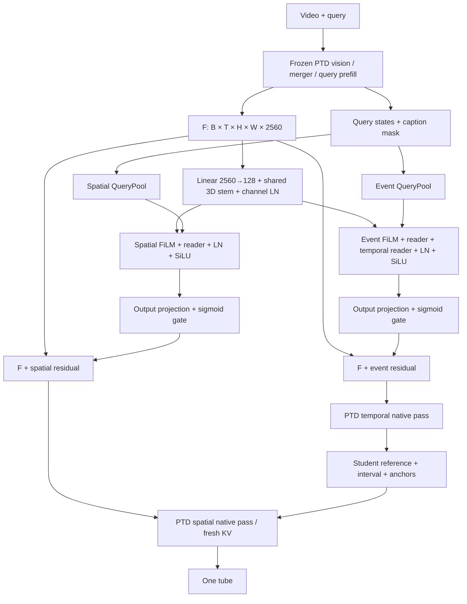

# 从视频到 tube 的代码地图

## 目录分工

```text
desta3d/                     手动编辑工作区
  config.py                  typed defaults + 严格 JSON 校验
  models.py                  adapter factory / 可读 DirectionMixer / pixel API
  cache.py                   sealed cache/basis 读取与 R16 target 投影
  train_cached.py            单 run、固定终态、等 query cosine fit
  __main__.py                inspect / summary / fit-cache
configs/desta3d/             六份可复制的 preset
docs/desta3d/                本阅读入口、参数表、计算图
vg_tta/                     原核心模块与历史机制，旧 pins 不变
scripts/                    一次性注册/worker/scorer/auditor，不作为新调参入口
protocols/                  各历史实验的科学和工程合同
results/                    公开匿名结果（公开仓库）
artifacts/                  本地封存结果/权重/cache，不上传
methods/CURRENT_METHOD.json  生产方法登记，与最新实验目录无关
```

## 先读真实 adapter 路径



代码阅读顺序：

1. [`capture_stock_fields`](../../vg_tta/desta3d_v2_ptd.py)：提取真实 merger grid、query token mask、物理 frame_times。
2. [`Desta3DAdapterV2.forward`](../../vg_tta/desta3d_v2.py)：共享 stem→两个 query-conditioned reader→残差。
3. [`branch_injection`](../../vg_tta/desta3d_v2_ptd.py)：真正插回 merger 的位置和 dtype cast。
4. 同文件 `decode_two_pass` / `spatial_decode_fixed_interval`：event-first，spatial 固定学生条件，fresh KV。
5. [`actuation_full_vocab`](../../vg_tta/desta3d_v3_actuation_full_vocab.py)：native coordinate 全152775词表读出，不把 restricted1001 CE 当成完整 CE。

这里的 3D 是 **T×H×W**，不是物理 XYZ。两路都访问 THW；event auxiliary head 的 `event_logits` 不是 PTD native endpoint logits。`referent_head` 也不是最终 coordinate decoder。

## Joint mixer 与 DirectionMixer 是不同代码路径

最早监督联合 correction 的 [`JointCorrectionMixer`](../../vg_tta/desta3d_v3_joint_mixer.py)：

```text
z128 + qT128 + qS128 + evidence8
  → Linear → SiLU → depthwise 3D local residual → mix → tanh(output256)
  → stock RMS × radius 缩放 → frozen union256 → 同一 residual 进入两个 pass
```

它输出层零初始化，幅度是上界缩放，训练用 native CE。

后来方向拟合、现在整理到 [`DirectionMixer`](../../desta3d/models.py)：

```text
z128 + qT128 + qS128 + evidence8 + state33 = input425
  → input Linear(hidden) → SiLU = h0
  → h0 + SiLU(depthwise3D(h0)) [+ mean_THW(h0)]
  → SiLU(mix Linear) → output Linear(rank)
  → coefficient field [B,T,H,W,rank]
```

这个模型输出层小非零初始化，cached loss 为整体 coefficient cosine。`project` 是另一步固定范数操作。**旧 Joint 的 radius 上界、Direction 的固定范数、pixel dim/blur 是不同机制**，不能因为字段名相似就混用。

## 缓存合同

| 字段 | 形状 | 来源/含义 |
|---|---|---|
| `z` | `[1,T,H,W,128]` | 冻结 B1 shared stem |
| `qT`, `qS` | `[1,128]` | 两个冻结 query pools |
| `evidence8` | `[1,T,H,W,8]` | event、start、end、box occupancy、box known、normalized physical time、y、x |
| `state33` | `[1,T,33]` | native endpoint、interval、coordinate confidence/entropy、support validity、evidence差等 |
| `oracle_coeff256` | `[1,T,H,W,256]` | 由 source-GT native gradient 构造的 sealed oracle |
| `stock_norm` | scalar | 原始 merger F 的 norm |

`state33` 的逐通道定义在 [`compressed_native_state`](../../vg_tta/desta3d_v3_gap_candidates.py)。其中包括 privileged evidence 相对 native box 的差；这个 cache 不能描述成完全无标签输入。

新 `cache.py` 只读取 seal 中的 `cache/train/*/CACHE.pt` 与 `cache/dev/*/CACHE.pt`，不读取原视频或新增 label pool。R16 使用 sealed Train-only `B16`，`target256 @ B16`；绝不在 dev 上重拟合 basis。

## 与旧 checkpoint 的关系

Local / GlobalMean 在同输入维数、内部宽度、rank 与 seed 下，保持原 `input/local/mix/output/basis` state keys、构造顺序和初始值；CPU测试逐值比较 forward、loss 和全部参数梯度。GlobalMean 是无参数前向开关，不能仅凭 state_dict 区分，必须一并保存 JSON。

旧 R16 checkpoint 还含 `union`、`channel_basis` 两个额外 buffer。新工作区从已封存 basis 构造自己的 model，只自动读取 cache 和 basis，不自动导入旧终态；不要删 keys 或 `strict=False` 后称作精确恢复。

## 原生推理、外部 evidence、评分入口

| 环节 | 已锁历史实现 | 当前工作区提供什么 |
|---|---|---|
| LLaVA-ST 生成 | [`external_policy_provider_v2`](../../scripts/desta3d_v3_external_policy_provider_v2.py) | 导航，不自动加载/下载 |
| 官方语法与局部框聚合 | [`llava_st_evidence_parser_v3`](../../vg_tta/llava_st_evidence_parser_v3.py) / [`external_privileged_views`](../../vg_tta/external_privileged_views.py) | 复用原函数 |
| B1/T/S/TS pixels | [`build_views`](../../vg_tta/desta3d_v3_policy_gate_views.py) | `make_pixel_views` 接显式配置 |
| PTD四臂推理及物理支持 | [`external_policy_native`](../../scripts/desta3d_v3_external_policy_native.py) | 代码导航；不自动重跑已结束16例 |
| seal后离线指标 | [`score_external_policy_gate`](../../scripts/score_desta3d_v3_external_policy_gate.py) | 保留原指标，不用训练 cosine 代替 native utility |

PTD 的 Transformers 环境与 LLaVA-ST 环境独立。不要为“统一入口”把两个 loader 导入同一个 Python 进程。
