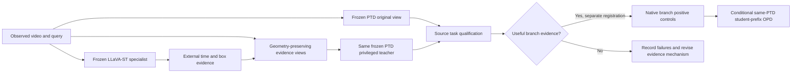

# External-guided Privileged OPD implementation map

Updated2026-09-28. The user cancelled the full-source fit. Its last committed state contains140 query occurrences /35 optimizer steps; that incomplete model is not used as a teacher. Full training is not running. Historical v2 failures and benefits remain available for review.

## Current architecture and boundaries

The external model is an evidence provider. It does not share PTD's tokenizer; its probabilities cannot directly supervise PTD with token KL. The proposed OPD teacher is the same PTD evaluated on a qualified evidence view and recomputed under the student's generated prefix. Adaptation remains **unimplemented and untested**, pending qualification and native controls.

| Component | Implementation | Current validation |
|---|---|---|
| Existing dual residual reader | `vg_tta/desta3d_v2.py` | Historical CPU/GPU audits; weak/mixed task effects retained |
| Official external teacher runtime | `vg_tta/llava_st_teacher.py` | Official model/import path audited; actual weights still downloading at publication |
| Evidence/time mapping and views | `vg_tta/external_privileged_views.py` | Four CPU contract tests pass |
| No-update teacher runner | `scripts/desta3d_v3_external_teacher_qualification.py` | Implemented; register only after full checkpoint integrity |
| Official pinned downloader | `scripts/download_llava_st_official.py` | Active; per-range and final LFS hash validation |
| Full-source training | `scripts/desta3d_v3_source_fit.py` | Cancelled by user at35 committed steps; retained for provenance only |
| Native branch controls / OPD | Protocol conditional stages | Proposed; no new optimizer run |

## Physical support

Use the already-fixed16 source-training parents, one query each. No target input/labels. These are exposed source development samples, with possible overlap in the external teacher's training. A successful source qualification is not target generalization.

The official external architecture has100 fast and20 slow frame positions. To hold observed evidence fixed, repeat nearest observations from the existing7–32-frame PTD input; never decode unseen frames. Save every repeated position and original physical frame ID. External normalized time maps through this piecewise function, not a false uniform-time assumption. This is explicitly a matched-evidence adaptation rather than the paper's100 unique-frame setting.

The temporal view dims frames outside the external interval by0.25. The spatial view blurs outside the external normalized box with radius8 at the original image dimensions. Frame IDs, dimensions, coordinate origin and ordering remain unchanged. Sparse boxes are interpolated only inside explicit support. Missing/invalid evidence keeps the original input and records the failure. All-keep/full-frame evidence must be pixel-identical to the input. Every corrupted teacher, if that stage is later registered, uses that same corrupted observation.

## Runtime and data management

Official repository: https://github.com/appletea233/LLaVA-ST at `bacf6d61e1de27a78fc0025083aa445d3d41b0b3`.

Official model: https://huggingface.co/appletea2333/LLaVA-ST-Qwen2-7B at `2f7261b55b0368e9c2971120b62c77545b3a792d`.

Use the repository's exact Transformers source commit `1c39974a4c4036fd641bc1191cc32799f85715a4` in an isolated import directory with tokenizers0.15.2 and HuggingFace Hub0.29.3. Retain Torch2.7/CUDA128 for RTX5090 support. PTD's Transformers5 runtime is untouched. Inference uses FP16/SDPA, not quantized weights. The complete checkpoint already includes421 SigLIP tensors; construction skips the redundant base-tower download and requires no missing/unexpected tensor keys after checkpoint load. This initialization path is not yet GPU-validated.

Following explicit user cleanup authorization,260.159GB of unneeded weight/data/cache files were removed. All scientific artifacts, code, predictions, failure records, B1 and cancelled-fit checkpoints are retained. Historical exact reruns that need removed generic model weights, fullHC2 archives, fullHC1 extracted training clips or corruption caches require redownload/reconstruction. Configurations and provenance remain. Selected CURRENT is unchanged.

The user requested timely publication of updated code and structure. Weights, videos, captions/annotation manifests, per-query predictions and raw gradients are not published. The old heartbeat was deleted and is not recreated. No automatic source-training restart or production promotion.
