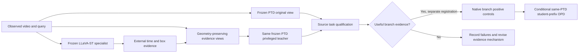

# External-guided Privileged OPD implementation map

**Current route (2026-09-28):** the mainline candidate is [privileged branch-latent adaptation](LATENT_PRIVILEGED_OPD.md). The source six-arm oracle has completed; it has not established correct-evidence advantage. External downloads were paused, then explicitly resumed by the user to finish this pixel-view route as a baseline. This is not a source-fit or OPD restart. Read the current oracle report/decision before interpreting the historical plan below.

Updated2026-09-28. The user cancelled the full-source fit. Its last committed state contains140 query occurrences /35 optimizer steps; that incomplete model is not used as a teacher. Full training is not running. Historical v2 failures and benefits remain available for review.

## Current architecture and boundaries

The external model is an evidence provider. It does not share PTD's tokenizer; its probabilities cannot directly supervise PTD with token KL. The proposed OPD teacher is the same PTD evaluated on a qualified evidence view and recomputed under the student's generated prefix. Adaptation remains **unimplemented and untested**, pending qualification and native controls.

| Component | Implementation | Current validation |
|---|---|---|
| Existing dual residual reader | `vg_tta/desta3d_v2.py` | Historical CPU/GPU audits; weak/mixed task effects retained |
| Official external teacher runtime | `vg_tta/llava_st_teacher.py` | Official model/import path audited; actual weights still downloading at publication |
| Evidence/time mapping and views | `vg_tta/external_privileged_views.py` | Physical-time, many-to-one aggregation, local fallback and gap controls pass; v1 pre-GPU time semantics corrected |
| Official loader/decode smoke | `scripts/desta3d_v3_external_loader_smoke.py` |Two fixed inputs, greedy vs official temp.01, exact actual-loader acceptance locked; GPU pending |
| Four-view PTD qualification | `scripts/desta3d_v3_privileged_ptd_qualification.py` |Original/temporal/spatial/combined B1 policy, no optimizer, implemented; GPU pending |
| Independent seal-first scorer | `scripts/score_desta3d_v3_privileged_qualification.py` |Synthetic16-parent full pipeline and tampered-seal rejection passed; actual scoring pending |
| Future native scopes | `vg_tta/desta3d_v3_native_scopes_v2.py` |Branch query pool and event temporal reader pointwise included at L2; norm_stem remains frozen |
| No-update teacher runner | `scripts/desta3d_v3_external_teacher_qualification.py` | Implemented; register only after full checkpoint integrity |
| Official pinned downloader | `scripts/download_llava_st_official.py` | Active; per-range and final LFS hash validation |
| Full-source training | `scripts/desta3d_v3_source_fit.py` | Cancelled by user at35 committed steps; retained for provenance only |
| Native branch controls / OPD | Protocol conditional stages | Proposed; no new optimizer run |

## Physical support

Use the already-fixed16 source-training parents, one query each. No target input/labels. These are exposed source development samples, with possible overlap in the external teacher's training. A successful source qualification is not target generalization.

The official external architecture has100 fast and20 slow frame positions. To hold observed evidence fixed, define100 uniformly spaced physical clip times and choose the nearest existing7–32-frame PTD observation at each time; ties select the earlier observation. Never decode unseen pixels. Save every requested physical slot and selected original frame ID. External normalized time maps linearly to physical clip start/end independently of repeated pixel IDs. For frame IDs[10,11,90], u=.5 maps to50, not11. The old index/piecewise rule and its CPU test were a pre-GPU contract error; their original evidence is retained. This is explicitly a matched-evidence adaptation rather than the paper's100 unique-frame setting.

The temporal view dims frames outside the external interval by0.25. The spatial view blurs outside the external normalized box with radius8 at the original image dimensions. Frame IDs, dimensions, coordinate origin and ordering remain unchanged. Many-to-one boxes are median-aggregated per physical observation; raw boxes, duplicate counts, pairwise IoUs and dispersion remain. Invalid boxes are local fallbacks, not whole-video rejection. Sparse boxes interpolate in physical time between valid anchors, without extrapolation and without crossing an invalid-only anchor. Support counts, coverage and maximum gaps are reported; no gap or discrepancy threshold is tuned in this version. Missing/invalid local evidence keeps the original pixels and records the failure. All-keep/full-frame evidence must be pixel-identical to the input. Every corrupted teacher, if that stage is later registered, uses that same corrupted observation.

## Runtime and data management

Official repository: https://github.com/appletea233/LLaVA-ST at `bacf6d61e1de27a78fc0025083aa445d3d41b0b3`.

Official model: https://huggingface.co/appletea2333/LLaVA-ST-Qwen2-7B at `2f7261b55b0368e9c2971120b62c77545b3a792d`.

Use the repository's exact Transformers source commit `1c39974a4c4036fd641bc1191cc32799f85715a4` in an isolated import directory with tokenizers0.15.2 and HuggingFace Hub0.29.3. Retain Torch2.7/CUDA128 for RTX5090 support. PTD's Transformers5 runtime is untouched. Inference uses FP16/SDPA, not quantized weights. The complete checkpoint already includes421 SigLIP tensors; construction skips the redundant base-tower download and requires no missing/unexpected tensor keys after checkpoint load. The new smoke compares this path against actual official load_lora_model with a separately pinned official SigLIP cache: full parameter hashes, processed pixels, first vision features and generated IDs. Both explicitly set max_frame100. Official temp.01 sampling and deterministic greedy are compared on two preselected queries. No GPU equivalence is claimed before that run.

Following explicit user cleanup authorization,260.159GB of unneeded weight/data/cache files were removed. All scientific artifacts, code, predictions, failure records, B1 and cancelled-fit checkpoints are retained. Historical exact reruns that need removed generic model weights, fullHC2 archives, fullHC1 extracted training clips or corruption caches require redownload/reconstruction. Configurations and provenance remain. Selected CURRENT is unchanged.

The user requested timely publication of updated code and structure. Weights, videos, captions/annotation manifests, per-query predictions and raw gradients are not published. The old training heartbeat stays deleted; the user subsequently authorized a single Luna max check every30min on the new route, with root handling anomalies. No automatic source-training restart or production promotion.

Read the corrected pre-GPU contract in [external_privileged_opd_v2](../../protocols/desta3d_v3_external_privileged_opd_v2.md). Q0 uses exposed source-training parents. Official ST-Align stage3 metadata explicitly includes STVG/SVG/ELC from VidOR, so video-level disjointness cannot be claimed for this VidSTG panel. No provenance-clean Q1 panel has been established.

Subsequent pixel baseline stages must use `scripts/desta3d_v3_external_resume.py` with the [accounting addendum](../../protocols/desta3d_v3_external_resume_accounting_v1.md) to include completed oracle receipts. This same-process entry changes registration/accounting only;2CPU controls passed, original scientific helpers/pins retained.
