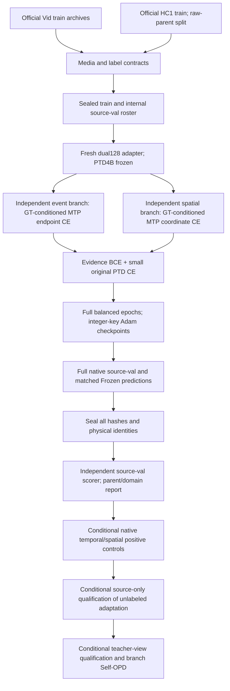

# DESTA-3D v3: implementation and evidence map

This route was authorized by user attachment6e648ae6 on2026-09-28. The active source configuration and data contracts are new; completed v2 controls remain historical evidence. This page distinguishes implemented interfaces from later conditional research stages.

| Component | Entry | Actual status |
|---|---|---|
| Full metadata / HC original extraction | `scripts/prepare_desta3d_v3_source.py` | Completed;85,184 intended queries/4,500 HC clips |
| Full original media probe | `scripts/audit_desta3d_v3_media.py` |9,936 completed;38 HC failures preserved |
| Same-clip HC repair | `scripts/repair_desta3d_v3_hc_media.py` |36 exact-annotation same-clip repairs;byte differences disclosed |
| Sealed labels and input identities | `scripts/build_desta3d_v3_source_roster.py` |85,181 accepted;3 media-contract quarantines;no outcome selection |
| Exact physical grid and bounded archive extraction | `vg_tta/desta3d_v3_data.py` |CPU contracts and full roster audited;actual pixels verified per use |
| Explicit structured source losses | `vg_tta/desta3d_v3_source.py` |CPU and4 real GPU backwards passed;GT-conditioned prefix, not native-control equivalence |
| Full training / checkpointing | `scripts/desta3d_v3_source_fit.py`, `vg_tta/desta3d_v3_training.py` |Registered and running;initial12query/3actualAdam steps safely paused and resumed |
| Native source-val / independent readback | training runner, `scripts/score_desta3d_v3_source_fit.py` |Code and CPU scalar/tensor controls ready;no complete new validation epoch yet |
| Branch scopes | `configure_branch` in source module |CPU-tested L0 branch FiLM/LN33280, sharedLN frozen;future real native positive controls pending |
| Shared detached referent pooling | `detached_referent_pool` in source module |CPU utility tested, defaultOFF;not adopted by training |
| Evidence-view Self-OPD | route protocol |Conditional hypothesis;teacher qualification and OPD not implemented/executed yet |

Full source is large: train72,454 Vid query/4,106 HC query, 4,892/169 raw parents. Internal source-val8,230/391 query,544/19 parents. A balanced epoch contains144,908 occurrences (HC repeats explicitly),36,227 updates; maximum5 epochs181,135 updates, warmup9,057. An hour allocation is a safety review, not an epoch. Source-val selection can stop after at least3 completed epochs and patience2. Never extrapolate first-window loss into task improvement.

Authoritative entries: `protocols/desta3d_v3_full_source_route_v1.md`, `protocols/desta3d_v3_source_fit_v1.md`, `artifacts/desta3d_v3/full_source_roster_v1/{SUMMARY,ROOT_ROSTER_READBACK,QUARANTINE}.json`, `artifacts/desta3d_v3/full_source_fit_v1/{CONFIG,LOCK,REGISTRATION,CPU_PREFLIGHT}.json`. The root checkpoint audit checks all committed window order, actual per-parameter counters, live optimizer binding, RNG and hashes. It reads no predictions or labels.

Target data are absent from this worker. Historical target development exposure is retained. HC2 validation overlaps HC1 source parents, so old HC2 panels are not independent tests of the new mixed-source model. CURRENT and old queues remain unchanged; the deleted automation is not recreated. Read `docs/RESEARCH_HISTORY.md` for current measured progress and receipt totals.
