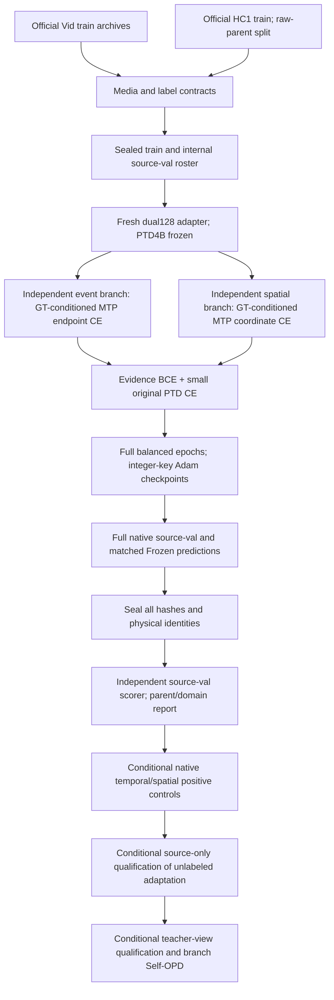

# 最新：源可控性与同范数位置对照已完成

已按附件完成自由merger→冻结输出列空间→旧mask链，以及同16源的early/late×correct/wrong无更新对照。自由/列空间在两个监督源上改善，但等效latent更新巨大，不能据此声称易学。位置对照未支持“提前mask即可修好”：正确性差值early−late，时间−4.899pp CI跨0、空间+.1298pp CI跨0；错误负控本身退化与全部负尾保留。

先看[位置主表/匿名16例/全部CI](results/desta3d_v3/2026-09-28/SOURCE_LOCATION.json)、[裁决与局限](results/desta3d_v3/2026-09-28/SOURCE_LOCATION.md)、[三层正控表](results/desta3d_v3/2026-09-28/ACTUATION_CHAIN.md)。location144输出/0optimizer，6CPU控制、432几何、7628margin、174+36汇总二核通过。当前所有GPU结束，累计42173.00594093104秒cap=null；源GT诊断非TTA，无target/OPD/64。后续context机制需先固定operator/幅度另登记，当前未跑。外部pixel baseline仍在授权内、须先official smoke。

## 以下为历史记录，当前状态以本节为准

# 最新：三层源可控性诊断已完成并独立核验

时间病例的自由残差与冻结输出列空间控制均把tIoU从29.17%提高至68.06%；空间先暴露坐标类CE与原生全词表argmax的支持差别，保留格式失败后，仅修loss分母得到sIoU59.65→74.88%，列空间控制为73.83%。原模型/门控全部冻结，固定30步、无best选择。

关键限制：列空间控制等效latent改变量为原latent的2698/5310倍；它证明两个源病例存在可达方向，不证明reader容易学会，更不是OPD/target收益。旧mask与监督控制不是纯位置单因素。下一检验同norm的before/after reader和正确/错误mask；尚未运行。

见[完整对照表](results/desta3d_v3/2026-09-28/ACTUATION_CHAIN.md)、[机器聚合及校验](results/desta3d_v3/2026-09-28/ACTUATION_CONTROL.json)、[解释与实现](docs/desta3d_v3/ORACLE_FAILURE_DIAGNOSIS.md)。所有失败、旧oracle负数和原始数据本地保留；公开不含权重、标签、caption、预测raw。GPU累计41976.21386800704秒，cap=null。官方外部权重下载已完成，后续pixel baseline尚待独立smoke/qualification。

## 以下为历史记录，当前状态以本节为准

> Current diagnostic: [free-merger native controls and objective correction](ORACLE_FAILURE_DIAGNOSIS.md). These optimize standalone token deltas with model weights frozen, not the L0–L3 adapter scopes. Source preparation below remains cancelled.

# DESTA-3D v3: implementation and evidence map

**Current route (2026-09-28):** the mainline candidate is [privileged branch-latent adaptation](LATENT_PRIVILEGED_OPD.md). The source six-arm oracle has completed; it has not established correct-evidence advantage. External downloads were paused, then explicitly resumed by the user to finish this pixel-view route as a baseline. This is not a source-fit or OPD restart. Read the current oracle report/decision before interpreting the historical plan below.

This route was authorized by user attachment6e648ae6 on2026-09-28. The full-source fit was cancelled by the user at140 query occurrences /35 committed Adam steps. Its checkpoint is retained for provenance only and is not eligible as a source-prepared model, teacher or OPD state. The active external-evidence route is documented in EXTERNAL_PRIVILEGED_OPD.md; completed v2 controls remain historical evidence. This page distinguishes implemented interfaces from later conditional research stages.

The following diagram describes the **cancelled historical source-preparation route**, not the active execution queue.

| Component | Entry | Actual status |
|---|---|---|
| Full metadata / HC original extraction | `scripts/prepare_desta3d_v3_source.py` | Completed;85,184 intended queries/4,500 HC clips |
| Full original media probe | `scripts/audit_desta3d_v3_media.py` |9,936 completed;38 HC failures preserved |
| Same-clip HC repair | `scripts/repair_desta3d_v3_hc_media.py` |36 exact-annotation same-clip repairs;byte differences disclosed |
| Sealed labels and input identities | `scripts/build_desta3d_v3_source_roster.py` |85,181 accepted;3 media-contract quarantines;no outcome selection |
| Exact physical grid and bounded archive extraction | `vg_tta/desta3d_v3_data.py` |CPU contracts and full roster audited;actual pixels verified per use |
| Explicit structured source losses | `vg_tta/desta3d_v3_source.py` |CPU and4 real GPU backwards passed;GT-conditioned prefix, not native-control equivalence |
| Full training / checkpointing | `scripts/desta3d_v3_source_fit.py`, `vg_tta/desta3d_v3_training.py` |Cancelled by user at140 query occurrences /35 committed steps; checkpoint retained for provenance only; not eligible as source-prepared model |
| Native source-val / independent readback | training runner, `scripts/score_desta3d_v3_source_fit.py` |Code and CPU scalar/tensor controls ready;no complete new validation epoch yet |
| Future native branch scopes | `vg_tta/desta3d_v3_native_scopes_v2.py` |CPU-tested nested L0–L3; L2 includes branch query pool and event temporal pointwise; L3 shared projection/conv with norm_stem frozen; real controls pending |
| Shared detached referent pooling | `detached_referent_pool` in source module |CPU utility tested, defaultOFF;not adopted by training |
| Privileged PTD qualification | `scripts/desta3d_v3_privileged_ptd_qualification.py` |Four-view runner and seal-first independent scorer implemented/CPU-tested; actual GPU qualification pending |
| Evidence-view Self-OPD | route protocol |Conditional hypothesis; optimizer not implemented or executed |

Full source is large: train72,454 Vid query/4,106 HC query, 4,892/169 raw parents. Internal source-val8,230/391 query,544/19 parents. A balanced epoch contains144,908 occurrences (HC repeats explicitly),36,227 updates; maximum5 epochs181,135 updates, warmup9,057. An hour allocation is a safety review, not an epoch. Source-val selection can stop after at least3 completed epochs and patience2. Never extrapolate first-window loss into task improvement.

Authoritative entries: `protocols/desta3d_v3_full_source_route_v1.md`, `protocols/desta3d_v3_source_fit_v1.md`, `artifacts/desta3d_v3/full_source_roster_v1/{SUMMARY,ROOT_ROSTER_READBACK,QUARANTINE}.json`, `artifacts/desta3d_v3/full_source_fit_v1/{CONFIG,LOCK,REGISTRATION,CPU_PREFLIGHT}.json`. The root checkpoint audit checks all committed window order, actual per-parameter counters, live optimizer binding, RNG and hashes. It reads no predictions or labels.

Target data are absent from this worker. Historical target development exposure is retained. HC2 validation overlaps HC1 source parents, so old HC2 panels are not independent tests of the new mixed-source model. CURRENT and old queues remain unchanged. The user separately requested a Luna max monitor every30min for the active download/qualification route; it cannot restart cancelled training. Read `docs/RESEARCH_HISTORY.md` for current measured progress and receipt totals.
