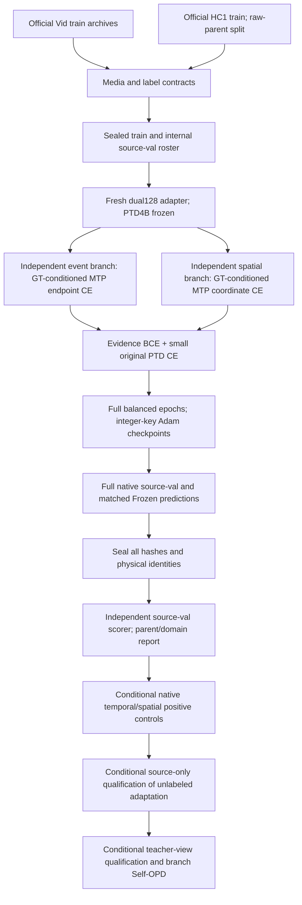

# Latest update: 2026-09-29 A0.3 completed

A Train-only query-balanced shared channel basis passes the exposed Dev64 structure gate (rank32 median energy86.1936%). Norm-matched native Shared-R16 and Shared-R32 both pass: Δt/s/v vs B1 are +9.0271/+9.2265/+10.9384pp and +9.0739/+10.4231/+12.5314pp. R16/R32 retain83.39%/95.53% of Full Oracle vIoU gain. The registered priority selects **fixed shared-rank16 factorized predictor as the next candidate only**; no learned low-rank network was implemented or trained.

Negative tails remain: v harm>5pp on6/5 queries; B1-good v retained14/17 and13/17. Source-GT oracle,16 exposed parents, descriptive CIs; not fresh/target or ordinary-input learnability. All256 predictions sealed; full scalar/tensor and independent source-parent audits passed. Original CPU hash audit failed from OpenBLAS4 versus original20; isolated v2 reconstructed every delta hash without GPU rerun or changing predictions/tolerances. Original failure retained. No full/fresh/expert/gate/OPD expansion.

[Full anonymous A0.3 results](../../results/desta3d_v3/2026-09-29/A03_SHARED_CHANNEL_BASIS.md).

Earlier entries retain their historical state.

# Latest update: 2026-09-29 A0.2 and structure audit completed

A0.2 completed with zero added parameters and exact original H128 initialization. GMean200 train/dev medians .007042/.001827; GMean2000 .007718/.001876: neither passes. Stop global-context/width/step tuning. Conditional full192 cached CPU structure audit also completed: global means explain only .029656%/.032596% energy (train/dev); per-time spatial means .655224%/.636620%; per-query rank16 captures90.437770%/91.370581%. T/H/W neighbor cosine means are approximately .1. Low channel rank coexists with strongly varying THW directions; it does not prove predictable factors or native utility. No new architecture, PTD/native/fresh/full/expert/OPD/target run. Full report: [A0.2 and structure audit](../../results/desta3d_v3/2026-09-29/A02_GLOBAL_CONTEXT.md).

Earlier entries retain their historical state.

# Latest update: 2026-09-29 A0.1 completed

A0.1 cached-only triage completed and independently audited. W256/S200 train/dev medians .007140/.002261; H128/S2000 .007310/.001842. Both fail. Hash-fixed Q1 H128/S2000 cosine .955796 passes the engineering fitability control. Stop width/step tuning; next candidate only global THW context conditioning, not implemented or run. No PTD/native/fresh/full expansion. Three workers/wrappers107.402s; full576 coefficient cosine audit max2.088e-14. H128 at200 exactly matches A0 parameters and Adam state. See [complete result](../../results/desta3d_v3/2026-09-29/A01_FITABILITY.md).

Earlier entries below retain their historical status.

# Current: A0 completed in31.8min; direction gate failed

|Direction cosine|Train128 /95parents|Dev64 /16parents|
|---|---:|---:|
|Mean|0.029865917|0.024222450|
|Median|0.007693602|0.002401304|

192/192 directions defined. Fixed existing StateAwareDirectionMixer, one seed,200 actual AdamW steps/800 query occurrences, only coefficient cosine loss. **Dev median<0.1 and Train median<0.3: capacity/optimization screening branch.** Native inference was correctly skipped; there is no A0 native t/s/v result, full618/447 expansion or fresh388 use.

The cache completed128 new source native captures/253 backwards; Dev64 reused all native/oracle evidence and only extracted missing frozen features. Complete NumPy projection/state/cosine audits passed. All8 tensors changed, clip0, frozen union unchanged, Adam integer/live counters200. Weak fit is not a proven capacity root cause. Source GT privilege and exposed development are explicit.

[Full anonymous results](../../results/desta3d_v3/2026-09-29/A0_FAST_SCREEN.md) and [machine-readable report](../../results/desta3d_v3/2026-09-29/A0_FAST_SCREEN.json). GPU exited and this A0 monitor was deleted. Only proposed next: internal width128→256, preserving feature128/state33/cache/loss/radius/steps. It has not run. Prior negative results and the CPU controller compatibility repair are retained.

## Historical registration and earlier results

# Current: A0 fast-screen registered and caching

The completed447 Gap audit is retained below. The next authorized run is a small direction screen, not full618. Fixed SHA256 metadata selection gives Train128 covering95 training parents and exposed Dev64/16 parents (four queries each). Fresh31/388 stays untouched.

Existing StateAwareDirectionMixer, hidden128/state33/union256, radius0.13545580427763146. One seed,200 AdamW steps, batch4, lr0.001/wd0/clip1, only global coefficient cosine loss. Train cache has frozen B1 native endpoint/full-vocabulary coordinate gradient targets. Dev oracle and complete native states reuse sealed artifacts; only absent frozen features are re-extracted. No PTD is loaded for cached training.

Only terminal Dev median cosine>=0.1 allows Dev64 native evaluation. Below the gate: train median<0.3 suggests capacity/optimization, otherwise conditioning/generalization. These are screening categories, not causal proofs. Native v<=0 directs a later trust/no-op hypothesis; positive v without systematic branch collapse only qualifies for separately registered expansion. No automatic full training, fresh confirmation, expert, OPD or target stage.

CPU3 controls and first real cache independent projection/state check passed. Overall cache/training/native efficacy remains pending. [Protocol](../../protocols/desta3d_v3_a0_fast_screen_v1.md). Conditional native runner is implemented separately and locked only if the direction gate passes. Private media, labels, raw and weights remain local.

---

## Current: gap audit completed, A recommended; no new training

本轮447query/31已曝光源父源诊断完成，1788预测、873backward、0optimizer，全部封存、full raw和两级独立评分核验通过。**DECISION=A：优先state-aware方向蒸馏；新训练尚未启动。**

| 父源宏 | tIoU % | sIoU % | vIoU % | Δv vs B1，pp |
|---|---:|---:|---:|---:|
| B1 | 46.637512 | 48.627481 | 32.407600 | — |
| Learned seed1 | 46.887168 | 47.764785 | 32.167599 | −0.240001 |
| Learned seed2 | 46.741185 | 48.246816 | 32.295832 | −0.111768 |
| Analytic Joint oracle | 53.402853 | 60.069317 | 44.679649 | +12.272049 |

Oracle Δv的配对父源95%CI为[+8.979625,+15.496381]pp，29正2负父源；对两seed分别+12.512050/+12.383817pp，CI下界均>9pp。两个learned/oracle方向cos均值仅.001459/.001767，中位.000697/.000833；444定义、3缺支持不定义。Oracle gain/learned harm为128/117query。虽均贴norm cap，但方向接近正交，未满足“方向对、幅度错”的B规则。

**正均值不等于完整teacher资格。** Oracle仍有2个父源v损害>5pp、66个query v损害>5pp，native-good v保持122/136、t保持164/199，未通过尾部和原好保持门。sourceGT诊断、非held-out/target结果；局部对齐不能证明native-state缺失是因果，A仍需单独真实接口/源训练验收。A/B/C只有CPU模块与协议，新31父源388query确认保持metadata-only；无自动expert/OPD/target/网格。

[完整匿名结果与限制](../../results/desta3d_v3/2026-09-29/ORACLE_MIXER_GAP.md)；同目录JSON保留全部31父源和9类结果组合。以下运行中记录保留为历史，不代表仍有GPU任务。

---

## Current: frozen Oracle–Mixer Gap Audit running; follow-ups CPU only

原两seed训练与447query确认已完成，负结果保留。当前仅进行同447/31已曝光源集合的冻结解析oracle诊断，首例真实接口和独立raw核验通过，尚无全量新效用结论。A方向蒸馏、B trust/no-op gate、C rescue骨架及31父源/388query新metadata确认名单已事先锁定，CPU检查通过，未启动其GPU训练或救援实验。

[当前协议、实现入口和限制](ORACLE_MIXER_GAP.md)。下面旧状态记录保留为历史。

---

## Current: joint mixer completed and audited; source teacher qualification not passed

Both fixed training seeds and all1,341 confirmation predictions are complete.
Parent-macro vIoU vs B1 is -0.240001pp and -0.111768pp, both CIs crossing zero;
temporal means rise slightly, spatial means decline, native-good retention is
incomplete. The registered qualification is not passed. No expert/OPD/target
stage starts. See [complete two-seed native result](../../results/desta3d_v3/2026-09-28/JOINT_LEARNABILITY_CONFIRMATION.md)
and [all31 anonymous parent results](../../results/desta3d_v3/2026-09-28/JOINT_LEARNABILITY_CONFIRMATION.json).
All earlier status entries below are historical; no training is running.

## Current: both learned-mixer training seeds complete, confirmation inference running

Both fixed seeds completed 618 queries / 95 parents / 155 actual Adam calls.
Seed one passes the preserved CPU audit v2; seed two passes isolated v3, which
accepts valid captured endpoint support even when generation format fails and
the spatial pass is not started. No GPU or scientific configuration changed.
See [both-seed training and audit record](../../results/desta3d_v3/2026-09-28/JOINT_LEARNABILITY_BOTH_TRAINING.md).
The 447-query, three-arm confirmation is running and has not been scored.
Older entries below record their historical state, not a current running queue.

## Latest: first learned-mixer seed complete, confirmation pending

Seed20260928 completed618queries/95parents/155actualAdam calls with audited integer states, frozen union and deterministic coverage. Seed20260929 is running. One training event-format failure is retained; missing support is explicitly counted. The first CPU auditor had an overly strict two-pass assertion; isolated v2 matches the existing early-failure contract without any GPU/scientific change. See [full training accounting](../../results/desta3d_v3/2026-09-28/JOINT_LEARNABILITY_SEED1_TRAINING.md). No confirmation utility or teacher advantage has been measured yet.

## Latest: learned joint mixer implemented, real probe passed, fit running

C_theta has103424 parameters; frozen PTD4B/B1 and256-dimensional union. Only C is optimized. Four CPU controls and real zero-native/replay equality, full152775-class coordinate objective, frozen scope and disposable Adam/reset passed. Fixed2seeds x618queries/95parents train;447queries/31 newly locked source confirmation parents. Native utility is not measured yet. See [learnability protocol](../../protocols/desta3d_v3_joint_learnability_v1.md). Historical31val exposure remains; no globally untouched claim. Finite component oracle deferred; no expert/OPD/target started. Old status paragraphs below are historical.

## Latest: Joint component CPU attribution completed (2026-09-28)

Current candidate: **Decomposed Evidence, Joint Correction**. Independent correction as the principal-method hypothesis is withdrawn. All16 saved cases show local complementary span contributions, while gradient-input cross effects remain9positive/7negative. No isolated-component native effect, joint mixer, expert or OPD has been measured. See [candidate boundaries](JOINT_CORRECTION_CANDIDATE.md) and [full attribution results](../../results/desta3d_v3/2026-09-28/JOINT_COMPONENT_ATTRIBUTION.md). Four synthetic CPU controls and1570 independent raw scalar checks passed; GPU increment0. Previous implementation/status entries below are historical, not an active queue.

## Latest: PANEL16 decomposition oracle completed

Six-arm96native /32 shared-F backwards /128 finite support reads /0optimizer, independently audited. See DECOMPOSITION_ORACLE.md and public result aggregates. No next stage auto-started; old scalar/full-source STOP remains.

## Latest: saved direction audit completed (2026-09-28)

CPU-only direction_alignment_v2: two prior selected source cases, exact B1/native support, full initial merger gradient (not low-dimensional parameter gradient), fixed span30 and all8 mask variants per case. Temporal late/context masks have adverse initial local CE dots; spatial masks have favorable but weaker dots and retained native gains. A shared sign-reversal root cause is not established. No prototype, reader training or OPD was launched; scalar-mask STOP remains. See the complete anonymous DIRECTION_ALIGNMENT results and audit protocol. Original v1 metadata-schema failure is preserved. No new GPU, cumulative42493.15652965409s.

Historical entries below retain their original time-specific meaning.

## Current context-support stage

Completed/audited context001: new context_mask helper, prepare script, five-arm
runner, seal-first independent scorer and root case/grammar readbacks. Same16
source parents,80native/0updates. Teacher directionality gates not established;
stop scalar-mask variants. Directional residual remains proposed/untested; no
actual-reader learning/OPD, no external GPU qualification or target expansion.
Full-source fit remains cancelled; original35step checkpoint is provenance only.

# DESTA-3D v3: implementation and evidence map

**Current route (2026-09-28):** sharedTHW/dual-reader privileged branch-latent diagnosis. Free and frozen-span controls established two-source reachability; small-norm location and fixed large-mask controls are completed, without a net privileged teacher advantage. Large-mask5arms/80native/0optimizer and all positive/negative outcomes are audited. Actual-reader learnability and OPD remain untested. External downloads are complete, but pixel/external GPU is deferred by the latest bounded source experiment. The full-source fit remains cancelled. Read the latest research/archive and public review entry before older plans below.

This route was authorized by user attachment6e648ae6 on2026-09-28. The full-source fit was cancelled by the user at140 query occurrences /35 committed Adam steps. Its checkpoint is retained for provenance only and is not eligible as a source-prepared model, teacher or OPD state. The deferred external-evidence baseline is documented in EXTERNAL_PRIVILEGED_OPD.md; completed v2 controls remain historical evidence. This page distinguishes implemented interfaces from later conditional research stages.

The following diagram describes the **cancelled historical source-preparation route**, not the active execution queue.

| Component | Entry | Actual status |
|---|---|---|
| Full metadata / HC original extraction | `scripts/prepare_desta3d_v3_source.py` | Completed;85,184 intended queries/4,500 HC clips |
| Full original media probe | `scripts/audit_desta3d_v3_media.py` |9,936 completed;38 HC failures preserved |
| Same-clip HC repair | `scripts/repair_desta3d_v3_hc_media.py` |36 exact-annotation same-clip repairs;byte differences disclosed |
| Sealed labels and input identities | `scripts/build_desta3d_v3_source_roster.py` |85,181 accepted;3 media-contract quarantines;no outcome selection |
| Exact physical grid and bounded archive extraction | `vg_tta/desta3d_v3_data.py` |CPU contracts and full roster audited;actual pixels verified per use |
| Explicit structured source losses | `vg_tta/desta3d_v3_source.py` |CPU and4 real GPU backwards passed;GT-conditioned prefix, not native-control equivalence |
| Full training / checkpointing | `scripts/desta3d_v3_source_fit.py`, `vg_tta/desta3d_v3_training.py` |Cancelled by user at140 query occurrences /35 committed steps; checkpoint retained for provenance only; not eligible as source-prepared model |
| Native source-val / independent readback | training runner, `scripts/score_desta3d_v3_source_fit.py` |Code and CPU scalar/tensor controls ready;no complete new validation epoch yet |
| Future native branch scopes | `vg_tta/desta3d_v3_native_scopes_v2.py` |CPU-tested nested L0–L3; L2 includes branch query pool and event temporal pointwise; L3 shared projection/conv with norm_stem frozen; real controls pending |
| Shared detached referent pooling | `detached_referent_pool` in source module |CPU utility tested, defaultOFF;not adopted by training |
| Privileged PTD qualification | `scripts/desta3d_v3_privileged_ptd_qualification.py` |Four-view runner and seal-first independent scorer implemented/CPU-tested; actual GPU qualification pending |
| Evidence-view Self-OPD | route protocol |Conditional hypothesis; optimizer not implemented or executed |

Full source is large: train72,454 Vid query/4,106 HC query, 4,892/169 raw parents. Internal source-val8,230/391 query,544/19 parents. A balanced epoch contains144,908 occurrences (HC repeats explicitly),36,227 updates; maximum5 epochs181,135 updates, warmup9,057. An hour allocation is a safety review, not an epoch. Source-val selection can stop after at least3 completed epochs and patience2. Never extrapolate first-window loss into task improvement.

Authoritative entries: `protocols/desta3d_v3_full_source_route_v1.md`, `protocols/desta3d_v3_source_fit_v1.md`, `artifacts/desta3d_v3/full_source_roster_v1/{SUMMARY,ROOT_ROSTER_READBACK,QUARANTINE}.json`, `artifacts/desta3d_v3/full_source_fit_v1/{CONFIG,LOCK,REGISTRATION,CPU_PREFLIGHT}.json`. The root checkpoint audit checks all committed window order, actual per-parameter counters, live optimizer binding, RNG and hashes. It reads no predictions or labels.

Target data are absent from this worker. Historical target development exposure is retained. HC2 validation overlaps HC1 source parents, so old HC2 panels are not independent tests of the new mixed-source model. CURRENT and old queues remain unchanged. The user separately requested a Luna max monitor every30min for the active download/qualification route; it cannot restart cancelled training. Read `docs/RESEARCH_HISTORY.md` for current measured progress and receipt totals.
