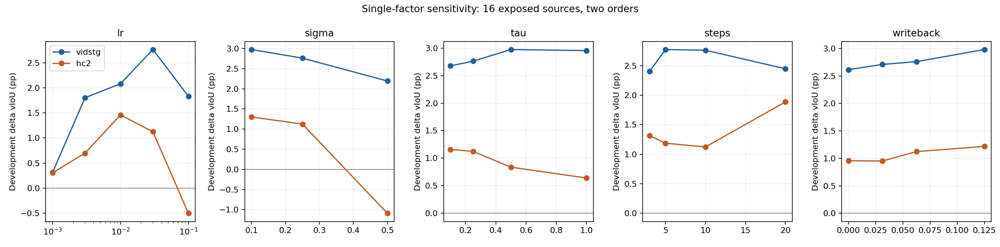
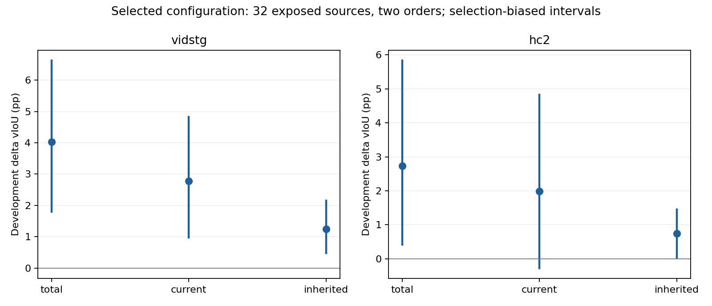

# DeCoTA Spatial OPD：有限参数搜索

VidSTG 与 HC2 各选择一套统一参数。下表来自历史曝光开发来源，
用于选参；CI 描述这些开发样本，不是经过调参后的独立效能证据。

| Target | lr | sigma | tau | steps | LN writeback | ΔvIoU (pp) | current / inherited (pp) | >20pp harm sources / cells |
|---|---:|---:|---:|---:|---:|---:|---:|---:|
| vidstg | 0.03 | 0.1 | 0.25 | 10 | 0.125 | 4.026 [1.793, 6.630] | 2.774 / 1.252 | 0 / 0 |
| hc2 | 0.03 | 0.1 | 0.25 | 20 | 0.0625 | 2.734 [0.414, 5.837] | 1.987 / 0.747 | 0 / 0 |

vidstg 的敏感参数：lr, sigma。16来源单因素筛查后，
在32来源双序上进行12次坐标提案，实际6个独立配置（重复提案复用）。
本数据集共22个完整评分配置、0个保留但未评分的数值无效配置。

hc2 的敏感参数：sigma, lr。16来源单因素筛查后，
在32来源双序上进行12次坐标提案，实际5个独立配置（重复提案复用）。
本数据集共20个完整评分配置、1个保留但未评分的数值无效配置。

数值无效配置保留：hc2 refine_02，{'lr': 0.1, 'sigma': 0.25, 'tau': 0.25, 'steps': 20, 'writeback': 0.0625, 'samples': 32}，失败前保存57条。该配置未评分、不能获选，没有跳过失败query或用fallback补分。

Native WHEN、单DINO、Uniform4、原admission/Top1、1792参数、M32 antithetic与真实likelihood结构均固定。
GPU预测封存后才进行开发集评分。未使用原128确认来源挑参数，没有新增主方法全量、corruption或其他消融。
不同筛查/细化阶段的来源数不同，不能把16来源默认值与32来源获选值直接解释成调参的配对收益。

独立复核覆盖252个指标聚合与1664个预测文件哈希；当前/继承/总收益分开，负尾与数值失败保留。
原baseline从完整Adam/LN与已保存输出链续接。HC源训练媒体缺失仍是完整EATA的依赖，不用目标验证数据替代。
GT没有进入在线loss、admission、输出轮次或reset。调参后的独立效能检验仍待另行授权。

完整评分配置的累计GPU fit时间：Vid 294.48s、HC 358.34s；capture时间分别671.72s、854.29s，独立CPU math分别6.20s、9.55s。调参controller实际墙钟3313.42s。这些fit/capture累计只覆盖42个完整评分配置，资格检查、数值失败前缀、启动与收尾开销未混入；不能称全pipeline平均成本。

正负source案例见COST_AND_CASES.json，按每source两序平均ΔvIoU列出各集最大三项正例和最大三项负例；案例仅匿名开发来源，没有视频、原框或标注。HC current CI仍跨零，不能把获选总收益称为独立双数据集稳定纠正证据。
