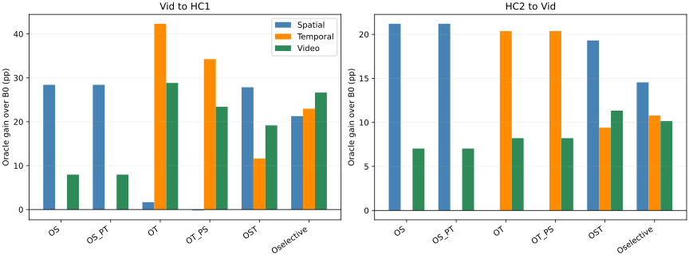
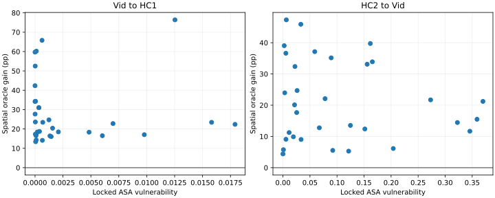

# TA-STVG Round2 — Causal Evidence & Correctability Audit

**Completed / independently read back.** Same64 historically exposed development parents,32 per direction. Ground truth is intentionally used for oracle optimization; these are not unlabeled TTA scores. Model weights and text H stay frozen. Round3/expert methods and PTD resumption were not run.

## Native oracle outcomes

Values are percent. Changes and95% parent bootstrap CIs are percentage points. Native sIoU scores all GT-valid boxes independently of the predicted temporal support; tube-supported sIoU additionally charges missing final-tube support. Each parent contributes one query. All finite terminal states are retained; no best-GT-metric step selection.

### Vid → HC1 (n=32)

|Arm|sIoU|tIoU|vIoU|Δs [CI]|Δt [CI]|Δv [CI]|v harm >5pp|
|---|---:|---:|---:|---|---|---|---:|
|B0|64.128|31.562|22.463|—|—|—|—|
|OS|92.542|31.562|30.415|+28.414 [+23.150, +34.527]|+0.000 [+0.000, +0.000]|+7.952 [+5.337, +10.984]|0|
|OS_PT|92.542|31.562|30.415|+28.414 [+23.150, +34.527]|+0.000 [+0.000, +0.000]|+7.952 [+5.337, +10.984]|0|
|OT|65.798|73.886|51.302|+1.670 [-0.135, +4.590]|+42.324 [+33.608, +50.784]|+28.839 [+22.080, +35.576]|1|
|OT_PS|63.920|65.827|45.871|-0.208 [-0.502, +0.039]|+34.265 [+24.602, +43.732]|+23.408 [+16.032, +30.781]|2|
|OST|91.985|43.174|41.642|+27.857 [+22.559, +33.999]|+11.612 [+5.466, +18.156]|+19.179 [+13.183, +25.458]|0|
|Oselective|85.411|54.532|49.117|+21.283 [+17.272, +26.153]|+22.970 [+15.894, +30.106]|+26.654 [+20.683, +32.670]|1|

### HC2 → Vid (n=32)

|Arm|sIoU|tIoU|vIoU|Δs [CI]|Δt [CI]|Δv [CI]|v harm >5pp|
|---|---:|---:|---:|---|---|---|---:|
|B0|39.428|39.340|16.471|—|—|—|—|
|OS|60.627|39.340|23.498|+21.200 [+16.883, +25.700]|+0.000 [+0.000, +0.000]|+7.026 [+5.038, +9.251]|0|
|OS_PT|60.627|39.340|23.498|+21.200 [+16.883, +25.700]|+0.000 [+0.000, +0.000]|+7.026 [+5.038, +9.251]|0|
|OT|39.425|59.703|24.679|-0.003 [-0.051, +0.051]|+20.363 [+12.855, +29.238]|+8.208 [+4.541, +12.530]|0|
|OT_PS|39.425|59.703|24.679|-0.003 [-0.051, +0.051]|+20.363 [+12.855, +29.238]|+8.208 [+4.541, +12.530]|0|
|OST|58.729|48.740|27.805|+19.302 [+15.038, +23.723]|+9.399 [+5.139, +14.255]|+11.333 [+7.865, +15.150]|0|
|Oselective|53.971|50.113|26.619|+14.543 [+11.658, +17.611]|+10.772 [+6.269, +15.828]|+10.148 [+6.866, +13.739]|0|

### Pooled64 (secondary) (n=64)

|Arm|sIoU|tIoU|vIoU|Δs [CI]|Δt [CI]|Δv [CI]|v harm >5pp|
|---|---:|---:|---:|---|---|---|---:|
|B0|51.778|35.451|19.467|—|—|—|—|
|OS|76.585|35.451|26.956|+24.807 [+21.220, +28.640]|+0.000 [+0.000, +0.000]|+7.489 [+5.852, +9.302]|0|
|OS_PT|76.585|35.451|26.956|+24.807 [+21.220, +28.640]|+0.000 [+0.000, +0.000]|+7.489 [+5.852, +9.302]|0|
|OT|52.612|66.794|37.990|+0.834 [-0.073, +2.341]|+31.343 [+24.901, +37.885]|+18.523 [+13.929, +23.293]|1|
|OT_PS|51.673|62.765|35.275|-0.105 [-0.255, +0.015]|+27.314 [+20.816, +34.075]|+15.808 [+11.311, +20.590]|2|
|OST|75.357|45.957|34.723|+23.579 [+19.967, +27.442]|+10.506 [+6.734, +14.563]|+15.256 [+11.752, +19.138]|0|
|Oselective|69.691|52.322|37.868|+17.913 [+15.290, +20.797]|+16.871 [+12.376, +21.505]|+18.401 [+14.544, +22.523]|1|

## Preservation: useful gain and collateral effects

Useful-gain retention uses the SAME parents with positive unconstrained oracle target-metric gain. Numerator includes protected harms rather than clipping them. Zero denominators are NA. All arms share loss-descent backtracking; protected arms add only the stated complementary constraint. Oselective allocates5 S then5 T steps versus10 joint steps in OST.

|Direction|Pair|Positive oracle parents|Useful gain retained|Protected−bare target gain [pp CI]|
|---|---|---:|---:|---|
|Vid → HC1|OS_PT|32|100.000%|+0.000 [+0.000, +0.000]|
|Vid → HC1|OT_PS|30|82.823%|-8.059 [-13.521, -3.233]|
|HC2 → Vid|OS_PT|32|100.000%|+0.000 [+0.000, +0.000]|
|HC2 → Vid|OT_PS|26|100.000%|+0.000 [+0.000, +0.000]|
|Pooled64 (secondary)|OS_PT|64|100.000%|+0.000 [+0.000, +0.000]|
|Pooled64 (secondary)|OT_PS|56|88.436%|-4.029 [-6.941, -1.504]|

|Direction|Arm|Mean accepted /10|Entirely no-op|Interval changes|Self box IoU on original interval|Endpoint KL|Newly lost GT support frames, mean|
|---|---|---:|---:|---:|---:|---:|---:|
|Vid → HC1|OS|9.875|0|0|0.833236|0.000000|0.000|
|Vid → HC1|OS_PT|9.875|0|0|0.833236|0.000000|0.000|
|Vid → HC1|OT|10.000|0|32|0.955245|1.799836|1.281|
|Vid → HC1|OT_PS|8.281|0|31|0.989212|1.412689|1.500|
|Vid → HC1|OST|9.875|0|28|0.822248|0.325177|1.000|
|Vid → HC1|Oselective|9.375|0|31|0.847558|0.859725|1.188|
|HC2 → Vid|OS|10.000|0|0|0.781341|0.000000|0.000|
|HC2 → Vid|OS_PT|10.000|0|0|0.781341|0.000000|0.000|
|HC2 → Vid|OT|10.000|0|30|0.996416|0.834310|1.812|
|HC2 → Vid|OT_PS|10.000|0|30|0.996416|0.834310|1.812|
|HC2 → Vid|OST|10.000|0|20|0.801078|0.366427|0.812|
|HC2 → Vid|Oselective|8.969|0|26|0.825488|0.461246|1.125|
|Pooled64 (secondary)|OS|9.938|0|0|0.807288|0.000000|0.000|
|Pooled64 (secondary)|OS_PT|9.938|0|0|0.807288|0.000000|0.000|
|Pooled64 (secondary)|OT|10.000|0|62|0.975831|1.317073|1.547|
|Pooled64 (secondary)|OT_PS|9.141|0|61|0.992814|1.123499|1.656|
|Pooled64 (secondary)|OST|9.938|0|48|0.811663|0.345802|0.906|
|Pooled64 (secondary)|Oselective|9.172|0|57|0.836523|0.660486|1.156|

## Vulnerability associations (locked before this round opened GT)

Primary VA=max-budget(mean-offset ASA1-appearance distance) using Round1 sealed preserving states. Spearman correlations and paired-parent bootstrap CIs are descriptive; no post-GT vulnerability feature selection. A positive raw loss-gradient cosine points uphill, so corrective alignment uses its negative.

|Direction|VA vs baseline spatial error|VA vs spatial oracle gain|VA vs joint oracle gain|Attack vs spatial descent cosine, mean [CI]|
|---|---|---|---|---|
|Vid → HC1|-0.202 [-0.533, +0.171]|-0.250 [-0.574, +0.127]|-0.223 [-0.526, +0.131]|-0.015 [-0.041, +0.010]|
|HC2 → Vid|-0.536 [-0.750, -0.222]|-0.009 [-0.382, +0.362]|-0.038 [-0.375, +0.318]|+0.000 [-0.032, +0.034]|
|Pooled64 (secondary)|+0.156 [-0.085, +0.384]|-0.222 [-0.458, +0.042]|-0.204 [-0.439, +0.055]|-0.007 [-0.028, +0.013]|

## Architecture alignment and secondary rank diagnostic

Baseline full native gradients include off-branch components. Energy concentration is a local Jacobian property; finite one-step swapped probes are reported separately. Ranks are channel-matrix energy retained, not a transferable trained subspace or a low-rank native-efficacy experiment.

|Direction|Objective|Aligned gradient energy %|Aligned first-step target gain pp|Swapped first-step target gain pp|R8/R16/R32/R64 retained %|
|---|---|---:|---:|---:|---|
|Vid → HC1|S|99.997|7.294|0.040|83.619/90.848/95.613/98.395|
|Vid → HC1|T|100.000|6.871|0.000|83.965/90.708/95.465/98.332|
|HC2 → Vid|S|100.000|3.598|0.007|80.472/88.907/94.552/97.915|
|HC2 → Vid|T|100.000|1.875|0.000|89.242/94.503/97.675/99.264|
|Pooled64 (secondary)|S|99.998|5.446|0.024|82.045/89.878/95.082/98.155|
|Pooled64 (secondary)|T|100.000|4.373|0.000|86.604/92.606/96.570/98.798|

## PartA: ASA → Query → Decoder

Exact selected-frame equality is required in BOTH offsets: stage1 HC32/Vid30, stage2 HC27/Vid26. Strong selection drift absence does not imply equality. Stage1 intermediate-head output and route-propagated FINAL tube are distinct; stage2 head is the final output. A/H/AH denote attention-only, feature-only and joint pooled-query effects in frozen baseline context.

|Direction|Stage/appearance|Eligible|Relative Q change A/H/AH|Cancellation ratio|Decoder self-vIoU A/H/AH|Stage1 routed final self-vIoU A/H/AH|
|---|---|---:|---|---:|---|---|
|Vid → HC1|1|32|0.020792/0.001615/0.020940|0.853944|0.997998/0.999877/0.997930|1.000000/1.000000/1.000000|
|Vid → HC1|2|27|0.081873/0.002735/0.081797|0.884780|0.996652/0.999788/0.996687|stage2 is final|
|HC2 → Vid|1|30|0.094031/0.007328/0.093814|0.873592|0.998176/0.999337/0.998268|1.000000/1.000000/1.000000|
|HC2 → Vid|2|26|0.079519/0.005442/0.078656|0.876118|0.996977/0.998223/0.997718|stage2 is final|
|Pooled64 (secondary)|1|62|0.056230/0.004379/0.056202|0.863452|0.998084/0.999616/0.998093|1.000000/1.000000/1.000000|
|Pooled64 (secondary)|2|53|0.080718/0.004063/0.080256|0.880531|0.996812/0.999021/0.997193|stage2 is final|

The observed appearance decomposition has attention-only and joint query effects of similar size, while feature-only effects are smaller. This weakens dominant A/H cancellation on the eligible set. Small cosine distance alone does not imply zero vector change: relative query-norm changes are reported. Frozen-context decoder output changes are small; stage1 route-propagated predictions are unchanged in this intervention set. These data support substantial functional redundancy/attenuation locally, not proof that all ASA is irrelevant. Changed-routing cases remain outside the exact decomposition.

## Six requested questions: findings and decision

1. **Oracle correctability: yes on this finite screen.** Vid→HC1 / HC2→Vid spatial-only gains are +28.414 / +21.200pp sIoU; temporal-only gains +42.324 / +20.363pp tIoU; joint gains +19.179 / +11.333pp vIoU. All six respective bootstrap CIs are positive. Every parent improves spatial sIoU under OS. These are GT-assisted opportunities at rho=.02/K10, not unlabeled TTA gains or a theoretical upper bound.
2. **Architecture alignment: strongly supported locally.** Spatial native gradient energy in appearance averages99.9973% /99.9996%; temporal energy in motion is100% /100%. Aligned versus swapped spatial first-step gains are7.294 vs0.040pp /3.598 vs0.007pp; aligned temporal first-step gains6.871 /1.875pp versus0 in the swapped appearance block. Official detach semantics are retained, so this describes the native Jacobian and these finite probes, not exclusive global correctability.
3. **Preservation retains gain, but activation matters.** OS_PT equals OS on every parent: temporal protection rejects zero candidates. OT_PS retains82.823% of positive bare temporal gain in HC and100% in Vid; only HC activates it (9/32 parents,248 rejected candidates,55 no-op steps). Vid temporal protection is inactive. Oselective is5 spatial then5 temporal steps; it is not a10+10 budget.
4. **Less box drift does not establish fewer task failures.** HC OT_PS improves original-interval box self-IoU from.955245 to.989212, but lowers vIoU gain by5.430pp [−9.035,−2.153] relative to OT and changes >5pp vIoU-harm count from1 to2. Mean newly lost GT support frames increases1.281 to1.500. The protected baseline interval covers only45.23% of HC GT-valid frames on average. Oselective−OST vIoU is+7.476pp [2.125,13.402] in HC but−1.185pp [−1.920,−.514] in Vid. Schedule and objective allocation also differ, so these comparisons do not isolate a benefit of preservation alone. No selective method is promoted.
5. **ASA vulnerability does not support the proposed positive correctability gate.** VA versus spatial gain is−.250 [−.574,.127] in HC and−.009 [−.382,.362] in Vid; VA versus joint gain is−.223 /−.038 with both CIs spanning zero. Both fail the prelocked positive-association criterion; this is absence of support, not proof of universal independence. In Vid, VA versus baseline spatial error is−.536 [−.750,−.222], opposite a high-V bad-case indicator. Attack versus spatial DESCENT mean cosine is−.0154 /+.0004, with both CIs spanning zero. Keep this VA as a diagnostic rather than adopt it as a gate, radius rule or repair direction.
6. **ASA changes are substantially attenuated downstream; dominant A/H cancellation is not supported.** On the exact-frame eligible set, attention-only query changes approximate joint changes and feature-only changes are much smaller. Pooled appearance query relative-norm changes are5.62% at stage1 and8.03% at stage2, so query vectors are not invariant merely because cosine drift is small. Stage1 interventions produce unchanged route-propagated final tubes; stage2 joint query interventions retain mean self-vIoU .996687 / .997718. This supports local functional redundancy/attenuation along the tested directions. It neither establishes universally irrelevant ASA nor labels attention as pointing at the wrong object.

## Verification and execution record

PartA: 1840 independently reconstructed pooled vectors, max relative error 1.2e-07; 7468 metric comparisons, max error 2.24e-08. Oracle:64 baseline outputs,384 final adaptations,3840 adaptation backwards plus128 initial S/T gradients and4 native-pipeline Jacobian-check backwards (3972 total backwards). 18940 independent preservation comparisons, max error 5.55e-16. Two original-pipeline Jacobian audits and four final full-pipeline reinsertion checks passed; all final text deltas zero and all radii valid.

Native contracts: `[{'forward_exact': True, 'full_H_joint_gradient_relative_error': 0.0, 'official_loss_max_absolute_error': 0.0, 'all_evidence_inputs_detached': True, 'offsets': 2}, {'forward_exact': True, 'full_H_joint_gradient_relative_error': 0.0, 'official_loss_max_absolute_error': 0.0, 'all_evidence_inputs_detached': True, 'offsets': 2}]`. Official source weights are (L1,GIoU,T)=(5,3,2) for Vid-source and(5,4,10) for HC2-source; sigma2 Gaussian temporal KL formula. Frozen source checkpoints follow the previous exact replay interface. No parameter update, expert invocation or backbone-per-step forward.

Cumulative Round2 GPU-process allocation: **869.022s (14.48min)**, including imports, source loading, engineering failures and replay checks; CPU development/readback/reporting excluded. All failures and source revisions retained. Initial PartA comparison failed on CPU-versus-GPU equality before results/GT; engineering repair moved only the comparison tensors to CPU, with exact equality unchanged.

Independent float64 NumPy native-loss reconstruction passed16509 scalar checks across5439 saved candidate/final/probe predictions (plus64 baselines), max absolute error1.480e-6; zero near-zero native loss changes under the registered5e-5 reporting threshold. Four CPU mathematical contract tests passed. Public scalar reconstruction is a separate publication check.

GT sequence: vulnerability definitions were locked first, then all PartA outputs sealed and independently read back, then the existing label container was streamed and only the64 authorized keys retained. GT is intentionally used in oracle losses/backtracking; selection is by loss and preservation, never by evaluated GT s/t/v metrics. All oracle outputs sealed before outcome scoring. No new cohort or fresh-test claim.

All scalar rows, collateral metrics, target exceptions, tails, baseline-good retention, mean-V secondary correlations and rank spectra are in the adjacent JSON files. No production method promoted; Round3 and PTD queues remain unstarted/paused.

## Public numerical reproduction

`ROWS_INDEX.json` links all anonymous scalar records; original IDs, captions, GT coordinates, media, weights, raw gradients, features and predictions remain local. `python scripts/audit_tastvg_causal_round2_public_v1.py results/tastvg_causal_round2/2026-09-29` rebuilds the public means, tails, correlations and useful-gain retention. Checkpoints and authorized Round1 caches are required for GPU reproduction; this repository does not redistribute the datasets. No inference was run during publication.
