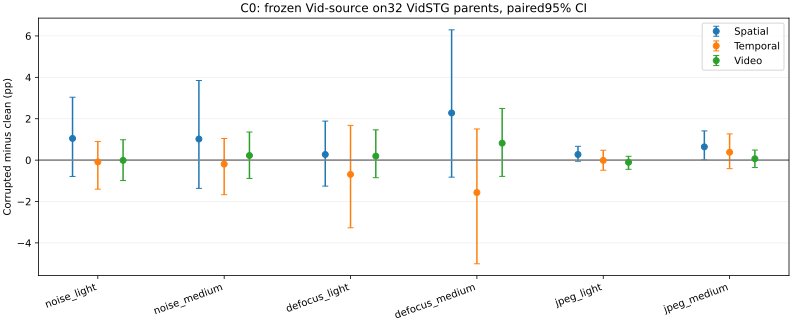
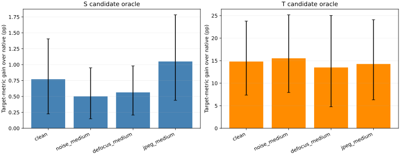

# TA-STVG C0/C1 — corruption anatomy and native candidate support

**Completed / independently read back.** VidSTG-source checkpoint on the original32 historically exposed VidSTG-test development parents. C0 uses all32 x7 conditions; C1 uses the first16 parents in unchanged order x clean/three medium conditions. No expert invocation, adaptation, gradients or HC2 selection. No fresh-test claim.

The immediate experiment follows the post-Round2 corruption plan. The broader One World / Dual Evidence / reliability-aware selective adaptation direction is retained as a research agenda; candidate headroom alone does not qualify a critic or establish OPD efficacy.

## Findings and decision

**Temporal support passes; this spatial candidate generator does not.** Corrupted parent-macro temporal oracle gain is14.431pp [6.934,23.850], with10/16 parents above5pp. Spatial gain is.705pp [.299,1.200], with0/16 above5pp. This is positive but small spatial headroom, not zero correctability. The next justified critic qualification is temporal-only; improve spatial candidate generation before spending on a spatial expert. Neither action is executed in this C0/C1 run.

**The primary corruption setting still needs care.** All six C0 video-delta CIs cross zero; JPEG has no >5pp S/T/video losses in this panel. Medium defocus contains6 T-dominant,4 S-dominant,1 joint/mixed and21 robust/no-material-loss cases. There are local failures, but no stable average frozen-video degradation at these existing strengths.

**Most temporal headroom is already present on clean inputs.** Clean T-oracle gain14.810pp is close to corrupted14.431pp. Decoder layers alone provide13.440pp of corrupted temporal headroom; final-logit span additions bring it to14.431pp. Uniform candidate choice gives−.826pp temporal target gain (CI crosses zero), so the oracle result does not make the ranking problem disappear.

**Actual corruption recovery is partial.** A post-score descriptive readback of every fixed C1 cell with >5pp target damage finds5 spatial-failure cells across4 parents, with0/5 restored to clean by the spatial candidate oracle;3 temporal-failure cells across3 parents, with1/3 restored. These tiny selected-for-description counts are not a new gate. Q12 (ordinal11) under medium defocus drops from87.302% to58.286% tIoU and even the candidate oracle stays58.286%; Q05 (ordinal4) under medium noise drops from16.043% to0 and has a22.656% temporal candidate. Large mean headroom and recovery of specific corruption failures are distinct. See CORRUPTION_RECOVERY.json for every such cell.

**Minor tails are retained.** Spatial component-max selection decreases video IoU in4/64 cells, worst−.192pp; temporal and combined oracle choices have no video decreases in this panel. None has a >5pp video-harm cell. GT-selected candidates are still oracle-only outputs.

## C0: frozen corruption effects

Values are percent; deltas are corrupted minus clean in percentage points with95% paired-parent bootstrap CIs (10000 draws). Negative delta means damage. Original custom severities,224 input interface and exact physical grids are retained. The checkpoint was trained for VidSTG; this is same-domain corruption, not the earlier HC2-to-Vid mechanism panel. Native sIoU measures all GT-valid boxes, independent of predicted interval.

|Condition|sIoU|tIoU|vIoU|Δs [CI]|Δt [CI]|Δv [CI]|s/t/v losses >5pp|
|---|---:|---:|---:|---|---|---|---|
|clean|37.613|42.480|16.159|+0.000 [+0.000, +0.000]|+0.000 [+0.000, +0.000]|+0.000 [+0.000, +0.000]|0/0/0|
|noise_light|38.660|42.392|16.146|+1.047 [-0.791, +3.037]|-0.087 [-1.406, +0.903]|-0.013 [-0.990, +0.982]|2/1/3|
|noise_medium|38.632|42.287|16.380|+1.019 [-1.365, +3.846]|-0.193 [-1.672, +1.044]|+0.221 [-0.884, +1.356]|2/3/2|
|defocus_light|37.884|41.789|16.352|+0.271 [-1.257, +1.885]|-0.691 [-3.269, +1.677]|+0.193 [-0.849, +1.464]|3/3/2|
|defocus_medium|39.891|40.913|16.976|+2.278 [-0.823, +6.295]|-1.567 [-5.009, +1.505]|+0.817 [-0.786, +2.495]|4/7/2|
|jpeg_light|37.884|42.465|16.054|+0.271 [-0.055, +0.666]|-0.015 [-0.489, +0.476]|-0.105 [-0.445, +0.183]|0/0/0|
|jpeg_medium|38.253|42.860|16.224|+0.640 [+0.013, +1.411]|+0.380 [-0.413, +1.266]|+0.065 [-0.361, +0.487]|0/0/0|

Failure classes use signed losses and a fixed5pp margin; robust means no material S/T loss, not an absolutely correct prediction. The fourth group is joint/mixed when neither branch dominates by5pp. Repeated conditions are not independent parents.

|Condition|S dominant|T dominant|Joint/mixed|Robust/no material S/T loss|
|---|---:|---:|---:|---:|
|noise_light|2|1|0|29|
|noise_medium|2|3|0|27|
|defocus_light|3|3|0|26|
|defocus_medium|4|6|1|21|
|jpeg_light|0|0|0|32|
|jpeg_medium|0|0|0|32|

## Internal evidence drift (corrupted versus clean)

ASA comparisons use only common selected frames, with exact coverage and selected-frame Jaccard retained in scalar rows. Missing common support is NA, not zero drift. Q vectors report both cosine and relative-norm changes. Associations and categories are descriptive, not causal attribution of output failures.

|Condition|TTS app/motion JSD|ASA1/ASA2 app cosine distance|Qs1/Qs2 relative norm|Qt1/Qt2 relative norm|Selection Jaccard1/2|
|---|---|---|---|---|---|
|noise_light|0.002041/0.002328|0.012820/0.012837|0.121536/0.124960|0.172925/0.245351|0.887292/0.868549|
|noise_medium|0.005631/0.006052|0.023918/0.026509|0.191527/0.160997|0.335426/0.285000|0.823588/0.838311|
|defocus_light|0.011824/0.011519|0.035144/0.036190|0.195761/0.184207|0.268982/0.265244|0.803941/0.851456|
|defocus_medium|0.017264/0.017552|0.051538/0.057216|0.271728/0.255528|0.405130/0.370164|0.742331/0.798664|
|jpeg_light|0.000513/0.000497|0.002778/0.002743|0.039002/0.037571|0.049872/0.048842|0.962714/0.960416|
|jpeg_medium|0.001547/0.001472|0.007394/0.007865|0.106700/0.070190|0.148384/0.106393|0.890674/0.922178|

## C1: student candidate headroom

Spatial candidates are complete tubes from the six final-pass decoder layers. Temporal candidates start with native and other layer envelopes, then use final-layer legal-span pairs to fill up to8 unique physical intervals. These are deterministic student hypotheses, not stochastic rollouts or a calibrated policy distribution. Native is always candidate0; no per-frame GT stitching. GT selection is offline oracle only.

|Condition|Native s/t/v|Spatial oracle Δs [CI]|Temporal oracle Δt [CI]|Layer-only temporal Δt|Combined oracle Δv [CI]|Parents with >5pp S/T gain|
|---|---|---|---|---:|---|---|
|clean|45.849/36.175/16.744|+0.770 [+0.226, +1.405]|+14.810 [+7.369, +23.777]|14.136|+6.680 [+3.178, +10.983]|0/16; 10/16|
|noise_medium|46.755/35.576/17.185|+0.501 [+0.149, +0.950]|+15.531 [+7.941, +25.182]|13.451|+8.445 [+3.816, +14.308]|0/16; 10/16|
|defocus_medium|47.954/35.142/17.897|+0.564 [+0.207, +0.980]|+13.498 [+4.764, +25.018]|12.710|+6.774 [+2.795, +11.672]|0/16; 6/16|
|jpeg_medium|45.972/36.002/16.647|+1.050 [+0.439, +1.783]|+14.264 [+6.314, +24.097]|14.159|+6.839 [+2.874, +11.865]|0/16; 9/16|
|corrupted_parent_macro|46.894/35.573/17.243|+0.705 [+0.299, +1.200]|+14.431 [+6.934, +23.850]|13.440|+7.353 [+3.456, +12.062]|0/16; 10/16|

The corrupted primary summary first averages the three medium-condition gains within each parent, then bootstraps16 parents. Clean is separate. Component oracle selection can lower vIoU; all tube harms are retained. Candidate mean is a uniform selection diagnostic, not an implemented method.

|Condition|Unique S/T, mean|Uniform S/T target gain pp|S/T/combined v-loss >5pp cells|
|---|---|---|---|
|clean|6.00/8.00|-0.801/0.518|0/0/0|
|noise_medium|6.00/8.00|-0.853/0.145|0/0/0|
|defocus_medium|6.00/8.00|-1.401/-2.555|0/0/0|
|jpeg_medium|6.00/8.00|-0.738/-0.068|0/0/0|
|corrupted_parent_macro|6.00/8.00|-0.997/-0.826|0/0/0|

## Fixed support gate and scope

The prelocked gate for later critic qualification is corrupted parent-macro target gain>=2pp, bootstrap lower bound>0 and at least4/16 parents with mean corrupted gain>5pp. A pass establishes only candidate headroom; a failure prioritizes improving this candidate generator. Neither result establishes teacher ranking quality, learnability, reliability calibration or TTA efficacy.

- S: **NOT PASSED**, mean 0.705pp, CI [0.299,1.200], parents>5pp 0/16.
- T: **PASS**, mean 14.431pp, CI [6.934,23.850], parents>5pp 10/16.

The historical light/medium panel was already known not to induce stable average video harm. Compare the C0 paired losses and clean C1 headroom before interpreting an oracle gain as corruption recovery. Do not strengthen severity or select examples after seeing this result within this run. C2 experts and all adaptation remain unstarted.

## Deterministic failure/good-case comparison

Post-score explanatory examples only:largest S loss, largest T loss and smallest total absolute S/T change for each condition; ties use original ordinal. Selection does not alter the experimental roster or candidate pool. Stable cases can still have poor absolute accuracy.

|Condition|Role|Query|Clean s/t/v|Corrupted s/t/v|Δs/Δt/Δv pp|
|---|---|---|---|---|---|
|noise_light|largest_S_loss|Q13|61.510/0.264/0.514|46.488/0.000/0.000|-15.022/-0.264/-0.514|
|noise_light|largest_T_loss|Q05|54.914/16.043/8.580|55.279/0.000/0.000|0.365/-16.043/-8.580|
|noise_light|stable_ST|Q01|0.000/82.686/0.000|0.000/82.686/0.000|0.000/0.000/0.000|
|noise_medium|largest_S_loss|Q13|61.510/0.264/0.514|43.999/0.268/0.435|-17.512/0.004/-0.079|
|noise_medium|largest_T_loss|Q05|54.914/16.043/8.580|53.540/0.000/0.000|-1.374/-16.043/-8.580|
|noise_medium|stable_ST|Q01|0.000/82.686/0.000|0.000/82.686/0.000|0.000/0.000/0.000|
|defocus_light|largest_S_loss|Q16|24.273/28.877/11.378|15.335/30.857/5.416|-8.938/1.980/-5.962|
|defocus_light|largest_T_loss|Q32|0.824/50.230/0.401|1.141/24.868/0.557|0.317/-25.363/0.156|
|defocus_light|stable_ST|Q30|10.802/6.704/0.569|10.716/6.704/0.564|-0.086/0.000/-0.005|
|defocus_medium|largest_S_loss|Q11|78.222/0.000/0.000|67.261/0.000/0.000|-10.961/0.000/0.000|
|defocus_medium|largest_T_loss|Q12|35.310/87.302/31.024|32.120/58.286/21.808|-3.189/-29.016/-9.216|
|defocus_medium|stable_ST|Q20|0.343/37.086/0.119|0.139/37.086/0.048|-0.204/0.000/-0.071|
|jpeg_light|largest_S_loss|Q13|61.510/0.264/0.514|59.448/0.000/0.000|-2.062/-0.264/-0.514|
|jpeg_light|largest_T_loss|Q19|78.635/96.007/75.651|78.609/91.840/71.604|-0.026/-4.167/-4.047|
|jpeg_light|stable_ST|Q01|0.000/82.686/0.000|0.000/82.686/0.000|0.000/0.000/0.000|
|jpeg_medium|largest_S_loss|Q11|78.222/0.000/0.000|76.099/0.000/0.000|-2.123/0.000/0.000|
|jpeg_medium|largest_T_loss|Q19|78.635/96.007/75.651|78.302/91.840/71.294|-0.333/-4.167/-4.356|
|jpeg_medium|stable_ST|Q01|0.000/82.686/0.000|0.000/82.686/0.000|0.000/0.000/0.000|

## Verification, data use and resources

224 original artifact SHA checks and224 exact new-native comparisons passed, including pixels, preprocessed inputs, boxes and both offset logits. Original per-parent frame grids span20–200 frames; an initial protocol wording that generalized the48-frame smoke case was corrected without changing any input or sampling. Independent exhaustive enumeration checked64 candidate sets. All 1600 metric calls used two implementations. Two CPU candidate contracts passed; frozen model state hash was unchanged. All224 predictions and64 candidate sets were sealed before streaming only32 authorized GT keys for scoring. Old cache containers include historical expert payloads, but the new worker receives only sanitized native fields and invokes no experts. Constructor annotation file opens are denied.

Cumulative new GPU-process wall allocation **376.021s (6.27min)** includes loading, pixel transformations, capture and engineering failures. CPU development/analysis/reporting excluded. New model backwards0; optimization steps0; new expert calls0; new downloads0. Existing predictions are reused as C0 reference; missing evidence/layers required224 new two-offset full native captures, not adaptation passes.

All failures and revisions, if any, remain local with receipts. The original32-parent cohort is historically exposed test development, not source-training data or fresh evaluation. Official training provenance cannot certify unknown pretraining overlap. Current production methods, PTD, the previous Round1/2 evidence and HC2 transfer selection remain unchanged.

## Public reproduction

`python scripts/audit_tastvg_corruption_c0c1_public_v1.py results/tastvg_corruption_c0c1/2026-09-29` reconstructs scalar means, candidate oracle maxima and the branch-specific gate. Original identifiers, captions, GT coordinates, media, checkpoints and raw predictions stay local. Authorized original data and cached manifests are required for GPU reproduction.
