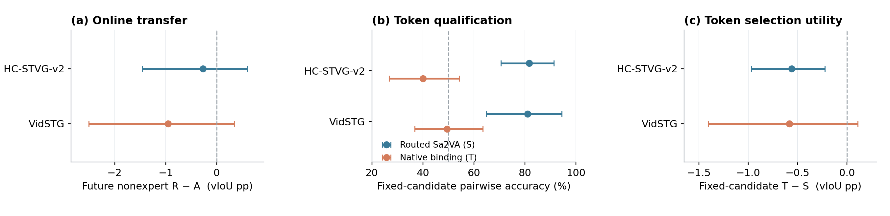

# Routed evidence 的局部收益没有转化为未来收益；native token binding P0 未通过

2026-10-02。本轮 reference-position-only 在线 A/R 对照与独立 token P0 均已实际完成，预测/分数封存后评分，根独立复算通过。HC 的 routed evidence 改善了当前到达的局部空间更新，但没有建立 future nonexpert 优势。两个数据集的当前 native-cosine binding 都未通过预登记资格条件，因此没有运行 ST rank 融合、combined online、memory 或新的参数搜索。这个负结果限制当前实现与开发面板，不排除所有 event-aware evidence 或 token-binding 方法。

## 实际 setting 和比较边界

A = 原 Uniform5 Sa2VA + 原 Rank-RKL；R = Student S-CDF routed5 Sa2VA + 完全相同 Rank-RKL。两集各原32历史曝光开发来源，一 query/源，原双序，clean + frame drop/freeze/motion blur/occlusion/exposure 五类 transient 5% corruption，25% scheduled expert。每臂每集384到达，合计1536评分到达，其中 A 的768预测精确复用已封存轨迹，R 的768预测重新推理并逐步生成自己的 candidates/state。

原同域官方 TA-STVG checkpoint、Paper48 采样与 corruption 像素、九个 probes、rho=.05、student temperature=1、D4、1792 spatial 参数固定。Vid lr=.033761698432507946、teacher temperature=.34902548789596055、K1；HC lr=.006097133675874025、teacher temperature=1、K8。只改五个 Sa2VA 观察帧的位置；没有 H-lite reward/geometry weighting、token loss、新 gate、target、优化器或 readout 修改。当前输出仍 pre-update，状态仍持久继承，temporal reranker/cache 不变。

模型 worker 不读取 GT。四条在线流共同封存后才开本轮 CPU 评分；token 的全部60 cell 分数另行封存后才开 token GT。来源早已曝光，本轮 GT 仅做资格判断和损害分析，没有反馈到线上，不按结果改变阈值/配置/名单。源宏聚合先平均同源条件与顺序，再配对10000 source-bootstrap（seed20261001）；区间是开发面板描述性95%CI，不是 fresh test。

## 主指标：corrupt future nonexpert

下面 Frozen/A/R 为 dense vIoU 的百分数，差值和区间为百分点。future 要求两臂均已有实际写入。本轮每集240 future 到达，HC覆盖30来源，Vid32来源；两序位置不同，因此这个子集不强行按32来源作分母。

| 数据集 | Frozen | A Uniform | R Routed | R−A 与95%CI |
|---|---:|---:|---:|---|
| HC-STVG-v2（primary） | 29.9561 | 31.2710 | 30.9969 | -0.2741 [-1.4535, +0.6001] |
| VidSTG（secondary） | 16.2145 | 16.8797 | 15.9285 | -0.9512 [-2.5024, +0.3393] |

两集 R−A 均值负、CI 跨零，不能宣布确定性总体伤害，也没有证据支持 routed online 优于 A。全部 corrupt 到达320/臂/集的结果，以及 expert、nonexpert、clean 控制完整保留在 ONLINE_SUMMARY.json。

| 数据集 | 全部 corrupt R−A（pp,95%CI） | clean future R−A（pp,95%CI） | future >5pp 受损到达/240 |
|---|---|---|---:|
| HC-STVG-v2（primary） | -0.3452 [-1.4396, +0.4518] | +0.1791 [-0.0688, +0.4417] | 5/240 |
| VidSTG（secondary） | -0.9580 [-2.3872, +0.1716] | -1.5461 [-3.4231, +0.2816] | 29/240 |

Vid clean 全部到达 R−A = −1.7115pp，95%CI [−3.5402,−0.1915]；这是本面板的负控制结果，不能说路由已解决部署问题。两个数据集所有 future 位置的 R−A tIoU 都为0，当前差异落在空间输出；scheduled temporal readout 保持原逻辑。

## GT pipeline：HC 当前更新改善，未来没有改善

局部效用是在当前到达的原 native interval 固定不变时，post-update tube 与 pre-update tube 的 dense vIoU 差。它只用于诊断，不替换正式 pre-update 输出。表中 rank 是各臂实际状态下首步候选、GT-strict pairs 的准确率；不同轨迹的候选不同，这不是上一轮固定候选 qualification 的同一指标。

| 数据集 | 首步 ranking A→R | 一次到达净局部更新 A→R（pp） | 配对局部 R−A（pp,95%CI） |
|---|---|---|---|
| HC-STVG-v2（primary） | 67.67% → 79.76% | +0.4421 → +0.8342 | +0.3921 [+0.1359, +0.6855] |
| VidSTG（secondary） | 72.42% → 74.89% | +0.8791 → -0.3877 | -1.2668 [-3.3309, +0.2195] |

HC 的配对局部改善为正，但 future R−A 仍跨零且均值负。损害记录也显示改善：KL 降而 GT 降的 inner steps 从162/600实际更新降到58/616，唯一有益 teacher-top 却执行受损的步数19→10。与此同时，后续非专家来源可能仍出现严重的相对 A 损失。匿名 HC source18、occlusion/order2/arrival26：A=.577522，R=.000307，Frozen=.044285；tIoU 三者相同。这是 R 相对 A 丢失收益，并非 R 相对 Frozen 损失57.7pp。

Vid 不同：一次到达的平均局部效用从 +.8791pp 变为 −.3877pp，有益唯一首选但更新受损3→15；当前执行问题仍然存在。不能把两集都唯一归为“正确更新传播给错误 future context”。HC 结果把 future transfer/context applicability 暴露为需要区分的候选机制，但这轮没有 matched episodic/reset/context-isolation 因果对照，故没有证明 memory 必然有效。

第一步没有任何 GT 计分参考帧的 expert 到达 HC A15→R12/80，Vid A25→R27/80。参考帧更集中于学生认为的事件，仍不保证监督覆盖真实计分支持。各步/各源正例、负例、奖励、梯度/位移标量、teacher 首选、净效用、K8 步链和累计更新均保留；原始 state/gradient/tubes 私有，匿名统计公开。gross gain/loss 是到达或 step 均值，不能与子集 source-macro 净值不加区分地相减。

## Native token P0：固定候选，零参数更新

沿用上一轮60个固定 cell，两个数据集各10来源、10 clean +20 corrupt；每 cell 同一原 A 首步九候选，共540 tubes。捕获 post-multimodal H appearance/motion/text、原生最后层第二 pass 的 spatial/temporal text cross-attention。按分支权重得到 q_obj/q_evt，框内正网格交叠面积 ROI pooling，T = 同 tube 在共同 A native interval 内 motion cosine − interval 外 motion cosine。S = 上一轮 routed Sa2VA 几何 reward。Object cosine 是诊断，不被加进 T。零更新、零新 expert、零外部 CLIP/LLM parser。

分支 attention 是原生权重，不代表已验证的 noun/action 分解；H 也没有为这里的 cross-modal cosine 单独校准。60输入的原生 boxes/indices/logits 全部逐位复现，独立 ROI/text/cosine 复算最大误差3.553e−15，因此当前负结果没有被格式或 ROI 算术失败解释。

| 数据集 | S pairwise（%,95%CI） | T pairwise（%,95%CI） | T−candidate0 top1（pp,95%CI） | T−S top1（pp,95%CI） |
|---|---|---|---|---|
| HC-STVG-v2（primary） | 81.67% [70.56, 91.39] | 40.00% [26.81, 54.17] | -0.0929 [-0.3109, +0.1504] | -0.5622 [-0.9679, -0.2246] |
| VidSTG（secondary） | 81.08% [64.93, 94.44] | 49.48% [36.81, 63.54] | -0.0233 [-0.5410, +0.4518] | -0.5836 [-1.4055, +0.1100] |

两集全部30 cell 的九个 token scores 都有合法 ROI/in/out pool。GT ranking 另有分母：HC corrupt20 cell/10源都有 strict GT pairs；Vid 有4 cell/2源的九条候选 GT 全并列，pairwise 以剩16 cell/8源计，top1 仍以全部20 cell/10源计。所有缺测/并列未删去伪装成更高覆盖。

互补 pair 并非不存在，但负向互补更多：HC S错T对54对，S对T错356对（720 strict pairs）；Vid分别59对、253对（576 strict pairs）。T 相对 S 的 top1 在 HC corrupt2 cell改善、17 cell变差、1并列；Vid3改善、12变差、5并列。TOKEN_CASES.json 保留正反例，不把某几个互补正例当作线上可靠性的证据。

原生分支 text 权重确实不同，但 pooled q_obj/q_evt 的 corruption 源宏 cosine HC=.99064、Vid=.98385。仅观察到不同 attention，不能宣称已分离 referent 与 event 语义。

“right object / wrong event”测试 A 没有可验的成对对象标签：HC corrupt 有43个 event-inside 准确 Sa2VA reference、31个 event-outside 有效 mask 无对象 GT；Vid对应39与28。两集 outside 位置已标注且准确的 reference 均为0，所以严格同对象 inside/outside pairwise/AUROC 为 unavailable，不记0，不称通过。当前 per-frame cosine 来自 student candidate0 ROI，未把 Sa2VA ROI 代替学生框；即使有 outside GT，也还需核实对应 student ROI 的对象身份。B/C 的候选排序负结果有效，A 的 event–object 假设没有被直接验证或否定。

资格条件已预先冻结：corrupt T source-macro pairwise > .5 且 top1 比 candidate0 正增益。HC、Vid均不满足。已保存 ST_ELIGIBILITY.json，没有生成 ST_ROWS，也没有进入 combined online 或 memory。

## 资源、失败与核验

R 成功 worker 墙钟 HC779.43s、Vid203.68s，含模型加载、解码和IO；native suffix router额外96 replay/集。76次实际新 Sa2VA调用，其中两次 Uniform live parity，matching digest/receipt 的其它输入精确复用；192 scheduled routed读取，专家每 arrival 只 fetch 一次，HC K8 刷新自己的候选。Token60 suffix replay成功墙钟38.34s，零 backbone/专家/参数更新。失败 startup 的额外墙钟未并入成功 worker 统计，这些不是 pure GPU kernel time，也不是完全 uncached end-to-end 评估成本。

完整代码、原配置、两个数据集全部匿名端点/step/candidate pairs、bootstrap、positive/negative cases、资源和失败说明均公开。独立核验覆盖1536 payload hash/state links、192 scalar CDF/cache binding、所有 SGD1792坐标算术、60 native-token parity、120 text query、1620 ROI vectors、1080 cosines；公开标量核验通过。saved engineering failures 用 additive code pin 修复，名单/输入/目标/参数不变，旧失败和预测不覆盖；详细可公开说明见 ENGINEERING_RECOVERIES.json。CURRENT_METHOD未改，旧队列未恢复。

图：corrupt future R−A；固定候选 S/T pairwise；固定候选 T−S top1。误差条均为 paired source-bootstrap95%CI，Vid pairwise 使用8个有 strict GT pairs 的来源。PDF/SVG与PNG同时提供。

本轮结论：保留 A；将 HC routed evidence 的局部效用与未建立的 future transfer 分开记录；当前 native inside–outside cosine P0 不进入方法。后续机制改变需要具体匹配实验，不能把这轮开发负结果写成所有 token binding/temporal routing 的不可能性结论。
