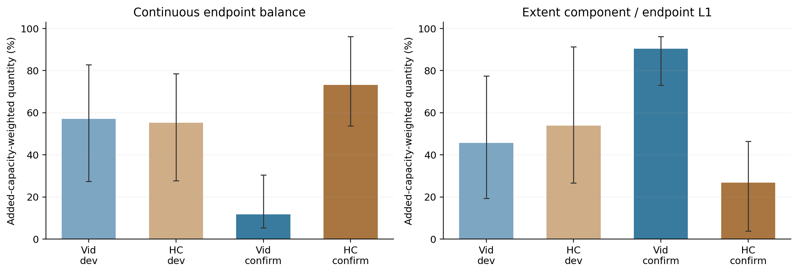

# Local-oracle diagnostic figures

## Local capacity and tied optima

## Strict geometric classification (interpret with continuous balance)

## Continuous endpoint balance

0 means one endpoint moves; 1 means equal endpoint movement. Centre and extent components are not additive. Intervals are source-bootstrap 95% CIs. HC confirmation ratios condition on nonzero total added gain and only two positive-gain sources.

